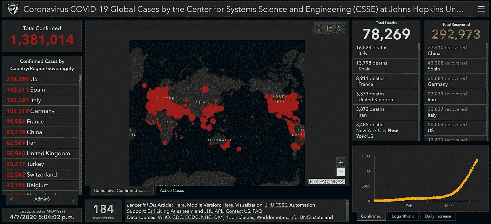
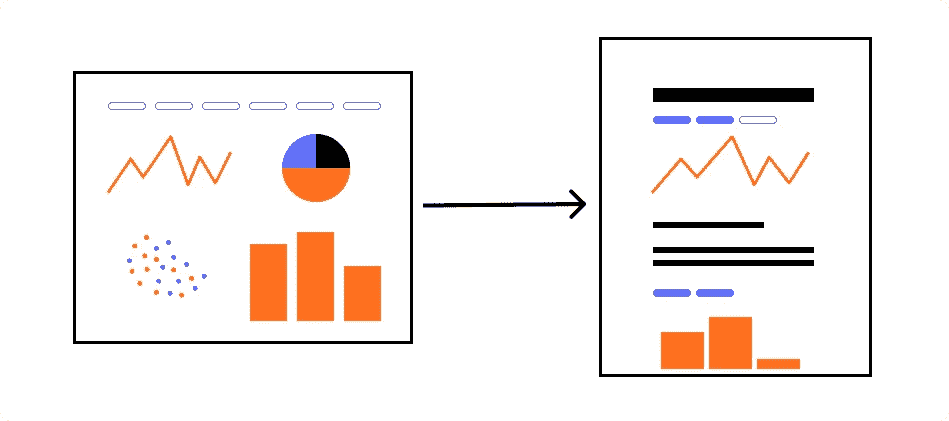
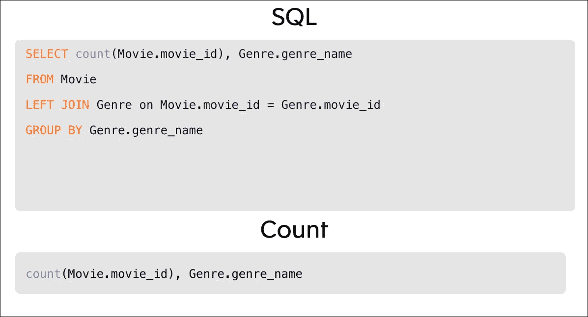

# 仪表板死了

> 原文：<https://towardsdatascience.com/dashboards-are-dead-b9f12eeb2ad2?source=collection_archive---------0----------------------->

在过去的几十年中，仪表板一直是分发数据的首选武器，但它们并不是故事的结尾。为了让数据访问越来越民主化，我们需要重新思考，答案可能比你想象的更接近…！

# 你好仪表板，我的老朋友

当我开始职业生涯时，我在一家大型科技制造公司工作。该公司刚刚购买了第一个仪表板工具，我们的团队负责从疲惫的电子表格和 SSRS 报告到闪亮的新仪表板的激动人心的过渡。

对我们来说，从电子表格到仪表板的转变是分析成熟度的重大飞跃。仪表板的周到设计和交互性大大降低了数据的“准入成本”。突然，你会在办公室里走来走去，看到来自任何角色和背景的员工摆弄仪表板。这是数据爱好者的天堂，对吧？

不完全是。我们很快发现仪表板带来了一系列新问题:

1.  你有仪表板，你有仪表板，你有仪表板！突然，仪表盘随处可见。工程师想要一些数据进行特别分析？这是一个仪表板。副总裁下周有一个演示，想要一些图表？她得到了一个仪表板。不，他们再也没有看他们一眼。一刀切的方法耗尽了我们团队的时间、资源和动力。这是一种独特的令人沮丧的感觉，看着你的仪表板又一次被抛弃，比你 2008 年的 Myspace 账户还快。
2.  **死于 1000 个过滤器**:在一个仪表板上线后，我们立即被新视图、过滤器、字段、页面等各种请求所淹没(提醒我告诉你我曾见过一个 67 页的仪表板……#难以忘怀)。很明显，仪表板没有回答每个人的问题，这要么是仪表板设计步骤的失败，要么是其他工具在提供人们需要的答案方面的失败。更糟糕的是，我们发现人们使用所有这些过滤器将数据导出到 Excel 中，然后用它们做自己的事情🤦‍♀️.
3.  **不是*我的*仪表盘**。仪表板炒作来得越快，它就开始消退。人们开始贬低仪表盘是“错误的”,并公然忽视它们。许多人认为这是对他们工作的威胁，如果他们看到他们没有预料到的数字，就把它归结为“坏数据”。我们有一个严重的信任问题，仪表板几乎没有提供机会来减轻他们的担忧。毕竟，我们不能把我们的 SQL 查询发送给他们；他们将无法阅读它们，更不用说理解它所反映的极其复杂的模式了。在每个团队创建他们自己的度量定义的情况下，我们不能给他们发送原始数据。我可能轻描淡写了…我们有一个巨大的、溃烂的、渗出的信任问题。

## 真实例子:吓人的红点里有什么？

为了进一步证明这一点，让我们考虑一个在当前冠状病毒危机中广泛流行的数据仪表板:约翰霍普金斯冠状病毒仪表板。

2020 年 4 月 7 日拍摄的 JHU 仪表盘截图

JHU 仪表板在视觉上很吸引人；红色和黑色唤起了这一刻应得的严肃感和紧迫感。当我们的目光扫过页面时，我们会遇到数字、各种大小的点，以及几乎总是越来越向右上方移动的图表。我们感觉情况很糟糕，而且似乎越来越糟。这个仪表板旨在以一种可访问且引人入胜的方式获取数据。它甚至可能被设计用来回答一些关键问题，如“今天我国有多少新病例？我的县？”需要明确的是，这是*所以*比他们仅仅发布一个表格或下载链接要好得多。

但是除了那些肤浅的发现，我们不能用这些数据采取*行动*。如果我们想将这些数据用于某个特定的目的，我们将缺乏必要的*上下文*来使这些数据变得有用——并相信它们是我们自己的(例如，社交距离测量在我的国家/县是什么时候开始的？在我的国家，检测的可用性如何？)即使我们设法获得了信任这些数字的必要背景，仪表板本身也缺乏进行我们需要的定制分析的*能力*和*灵活性*。

就像我在某个不知名的公司的经历一样，这个仪表板成功地让人们用数据做一些事情，但不一定是用数据做一些有意义的事情。在一家不知名的公司，我们试图通过添加越来越多的仪表板，然后添加越来越多的过滤器来解决这个问题，然后当这些仪表板毫无用处时，就将其删除。这种负反馈循环导致了对数据的严重不信任和团队间的分裂，如果消极进取的 LinkedIn 更新是可信的，我认为其中许多仍然存在。

仪表板为数据赋权做了大量工作(还有我的职业生涯！)但它们肯定不是数据协作和报告的最佳接口。谢天谢地，有一个竞争者你可能已经在用了…

# 数据进入肖像模式

从仪表板到笔记本的演变

像 Jupyter 这样的数据笔记本在过去几年里在数据科学领域变得非常流行。在进行数据分析和数据科学时，面向过程的本质已经被证明优于传统的脚本。这不仅有利于从事这项工作的分析师，也有助于不得不使用它的老板/同事/不情愿的朋友。

从根本上说，笔记本电脑提供了机会:

1.  为了让大家*信任*这个过程(因为他们可以从字面上看到代码和作者的评论)，
2.  拥有回答任何问题的*能力和灵活性*(只要用户知道工具所用的语言)，以及
3.  一种让*与*合作、*展示*以及*与更广泛的受众分享*这些决定的方式。

我当然不是第一个想将笔记本电脑的强大功能和灵活性应用到数据分析/商业智能领域的人。我们已经和许多使用笔记本电脑而不是仪表板的公司谈过了。有些人只使用 Jupyter 笔记本进行报告，其他人会将图表剪切并粘贴到文本编辑器中以达到类似的效果。这些都是不完美的解决方案，但标志着公司愿意超越精心制作的仪表板，实现笔记本电脑的优势。

我们只是需要一种方法来将这些原则扩展到数据科学之外，并使笔记本变得像仪表板一样易于访问。

## 面向大众的笔记本

在 [Count](https://count.co?utm_medium=blog&utm_source=Medium&utm_campaign=cm&utm_content=dashboardsaredead) ，我们对笔记本电脑的基本优势深信不疑，因此我们围绕它们建立了一个数据分析平台。这里没有仪表板！

为了在数据科学之外使用它们，我们不得不制作自己的版本，但基本原则仍然适用，但有一些额外的好处…

**专为各种经验水平打造**

*   无需向团队中的每个人教授 Python 或 SQL，因为可以通过拖放、编写“笔记本 SQL”(见下文)或编写完整的 SQL 来构建查询。

Count 的笔记本 SQL 示例

*   只需一次点击即可获得快速视觉效果，因此无需复杂的可视化软件包或软件。
*   表和查询输出的自动连接，因此无需编写复杂的连接或尝试解释模式

**已启用协同**

*   与队友、整个团队、整个公司或任何有链接的人共享笔记本
*   添加注释和标注，使其真正成为共享文档

计数笔记本夹

通过以笔记本电脑为核心，Count 提供了团队所需的能力、透明度和协作，不仅可以为人们提供数字，还可以让他们获得所需的见解并与公司其他人分享。

由于我们一直在构建 Count，我们一直在与许多组织合作，以了解笔记本如何改变数据在团队中的使用方式。以下是我们的发现:

1.  分析师使用笔记本而不是疯狂的 SQL 脚本来创建一些其他团队使用的基础表。任何人都可以查看(和解读)这些笔记本，所以没有人会因为不知道这些数字来自哪里而对其不屑一顾。
2.  数据团队创建了一些基本报告。这些报告充满了评论，以帮助指导读者如何解释这些数字和任何需要考虑的问题。
3.  然后，用户可以使用这些笔记本或创建自己的笔记本来回答他们的特别问题。他们与数据团队分享这些笔记本电脑，这样他们就可以帮助指导他们，然后他们将这些笔记本电脑展示出来，并与企业的其他部门分享。

由于每个人都可以消费所有东西，而且在一个地方，信任问题开始改善(或者，在现实中，只是变成了其他事情)。他们没有为不使用仪表板的人创建仪表板，也没有为满足各种需求而创建数以千计的过滤器，因为人们有更多的权力来创建他们真正需要的报告。他们描述的场景证明，从仪表板到笔记本的小小转变会对您的团队利用数据的方式产生巨大影响。

如果您想了解更多关于笔记本如何帮助您的团队更加数据驱动的信息，请在 hello@count.co 给我们写信，或者您可以在这里阅读更多！

*这是我们“呼唤更好的分析工具”系列的文章之一。该系列的其他文章包括:*

*   [*分析工作流程中断*](https://count.co/blog/posts/the-analytical-workflow-is-broken) *—为什么笔记本电脑正在取代标准分析工具集。*
*   [*数字不再足够*](https://app.count.co/n/Md9SanTZNWv) *—为什么我们需要比图表更多的东西来改变世界。*
*   *如何为您的组织带来笔记本电脑—如何一次一个数据请求地改变您组织的性能(即将推出)*

*报名参加我们的* [*快讯*](https://count.co/join-newsletter) *获取最新帖子。*

# 资源

[1] C [新冠肺炎冠状病毒全球病例由约翰·霍普金斯大学(JHU)系统科学与工程中心(CSSE)](https://coronavirus.jhu.edu/map.html)(2020)约翰·霍普金斯大学