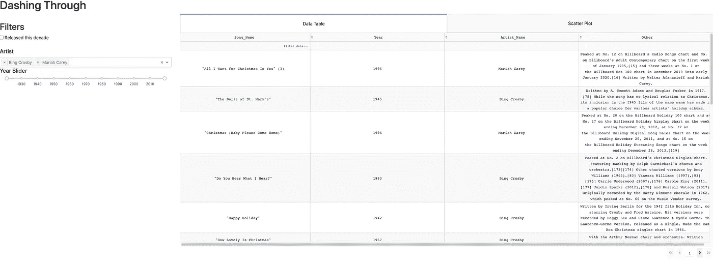
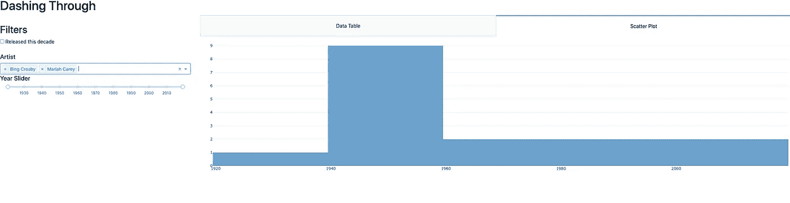

# 使用 Dash 和 SQL 快速浏览圣诞歌曲

> 原文：<https://towardsdatascience.com/dashing-through-christmas-songs-using-dash-and-sql-34ef2eb4d0cb?source=collection_archive---------50----------------------->

## 使用 SQL 数据库创建 Dash 仪表板的简单项目


塞巴斯蒂安·斯宾德勒在 [Unsplash](https://unsplash.com?utm_source=medium&utm_medium=referral) 上拍摄的照片

女士们先生们，宾·克罗斯比先生！TL；dr 在 [GitHub](https://github.com/Datadolittle/Dashing_Through_Christmas_Songs) 上找到网络应用的代码。

宾·克罗斯比和安德鲁斯姐妹演唱《铃儿响叮当》

本文概述了我使用[破折号](https://dash.plotly.com/)在 SQL 数据库上创建 web 应用程序的奋斗和成功。本文分为 4 个部分:创建 SQL 数据库、安装 Dash 环境、构建 web 应用程序、运行应用程序。我不熟悉 Dash 环境，这种灵活性给了我灵感。还有其他 web 应用程序创建引擎，如 [Viola](https://voila.readthedocs.io/en/stable/install.html) 也值得探索。Dash 令人耳目一新，因为它包含了可以显示不同对象的标签的独特功能。

## **用 python 将 CSV 文件转换成 SQL 数据库**

我用维基百科[上的美国圣诞歌曲表](https://en.wikipedia.org/wiki/List_of_popular_Christmas_singles_in_the_United_States)创建了一个 CSV 文件。经过一些手动格式化后，我有了一个包含 4 列的 CSV 文件[歌曲名、艺术家名、发行年份、其他信息]。在下面的脚本中将 CSV 转换为 SQL 数据库之前，Pandas 是唯一需要安装的库。模块 sqlite3 已经是我的 python 发行版的一部分。

```
import pandas as pd
import sqlite3conn = sqlite3.connect('Songs.db')
c = conn.cursor()# Create table with headers
c.execute('''CREATE TABLE Songs
             ([generated_id] INTEGER PRIMARY KEY,[Song_Name] text, 
             [Artist_Name] text, [Year] date, [Other] text)''')conn.commit()# Convert CSV to SQL
read_songs = pd.read_csv('Chrismas_Songs.csv')
read_songs.to_sql('Songs', conn, if_exists='append', index = False)
```

简而言之，该代码使用 execute 函数创建了一个 SQL 表，其中包含 SQL 命令。当我们将 CSV 文件导出到先前为空的 SQL 表中时，使用 Pandas 填充该表。现在我们的 SQL 数据库已经准备好了，接下来是安装 Dash 的时候了。

## **创建 Dash 环境**

仪表板安装提示可在[仪表板主页](https://dash.plotly.com/)上找到。这个项目需要安装的包包括

```
## Install Plotly
pip install plotly## Install Pandas
pip install pandas## Install Dash and Components
pip install dash
pip install dash-bootstrap-components
pip install dash-html-components
pip install dash-table
```

**Web 应用的构建结构**

```
index.py
app.py
database/
|_ __init__.py
|_ Chrismas_Songs.csv
|_ Songs.db
|_ transforms.py
tabs/
|_ __init__.py
|_ sidepanel.py
|_ tab1.py
|_ tab2.py
```

我从数据库/和选项卡/文件夹中导入数据函数，所以我必须包含一个名为 __init__ 的空白文件。py 让 python 知道这是一个模块。web 应用程序将从 index.py 运行，该文件调用包括 app.py 在内的所有其他 python 文件。

## 构建 Dash Web 应用程序

构建应用程序从 app.py 文件开始。下面，我们调用应用程序并将其连接到服务器(在索引文件中)

**app.py**

```
**import** dash
**import** dash_bootstrap_components **as** dbc

app = dash.Dash(__name__, external_stylesheets =[dbc.themes.BOOTSTRAP])
server = app.server
app.config.suppress_callback_exceptions = True
```

索引文件是奇迹发生的地方。这是您的 web 应用程序的四分卫。Dash 使用回调从客户端(web)获取数据，并在服务器端(后端)操作。下面是一个来自索引文件的例子，完整的索引文件见 [GitHub](https://github.com/Datadolittle/Dashing_Through_Christmas_Songs/blob/master/index.py) 。

**index.py**

[不是完整的文件，从 Github 下载或复制完整的文件]

```
app.layout = sidepanel.layout

@app.callback(Output(**'tabs-content'**, **'children'**),
              [Input(**'tabs'**, **'value'**)])**def** render_content(tab):
    **if** tab == **'tab-1'**:
        **return** tab1.layout
    **elif** tab == **'tab-2'**:
        **return** tab2.layout@app.callback(Output(**'table-sorting-filtering'**, **'data'**)
, [Input(**'table-sorting-filtering'**, **"page_current"**)
, Input(**'table-sorting-filtering'**, **"page_size"**)
, Input(**'table-sorting-filtering'**, **'sort_by'**)
, Input(**'table-sorting-filtering'**, **'filter_query'**)
, Input(**'Last_Decade'**, **'value'**)
, Input(**'year-slider'**, **'value'**)
, Input(**'Artist-drop'**, **'value'**)]) **# function to filter data table 
def** update_table(page_current, page_size, sort_by, filter, yearcheck, prices, artists):
# insert function content here**if** __name__ == **'__main__'**:
    app.run_server(debug = True)
```

让我们从头开始分析一下。app.layout 使用用户输入创建侧栏，更多内容将在 sidepanel.py 分解中解释。@app.callback 既呈现选项卡(数据表和直方图)，也调用用户选择的过滤。@app.callback 中的输入对应于下面函数中的参数。例如，在 first @app.callback 中，tabs 与 render_content 函数中的 tab 参数相同，Last_Decade 与 update_table 函数中的 yearcheck 相同。最后一部分是在 if __name__ == '__main__ '函数中对应用服务器的调用。

**Database/transforms.py**

这个文件将 SQL 数据库连接到我们的索引文件和 web 应用程序。

```
**import** dash
**import** dash_bootstrap_components **as** dbc
**import** dash_core_components **as** dcc
**import** dash_html_components **as** html
**import** pandas **as** pd
**import** sqlite3
**import** dash
**from** dash.dependencies **import** Input, Output
**import** dash_table
**import** pandas **as** pd

conn = sqlite3.connect(**r"/Users/stronglab2/Documents/Datadolittle/Dashing_Through/database/Songs.db"**)c = conn.cursor()

df = pd.read_sql(**"select * from Songs"**, conn)
```

**Tabs/tab1.py**

[不是完整的文件，从 Github 下载或复制完整的文件]

Tab1.py 在第一个选项卡中创建数据表。该文件还包括单元格的格式选项。

```
## Load SQL Database into table
df = transforms.df

PAGE_SIZE = 50layout = html.Div(dash_table.DataTable(id='table-sorting-filtering',columns=[{**'name'**: i, **'id'**: i, **'deletable'**: True} **for** i **in** df[[**'Song_Name'**,**'Year', 'Artist_Name'**,**'Other'**]]], ..................
```

SQL 数据被加载到 pandas 数据框中，并显示为 dash 数据表。然后，我们为数据表创建列。定义列后的点表示整个文件中有更多的细节。

**Tabs/tab2.py**

[不是完整的文件，从 Github 下载或复制完整的文件]

Tab2.py 在第二个选项卡中创建直方图。该文件还包含@app.callbacks，用于根据用户选择进行更新。

```
df = transforms.df

layout = html.Div(
    id=**'table-paging-with-graph-container'**,
    className=**"five columns"** )

@app.callback(Output(**'table-paging-with-graph-container'**, **"children"**),
              [Input(**'Last_Decade'**, **'value'**)
                  , Input(**'year-slider'**, **'value'**)
                  , Input(**'Artist-drop'**, **'value'**)
               ])
**def** update_graph(yearcheck, prices, artists):
....................................................................
    graph_plotly = go.Histogram(x=dff[**'Year'**],
                      name=**"Histotest"** , opacity=0.7) **return** html.Div([dcc.Graph(id=**'histo-graphic',figure={'data':[graph_plotly], ..........**
```

直方图是通过 go 生成的。直方图功能，并通过 html 显示在标签页中。Dic([dcc。图表…

**Tabs/sidepanel.py**

[不是完整的文件，从 Github 下载或复制完整的文件]

侧面板允许用户与 web 应用程序交互。有三种相互作用。“最近十年”复选框(2009 年之后发行的歌曲)、“艺术家”下拉列表(可以选择多个艺术家)或发行日期范围(1910-2020)。表格和直方图根据选择进行更新。

```
layout = html.Div([
    html.H2(**'Filters'**)
    , dcc.Checklist(id=**'Last_Decade'** , options=[
            {**'label'**: **' Released this decade '**, **'value'**: **'Y'**}
        ])
        ,html.Div([html.P() ,html.H5(**'Artist'**), dcc.Dropdown(id = **'Artist-drop'** ,options=[
                     {**'label'**: i, **'value'**: i} **for** i **in** df[**'Artist_Name'**].unique()],
                value=[],
                multi=True
            )])
          ,html.Div([html.H5(**'Year Slider'**)
                   , dcc.RangeSlider(id=**'year-slider'...............**
```

这个文件创建了所有三个交互选项。每个选项由 html 分隔。Div 然后用交互类型调用 dash_core_components (dcc)。在 index.py 文件和 tab2.py 中调用 id 来更新表和直方图。

## 运行 Web 应用程序

对于那些希望看到工作示例的人，安装所需的包并从 [GitHub](https://github.com/Datadolittle/Dashing_Through_Christmas_Songs) 下载资源库。下面的屏幕截图显示了 web 应用程序。



数据表选项卡，过滤宾·克罗斯比和玛丽亚·凯莉的歌曲



宾·克罗斯比和玛丽亚·凯莉的歌曲直方图

要运行应用程序，只需在应用程序目录中键入`python index.py`。您可能会看到下面的提示，显示该应用程序正在您的本地计算机上运行。

```
Running on http://127.0.0.1:8050/Debugger PIN: 829-054-282* Serving Flask app "app" (lazy loading)* Environment: productionWARNING: Do not use the development server in a production environment.Use a production WSGI server instead.* Debug mode: onRunning on http://127.0.0.1:8050/Debugger PIN: 182-493-929
```

只需将`http://127.0.0.1:8050/`复制并粘贴到网络浏览器中，应用程序就启动了！

这是一个使用 Dash 和 SQL 构建的简单 web 应用程序。我的名字是[科迪·格利克曼](https://codyglickman.com/)，可以在 [LinkedIn](https://www.linkedin.com/in/codyglickman/) 上找到我。请务必查看我在数据科学或 web 开发领域的一些其他文章。

[](/building-a-beautiful-static-webpage-using-github-f0f92c6e1f02) [## 使用 GitHub 创建漂亮的静态网页

### 查找模板和为静态网页创建表单的位置

towardsdatascience.com](/building-a-beautiful-static-webpage-using-github-f0f92c6e1f02) [](https://medium.com/swlh/exploring-college-football-salaries-dc472448684d) [## 探索大学足球薪酬

### 按州和会议列出的每个学生的价格

medium.com](https://medium.com/swlh/exploring-college-football-salaries-dc472448684d) [](/what-or-why-in-machine-learning-e2a73da528c8) [## 机器学习中的什么或为什么

### 使用 Python 解释模型的综合指南

towardsdatascience.com](/what-or-why-in-machine-learning-e2a73da528c8)