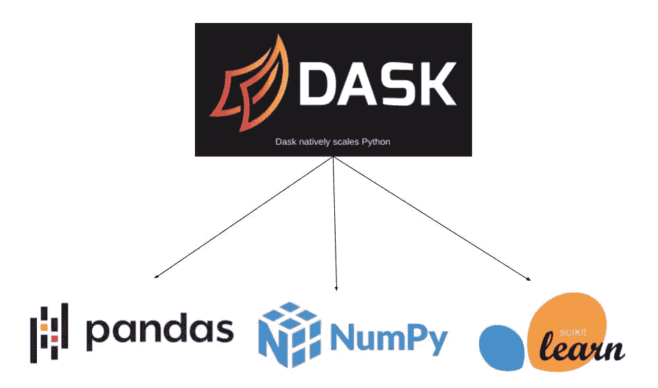
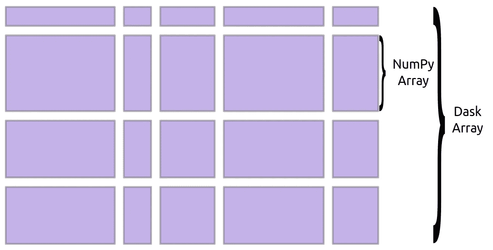
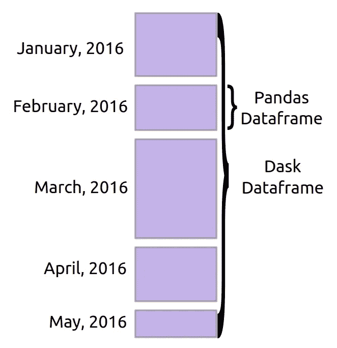
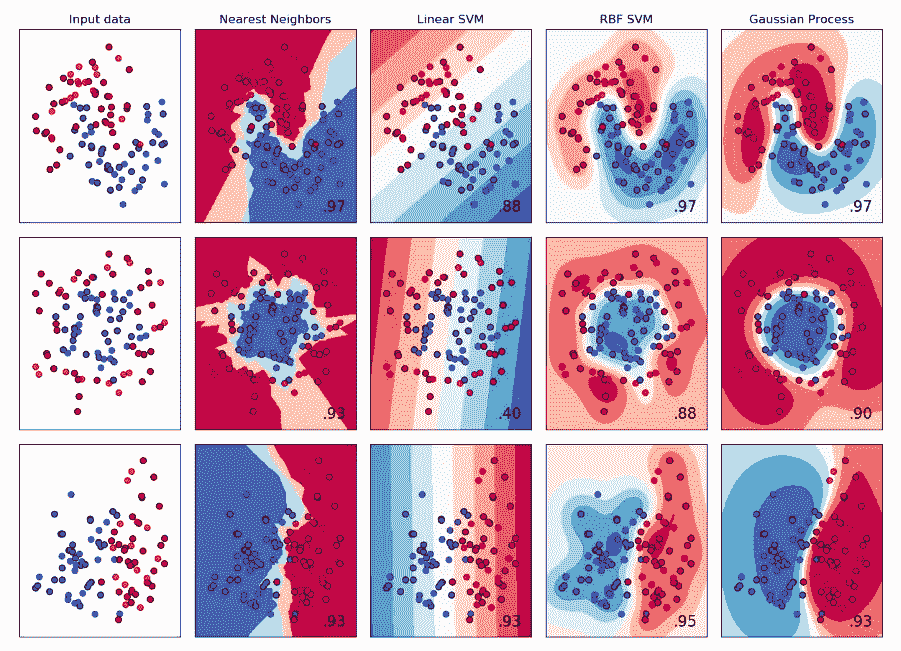
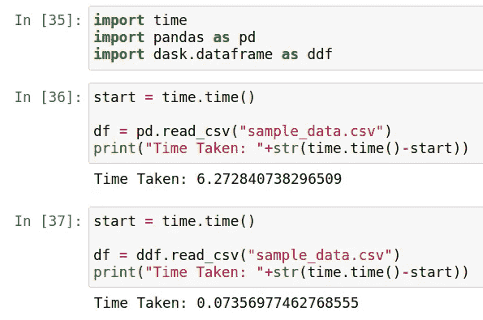
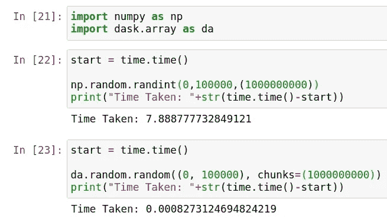

# DASK:使用并行化处理大型数据集的指南

> 原文：<https://towardsdatascience.com/dask-a-guide-to-process-large-datasets-using-parallelization-c5554889abdb?source=collection_archive---------26----------------------->

## [理解大数据](https://towardsdatascience.com/tagged/making-sense-of-big-data)、[数据科学](https://medium.com/towards-artificial-intelligence/how-to-build-a-data-science-portfolio-that-can-get-you-a-job-9f8d113739b3)、[机器学习](/how-to-learn-data-science-from-beginners-to-masters-in-just-1-year-my-personal-experience-6152bedd8157)

## Numpy、Pandas 和 Scikit-Learn 框架中大数据并行计算的简单数据分析解决方案


托马斯·詹森在 [Unsplash](https://unsplash.com/s/photos/motherboard?utm_source=unsplash&utm_medium=referral&utm_content=creditCopyText) 上拍摄的照片

## 介绍

如果您正在处理大量数据，并且您担心 Pandas 的数据框架无法加载它或者 NumPy 数组卡在中间，您甚至需要一个更好的并行化解决方案来处理您的数据和训练机器学习模型，那么 dask 为这个问题提供了一个解决方案。在深入研究之前，让我们看看 dask 到底是什么？

在潜入深海之前，你听说过懒惰装载吗？了解 Vaex 如何主导加载大型数据集的市场。

[](/now-load-huge-datasets-within-a-second-using-lazy-computation-in-python-2698bdb02250) [## 现在，使用惰性计算在一秒钟内加载巨大的数据集😴用 Python？

### 厌倦了用熊猫加载数据集…了解 Vaex 如何帮助在几秒钟内加载大量数据…

towardsdatascience.com](/now-load-huge-datasets-within-a-second-using-lazy-computation-in-python-2698bdb02250) 

## dask 是什么？

[Dask](https://dask.org/) 是一个极其高效的开源项目，它使用现有的 Python Apis 和知识结构，使得在 Numpy、Pandas、Scikit-learn 之间进行修改成为它们的 Dask 支持的对等物变得简单。此外，Dask 的调度程序可以扩展到千节点集群，其算法在全球内****最重要的**台**号超级计算机上进行测试。****

********

****来源:使用 [Dask 并行化](https://dask.org/)扩展到集群****

## ****装置****

****quality 是预装在您的 Anaconda 中的，但是对于 pip，您可以使用以下命令获得完整的版本:****

****Dask 的 Conda 安装:****

```
**!conda install dask**
```

****Dask 的 pip 安装:****

```
**!pip install “dask[complete]”**
```

## ****达斯克是做什么的？****

****Dask 有助于并行化阵列、数据帧和机器学习，以处理大量数据，例如:****

********

******数组**:并行化的 Numpy****

********

```
**# Arrays implement the Numpy APIimport dask.array as da
x = da.random.random(size=(10000, 10000), chunks=(1000, 1000))
x + x.T - x.mean(axis=0)**
```

******数据帧**:平行熊猫****

********

```
**# Dataframes implement the Pandas APIimport dask.dataframe as dd
df = dd.read_csv('financial_dataset.csv')
df.groupby(df.amount).balance.sum()**
```

******机器** **学习**:并行化 Scikit-Learn****

********

```
**# Dask-ML implements the Scikit-Learn APIfrom dask_ml.linear_model import LogisticRegression
lr = LogisticRegression()
lr.fit(train, test)**
```

## ****Dask 中的数据帧****

****大多数 Dask API 与 Pandas API 非常相似，因此您可以使用非常相似的命令直接使用 Dusk 中 Pandas 的数据帧。要生成一个离散的数据帧，您可以像以前调用 Pandas 一样简单地调用` **read_csv()** `方法，或者轻松地将 Pandas 数据帧转换成 Dask 数据帧。****

```
**import dask.dataframe as ddf
dd = ddf.from_pandas(df, npartitions=N)**
```

## ****基准数据框架:熊猫 vs 达斯克****

****对于下面的基准测试，所用的机器具有标准的 4 核处理器，该处理器在测试两种框架时保持标准。****

****我做了一个非常简单而有趣的基准测试，来展示 Dask DataFrame 与传统的 Pandas DataFrame 相比，从一个包含 500 万条记录的. csv 文件中读取数据集的速度有多快。****

********

****为读取 CSV 数据帧对 Pandas 和 Dask 进行基准测试****

*******结果*** :读取一个大小超过 **600MB** 的 **5M** 数据文件，Pandas DataFrame 大约需要 **6.2 秒**，而 Dask DataFrame 由于其令人印象深刻的并行化能力，执行同样的任务所需的时间远少于**秒**。****

*******注*** :这个测试是在一个小数据集上进行的，但是随着数据量的增加，读取数据的时间差会成倍增加。****

****您可以使用下面的代码来改变更大数据集的基准测试。****

## ****基准阵列:Numpy 与 Dask****

****在这个基准测试中，我使用 Numpy 数组和 Dask 数组生成了一个**1 万亿**大小的随机数数组。****

********

****创建阵列的基准测试 Pandas vs Dask****

*******结果*** :正如所料，结果非常明显，因为 Numpy 数组的计算时间不到 **8 秒**，而 Dask 数组的计算时间**可以忽略不计**！****

****您可以使用下面的代码尝试相同的基准测试****

## ****关键要点****

****Dask 有助于更快地进行数据分析，因为它并行化了现有的框架，如 Pandas、Numpy、Scikit-Learn，并使用机器 CPU 的全部潜力并行处理数据。你可以在这里尝试 Dask [的惊人功能](https://docs.dask.org/en/latest)。****

****延迟加载与并行处理的结合确实是一个致命的组合，可以帮助您在任何需要的时候利用系统的全部潜力，要了解更多信息，您可以阅读[这篇关于 Vaex](/now-load-huge-datasets-within-a-second-using-lazy-computation-in-python-2698bdb02250) 的文章。****

## ****数据科学家的进一步阅读:****

****[](https://medium.com/towards-artificial-intelligence/how-to-evaluate-machine-learning-model-performance-in-python-135b4ae27f7e) [## 如何评价 Python 中机器学习模型性能？

### 一个实用的方法来计算模型的性能和在 Python 中的实现，涵盖了所有数学…

medium.com](https://medium.com/towards-artificial-intelligence/how-to-evaluate-machine-learning-model-performance-in-python-135b4ae27f7e) [](/how-to-learn-data-science-from-beginners-to-masters-in-just-1-year-my-personal-experience-6152bedd8157) [## 如何在短短 1 年内把数据科学从初学者学到大师(我的亲身经历)

### 随着时间的推移，我的从初学者到大师学习数据科学的清单的完整汇编只需要一年时间…

towardsdatascience.com](/how-to-learn-data-science-from-beginners-to-masters-in-just-1-year-my-personal-experience-6152bedd8157) 

**谢谢！******