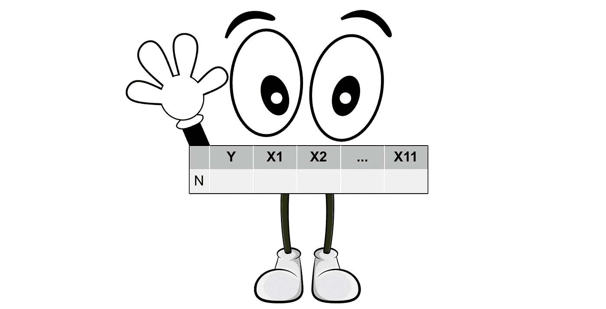
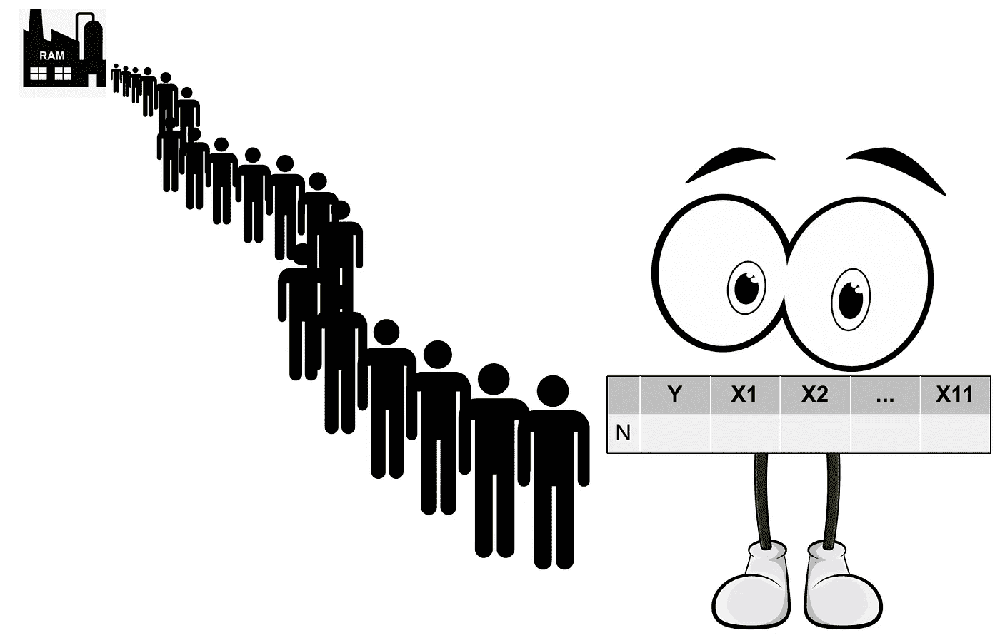
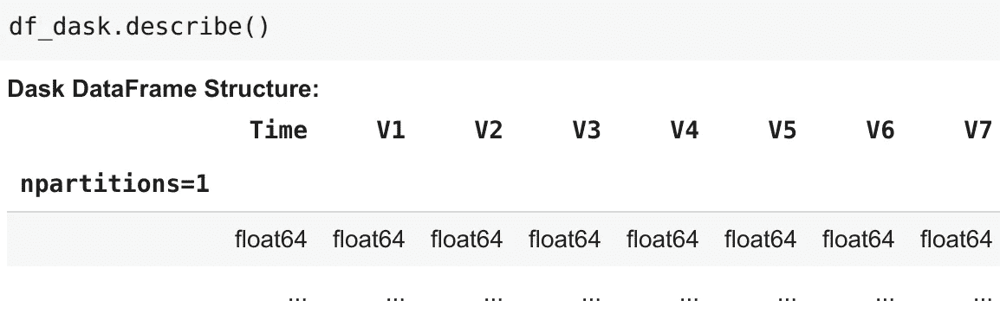
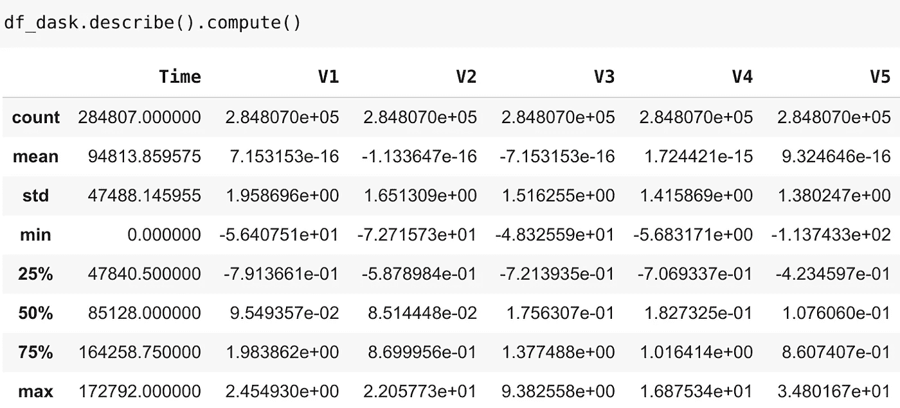

# Dask 与 Vaex:大型数据处理中数据点的经验

> 原文：<https://towardsdatascience.com/dask-vs-vaex-experience-of-a-data-point-on-large-data-processing-ca157b81846e?source=collection_archive---------39----------------------->

## 需要处理十亿行数据？我来和大家分享一下我使用 Dask 和 Vaex 的经验。



嗨，我是数据 N！

你好。很高兴见到你！😄我是 Data N(你可以叫我 N)，今天，我想分享我作为 data point 与我的新经理 Dask 和 Vaex 一起工作的经验，以及一些与他们建立良好工作关系的技巧(*wink*)。

# 背景故事

背景故事是这样的…最近，我们公司有一个小的重组和我们的前经理，熊猫🐼，由两名新员工接管。官方给出的原因是熊猫转移到了新的机会，但我们所有内部人士都知道发生了什么。

嗯，事实是高层管理人员对熊猫最近的表现不满意。我们公司发展迅速，业务呈指数增长。熊猫最初做得很好，但逐渐发现自己无法应对不断增加的数据。当满载美国数据的卡车到达时，我们被证明对熊猫来说太多了。通常，我们会坐在一个名为硬盘的大型仓库中，但当我们需要处理时，有一个名为随机存取存储器(又名 RAM)的临时存储室，我们将被运送到那里进行进一步处理。问题就在这里:RAM 中没有足够的空间容纳我们所有人。



RAM 里没有足够的空间容纳我们所有的人

所以我们的猜测是，高层管理人员决定用 Dask 和 Vaex 替换 Pandas，以便进一步发展公司。这很可悲，但这只是生意。

# 介绍 Dask 和 Vaex…

自从两个新经理来了，他们每个人都部署了一个独特的伎俩来对付我们。

使用 Dask，我们被分成组(或者用他的话说，“分区”)，并且一次处理一个到几个组。

有了 Vaex，我们每个人都提供了我们在仓库中的地址，当 Vaex 需要我们时，她会根据我们的地址调用那些需要来 RAM 的人(她将这种技术称为“内存映射”)。

不管怎样，好的一面是工作完成了，尽管我们太多了，无法一次全部放入 RAM，高层管理人员现在很高兴。

# 我如何适应 Dask 和 Vaex？

在一起工作了这么长时间后，我们已经很习惯熊猫的命令了，所以 Dask 和 Vaex 都试图用类似的命令来命令我们，这很有帮助。但是它们毕竟不是熊猫，所以还是有一些不同。

## **# Dask**

Dask 喜欢一个关键词叫“计算”。在他说“计算”之前，我们不能完全处理。达斯克总是告诉我们做事要有目的。因此，他的程序通常会是一系列类似熊猫的命令，然后他会在最后一个主要命令中喊出“计算”,然后我们开始全面的实际工作。

以下面的简单代码为例:

```
import dask.dataframe as dddf_dask = dd.read_csv(’data.csv’)
df_dask.describe()
```

您得到的不是您期望得到的一般统计数据，而是这个(基本上没有显示任何数据):



发生的情况是，当执行`dd.read_csv`时，Dask 只从 CSV 文件的开头读入一个美国数据点样本。当调用`describe()`时，Dask 仅仅记录下要采取的步骤。

为了得到你从熊猫那里得到的通常的输出，你需要一个神奇的词“计算”:



## # Vaex

对于 Vaex，她也有自己的风格。一个显著的区别是，她总是希望我们在任何处理完成之前执行列车测试拆分。

那是因为 Vaex 有一个巧妙的技巧。

假设我们对训练数据进行了一些转换:

通过下面两行代码，这些相同的转换可以很容易地应用于测试数据:

```
state = df_train.state_get()
df_test.state_set(state)
```

我问 Vaex 这个技巧背后的秘密，她告诉我实际上她的每个数据帧都包含一个*状态*，它基本上包含了应用于数据帧的所有转换的信息。

因此，我们在两行代码中所做的是获取包含在`df_train`的*状态*中的转换信息，并将这个*状态*应用到`df_test`，所有的更改都将被传递。

如果你想知道，标准化转换在`df_test`上使用了`df_train`的平均值和标准偏差。

我猜她真的知道如何聪明地工作！

# Dask 和 Vaex 对比如何？

这是一个敏感的话题…

老实说在我看来，就性能而言，Vaex 似乎比 Dask 更有能力。我们中的一些人喜欢 Dask，所以不要告诉别人我说了什么，否则他们可能会解雇我。你也不用信我的话，看看别人([这里](/beyond-pandas-spark-dask-vaex-and-other-big-data-technologies-battling-head-to-head-a453a1f8cc13)和[这里](/dask-vs-vaex-for-big-data-38cb66728747#:~:text=Vaex%20is%20a%20high%2Dperformance,and%20explore%20big%20tabular%20datasets.&text=Dask%20is%20more%20focused%20on,datasets%20on%20a%20single%20machine.))在说什么就知道了。

尽管是一个高水平的表演者，Vaex 还是有点害羞，所以她不适合和其他人相处，比如 Scikit-Learn，通常需要一些中介。然而，Dask 和许多其他人合作得很好，因为他经常和 Numpy，Pandas 和 Scikit-Learn 交往。

您可能还会注意到，Dask 擅长在集群环境中工作，而 Vaex 在单台机器上表现出色。

这就是我对我的新经理 Dask 和 Vaex 的所有分享！希望我的建议是有用的，你也将有一个与 Dask 和/或 Vaex 合作的好时光。😄

感谢听我的分享，如果你有任何问题或意见，请随时告诉我。

# 我的内部消息来源

 [## 简介- Dask 教程文档

### 您可以在实时会话中运行该笔记本，也可以在 Github 上查看它。欢迎来到 Dask 教程。Dask 是平行的…

tutorial.dask.org](https://tutorial.dask.org/00_overview.html)  [## Vaex 是什么？- vaex 3.0.0 文档

### Vaex 是一个 python 库，用于懒惰的核外数据框架(类似于 Pandas)，以可视化和探索大的表格…

vaex.readthedocs.io](https://vaex.readthedocs.io/en/latest/index.html)