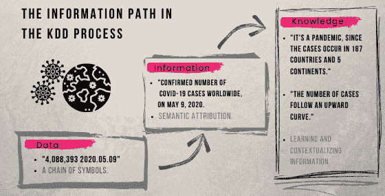
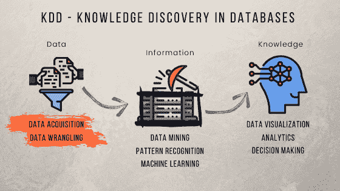
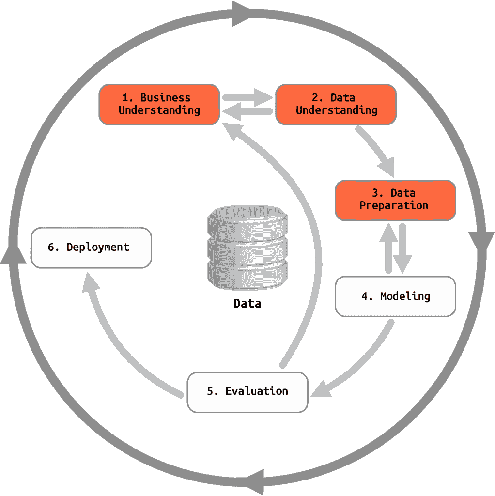
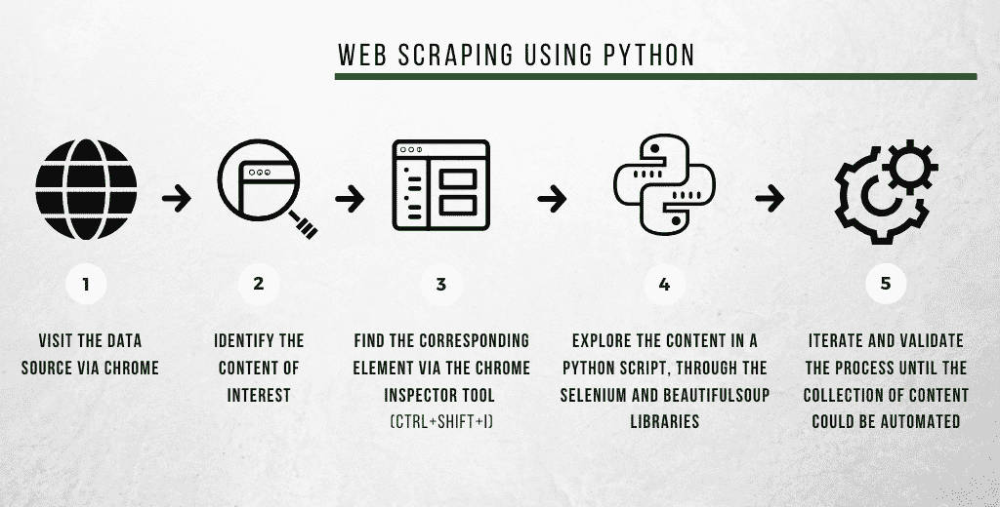
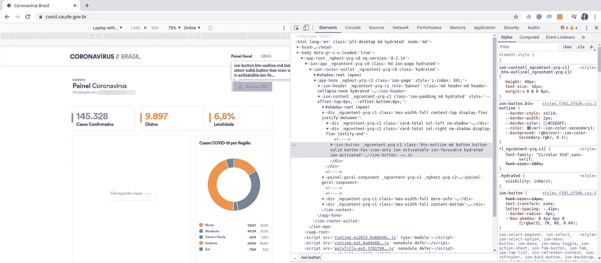
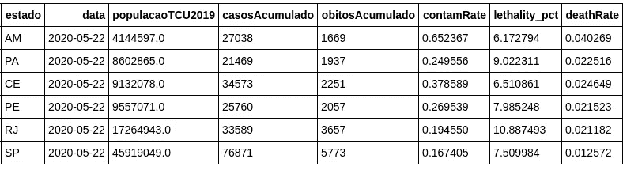
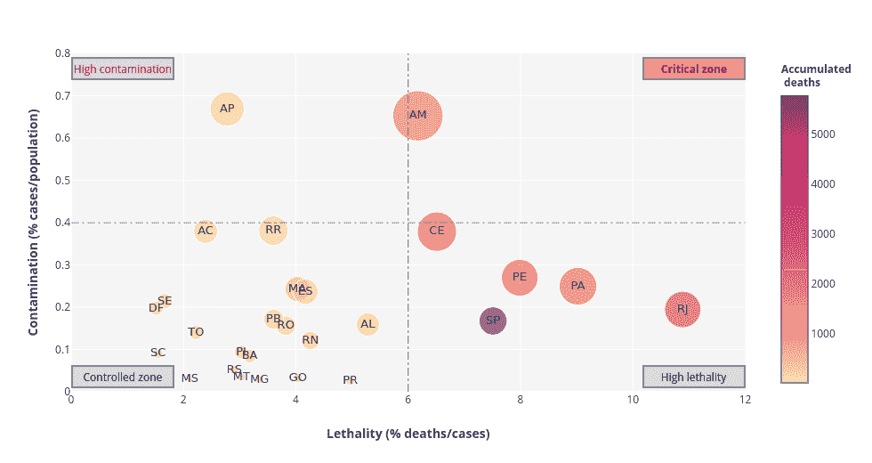

# 数据获取、网络搜集和 KDD 过程:巴西新冠肺炎数据的实践研究

> 原文：<https://towardsdatascience.com/data-acquisition-web-scraping-and-the-kdd-process-a-practical-study-with-covid-19-data-in-brazil-f7f397e814b7?source=collection_archive---------57----------------------->

> 你对数据科学感兴趣吗？你知道巴西的**新冠肺炎的情况吗？在这篇文章中，我将探索数据获取的概念，并演示如何使用简单的**网络搜集技术来获取疾病进展的官方数据**。值得一提的是，通过对代码进行一些修改，这里使用的策略可以很容易地扩展到来自其他国家的数据，甚至扩展到其他应用程序。所以戴上你的面具，洗干净你的手，现在就开始读吧！**

[***派人去葡萄牙任职。***](https://tbnsilveira.info/?p=985)

我必须以向所有新冠肺炎受害者表达最诚挚的情感开始这篇文章。正是在他们的记忆中，我们必须寻找科学发展的动力，同时不要忘记，如果科学存在，那是因为有一种人性在支撑着它。关于数据科学，正是通过它，我们可以最大限度地减少假新闻，并以某种方式为一个更明智、更明智和更有思想的社会做出贡献。

几周前，当我意识到在官方基础上几乎没有关于巴西新冠肺炎病例数量的分层信息时，我开始了这个数据分析项目，例如世界卫生组织(世卫组织-世界卫生组织)或约翰·霍普斯金大学维持的[小组](https://coronavirus.jhu.edu/map.html)的信息。作为分层，其实我们理解的是可以在不同层观察到的数据集。也就是说，对于像巴西这样的大陆规模的国家，了解该国的病例总数只能提供信息。为了使这些信息发挥作用，必须按照地区、州或城市进行分层。

为了提供问题的概述和指导分析的发展，我为这项研究列出了一些目标，希望读者也能采纳:

*   获得 KDD 过程的概述，并理解数据采集在其中的位置。
*   探索数据采集技术，以便类似的问题可以很容易地使用它们。
*   从官方数据库获取巴西新冠肺炎病例和死亡人数，按州分类。

在接下来的几节中，我们将探索其中的每一项，以构建必要的概念并在 Python 开发环境中实现它们。准备好了吗？

# KDD——数据库中的知识发现

数据库中的知识发现是人们从数据库中寻找全面的、有效的和相关的模式的过程。这是一个交互和迭代的过程，其中包括许多今天被称为数据科学的技术和方法。

然而，在探索 KDD 过程的主要阶段之前，有必要区分三个关键术语:数据、信息和知识。KDD 的每一步都与处理每一项有关，如图 1 中我们正在解决的问题所示。



图一。从数据到知识:KDD 的信息处理。

简而言之，数据都是与某种现象或事件相关的符号链，无论是否结构化。数据本身没有任何意义。看:408 万这个数字只是个基数。只有当我们赋予它这是新冠肺炎确诊病例数的感觉后，它才变得可怕。换句话说，只有当我们赋予数据意义时，我们才有信息。

正是通过对信息的处理，我们获得了知识，这与我们所说的“认知过程”密切相关——感知、语境化和学习——因此也与智力密切相关。

一旦理解了这三个概念，我们现在就可以进入 KDD 进程的三个基本阶段。这些无非是分别专用于获取和探索数据、信息和知识的任务集，如下图 2 所示:



图二。KDD 过程及其阶段(I)数据获取，(ii)信息处理，和(iii)知识提取。

KDD 流程由多个步骤组成，而这些步骤又是多个任务的组合。例如，数据挖掘任务是信息处理步骤的一部分。相比之下，那些与数据可视化、分析和决策制定相关的任务是最后一步的一部分，旨在进行知识提取。

在本文中，我们将只关注数据采集任务，这是任何 KDD 项目的基础。通常，没有预定义的方法来获取数据。中长期项目通常需要数据模型，以及用于收集和存储数据的健壮架构。反过来，短期项目大多需要立即可用的资源。

牢记这些基本概念，我们准备朝着我们的目标前进:获得巴西新冠肺炎病例数量的官方数据。

# 定义数据采集策略

正如我们所见，数据采集策略只有从完整的 KDD 过程的角度构建才有意义。也就是说，在我们开始收集数据之前，我们需要有一个明确的目的定义。我们试图解决或阐明的问题是什么？

CRISP-DM 参考模型如图 3 所示，在经历 KDD 过程时可用作指南针。你还记得我们之前定义 KDD 为一个互动和迭代的过程吗？

交互意味着两个或更多代理之间的相互或共享的动作。它既可以指持有数据和信息的人，也可以指阶段。在图 3 的第一步之间的两个方向上的短箭头表示该过程中必要的交互。我敢说，这是 KDD 或数据科学领域的新手面临的最大挑战:最初有一种错觉，认为这些步骤是连续不断的，这导致了一种做错事的感觉。恰恰相反，通过理解业务，我们使得理解数据成为可能，数据为我们收集关于业务的新见解，等等。

反过来，迭代与相同过程的重复相关联。图 3 中较大的箭头形成一个圆圈，象征着这种重复。它从第一步开始，经过开发之后，又回到第一步。KDD 项目永远不会停滞不前。



图 3。根据 CRISP-DM 参考模型的 KDD 流程阶段。(改编自*维基共享资源*。)

图 3 中突出显示的方框代表与**数据采集**过程相关的步骤。根据 CRISP-DM，第一步——理解业务——是整个项目成功的基础，包括(I)业务目标的定义；(二)对现状的评估，包括清单和风险分析，以及哪些数据和信息已经可用；㈢确定应用数据挖掘的目标，以及成功标准的定义；(四)项目计划的制定。

第二步——理解数据——包括(I)第一个数据样本和(ii)其详细描述；㈢数据的初步探索；以及(iv)对该数据质量的评估。请记住，这两个初始步骤是交互进行的，并且在理想情况下，涉及领域和业务专家。

第三步从发起人对项目计划的确认开始，其特点是准备数据。一般来说，这一阶段所需的工作变得更加昂贵，因此，他们的变化应该是温和的。这一步的主要任务包括数据的选择和清理、格式的构建和调整以及数据的合并。所有这些任务通常被称为数据预处理。

一旦你在理解业务(或问题)和跟踪可用数据之间有了第一次互动，你的**数据获取策略**就会开始被定义。为此，我主要考虑两种可能的情况:

1.  **有对数据源**的控制:你可以以某种方式管理和控制生成数据的源(传感器、仪表、人员、数据库等)。).以护士长的活动为例:他可以监督、审计、建立协议，并记录他所在病房的所有患者数据。重要的是要注意，控制是针对数据的来源或注册，而不是针对与数据相关的事件。
    这种场景通常发生在高度复杂或持续时间长的项目中，在这些项目中，数据模型已经建立，并且有方法确保其一致性和完整性。
2.  **没有对数据源**的控制:这是在短期项目或偶尔感兴趣的项目中，以及在使用或要求来自其他来源的数据的项目、分析或常年研究中最常见的情况。无论采取何种举措，数据采集策略都必须更加可靠，因为任何超出其控制范围的变化都会增加分析成本，甚至导致项目不可行。
    我们自己的研究说明了这种情况:如果我们无法控制这些数据的产生和传播，如何获得巴西新冠肺炎病例的分层数量？

期望在企业和机构中，或者在领导纵向研究或制造过程时，找到第一个场景。否则，您可能需要处理第二个问题。在这种情况下，您的策略可能包括订阅、数据分配协议，甚至是在获得适当许可后从互联网上搜索和编译此类数据的技术。Web 抓取是这些技术中的一种，我们接下来会看到。

# 通过网络搜集获取数据:通过巴西卫生部的官方小组获取数据

随着目标的确立——巴西新冠肺炎病例的分层数量——我的第一个行动是寻找可能的来源。2020 年 4 月中旬我咨询了[巴西卫生部](https://saude.gov.br/)门户网站。当时，我还没有找到统一的、容易获取的信息，所以我增加了可能来源的粒度:州和市卫生部门。在这种情况下，挑战在于他们呈现数据的方式的异质性。在咨询一名公共卫生工作者时，她告诉我，这些数据已经整合到国家公报中，具体的需求应该向机构提出。因此，我的第一个策略是设计一种自动收集此类公告(PDF 格式)并开始提取所需数据的方法——部分结果可在这个 [GitHub 资源库](https://github.com/tbnsilveira/epidemic_BRdata/blob/master/data_acquisition/Brazilian_EpidemiologicalBulletins.ipynb)中获得。

然而，在 2020 年 5 月初，我有一个令人不快的惊喜:在新闻公告中，我用来提取数据的表格(对于那些好奇的人来说，[pdf plumb](https://github.com/jsvine/pdfplumber)库是一个极好的工具)被数字所取代，这使得我的提取方法不可行。

我特意详细阅读了上述段落，原因很简单:再次展示 KDD 数据采集步骤固有的交互过程。此外，当我们承担一个我们无法控制数据源的项目时，我想强调风险和不确定性。在这种情况下，最好有其他选择，建立合作关系或协议，并寻求建立自己的数据集。

当我在寻找新的策略时，巴西卫生部开始将数据整合到一个 CSV 文件中，几天后将格式改为 XLSX，并每天更改文件名。在下面的段落中，我将详细说明我是如何针对这种新情况调整我的过程和代码的。

顺便说一句，从互联网上可用的页面和内容中自动检索数据和信息被称为 web 抓取。这项技术可以通过 Python 库轻松实现，如图 4 所示。



图 4。使用 Google Chrome 检查工具和 Python 语言简化网页抓取过程的步骤。

我们终于到了这篇文章的实际部分——也许是最令人期待的部分。按照图 4 中定义的步骤，我们首先(1)访问[冠状病毒小组](https://covid.saude.gov.br/)，以及(2)通过点击页面右上角的“Arquivo CSV”按钮，确定我们感兴趣的数据。当我们激活 Google Chrome 页面检查工具(3)时，我们会找到与 HTML 页面上的项目相对应的代码，如图 5 所示。记住，检查工具是由*检查*菜单激活的，当我们右击页面的任何元素时，或者通过快捷键 *ctrl+shift+I* 。



图 5。通过谷歌 Chrome 检查工具看到的巴西卫生部冠状病毒门户网站。

下一步(4)是从我们的 Python 代码中访问这些数据，这可以通过 Jupyter 笔记本、脚本或 IDE 来完成。在任何情况下，这个想法都是通过使用 [Selenium](https://selenium-python.readthedocs.io/) 库来模拟对所需门户的访问以及与 web 页面的交互。

在下面几行中，我开始创建一个虚拟环境来访问 Google Chrome 模拟器中的门户网站 URL:

```
# Initial statements 
from pyvirtualdisplay import Display 
from selenium import webdriver # Parameters definition 
url = 'https://covid.saude.gov.br' # Starts the virtual environment: 
display = Display(visible=0, size=(800,600)) display.start() # Opens the Chrome emulator in the desired URL: 
driver = webdriver.Chrome() # Reads and gets the page content encoded in UTF-8: 
driver.get(url) page = driver.page_source.encode('utf-8')
```

一旦我们读取了页面，我们就进入图 4 的步骤(5 ),在这里我们重复这个过程，直到我们保证数据是我们想要的形式。为此，我们可以首先检查加载页面的大小(例如，如果它为空，则意味着出现了问题)及其前几行:

```
# What is the length of the loaded page? 
print(len(page)) # What is the data type? 
print(type(page)) # What is the content of the first positions of the byte stream? print(page[:2000])
```

大多数情况下，下一步将是使用被称为解析器的工具来探索 HTML 内容——[beautiful soup](https://www.crummy.com/software/BeautifulSoup/bs4/doc/)库是一个优秀的 Python 解析器。在我们的例子中，考虑到我们感兴趣的数据不在 web 页面上，而是来自这个页面上的一个操作，我们将继续只使用 Selenium 方法来模拟按钮上的点击，自动下载缺省系统文件夹中所需的文件:

```
## Path obtained from inspection in Chrome: 
xpathElement = '/html/body/app-root/ion-app/ion-router-outlet/app-home/ion-content/div[1]/div[2]/ion-button' ## Element corresponding to the "Arquivo CSV" button: 
dataDownloader = driver.find_element_by_xpath(xpathElement) 
## Download the file to the default system folder: dataDownloader.click()
```

下一步是验证文件下载是否正确。因为它的名字不是标准化的，所以我们通过 glob 库列出了最近的文件:

```
import os 
import glob ## Getting the last XLSX file name: 
list_of_files = glob.glob('/home/tbnsilveira/Downloads/*.xlsx')
latest_file = max(list_of_files, key=os.path.getctime)
print(latest_file)
```

至此，网页抓取任务完成，同时我们进入*数据准备*阶段(如有必要，查看图 3)。

假设我们感兴趣的是每个州的病例数、人口数、死亡率(死亡人数与病例数之比)和死亡率(死亡人数与人口数之比)。下面的代码行执行提供所需信息所需的预处理任务。

```
## Reading the data 
covidData = pd.read_excel(latest_file)
covidData.head(3) ## Getting the last registered date: 
lastDay = covidData.data.max() ## Selecting the dataframe with only the last day 
## and whose data is consolidated by state 
covidLastDay = covidData[(covidData.data == lastDay) & 
(covidData.estado.isna() == False) & (covidData.municipio.isna() == True) & (covidData.populacaoTCU2019.isna() == False)] ## Selecting only the columns of interest: 
covidLastDay = covidLastDay[['regiao', 'estado', 'data', 'populacaoTCU2019', 'casosAcumulado', 'obitosAcumulado']]
```

预处理步骤通过从预先存在的数据生成一些附加特征来完成:

```
## Copying the dataframe before handling it: 
normalCovid = covidLastDay.copy() ## Contamination rate (% of cases by the population of each state) normalCovid['contamRate'] = (normalCovid['casosAcumulado'] / normalCovid['populacaoTCU2019']) * 100 ## Fatality rate (% of deaths by the number of cases) normalCovid['lethality_pct'] = (normalCovid['obitosAcumulado'] / normalCovid['casosAcumulado']) * 100 ## Mortality rate (% of deaths by the population in each state) normalCovid['deathRate'] = (normalCovid['obitosAcumulado'] / normalCovid['populacaoTCU2019']) * 100
```

从这一点出发，我们可以在预处理的数据库中进行搜索:

```
normalCovid.query("obitosAcumulado > 1000")
```



数据采集阶段到此结束。如果我们遵循 CRISP-DM 方法，下一步可能是构建模型、分析或可视化。为了说明这一 KDD 过程的可能结论，图 6 展示了一个*四象限*图，该图将巴西不同州的病例百分比与致死率相关联(生成该图的代码可在 [GitHub](https://github.com/tbnsilveira/epidemic_BRdata/blob/master/data_acquisition/Brazilian_Ministry_of_Health_COVID19data.ipynb) 上获得)。



图 6。根据卫生部 2020 年 5 月 22 日发布的数据，巴西各州新冠肺炎病例数与致死率之间的关系。

上图是我们到目前为止所介绍的整个过程的结果:数据是通过网络搜集获得的，信息是通过处理数据生成的，知识是通过结构化信息获得的。亚马孙州是每个居民感染人数最多的州，也是死亡率最高的州。圣保罗州是累计死亡人数最多的州，但就其总人口而言，感染人数相对较低。

# 最终考虑

在本文中，我试图概述 KDD 过程以及如何使用 web 抓取技术实现数据采集，尤其是在小型项目或分析的情况下。

您可能想知道访问门户网站并简单下载那里的可用数据是否会更容易。是的，会的！然而，数据科学项目期望数据获取尽可能自动化，为预测分析提供空间，预测分析的模型需要每天或不断更新。此外，对于相对更简单的问题，理解复杂的主题并获得对我们技术的信心变得更加有效——或许还很有趣。

最后，我必须提醒你，在获取和处理数据时，一定要遵守道德规范。自动收集公共领域的数据，不需要行政费用，是一种完全合法的活动。然而，如果你对何时允许或不允许使用这种算法有疑问，请不要犹豫，向专家甚至数据所有者咨询。

*原载于 2020 年 5 月 23 日*[*http://tbnsilveira . info*](https://tbnsilveira.info/2020/05/23/the-data-acquisition-process-via-web-scraping-a-case-study-of-covid-19-in-brazil/)*。*