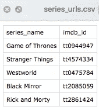
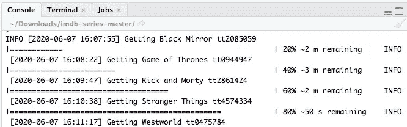
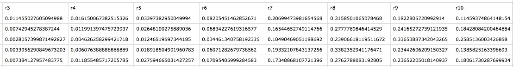
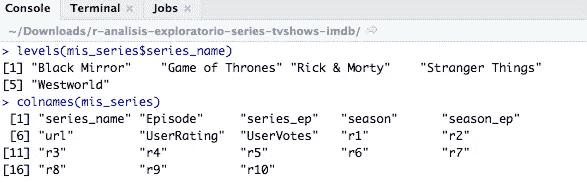
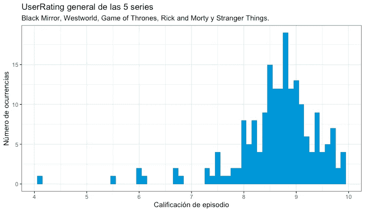
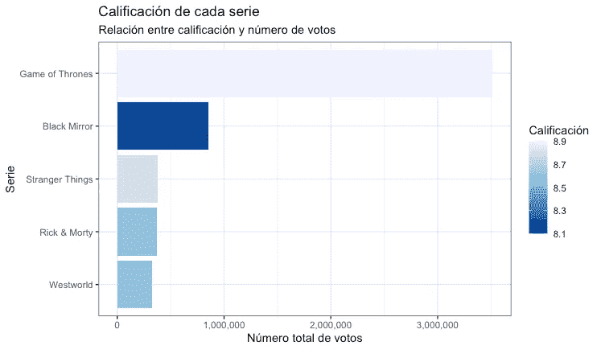
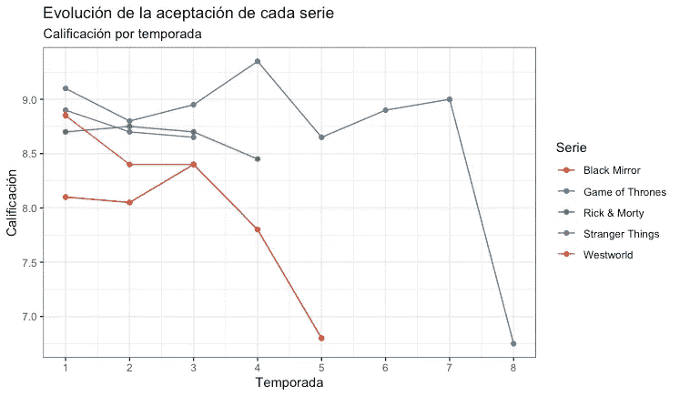
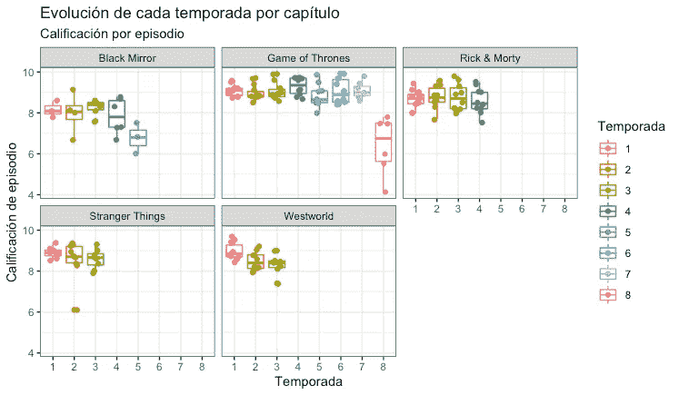
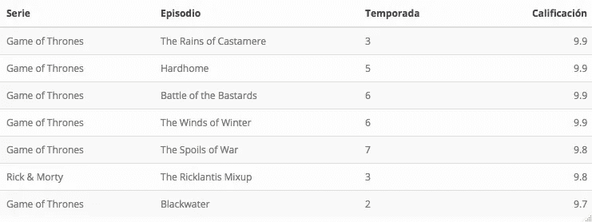
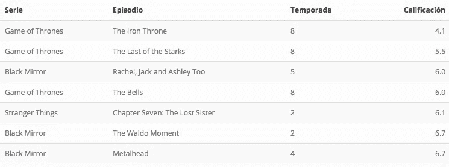

# 基于 R 的 IMDb 刮削数据的数据分析与可视化

> 原文：<https://towardsdatascience.com/data-analysis-and-visualization-of-scraped-data-from-imdb-with-r-5d75e8191fc0?source=collection_archive---------43----------------------->

## 极客(也不那么极客)喜欢的电视剧


电视剧数据可视化仪表盘，文末链接

当然，你和我一样，在一天或一周中的任何时候，利用这个休息时间来摆脱日常事务、工作和问题，只是放松一下，在流媒体服务上、电视上看你最喜欢的电视连续剧，或者掸掉旧 DVD 上的灰尘。

我们享受那些娱乐的时刻，无论是单独还是与人一起，我们可以沉浸在一个吸引我们、感动我们、让我们反思或娱乐我们的故事中。这些电视连续剧中有许多以离奇的告别告终，而在其他情况下，它们的结局很糟糕，惹恼了它们的粉丝。无论如何，很多事情的发生并不是每个人都能看到的。

在这种动机下，我们将对一些最受欢迎的电视剧(尤其是在极客文化中)进行数据可视化和分析:《黑镜》、《西部世界》、《权力的游戏》、《瑞克与莫蒂》、《奇人异事》。

# IMDb 数据的准备和提取

[IMDb(互联网电影数据库)](https://www.imdb.com/)目前有一个更新的和广泛的在线数据库，包含关于电视剧、电影等的信息。它还根据世界各地用户的意见和投票，为它存储的每个主题保存评级。

我们将使用一个有趣而简单的脚本来准备我们将要使用的数据集。这个脚本使用 **rvest** 包从 IMDb 网站执行 Web 抓取(一种用于以自动化方式从网站提取信息的技术),不需要深入研究这个主题，稍后再详细描述。你所要做的就是更新文件" **series_urls.csv"** ，在这里你可以添加连续剧、电影或者任何你想包含在 IMDb 中的东西的标题以及它的标识符(例如对于《权力的游戏》来说，它的 URL 是[https://www . IMDB . com/title/tt0944947/](https://www.imdb.com/title/tt0944947/)，其中“TT 0944947”是我们所关心的)。

在这篇文章中，考虑到所选的电视剧，CSV 文件看起来像这样:



分析电视剧《IMDb》——要分析的电视剧

一旦定义了这个 CSV 文件，就可以在根文件夹中运行 R 脚本，对每个系列的所有数据进行 Web 抓取(更新到最新)。



解析电视剧《IMDb——运行网络抓取脚本》

我们将获得什么数据？那么，它将在**【data】**文件夹中生成一个新的 CSV 文件，该文件由每部电视剧的以下变量组成:

**连续剧 _ 名称** < chr >电视剧名称
**连续剧 _ep** < int >剧集编号
<int>季号
**季 _ep** < int >季号
**网址** < chr > IMDb 网址为剧集
**剧集** <
**用户投票** < dbl >评分票数
**r1** < dbl >评分为 1 分的用户比例
…
**r10**<dbl>评分为 10 分的用户比例

本文在 Web 抓取后获得的 CSV 文件如下所示:


分析电视剧《IMDb—IMDb 1》网络抓取后获得的 CSV 文件



分析电视剧《IMDb—IMDb 2》网络抓取后获得的 CSV

我知道，我知道……现在你看着我问:对于这一切，你说了那么多的剧本在哪里，索尔？我只是想先弄清楚它是如何工作的，在分享之前，你可以在作者的资源库中找到:[**https://github.com/nazareno/imdb-series**](https://github.com/nazareno/imdb-series)。现在你只需要下载、定制并在本地运行。

# 让我们开始处理数据

好了，用 R 开始一个新的脚本，现在我们有了数据集，是时候做一点分析了。我们将首先加载我们将使用的库，以及先前通过 Web 抓取获得的数据集的 CSV。

```
library(tidyverse)
library(plotly)
library(kableExtra)
library(knitr)theme_set(theme_bw())# CSV READING GENERATED BY IMDB WEB SCRAPING 
series_imdb <- read_csv("series_imdb.csv")# EN CASO DE HABER GENERADO UN DATASET MÁS GRANDE, FILTRAR SÓLO ALGUNAS SERIES DEL CSV COMPLETO
mis_series <- series_imdb %>% filter(series_name %in% c("Black Mirror", "Game of Thrones", "Rick & Morty", "Stranger Things", "Westworld")) %>%
  mutate(series_name = factor(series_name)) %>%
  mutate(season = factor(season))# TV SERIES AND COLUMNS PREVIEW
levels(mis_series$series_name)
colnames(mis_series)
```

现在，我已经从 5 部电视剧中获得了 189 个观察值和 18 个可用变量。



浅析电视剧《IMDb》——电视剧与控制台中的变量

我们准备好回答问题了。丹妮莉丝的龙有性别吗？狄摩高根会继续伤害人类吗？。不，不幸的是不是这些类型的问题，但我们将能够获得相关的数据和回答问题，如哪个系列更成功？最不成功的几季或几集是什么？

# 用户评级变量概述

在本分析中，我们将用来回答问题的一个变量是用户评级，在下文中理解为指定评级。让我们来看看 5 部电视剧集的收视率分布情况。

```
# GLOBAL USER RATING HISTOGRAM
mis_series %>%
  ggplot(aes(UserRating)) +
  geom_histogram(binwidth = .1, fill = "#0196d7") +
  scale_x_continuous(breaks = seq(0, 10, 1)) +
  labs(y = "Número de ocurrencias", x = "Calificación de episodio") + 
  ggtitle("UserRating general de las 5 series", "Black Mirror, Westworld, Game of Thrones, Rick and Morty y Stranger Things.")
```

用户评分是用 0 到 10 分来衡量的。我们将获得下面的情节，其中我们可以看到，在这五个选定的电视连续剧的情况下，8 到 9 之间的分数占主导地位。一开始就必须承认，选择的五个系列都是制作相当精良的电视剧。



分析电视连续剧《IMDb》——普通用户评分

# 收视率最高的电视剧就是票数最多的电视剧吗？

IMDb 提供了 UserVotes 变量，通过它我们可以发现投票数和每部电视剧获得的收视率之间是否存在关系。

```
# RELATION BETWEEN RATING AND VOTES PER TV SERIES
series_votos <- mis_series %>% group_by(series_name) %>% summarise(rating = median(UserRating), totalvotos = sum(UserVotes))
series_votos %>% 
  ggplot(aes(x = reorder(series_name, totalvotos), y = totalvotos, fill = rating)) +
  geom_histogram(stat = "identity") +
  scale_fill_distiller(name="Calificación", palette = "Blues") +
  scale_y_continuous(labels = scales::comma) + 
  coord_flip() +
  xlab("Serie") + ylab("Número total de votos") + 
  ggtitle("Calificación de cada serie", "Relación entre calificación y número de votos")
```

通过获得的直方图，我们发现虽然收视率最高的电视剧是票数最高的电视剧，但与此相反，收视率最低的电视剧并不完全是票数最少的电视剧。所以我们可以说总票数和收视率没有太大关系。



电视连续剧《IMDb》的收视率和投票分析

# 每部电视剧从头到尾的接受度如何？

为了回答这个问题，我们将使用折线图。中位数用于衡量评估，因为它不受平均值等极值的影响。

```
# ACCEPTANCE OF EACH TV SERIES BASED ON ITS SEASON RATING
series_acep <- mis_series %>% group_by(series_name, season) %>% summarise(rating = median(UserRating))
series_acep %>% 
  ggplot(aes(x = as.numeric(season), y = rating, color = series_name)) +
  geom_line() +
  geom_point() +
  scale_x_continuous(breaks = 1:10) +
  scale_color_brewer(name = "Serie", palette = "Set1") +
  xlab("Temporada") + ylab("Calificación") + 
  ggtitle("Evolución de la aceptación de cada serie", "Calificación por temporada")
ggplotly()
```

随着剧情的展开，我们可以看到每一部电视剧的悲惨衰落，尤其是《黑镜》和《权力的游戏》(也许有充分的理由，他们给了我们一个多么精彩的大结局，对吗？).



电视剧《IMDb》各季收视率和接受度分析

# 每章是如何演变影响每部电视剧的季收视率的？

这是一个也许你们很多人也会有的问题。嗯，我们会用每一季的方框图来验证，用它也可以看到每集的收视率汇总。

```
# SEASON RATING BY EPISODES
series_temp <- mis_series %>%
  ggplot(aes(season, UserRating, color = season)) +
  geom_boxplot() +
  geom_jitter(width = .2) +
  facet_wrap(~series_name) +
  labs(x = "Temporada", y = "Calificación de episodio", color = "Temporada") + 
  ggtitle("Evolución de cada temporada por capítulo", "Calificación por episodio")
```

获得的剧情会让我们更深刻、更悲哀地看到，比如《权力的游戏》的没落，以及一些因收视率低得多而脱颖而出的剧集。



分析电视剧《IMDb》——每部电视剧的季集收视率

# 所选电视剧最好和最差的几集是什么？

你肯定会有另一个大问题。我们可以根据按升序和降序排列的用户评级所获得的最低和最高评级来查看哪些是最好的和最差的剧集。

```
# TOP OF BEST AND WORST EPISODES BASED ON THEIR RATING
mejores_ep <- knitr::kable(x = head(arrange(mis_series, desc(UserRating)) %>%
      select(series_name, Episode, ,season, UserRating), 7),
      col.names = c('Serie', 'Episodio', 'Temporada', 'Calificación'))
kable_styling(mejores_ep, "striped", position = "left", font_size = 12)peores_ep <- knitr::kable(x = head(arrange(mis_series, (UserRating)) %>%
       select(series_name, Episode, ,season, UserRating), 7),
      col.names = c('Serie', 'Episodio', 'Temporada', 'Calificación'))
kable_styling(peores_ep, "striped", position = "left", font_size = 12)
```

需要注意的是，相比其他电视剧，《权力的游戏》的集数和季数都更多。很明显，它很可能会出现在收视率最高和收视率最低的剧集中。



分析电视连续剧《IMDb》—收视率最高剧集的表格视图



分析电视连续剧《IMDb》——收视率最差剧集排行榜

你怎么想呢?你同意获得的前 7 名吗？如果你很想看看前 20 名，除了看到用 **plotly** 产生的稍微有点花哨的情节，我还分享了我为这篇文章整理的**flex dashboard**:https://rpubs.com/cosmoduende/imdb-tv-series-analysis-r

在这里你还可以找到完整的代码，如果你想用你最喜欢的电视剧进行分析:[https://github . com/cosmoduende/r-analisis-exploratorio-TV-series-IMDB](https://github.com/cosmoduende/r-analisis-exploratorio-tv-series-imdb)

我希望你有一个非常快乐的分析，你可以体验把它付诸实践，你玩，并惊讶于非常有趣的结果。

应不讲西班牙语的人的要求，这篇文章被翻译成了英文，这些人在小组和论坛上问我是否愿意用英文发表这篇文章。

谢谢你，下次再见。