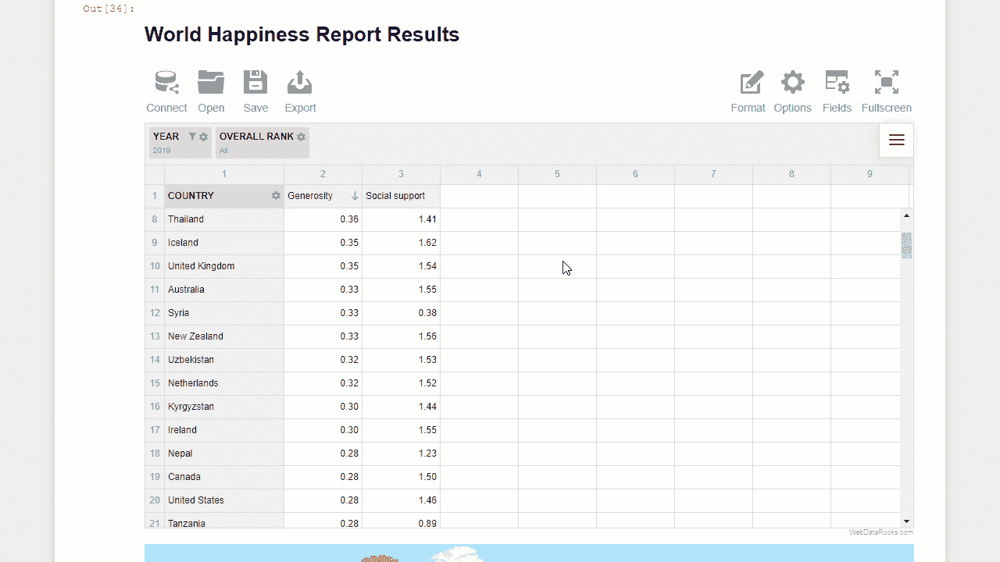

# 使用 Jupyter 笔记本进行数据分析和可视化

> 原文：<https://towardsdatascience.com/data-analysis-and-visualization-with-jupyter-notebook-22f6dcd25cc5?source=collection_archive---------7----------------------->

## 用 JS 库可视化 Jupyter 笔记本中的数据

丰富的交互计算体验是我最喜欢 **Jupyter 笔记本**的地方。此外，这是一个完美的基于网络的环境，用于执行探索性分析。

在本教程中，我将展示如何使用两个作为 JavaScript 库提供的**交互式数据可视化工具**来支持项目的探索阶段。本指南将花费最少的时间和步骤来完成。

我认为数据报告应该易于理解，比分析本身花费的时间更少。这就是为什么，在没有添加任何扩展的情况下，我们将在最短的时间内为 **Jupyter 笔记本**内的**报道建立一个工作环境。**

希望由此产生的笔记本模板将帮助每个处理数据的人回答重要的特定领域的问题，并以可理解的形式呈现数据分析见解。

开始吧！

# 数据

作为一个数据样本，我们将使用 Kaggle 的[世界幸福报告来探索数据的空间和时间趋势。](https://www.kaggle.com/unsdsn/world-happiness)

# 工具

*   JupyterLab —我们的环境。你也可以使用 Jupyter 笔记本
*   **WebDataRocks 数据透视表**

这个数据透视表将处理所有与数据相关的计算:聚合、过滤和排序数据。它的主要特点是交互性和易用性。此外，它将作为我们的仪表板的引擎，处理数据并以汇总的形式将其传递给图表。

*   **谷歌图表**

由于我们的大脑对图表的反应更快，我们可以将表格数据表示与交互式图表结合起来。为此，Google Charts 是一个不错的选择。这个 web 服务提供了所有的基本图表，这些图表可以根据我们的需要进行定制。

# 关键想法

让我们将本教程分解为构建数据报告解决方案的几个关键步骤:

*   导入所需的库
*   数据准备
*   在笔记本中嵌入数据透视表和图表
*   将数据发送到表
*   配置报告
*   将数据从表格发送到图表
*   保存报告
*   保存并共享笔记本

# 步骤 1:导入 Python 库

让我们弄清楚每个库代表什么功能:

1.**IPython . display**—IPython 中显示工具的 API

2. **json** —用于序列化和反序列化 Python 对象的模块。

3.熊猫——数据处理和分析的主要图书馆

# 第二步:获取数据

首先，这一步取决于您如何存储和访问您的数据。

我使用 Google Sheets 将几个 CSV 文件中对应于各个年份的数据记录合并在一起。使用本教程中描述的[方法，我将数据从 Google Sheets 导入到 pandas dataframe。](/how-to-import-google-sheets-data-into-a-pandas-dataframe-using-googles-api-v4-2020-f50e84ea4530)

或者，您可以简单地使用 [read_csv()](https://pandas.pydata.org/pandas-docs/stable/reference/api/pandas.read_csv.html) 方法从文件系统导入数据。要合并几年的信息，可以使用“ [concat](https://pandas.pydata.org/pandas-docs/stable/reference/api/pandas.concat.html) 操作。

让我们看看我们的数据是什么样子的:

现在已经使用最适合您的方法将数据加载到 dataframe 中，使用指定的“records”方向将其转换为 JSON。生成的类似列表的结构是数据透视表理解的数据格式:

# 步骤 3:创建一个数据透视表，并向其输入数据

接下来，使用指定的报表配置定义数据透视表对象:

以下是我们到目前为止的配置:

*   一个**数据片**——我们希望在网格上呈现的字段的子集。
*   一个**数据源**及其类型。使用 json.loads()方法，我们将包含 json 文档的字符串反序列化为 Python 对象。
*   可选视图相关设置:**条件格式**，**数字格式**。

接下来，让我们将 Python 字典表示的数据透视表转换为 JSON 格式的字符串:

# 步骤 4:以 HTML 呈现数据透视表和图表

最重要的一步来了。

让我们定义一个函数，它将在笔记本单元格中呈现数据透视表和图表。

这里，我们已经指定了 HTML 布局，它包含 Google Charts 和 WebDataRocks 的脚本、CSS 样式以及将呈现数据透视表和图表实例的容器。整个布局用三重引号括起来。

此外，我们传递一个参数，它代表执行定制的 JavaScript 代码。在这段代码中，我们实现了应该如何以及何时绘制图表的逻辑。只有当数据透视表完全呈现、加载了数据和本地化文件时，才会出现这种情况。我们可以通过“ [reportcomplete](https://www.webdatarocks.com/doc/reportcomplete/?r=td3) ”事件来跟踪这一时刻。

下面的代码完成了从表中获取数据、创建图表以及将汇总数据传递给图表的所有繁重工作:

最后，让我们调用渲染函数并查看生成的仪表板:

# 结果

如您所见，数据透视表填充了数据，字段根据我们设置的报表规则显示和格式化。

请注意，仪表板本身是交互式的:您可以使用报告工具的不同元素，在网格上分割数据记录，对它们进行过滤和排序。此外，图表会对报告中的每个变化做出反应。

# 下一步是什么？

现在，您有了一个报告工具，可以从多个角度查看数据。花些时间探索数据:更改跟踪的指标，过滤数据。尝试添加其他可视化图表。

你可以尝试其他数据集，寻求真知灼见。我希望您会喜欢这个过程和结果，并通过这种方法提高您的笔记本电脑工作效率。完成数据分析后，保存笔记本并与朋友或同事分享。讲述你的数据故事。他们会喜欢的！

# 参考

*   [可随时使用的笔记本](https://github.com/veronikaro/pivoting-jupyter-notebook)
*   [谷歌图表文档](https://developers.google.com/chart)
*   [WebDataRocks 文档](https://www.webdatarocks.com/?r=td3)