# 网络安全 101 的数据分析:检测横向移动

> 原文：<https://towardsdatascience.com/data-analysis-for-cyber-security-101-detecting-lateral-movement-2026216de439?source=collection_archive---------18----------------------->


这是一系列博客文章的第二部分。第一个可以在[数据渗透](/data-analysis-for-cybersecurity-101-detecting-data-exfiltration-ae887594f675)上看。

这篇博文的结构如下:

1.  [**介绍横向运动**](#9c29) (4 分钟):一个玩具例子来说明什么是横向运动
2.  [**网络异常检测**](#3445) (7 分钟) **:** 统计和机器学习技术检测横向移动
3.  [**CTF 挑战**](#4862) (3 分钟) **:** 解决3 CTF 挑战关于寻找横向运动
4.  [**违规报告**](#f96f) (4 分钟) **:** 真实的例子以及我们可以从中学到什么
5.  [**可见度和传感器优势**](#8d93) (3 分钟) **:** 检查您的数据质量和可见度
6.  [**黑暗空间和蜜罐**](#82f4) (2 分钟) **:** 要做的事情让检测横向移动变得更容易

# 前提

> *好看！您已经成功地检测并阻止了* [*数据泄露*](/data-analysis-for-cybersecurity-101-detecting-data-exfiltration-ae887594f675) *，但战斗还远未结束。我们仍然怀疑有坏人潜伏在你的网络中。作为一名负责任的网络安全管理员，你开始搜寻。* ***利用网络流量数据搜寻更多异常安全事件。***

# 妥协的假设

作为一名网络安全管理员，一种*健康的心态是**假设您已经受到威胁**，这样，您的目标就是找到对手的**利用后活动的证据。***

*请记住，利用只是攻击者的第一步，他们还需要采取额外的步骤来实现他们的主要目标。*

**

*回想一下之前的[博文](/data-analysis-for-cybersecurity-101-detecting-data-exfiltration-ae887594f675)，在最初的妥协之后，为了窃取你的数据，攻击者需要经历以下步骤:*

*(1)**攻击者需要使用一些命令和控制(C2)通道与他们的立足点**进行协调。*

*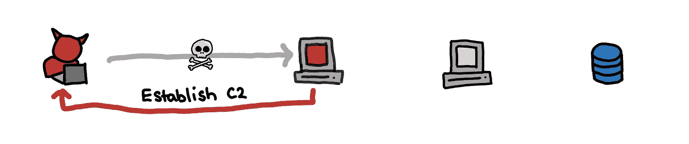*

*(2)使用 C2，**攻击者需要通过网络导航和横向移动来到达数据**。*

*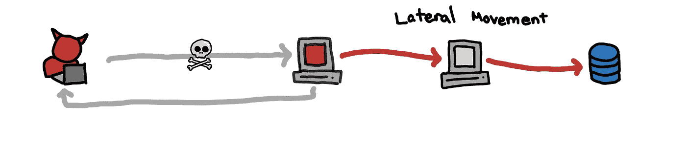*

*(3)一旦攻击者获得了数据，**攻击者需要将这些数据**从网络中泄漏出去。*

*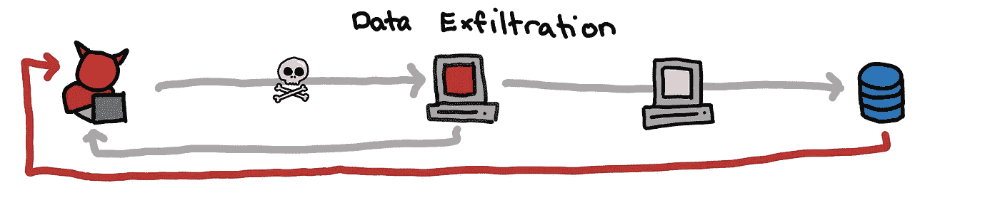*

*在这篇博文中，我们将介绍一些检测*横向移动的简单方法，以及一些关于如何设计可防御和可监控系统的注意事项，以便我们能够持续防御我们的网络。**

# **横向运动**

****

## **玩具案例研究**

**当攻击者成功入侵主机时，很可能主机没有必要的凭证、权限和网络访问权来获取公司的机密数据。在这种情况下，攻击者必须利用他们现有的立足点来获得更高级别的访问权限。**

**在我们更深入地检测横向运动之前，让我们使用一个玩具案例研究，以便我们可以“描绘”到底发生了什么。**

**我们的网络中有两个主要部门:**

*   **人力资源部:打开大量来自求职者的随机电子邮件。他们只能访问内部电子邮件服务器。**
*   **IT 团队:管理生产数据库和员工桌面**

**人力资源员工是坏人更容易攻击的目标，但是，即使人力资源员工被诱骗打开恶意 PDF，让攻击者访问人力资源机器，这种访问也不会立即让他访问生产数据。那现在怎么办？**

**下面，我们举例说明我们的玩具案例研究，以及攻击者如何能够在内部进行转换，以便最终能够访问生产数据。**

**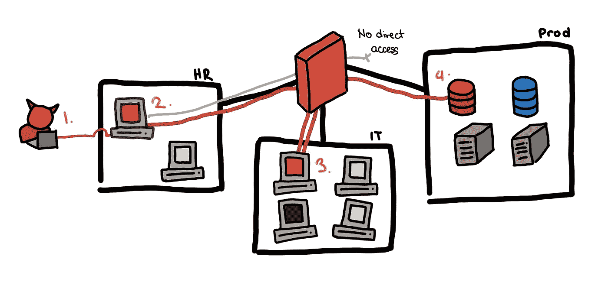**

**玩具示例，从电子邮件到生产数据库**

1.  **攻击者向**发送了一封伪造的求职电子邮件**，HR 打开了附件中的简历。这原来是**一个恶意的 PDF** ，它帮助**攻击者使用反向 shell 在 HR 子网**中建立立足点。**
2.  **通过强力攻击，**攻击者获得了 HR 机器的本地管理员凭证**，并能够提升他的权限。**
3.  **不幸的是，**所有机器都有相同的本地管理员证书。**使用这些凭证，他能够**转到 IT 组子网中的主机。****
4.  ****通过 IT 组主机**的隧道，他能够访问所有生产服务器。**

**我们如何检测这种横向运动？有些事情上图没有显示出来。想想攻击者是如何发现他所使用的不同帐户、主机和服务的。**

## **[主机发现](https://nmap.org/book/man-host-discovery.html) [1]**

**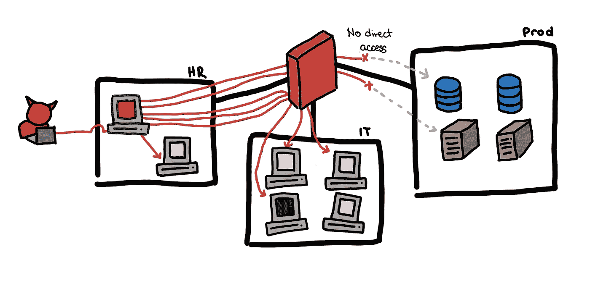**

***“我可以使用这台人力资源机器访问什么？”***

**在上述第 2 步和第 3 步之间，坏人必须以某种方式知道他可以转到 IT 子网中的哪个 IP 地址。他是怎么找到这个 IP 的？**

**一种方法是通过扫描可访问的 IP 进行网络扫描。如果扫描结束时枚举了子网中的所有主机，这可能会产生噪声，很容易被检测到。**

****这种情况的一个迹象是一个单一的源主机试图建立到许多目的主机的连接。**这是在 TCP、UDP 和 ICMP 中。**

**另请注意，在扫描可访问的主机时，防火墙可能不允许某些连接。如果您的防火墙记录这些放弃的尝试，那么这将为我们提供另一种检测网络扫描的方法。**另一个危险信号是当防火墙丢弃来自单个源主机的大量不同连接时。****

****在某些情况下，单一掉线也是一个危险信号，尤其是在网络设置良好的情况下。**例如，如果一个生产 web 服务器试图连接到一个内部主机，但被防火墙规则丢弃，可能会发生一些奇怪的事情。**

## **[服务发现](https://nmap.org/book/man-version-detection.html)【2】**

**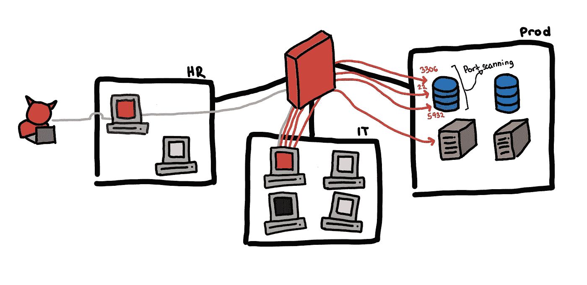**

**“这是数据库吗？还是 web 服务器？”**

**现在，攻击者知道他可以到达哪些主机，下一个问题可能是，他们有什么服务？在第 3 步和第 4 步之间，攻击者可能首先发现在端口 5432 上运行着一个服务，这就是为什么他认为它可能是一个 PostgreSQL 服务器。**

**发现公开的正在运行的服务包括通过端口扫描尝试找到主机的开放端口。根据攻击者的目标，这也可能非常嘈杂。**

**默认情况下，nmap 扫描每个协议的 [1000 个“感兴趣的”端口](https://github.com/danielmiessler/SecLists/blob/master/Discovery/Infrastructure/nmap-ports-top1000.txt) [3】。然而，攻击者可能会选择扫描所有的 65535 端口，这将更加嘈杂。或者，攻击者可能更隐蔽，选择只扫描他关心的几个端口，例如用于 NetBIOS 服务扫描的端口 139 和 445。**

**对于更隐蔽的端口扫描，这更接近于寻找主机扫描的迹象。**

**对于有噪声的端口扫描，我们正在寻找试图连接到许多目的端口的源。相关日志是网络流日志或防火墙日志。**

**如果您为此设置了警报，您首先应该找到的是您的漏洞扫描器。如果你没有发现这些，那么你就是做错了。**

## **端点到端点连接**

**您应该在网络中看到的最常见的连接是从一个端点到一个服务器或从一个服务器到另一个服务器。端点之间相互对话并不常见，从服务器到端点的连接就更不常见了。(尤其是当您不希望员工创建自己的文件共享时。)**

**端点到端点的良性连接的一个例子是从它到网络上不同主机的连接。这可能是为了维护或更新。**

**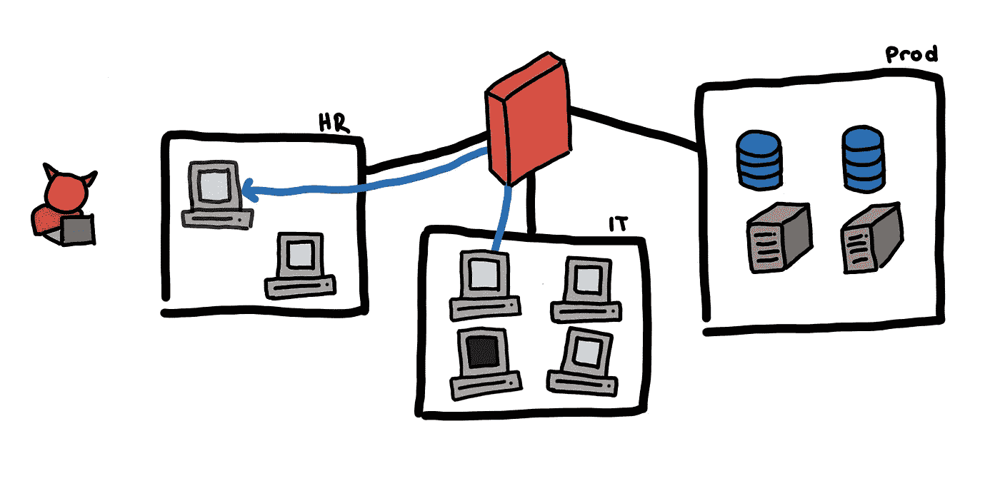**

**IT 机器与 HR 机器对话可能是正常的**

**然而，HR 机器直接与 IT 机器建立连接可能是不正常的。**

**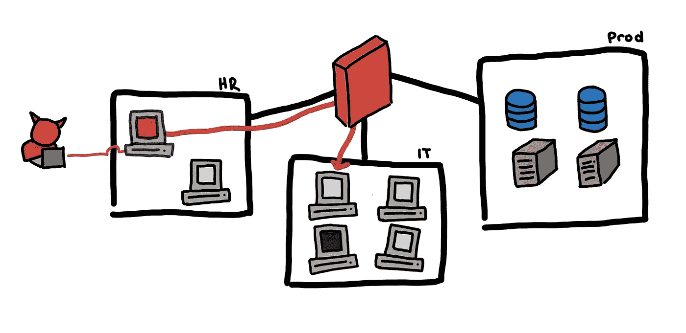**

**HR 机器连接到 IT 机器可能不正常**

**你对你的网络了解得越“深入”，你就越能缩小可能异常的连接类型，以及哪些是真正重要的。**

**在 toy 示例中，我们可以为从 HR 机器到除电子邮件服务器之外的任何其他主机的任何连接尝试设置警报。我们甚至可以阻止 HR 与除邮件服务器之外的任何内部主机的任何连接。**

# **网络异常检测**

****

**到目前为止，我们讨论的方法都是基于签名的。基于我们确定的横向移动可能如何发生的机制，我们定义业务规则并将它们编码为警报。有了这些，我们能够将尽可能多的领域专业知识和背景融入到我们的警报中。如果处理得当，这些可以为我们提供具有良好信噪比的警报。**

**尽管这些类型的规则对于保护我们的网络是必要的，但是它们可能不足以适当地保护我们的网络，因为:**

1.  **网络复杂性的增长速度远远超过安全团队增加的人力**
2.  **企业网络不是静态的，需要持续的监控和重新建立基准**
3.  **业务规则在检测新型攻击方面不够稳健**

**如果您的网络相对较小，那么您可以使用基于规则的警报，因为您可以描述所有您期望看到的正常连接，并为那些您认为不正常的连接创建警报。这些主机应该只与 DNS 和代理服务器通信。此服务器应该只连接到此数据库。只有这些特定的主机应该连接到生产数据库……**

**然而，随着您的网络变得越来越大、越来越复杂，跟踪所有这些变得几乎不可能。这就是为什么我们想探索一些网络异常检测技术。**

****假设是恶意主机会偏离典型行为。**如果我们能够以某种方式自动捕捉“正常”的特征，那么希望我们能够通过筛选“异常”来捕捉恶意活动。**

**定义和模拟“正常”的好方法是一个正在进行的研究领域。在这篇博文中，我们将主要关注两种方法:**

1.  **发现宿主行为特征中的异常值。**
2.  **通过新的边/链路预测发现意外连接**

## **主机行为特征中的异常值**

**这里的想法是将主机在给定时间间隔内的行为总结到一个向量中。有了所有这些主机矢量，我们就可以识别出与网络其余部分格格不入的主机。**

****特色工程****

**最重要的第一步是为网络中的每台主机构建功能。**

**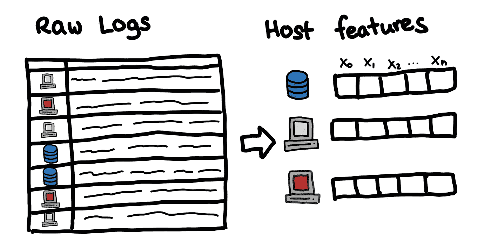**

**我们应该得到什么特征？这取决于您能得到什么，以及您所在组织的安全领域专家有什么建议。**

**首先，我们来看看论文[13]使用了什么特征。他们总共使用了 23 项功能:**

*   ****RDP 特色:***SuccessfulLogonRDPPortCount，UnsuccessfulLogonRDPPortCount，RDPOutboundSuccessfulCount，RDPOutboundFailedCount，RDPInboundCount***
*   ****SQL 特性:**UnsuccessfulLogonSQLPortCount、SQLOutboundSuccessfulCount、SQLOutboundFailedCount、SQLInboundCount**
*   ****成功登录功能:**SuccessfulLogonTypeInteractiveCount、SuccessfulLogonTypeNetworkCount、SuccessfulLogonTypeUnlockCount、successfullogontyperoteractivecount、SuccessfulLogonTypeOtherCount**
*   ****未成功登录功能:**UnsuccessfulLogonTypeInteractiveCount、UnsuccessfulLogonTypeNetworkCount、UnsuccessfulLogonTypeUnlockCount、unsuccessfullogontyperemoteeinteractivecount、unsuccessfullogontypoethercount**
*   ****其他:** NtlmCount，DistinctSourceIPCount，DistinctDestinationIPCount**

**[14]中的其他特征示例有:**

*   **过去 24 小时内是否至少有一个地址验证失败**
*   **给予用户访问网站的 IP 地址的最大异常值**
*   **从登录到结账的最短时间**
*   **用户在过去 24 小时内访问网站的不同位置的数量。**

**有了这些特征向量，我们可以构建一个矩阵，并开始使用离群点检测技术。**

****主成分分析****

**我们从使用*主成分分析【15】*寻找异常值的经典方法开始，因为在我看来这是最直观的。**

**简单来说，你可以认为 PCA 是一种压缩和解压缩数据的方法，其中压缩过程中的数据丢失被最小化。**

**由于大多数数据应该是正态的，因此 PCA 的低秩近似将集中于正态数据。PCA 在异常值的情况下表现如何？**

**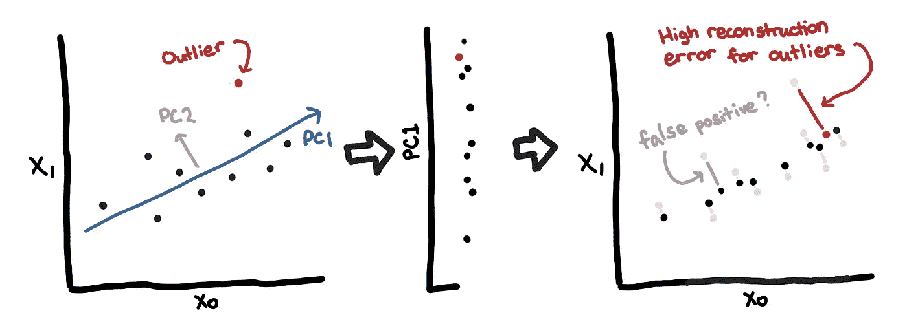**

**由于离群值不符合其余数据的相关结构，因此这些数据将具有较高的重建误差。一种形象化的方法是将“正常数据”视为网络的后台活动。**

**下面我们从 fast.ai [12]的数值线性代数课程中看到一个更直观的例子。他们从视频的不同帧中构建了一个矩阵。左边的图像是视频的一帧。中间的图像是使用鲁棒 PCA 的低秩近似。右边的图像是差异，重建误差。**

**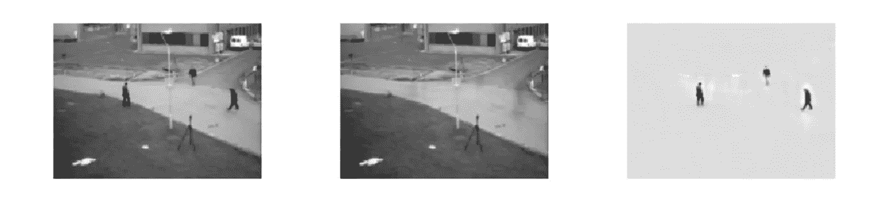**

**[fast . ai 的鲁棒 PCA 背景去除示例](https://github.com/fastai/numerical-linear-algebra/blob/master/nbs/3.%20Background%20Removal%20with%20Robust%20PCA.ipynb) [12]**

**在上面的例子中，视频的“主题”通常出现在重建误差中。同样，我们希望异常的宿主能从背景中突出出来，并具有较高的重建误差。**

**注意:经典的主成分分析可能对异常值敏感(不幸的是),因此使用[12]中讨论的健壮主成分分析可能更好**

## **自动编码器**

**我不会详细介绍自动编码器，但是您可以将自动编码器视为 PCA 的非线性版本。**

**神经网络的构建使得中间存在信息瓶颈。通过迫使网络通过中间的少量节点，它迫使网络优先考虑最有意义的潜在变量，这就像 PCA 中的主成分。**

**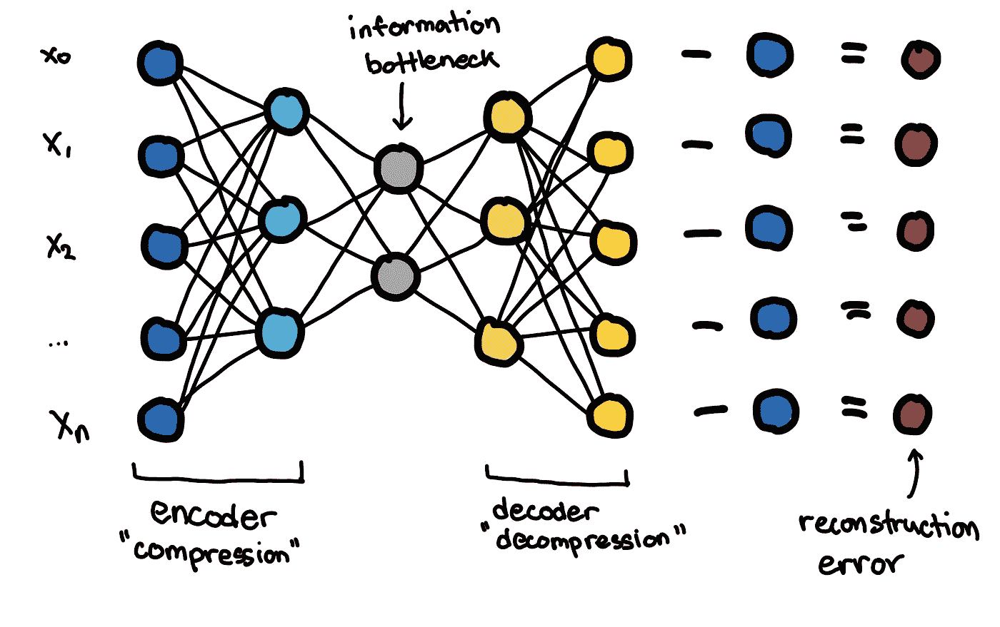**

**类似于 PCA，如果自动编码器是在正常数据上训练的，那么它可能很难重构异常数据。重建误差可以用作“异常分数”。**

**PCA 和 autoencoder 是[14]用来以无人监管的方式检测恶意主机的一些组件。**

****隔离林等方法****

**发现异常主机的另一种流行方法是使用隔离森林，这种方法比其他方法表现更好[13]。就像许多基于树的算法一样，这可以处理数值和分类数据，并且对数据的分布和形状没有什么假设。**

**最后，我们希望使用我们的历史数据来学习一个可以帮助我们区分正常和不正常的函数。**

**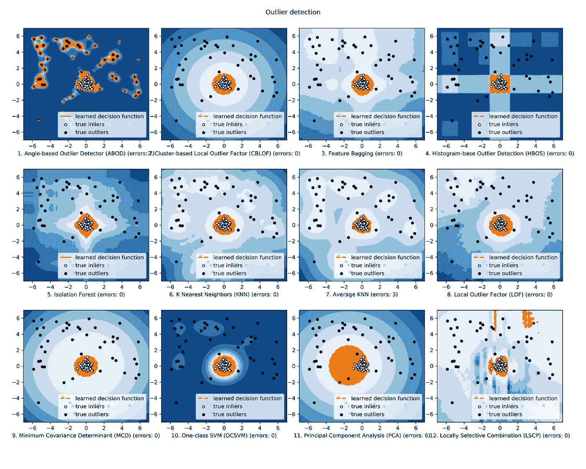**

**[使用 Py](https://github.com/yzhao062/pyod) OD [16]从不同方法中学习到的示例决策边界**

**如果你想探索不同的离群点检测方法，我推荐你浏览一下[PyOD](https://github.com/yzhao062/pyod)【16】和他们引用的实现算法和论文。**

**如果你有兴趣了解更多这方面的知识，我推荐你观看[异常检测:算法、解释、应用](https://www.youtube.com/watch?v=12Xq9OLdQwQ)【17】。**

## **新边缘/链路预测**

**这是对[11]的过度简化**

**不像以前的方法，我们试图找到恶意主机。在这里，我们试图找到异常边，其中边是客户端和服务器之间的连接，或者是源和目的地之间的连接。源/客户端也可以是用户名，边代表认证。**

****

**现在假设这是我们第一次看到这个边缘。我们可能会问，*观察到这个新边缘的概率有多大？***

****

**对于上面的函数，我们需要客户端和服务器都有某种表示。我们可以有分类协变量，例如:**

*   **主机的子网**
*   **主机的类型(端点或服务器)**
*   **用户的职务**
*   **用户的位置**

**有了分类协变量，用二进制指示变量表示，我们可以使用源和目的地的相互作用来了解新边的可能性有多大。**

****获取源和目的地的嵌入****

**表示主机的另一种方式是生成某种嵌入。**

**让我们从历史数据中说，我们以前已经观察到以下优势。主机在某些连接中可以是源，在另一些连接中可以是目的。**

**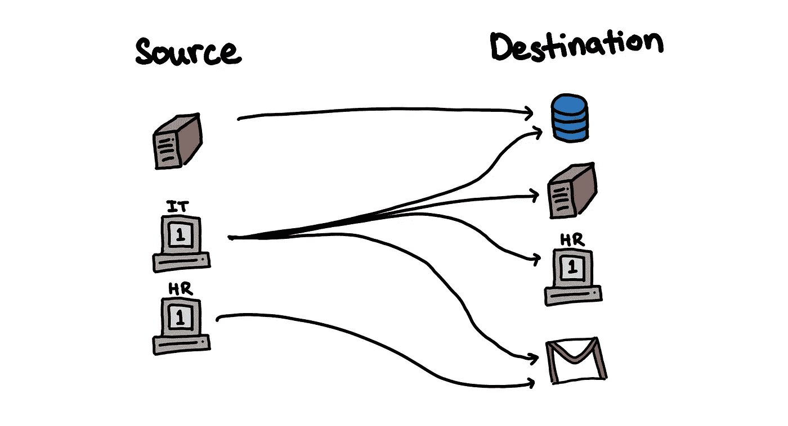**

**由此，我们可以构建一个邻接矩阵，其中每个单元代表一条可能的边，而被观察到的边的值为 1。**

**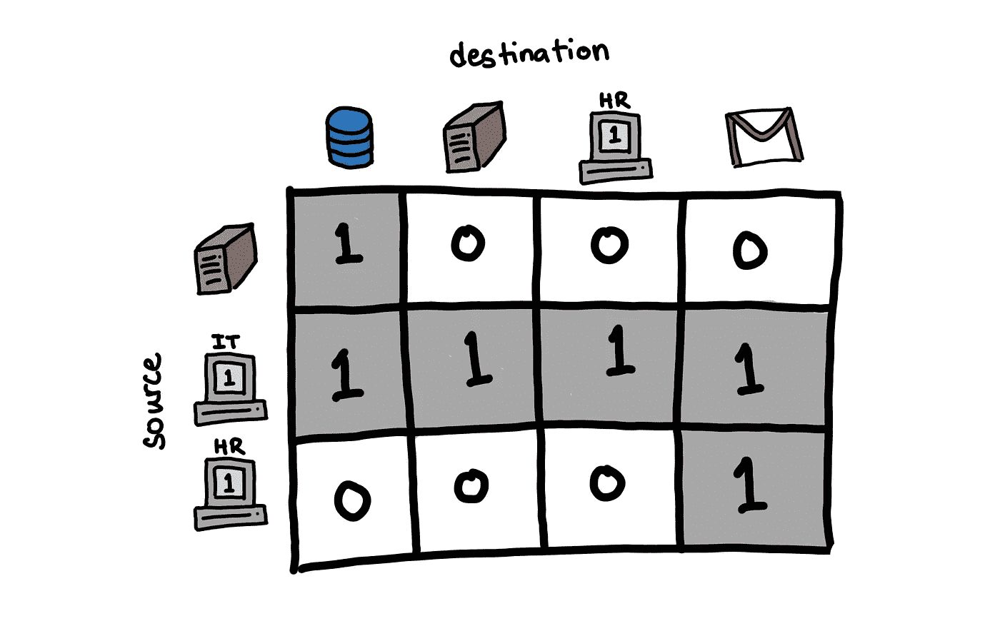**

**邻接矩阵来自**

**使用这个矩阵，我们可以执行一些非负矩阵分解。这是我们在其他应用中看到的，比如推荐系统和协同过滤。通过因式分解，我们能够得到源和目的地的嵌入。**

**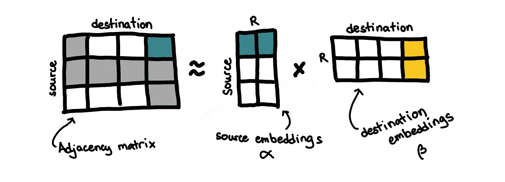**

****链接预测****

**文件[18]显示了如何能够因子分解，同时纳入分类协变量。这是通过*泊松矩阵分解(PMF)完成的。***

**在估计嵌入和一些必要的系数之后，我们可以估计观察到新边缘的可能性。**

**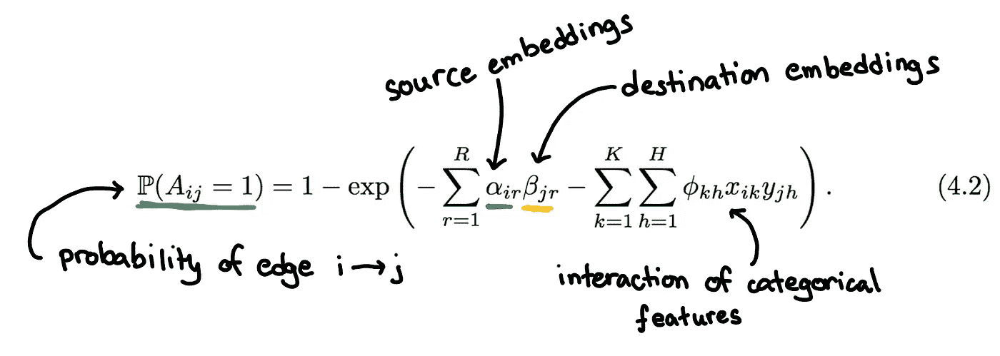**

**[PMF 模型下的概率函数【18】](https://arxiv.org/pdf/2001.09456.pdf)**

**我希望您对我们正在尝试做的事情有一个高层次的了解，但是当然，以一种计算高效的方式估计α、β和ɸ的值是问题的关键。详细可以看[【18】](https://arxiv.org/pdf/2001.09456.pdf)还有。另一篇也是关于边缘预测的论文是[11]。**

**如果你对统计学在网络安全中的更多应用感兴趣，我建议你去看尼克·赫德的演讲[网络安全中的数据科学和相关的统计挑战](https://www.youtube.com/watch?v=OyxtWJ2r35k)【19】。**

# **CTF 挑战**

****

**以下是针对横向运动的 [2019 趋势科技 CTF](https://ctf.trendmicro.com/) 中通配符 400 挑战的(很晚)部分演练。在这里尝试挑战[，解决方案可以在](https://www.kaggle.com/hawkcurry/data-analysis-for-network-security-101-questions)[这个内核](https://www.kaggle.com/hawkcurry/data-analysis-for-network-security-101-solution)中找到。**

**这里的数据是合成的，不模拟典型的网络协议和行为。因此，这些挑战不需要深入了解网络协议。**

## **横向蛮力**

> **问题 9:一旦一台机器被弹出，它通常被用来探索还能到达什么地方。一台主机被用来大声探测整个企业，试图找到企业中所有其它主机的方法。它的 IP 是什么？**

**我们看到主机正在扫描整个网络。这可能意味着我们在寻找主机扫描的迹象。**

**要做到这一点，我们需要获得具有许多唯一目的 IP 的源 IP 地址。**

**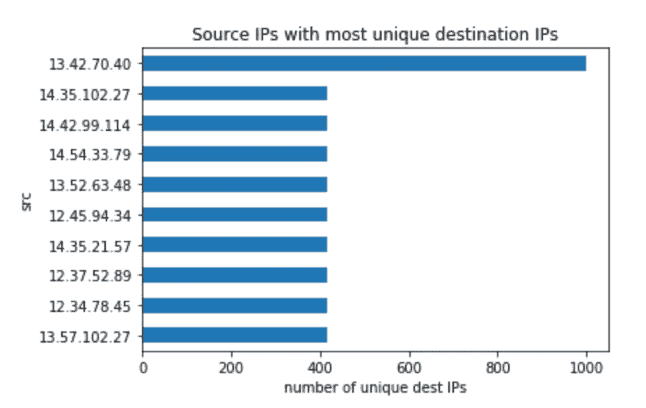**

**这里很明显**13.42.70.40**正在扫描并试图横向移动。为了完整起见，我们查看了它的网络活动，发现在非工作时间进行扫描会导致网络活动激增。**

****

**未节流的扫描噪音很大，会产生大量流量。因此，如果攻击者不试图隐藏他们的网络扫描，这是我们希望看到的。**

# **横向间谍**

> ***问题 10:一台主机试图找到一条更安静地连接其他主机的途径。它的 IP 是什么？***

**这是一个更棘手的问题。排除 13.42.70.40 之后，很难找到任何其他主机在唯一目标 IP 或目标端口数量方面表现突出。**

**于是，下面的情节就没用了。坏主机正在与正常主机的后台活动融合在一起。**

**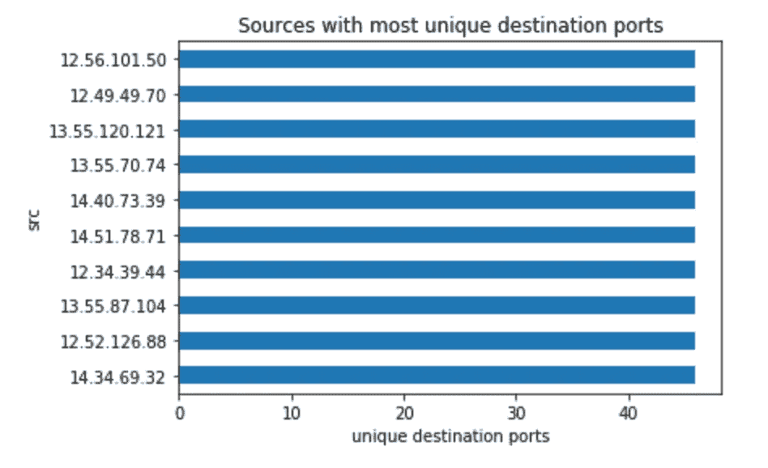****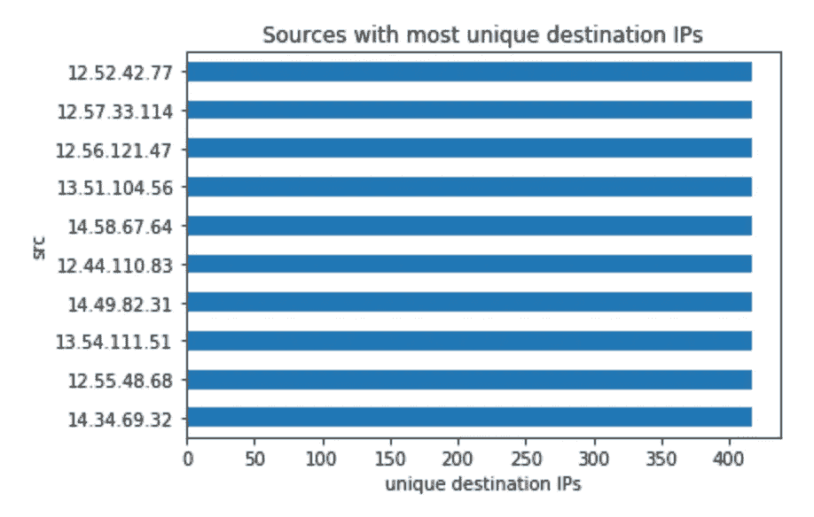**

**我们必须找到一种更有创造性的方法来发现扫描活动。如果我们有更多的网络背景，那么我们可以专注于:**

*   **连接到网络中未使用的端口**
*   **到端点的连接**

**这是我们从网络基线中了解到的情况，但我们的网络中没有这种环境。为了推断哪些端口是“正常的”，我们假设如果多个源主机连接到一个特定的 IP 地址和端口，那么它可能是正常的。**

**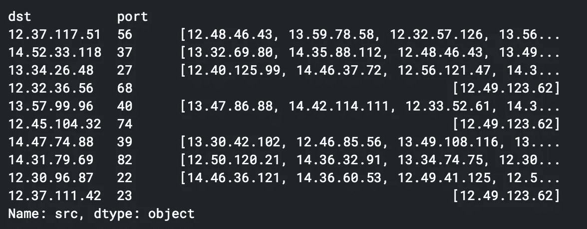**

**给定目标 IP 和端口的源 IP 列表**

**例如，我们看到多个主机连接到`12.37.117.51:56`，那么这可能是一个正常的连接。**

**对于`12.32.36.56:68`，我们看到只有`12.49.123.62`试图连接到它。这大概是不正常的。**

**过滤掉正常的目的 IP 和端口后，剩下的唯一源主机就是`12.49.123.62`。这是我们的烂 IP。**

## **奖金(可选):内部 P2P**

> ***问题 5:有时我们的低度感染在其他方面也是可见的。一种特殊的病毒已经在许多机器中传播，这些机器现在被用来相互传递命令。恶意软件创建了一个内部 P2P 网络。在所有相互通信的主机中，最大的内部集团使用哪个唯一端口？***

**这与检测横向移动有关，但解决方案涉及使用[图论](https://en.wikipedia.org/wiki/Graph_theory)中的分析技术。**

**这个问题很简单，因为这个问题直接问最大的集团。集团是一组彼此都有联系的主机。**

**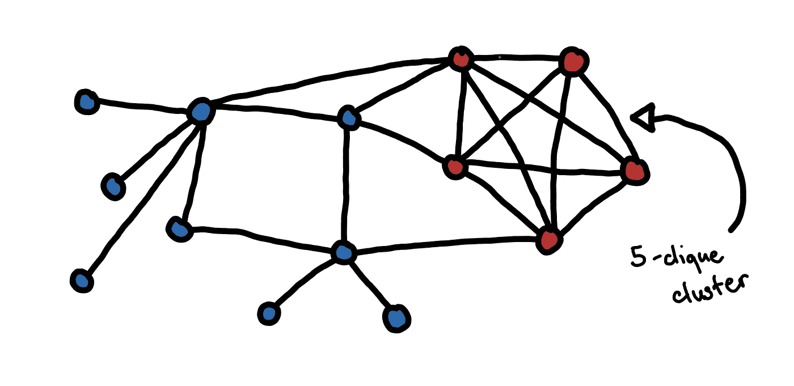**

**每个圈都是网络中的一个主机。如果两个主机彼此有连接，我们在它们之间放置一个端点。**

**使用 [NetworkX](https://networkx.github.io/) ，通过[枚举所有派系](https://networkx.github.io/documentation/networkx-1.10/reference/generated/networkx.algorithms.clique.find_cliques.html)并找到最大的一个，就可以得到确切的答案。然而，这并不能很好地扩展。**

**我们选择使用快速近似方法 [large_clique_size(G)](https://networkx.github.io/documentation/latest/reference/algorithms/generated/networkx.algorithms.approximation.clique.large_clique_size.html) 。**

```
**G = networkx.Graph()
G.add_nodes_from(internal_nodes)
for l, r **in** zip(internal_edges.src, internal_edges.dst):
    G.add_edge(l, r)        

_size = large_clique_size(G)**
```

**使用上面的代码，我们可以获得特定端口的大集团，但这对于所有端口来说运行起来太慢了。为了加速搜索，我们过滤掉最大团保证很小的端口。**

**很容易证明，如果图`G`中存在一个规模为`K`的团，那么`G`中至少应该存在`K`个度大于或等于`K-1`的节点。鉴于这一事实，我们可以计算每个端口的团大小的上限。完成这项工作的代码在[解决方案内核](https://www.kaggle.com/hawkcurry/data-analysis-for-network-security-101-solution)中。**

**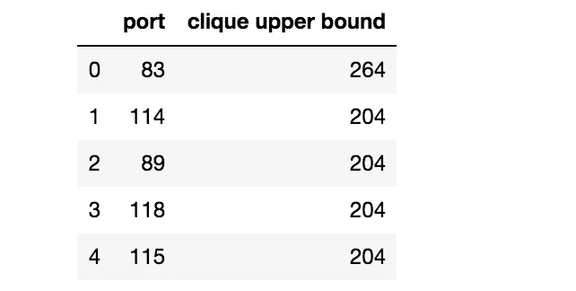**

**这些是具有最高上限的端口**

**处理这些端口我们发现端口 **83** 有一个 **264** 的最大团。**

# **违规报告**

****

**在这一节中，我们将回顾以前数据泄露造成的历史“灾难”。**

## **[2018 SingHealth 数据泄露](https://www.mci.gov.sg/-/media/mcicorp/doc/report-of-the-coi-into-the-cyber-attack-on-singhealth-10-jan-2019.ashx) [5]**

**2018 年新加坡健康数据泄露事件中，新加坡卫生服务部门的 150 万名患者的数据被盗。这个事件最接近我们的玩具案例研究。**

**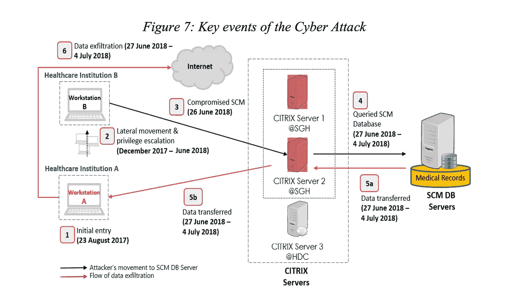**

**SingHealth 数据泄露事件报告中关键事件的图解摘要[5]**

**简而言之，关键事件包括:**

1.  **尽管报告中并不清楚这是如何发生的，但我们知道攻击者能够通过网络钓鱼攻击在的*工作站上**安装恶意软件。*****
2.  **通过访问**工作站 A，攻击者能够危害多个端点和服务器。**根据报告，攻击者可能已经侵入了 Windows 身份验证系统，并从域控制器获取了管理员和用户凭据。**
3.  **最终，攻击者能够控制**工作站 B，这是一个可以访问 SCM 应用程序的工作站。有了它，攻击者能够找到适当的凭证来破坏 SCM 系统****
4.  **在 SCM 数据库上运行了大量查询**
5.  **通过**工作站 A** 对数据进行了过滤**

**以下是报告中确定的一些促成因素。**

****SGH 思杰服务器和配置管理数据库之间的网络连接是允许的。****

**允许 Citrix 服务器场与 SCM 数据库服务器之间的网络连接。对网络体系结构的基本安全审查可能已经表明，这种开放的网络连接产生了安全漏洞。**

**如果这两个系统是隔离的，攻击者就不能轻易地访问 SCM 数据库。**

**根据该报告，在两个系统之间保持这种开放网络连接的原因之一是为了提高操作效率。管理员希望能够使用 Citrix 服务器和安装在那里的工具来管理不同系统的多个数据库。**

****SGH 思杰服务器未能充分防范未经授权的访问****

**这里的许多因素都与身份验证和凭证管理有关，这超出了本文的范围。现在与我们相关的一个问题是，*缺乏防火墙来防止使用 RDP 对 SGH Citrix 服务器进行未经授权的远程访问。***

## **[2018 年美国宇航局 JPL 违规事件](https://oig.nasa.gov/docs/IG-19-022.pdf)【6】**

**2018 年美国宇航局 JPL 漏洞因标题为“*美国宇航局因未经授权的树莓派*被黑”而闻名。最终报告没有详细说明最初的进入点是什么，攻击者是如何获得树莓 pi 的访问权限的，以及树莓 pi 位于何处。**

**我觉得有趣的是发现“**与外部合作伙伴共享的网络环境分割不充分”。****

**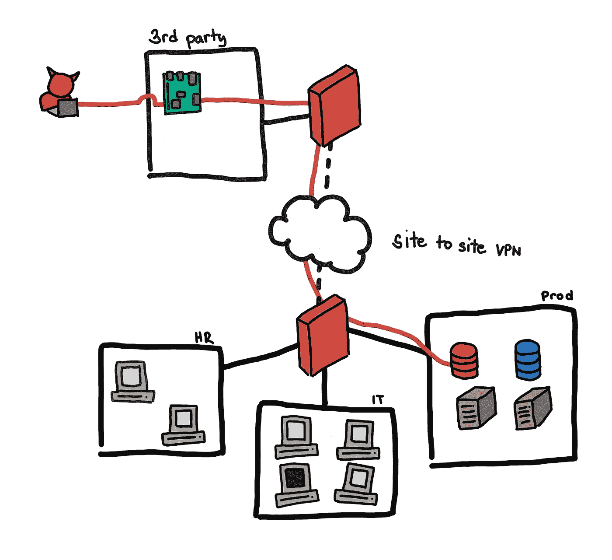**

**应该限制第三方对内部网络的访问**

> ****JPL 建立了一个网络网关，允许外部用户及其合作伙伴**，包括外国航天局、承包商和教育机构，远程访问特定任务和数据的共享环境。然而， **JPL 没有适当地隔离各个合作伙伴环境**以将用户限制在他们已经批准访问的那些系统和应用……**2018 年 4 月事件中的网络攻击者利用 JPL 网络缺乏分段性在连接到网关的各种系统之间移动**，包括多个 JPL 任务操作和 DSN。**

**横向流动可能导致跨组织的访问。对外部各方实施严格的信任边界，并确保将他们对您网络的访问仅限于必要的连接。外部各方可能不像您的组织那样具有安全态势，并且可能是薄弱环节。确保微调您的 IDS 或 IPS，将来自这些子网的流量视为外部流量。**

## **[2017 年 Equifax 数据泄露](https://republicans-oversight.house.gov/wp-content/uploads/2018/12/Equifax-Report.pdf) [7]**

**2017 年的 Equifax 泄露是一次数据泄露，导致大约 1.43 亿美国消费者的数据泄露。**

**切入点是 ACIS 应用程序，该应用程序没有为现在著名的关键 Apache Struts 漏洞打补丁。利用该漏洞，攻击者能够获得服务器上的 web 外壳并运行任意命令。**

**鉴于货物信息预报系统服务器已经受损，最好是将攻击的影响仅限于货物信息预报系统。网络或主机防火墙会阻止对外部资源的访问。**

**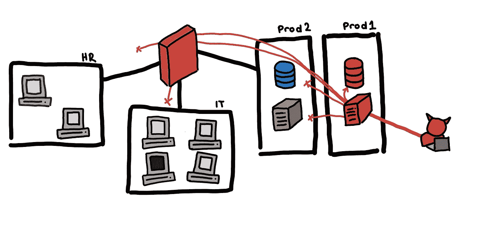**

**网络分割限制了爆炸半径**

**不幸的是，根据报告，Equifax 网络是平坦的！这是最坏的情况，因为任何主机的危害都可能导致网络中任何主机的危害。**

**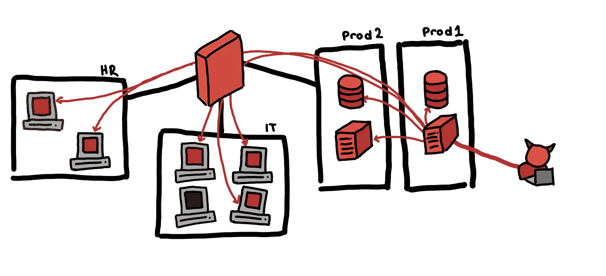**

**扁平网络使得攻击非常高效**

> **安全问题 1。在 Sun 应用服务器和 Equifax 网络的其余部分之间没有分割。**从互联网获得应用服务器控制权的攻击者可以在全球范围内转向[Equifax]网络中的任何其他设备、数据库或服务器** …如果攻击者利用扁平、未分段的网络突破组织的网络边界，他们可以在整个网络中横向移动，并获得对关键系统或重要数据的访问权限。**

**通过远程访问 ACIS web 服务器，攻击者能够:**

1.  **装载包含未加密应用程序凭据的文件共享**
2.  **在 51 个不同的数据库上运行 9，000 个查询。**
3.  **泄露所有数据**

**具体来说，货物信息预报系统只使用了 3 个数据库，但可以通过网络访问 48 个不相关的数据库。如果货物信息预报系统被隔离在相关的数据库中，那么这个漏洞就不会那么严重。**

## **网络分段**

**我们在所有不同的漏洞中看到的一个共同主题是，网络分段在防止横向移动方面起着重要作用。**

**如果网络被适当地分段，爆炸半径被限制在特定的系统内，攻击者将很难在网络中穿行。**

**然而，对于传统网络，非常精细的分段可能成本过高，并且您可能会受到网络物理拓扑的限制。但是对于云部署，因为一切都是虚拟化的并且可以自动化，我们可以将*微分段*应用到我们的系统中【4】。您可以基于每个工作负载隔离机器，而不是基于每个网络。**

# **能见度和传感器优势**

****

**在设置警报和规则之前，您需要做的一项重要工作是检查您实际收集的日志。你和你的团队必须清楚你的可见性极限是什么。**

*   **我从哪些数据源收集日志？**
*   **我在每个数据源中启用了哪些类型的日志？**
*   **我的数据源/传感器实际“看到”了什么？**
*   **我测试过吗？**

## **我从哪些数据源收集日志？**

**检查您从哪些数据源收集数据。**

**对于传统的内部部署，您可以列出来自您的设备和供应商的所有常用内容，包括 DNS、DHCP、Active Directory、防火墙、代理、SQL 等。也可以查一下[安全洋葱。](https://securityonion.net/)它是免费的，你可以利用围绕它发展起来的社区的知识和工具。**

**对于云部署，确保您正在收集您在云提供商中使用的关键服务的审计和访问日志。另外，收集网络流量日志。**

## **我在每个数据源中启用了哪些类型的日志？**

**默认情况下，有些数据源不会保存所有必要的日志，您需要打开它。**

**您可能会发现，由于配置错误，一些防火墙规则没有被记录。“我关闭了 X 的所有日志记录，因为它正在填满磁盘。”**

**例如，在谷歌云平台中，防火墙日志、VPC 流日志和 GCS 数据访问日志在默认情况下是不打开的。**

## **我的数据源/传感器实际“看到”了什么？**

> **传感器的优势描述了传感器能够观察到的数据包。优势是由传感器的位置和网络的路由基础设施之间的相互作用决定的[8]。**

**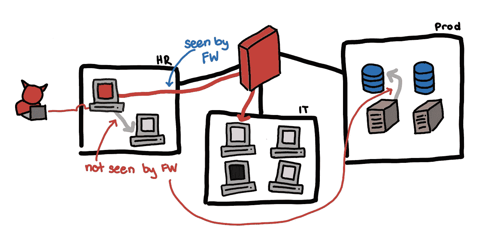**

**并非所有连接对我们的传感器都可见**

**对于我们的玩具用例，可能是同一子网内的连接不需要通过防火墙。如果我们分析防火墙日志，我们看到的唯一连接来自两个不同子网中的主机。**

**一些企业可能有单独的外围防火墙和内部防火墙设备。假设您只从外围防火墙收集日志，那么很可能任何内部到内部的连接都不会出现在您的 SIEM 上。**

**小心这个。你必须知道你的盲点在哪里。使用不能让您充分了解网络的日志会给您一种虚假的安全感。你可能认为没有人在扫描网络，而事实上，有，只是你没有看到它！**

**对于云基础设施，这取决于您的云服务提供商能为您提供什么。因为一切都是虚拟化的，所以您不再受网络物理拓扑的限制，并且有可能在整个 IaaS 中实现统一的可见性。但是如果你使用 PaaS，特别是对于 SaaS 来说，你对得到什么样的日志有更少的控制。**

## **我测试过吗？**

**确保您的数据源正在工作并且您正在获取日志的唯一方法是测试它！**

**根据您的威胁建模制定几个简单的场景并进行模拟。尝试在不同的子网上实际运行网络扫描，或者尝试使用某些 honey 凭据。看看这些是否会生成您想要的日志和警报。看看你的新机器学习模型是否会检测到这一点。**

**运行模拟时，您可以从日志收集、数据转换、SIEM 接收、规则和警报，甚至调查和事件响应等方面对您的检测系统进行端到端测试。**

**它还将让您有机会捕捉数据源失败或配置错误的实例。也许服务停止了，它的存储空间被填满了，或者它的许可证过期了。可能是防火墙配置的更改无意中禁用了一组防火墙规则的日志记录。**

**不要因为没有收到 NIDS 或 DLP 的警报就认为一切正常；如果 NIDS 主机在 3 个月前被意外关闭了呢？**

> **Equifax 没有看到数据泄漏，因为用于监控 ACIS 网络流量的设备由于安全证书过期而已经停用了 19 个月。[7]**

**测试测试测试！**

# **黑暗空间和蜜罐**

****

**这里有些东西可能对那些拥有更成熟的网络和安全状况的人有用。**

## **暗区**

**未使用的地址或端口号称为暗空间，合法用户很少尝试访问暗空间。大多数用户不手动输入 IP 地址，通常依赖 DNS 或应用程序为他们连接。另一方面，当攻击者试图横向移动时，很可能最终会访问它们[8]。**

**我们可以对试图进入这些黑暗空间的内部主机发出警报。这可能很吵，但在某些情况下很容易调查。该警报的一个常见原因是地址错误或配置错误。**

**根据[8]，这里有一些事情你可以做，使攻击者更有可能进入黑暗的空间，使它更容易被检测到:**

*   ****重新排列地址:**大多数扫描是线性/顺序的，重新排列地址使它们均匀地分散在网络中，或者在网络中留下大片空白是一种创造黑暗空间的简单方法。**
*   ****移动目标:**如果分配给一个服务的端口是非标准的，攻击者只有在枚举更多的端口后才能找到它，使它们更加可见。当然，这是有代价的，因为过多地改变端口可能会让每个人感到困惑。**

## **蜂蜜制品**

**蜂蜜的事情类似于黑暗空间，我们不期望这些事情出现在我们的日志中。**

**与黑暗空间不同，这些东西确实存在于我们的网络中，但它们没有任何合法用途。正式员工不知道这些，也不应该需要使用或接触这些。另一方面，攻击者可能会在网络中移动时遇到这些东西，如果这些宝贝看起来有价值或有用，他们可能会尝试用它们做些什么。**

**这些例子有:**

*   **蜂蜜证书:**
*   **蜂蜜代币**
*   **蜂蜜文件共享**
*   **蜂蜜服务器**

**我们希望它们看起来有价值，一旦这些出现在我们的日志中，我们就会进行调查。蒂姆·梅丁在他最近的网络直播“ [**肮脏的防御，做得极其便宜:让我的生活更艰难让你的生活更轻松**](https://www.youtube.com/watch?v=YrhpB-GEyKQ)**【9】中对此进行了更详细的讨论。****

## **其他人**

**这是相关的，但我只会简单地提一下(因为这篇博文已经够长了，抱歉)。**

**虽然 NIDS 和 NIPS 有时部署在外围。如果位置和配置正确，它们可以帮助检测横向运动。它将能够检测网络上的客户端漏洞、可能的文件传输和不常见的未授权网络协议的使用。您还可以使用 NIDS 来检测网络上明文传输的蜜糖令牌。**

**检查它是否配置为忽略内部到内部的连接。**

# ****接下来:指挥与控制，信标****

****

**我们仅仅触及了表面。您可以使用诸如 Active Directory 之类的日志进行更深入的研究，以便更精确地搜索横向移动，但是我们现在必须继续。**

**在下一篇博文中，我们将讨论一些关于寻找**命令和控制证据的问题。****

**攻击者需要能够控制他们的立足点，以便在您的网络中导航。就像他们说的，杀一条蛇砍下它的头。**

# **参考**

**[1] [Nmap 参考指南，第 15 章，主机发现。](https://nmap.org/book/man-host-discovery.html)**

**[2] [Nmap 参考指南，第 15 章，服务和版本检测**。**](https://nmap.org/book/man-version-detection.html)**

**丹尼尔·米斯勒，秘书。**

**[4] [CSA 安全指南(v4)，7.3.3 微分段和软件定义的边界。](https://cloudsecurityalliance.org/artifacts/security-guidance-v4/)**

**[5] [调查委员会对新加坡医疗服务数据库网络攻击的公开报告。](https://www.mci.gov.sg/-/media/mcicorp/doc/report-of-the-coi-into-the-cyber-attack-on-singhealth-10-jan-2019.ashx)**

**喷气推进实验室的网络安全管理和监督。**

**[7][Equifax 数据泄露。](https://republicans-oversight.house.gov/wp-content/uploads/2018/12/Equifax-Report.pdf)**

**[8] M. Collins，通过数据分析实现网络安全(2014 年)**

**肮脏的防御，廉价的交易:让我的生活变得更艰难，让你的生活变得更轻松。**

**[安全洋葱](https://securityonion.net/)。**

**[11] [梅泰利，s .，赫德，N. (2019)。计算机网络中的贝叶斯新边缘预测和异常检测。](https://pdfs.semanticscholar.org/dc64/caea1938fa1554794130de4a7bbd6a0bbd01.pdf#page=27&zoom=100,132,341)**

**[12] [Rachel Thomas，Fast.ai 数值线性代数，第 3 课:鲁棒 PCA 背景去除。](https://github.com/fastai/numerical-linear-algebra/blob/master/nbs/3.%20Background%20Removal%20with%20Robust%20PCA.ipynb)**

**[13] [Siddiqui，Md Amran 等人，“使用异常检测和解释以及专家反馈来检测网络攻击。”](https://www.microsoft.com/en-us/research/uploads/prod/2019/06/ADwithGraderFeedback.pdf)**

**[14] [Veeramachaneni，Kalyan 等人，《AI^ 2:训练大数据机器进行防御》](https://dai.lids.mit.edu/wp-content/uploads/2017/10/AI2_Paper.pdf)**

**【15】[徐美玲等.一种基于主成分分类器的新型异常检测方案.](http://users.cs.fiu.edu/~chens/PDF/ICDM03_WS.pdf)**

**PyOD:一个用于可伸缩异常检测的 Python 工具箱。**

**[17] [托曼·迪特里希。异常检测:算法，解释，应用。](https://www.youtube.com/watch?v=12Xq9OLdQwQ)**

**帕西诺、弗朗切斯科·桑娜、梅丽莎·JM·特科特和尼古拉斯·a·赫德。"使用泊松矩阵分解的计算机网络中的图链接预测."**

**[19]尼克听说了。[网络安全和相关统计挑战中的数据科学](https://www.youtube.com/watch?v=OyxtWJ2r35k)**

**照片由来自[佩克斯](https://www.pexels.com/photo/sunrise-photography-1214011/?utm_content=attributionCopyText&utm_medium=referral&utm_source=pexels)的[阿尔特姆·萨拉宁](https://www.pexels.com/@arts?utm_content=attributionCopyText&utm_medium=referral&utm_source=pexels)、来自[佩克斯](https://www.pexels.com/photo/calm-ocean-panoramic-photography-845254/?utm_content=attributionCopyText&utm_medium=referral&utm_source=pexels)的[丹尼斯·尤丁](https://www.pexels.com/@denis-yudin-125459?utm_content=attributionCopyText&utm_medium=referral&utm_source=pexels)、来自[佩克斯](https://www.pexels.com/photo/silhouette-of-lighthouse-2873059/?utm_content=attributionCopyText&utm_medium=referral&utm_source=pexels)的[伊格纳西奥·帕莱斯](https://www.pexels.com/@ignacio-pales-407380?utm_content=attributionCopyText&utm_medium=referral&utm_source=pexels)、来自[佩克斯](https://www.pexels.com/photo/body-of-water-2347449/?utm_content=attributionCopyText&utm_medium=referral&utm_source=pexels)的[汤姆·斯温嫩](https://www.pexels.com/@shottrotter?utm_content=attributionCopyText&utm_medium=referral&utm_source=pexels)、来自[伊戈尔·戈里亚切夫](https://unsplash.com/@old_pioneer?utm_source=unsplash&utm_medium=referral&utm_content=creditCopyText)的[乌斯普拉什](https://unsplash.com/s/photos/3-boats?utm_source=unsplash&utm_medium=referral&utm_content=creditCopyText)、[埃莉诺拉·帕特里科拉](https://unsplash.com/@ele1010?utm_source=unsplash&utm_medium=referral&utm_content=creditCopyText)**