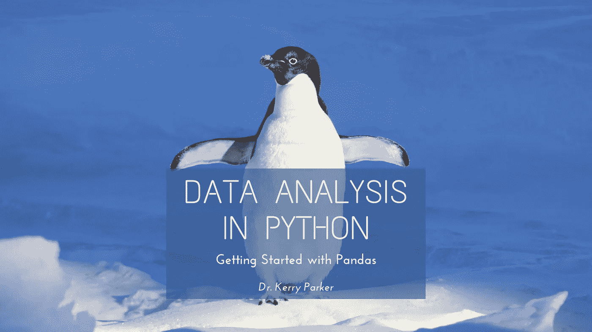
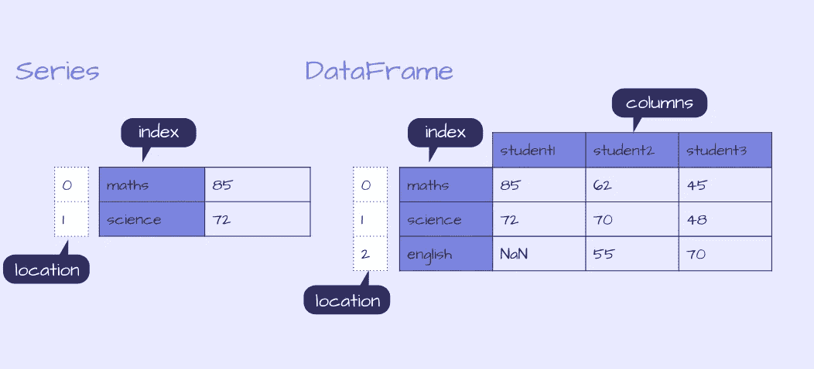
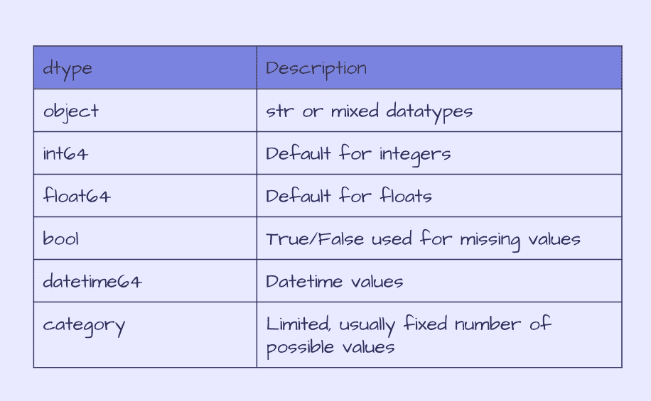
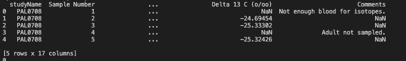
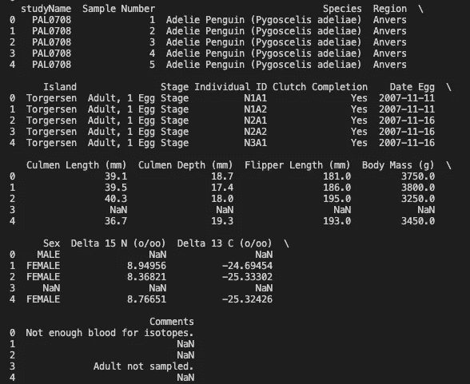

# python 中的数据分析:熊猫入门

> 原文：<https://towardsdatascience.com/data-analysis-in-python-getting-started-with-pandas-8cbcc1500c83?source=collection_archive---------23----------------------->



Pandas 是一个广泛用于数据分析和操作的 python 工具。最近，我一直在使用具有大数据帧(> 50 米行)的 pandas，并通过 [PyDataUK May Talks](https://www.youtube.com/watch?v=C1hqHk1SfrA) 和 exploring [StackOverflow](https://stackoverflow.com/) 线程发现了几个对优化我的分析非常有用的技巧。

本教程是一个系列的第一部分，旨在介绍熊猫和它在探索[帕尔默企鹅数据集](https://allisonhorst.github.io/palmerpenguins/index.html)时提供的一些有用的功能。

在本文中，我们将介绍:

*   如何安装和导入熊猫
*   熊猫中的数据结构
*   如何输入和输出数据
*   检查数据
*   数据清理入门

# 介绍帕尔默企鹅

虹膜数据集是数据科学中常用于可视化和模式识别的数据集。自从最近发现作者与优生学的联系后，一直在努力寻找其他数据集供使用。
这就是企鹅的用武之地，[帕尔默企鹅数据集](https://allisonhorst.github.io/palmerpenguins/index.html)已经由[克里斯汀·戈尔曼](https://www.uaf.edu/cfos/people/faculty/detail/kristen-gorman.php)博士和[艾利森·霍斯特](https://www.allisonhorst.com/)根据 CC-0 许可收集并发布，作为可供探索的备选数据集！

它已经发布了供 R 使用的示例，但是我们将使用 python 包 pandas 来探索可以在 [GitHub](https://github.com/allisonhorst/palmerpenguins/tree/1a19e36ba583887a4630b1f821e3a53d5a4ffb76/data-raw) 上找到的原始数据集(注意原始 CSV 文件不再包含在主分支中，因为它是我第一次开始查看数据集时包含的，所以我在这里引用存储库中的一个旧提交。如果该文件被重新添加到主分支中，我将更新它)。

这些数据包含了对南极洲帕尔默群岛岛屿上三种不同企鹅物种的观察，我们可以使用这些数据来比较不同物种或岛屿之间的体重、鳍状肢长度或长度。

## 我们开始吧！


[作品](https://github.com/allisonhorst/palmerpenguins/blob/master/vignettes/articles/img/lter_penguins.png)作者 [@allison_horst](https://twitter.com/allison_horst)

# 1.安装和导入熊猫

Pandas 可以使用 python 包管理器`pip` : `pip install pandas`从 [PyPI](https://pypi.org/project/pandas/) 安装

或者将`conda`与`conda install pandas`配合使用

安装完成后，我们可以导入熊猫，并为其分配一个别名`pd`,别名为:

```
import pandas as pd
```

# 2.数据结构

pandas 中有两种数据结构，Series 和 DataFrames。我最常用的结构是 DataFrame，这是一种带有标签的 2D 表格结构，类似于电子表格或 SQL 表。

另一种结构是一个序列，它是一个 1D 标记的数组，可以保存任何数据类型。每一行都标有索引。

数据帧可以用许多不同的方式构建，包括作为系列的字典，其中每个系列是数据帧中的一列。

本文将关注数据帧，我们将使用 CSV 作为数据帧的输入。

要进一步探索数据结构，请查看熊猫文档。



熊猫系列和数据框示例

# 3.输入输出数据

## 投入

数据框可以通过多种方式创建:

a)创建一个空的数据帧:`df = pd.DataFrame()`

b)输入数据:`df = pd.DataFrame(data = data)`，其中输入数据`data`可以是多种不同的格式，这使得构建数据框架变得灵活和方便，因为您处理的数据可以是任意数量的结构，包括序列字典，如上图所示，并且可以用以下代码构建:

```
d = {'student1': pd.Series([85., 72.], index=['maths', 'science']),
   'student2': pd.Series([62., 70., 55.], index=['maths', 'science', 'english']),
   'student3': pd.Series([45., 48., 70.], index=['maths', 'science', 'english'])}
df = pd.DataFrame(d)
print(df.head())
```

c)来自文件或数据源的输入，我们将在此重点关注 Palmer Penguin 数据的[原始 CSV。](https://raw.githubusercontent.com/allisonhorst/palmerpenguins/1a19e36ba583887a4630b1f821e3a53d5a4ffb76/data-raw/penguins_raw.csv)

与使用输入数据构建数据框架非常相似，当从文件或数据源创建数据框架时，可以接受许多输入格式。
这包括:

*   excel 电子表格
*   结构化查询语言
*   战斗支援车
*   JSON

查看[熊猫文档](https://pandas.pydata.org/pandas-docs/stable/reference/io.html)获取完整列表。

这在数据存储方面提供了很大的灵活性，你可以读入存储在本地或远程的文件，甚至可以接受压缩文件。

我们感兴趣的 Palmer Penguin 文件存放在 GitHub 上，您可以下载该文件并阅读指定您机器上位置的 CSV 文件，或者我们可以提供原始文件的链接并使用一行代码打开它:

```
df = pd.read_csv('https://raw.githubusercontent.com/allisonhorst/palmerpenguins/1a19e36ba583887a4630b1f821e3a53d5a4ffb76/data-raw/penguins_raw.csv')
```

另一个常见的数据源是 SQL 数据库。有许多不同的 python 包可以连接到数据库，其中一个例子是`pymysql`，我们可以首先连接到 MySQL 数据库，然后使用`read_sql`将数据从查询加载到`df`。这提供了快速和容易地连接到远程数据库的灵活性！

**注意:这只是一个如何读入 SQL 数据的例子，在教程**中没有用到

```
# Example code: how to use read_sql
import pymysqlcon = pymysql.connect(host='localhost', user='test', password='', db='palmerpenguins')df = read_sql(f'''SELECT * FROM penguins''', con)
```

💡 [Python 3 的 f 字符串](https://realpython.com/python-f-strings/)在输入查询时使用起来很方便。

我们稍后可能会输入一个条件，该条件使用了我们之前定义的变量，我们可以直接在 f 字符串中包含该变量，而不是对该条件进行硬编码。

三重引号还允许在 f 字符串中使用单引号，而不使用转义字符，如下例所示。例如:

```
# Example code: f-string's and variables
region = tuple('Anvers')df = read_sql(f'''SELECT * FROM penguins WHERE Region IN {region} AND Date Egg > '2007-11-11' ''', con)
```

## **大型数据帧**

在读取大型数据集时，通过指定选项`chunksize`至`read_csv`、`read_sql`或其他输入函数，可以迭代文件并每次迭代读取有限的行数。然而，值得注意的是，这个函数现在返回一个`TextFileReader`而不是一个数据帧，并且需要进一步的步骤将块连接成一个数据帧。

```
df = read_csv('https://raw.githubusercontent.com/allisonhorst/palmerpenguins/1a19e36ba583887a4630b1f821e3a53d5a4ffb76/data-raw/penguins_raw.csv', chunksize = 10000)df_list = []
for df in df:
    df_list.append(df)df = pd.concat(df_list,sort=False)
```

在 Palmer Penguin 数据集上不一定要使用这一步，因为它只有几百行，但这里展示的是如何在一个大文件上使用这一步，一次读取 10k 行中的数据。

## **输出**

正如我们可以以多种格式输入文件一样，将数据帧输出到文件也同样灵活和容易！

经过一些操作后，我们可以将数据帧写入 CSV，如果需要，可以选择压缩文件:

```
df.to_csv('output.csv', compression='gzip)
```

如果您的数据存储在 AWS 中，那么有一个用于 Python 的 AWS SDK，`[boto3](https://boto3.amazonaws.com/v1/documentation/api/latest/index.html)`可以用来连接到您的 AWS 服务。

# 4.检查数据的快速检查

在我们开始研究我们的数据之前，首先要检查它是否已经正确加载并包含我们所期望的内容。

## 数据帧的尺寸

我们可以首先通过检查行数是否大于 0 来检查数据帧是否为空，并使用以下函数进一步检查维度:

*   获取行数:`len(df)`
*   获取列数:`len(df.columns)`
*   获取行数和列数:`df.shape`
*   获取元素的数量(行数 X 列数):`df.size`

```
if len(df) > 0:
    print(f'Length of df {len(df)}, number of columns {len(df.columns)}, dimensions {df.shape}, number of elements {df.size}')else:
    print(f'Problem loading df, df is empty.')
```

这将返回:

```
Length of df 344, number of columns 17, dimensions (344, 17), number of elements 5848
```

我们的数据集已经正确加载，有 344 行和 17 列。这个数据帧包含什么？

## 数据类型和存储器

我们已经加载了数据帧，但是我们仍然不知道它包含什么类型的数据。我们可以用`df.info()`得到一个摘要——让我们看看它返回了哪些细节:

```
df.info()<class 'pandas.core.frame.DataFrame'>
RangeIndex: 344 entries, 0 to 343
Data columns (total 17 columns):
studyName              344 non-null object
Sample Number          344 non-null int64
Species                344 non-null object 
Region                 344 non-null object 
Island                 344 non-null object 
Stage                  344 non-null object 
Individual ID          344 non-null object 
Clutch Completion      344 non-null object 
Date Egg               344 non-null object 
Culmen Length (mm)     342 non-null float64 
Culmen Depth (mm)      342 non-null float64 
Flipper Length (mm)    342 non-null float64 
Body Mass (g)          342 non-null float64 
Sex                    334 non-null object 
Delta 15 N (o/oo)      330 non-null float64 
Delta 13 C (o/oo)      331 non-null float64 
Comments               54 non-null object 
dtypes: float64(6), int64(1), object(10) memory usage: 45.8+ K 
```

`df.info()`回报:

*   索引数据类型(dtype)和范围，在本例中，pandas 数据帧有 344 个条目，用索引值 0-343 表示，
*   每列的名称和数据类型，以及非空值的数量，
*   内存使用情况

penguin 数据包含混合或字符串数据类型的列`objects`，整数`int64`和浮点数`float64`。下表总结了熊猫的数据类型。



熊猫类型

使用`[df.info()](https://pandas.pydata.org/pandas-docs/stable/reference/api/pandas.DataFrame.info.html)`默认情况下，内存使用量只是根据列数据类型和行数进行估计。
我们可以指定使用深度内省来计算实际内存使用量，这在处理大型数据帧时特别有用:

```
df.info(memory_usage='deep') <class 'pandas.core.frame.DataFrame'> 
RangeIndex: 344 entries, 0 to 343 
Data columns (total 17 columns): 
studyName              344 non-null object 
Sample Number          344 non-null int64 
Species                344 non-null object 
Region                 344 non-null object 
Island                 344 non-null object 
Stage                  344 non-null object 
Individual ID          344 non-null object 
Clutch Completion      344 non-null object 
Date Egg               344 non-null object 
Culmen Length (mm)     342 non-null float64 
Culmen Depth (mm)      342 non-null float64 
Flipper Length (mm)    342 non-null float64 
Body Mass (g)          342 non-null float64 
Sex                    334 non-null object 
Delta 15 N (o/oo)      330 non-null float64 
Delta 13 C (o/oo)      331 non-null float64 
Comments               54 non-null object 
dtypes: float64(6), int64(1), object(10) memory usage: 236.9 KB
```

我们还可以使用以下命令检查每列的内存使用情况:

```
print(df.memory_usage(deep=True))
Index                     80 
studyName              22016 
Sample Number           2752 
Species                31808 
Region                 21672 
Island                 21704 
Stage                  25800 
Individual ID          21294 
Clutch Completion      20604 
Date Egg               23048 
Culmen Length (mm)      2752 
Culmen Depth (mm)       2752 
Flipper Length (mm)     2752 
Body Mass (g)           2752 
Sex                    21021 
Delta 15 N (o/oo)       2752 
Delta 13 C (o/oo)       2752 
Comments               14311 
dtype: int64 
```

或者总内存使用量如下:

```
print(df.memory_usage(deep=True).sum())242622
```

我们可以看到，数字列明显小于包含对象的列。不仅如此，我们对分析中的所有列都不感兴趣。

这个原始文件包含已经收集的所有数据。如果我们要比较不同种类和不同岛屿上的企鹅的体重、鳍状肢长度和长度，那么我们可以清理数据，只保留相关的数据。

# 5.数据清理

要清理数据，我们可以采取几个步骤:

## 删除我们不感兴趣的列

让我们先看一下前几行数据:

```
print(df.head())
```



df.head()的输出

这个输出看起来不太对。我们知道有 17 列，但我们只能看到其中的 4 列以及这里的索引。根据您正在使用的控制台的大小，您可能会在这里看到更多的列，但可能不是全部 17 列。

为了查看所有的列，我们可以将`display.max_columns`的值设置为`None`。

```
pd.set_option('display.max_columns', None)
print(df.head())
```



将最大列数设置为 None 后 df.head()的输出

查看数据样本，我们可以确定我们想要使用的列，并通过只指定我们想要保留的行和列来为`df`重新分配一个新值。我们可以用`df.loc(rows, cols)`来做到这一点。在 rows 参数中，冒号表示所有值，而 columns 可以指定我们感兴趣的列，它们是:物种、地区、岛屿、竿长(mm)、竿深(mm)、鳍长(mm)、体重(g)、性别

```
 keep_cols = ['Species', 'Region', 'Island', 'Culmen Length (mm)', 'Culmen Depth (mm)', 'Flipper Length (mm)', 'Body Mass (g)', 'Sex']df = df.loc[:, keep_cols] print(df.columns) >>> Index(['Species', 'Region', 'Island', 'Culmen Length (mm)',        'Culmen Depth (mm)', 'Flipper Length (mm)', 'Body Mass (g)', 'Sex'],       dtype='object'
```

现在，我们的数据帧中只存储了感兴趣的列。

## 替换或删除空值

我们可以再次检查`df`的内存使用情况，我们可以看到，通过删除不相关的列，它减少了一半。

```
df.info(memory_usage='deep')<class 'pandas.core.frame.DataFrame'> 
RangeIndex: 344 entries, 0 to 343 
Data columns (total 8 columns): 
Species                344 non-null object 
Region                 344 non-null object 
Island                 344 non-null object 
Culmen Length (mm)     342 non-null float64 
Culmen Depth (mm)      342 non-null float64 
Flipper Length (mm)    342 non-null float64 
Body Mass (g)          342 non-null float64 
Sex                    334 non-null object 
dtypes: float64(4), object(4) memory usage: 104.8 KB 
```

看看非空值的数量，大小数据有 2 个空值，性别有 10 个。我们也可以看到这一点:

```
print(df.isna().sum())  
Species                 0 
Region                  0 
Island                  0 
Culmen Length (mm)      2 
Culmen Depth (mm)       2 
Flipper Length (mm)     2 
Body Mass (g)           2 
Sex                    10 
dtype: int64
```

我们可以删除这些值，或者用另一个值替换它们，在函数中指定`inplace=True`来重新赋值。
在这种情况下，我们可以用`Unknown`替换`Sex`列的`na`值，并删除其他列的`na`值。

```
df['Sex'].fillna('Unknown', inplace=True) print(df.isna().sum()) Species                0 
Region                 0 
Island                 0 
Culmen Length (mm)     2 
Culmen Depth (mm)      2 
Flipper Length (mm)    2 
Body Mass (g)          2 
Sex                    0 
dtype: int64 df.dropna(inplace=True) print(df.isna().sum()) Species                0 
Region                 0 
Island                 0 
Culmen Length (mm)     0 
Culmen Depth (mm)      0 
Flipper Length (mm)    0 
Body Mass (g)          0 
Sex                    0 
dtype: int64
```

由于我们只移除了少数几个值，这不太可能影响内存使用，但有助于清理数据，并且在处理包含大量空值的大型数据帧时，可能会减少内存。

## 将对象转换为分类数据类型

清理数据的最后一步是检查每一列中唯一值的数量，以确定分类数据类型是否比使用对象更合适。

我们已经知道在我们的数据中有三种企鹅，但是这个列的 dtype 是一个`object`，所以让我们先检查这个列。

```
print(df['Species'].head()) 0    Adelie Penguin (Pygoscelis adeliae) 
1    Adelie Penguin (Pygoscelis adeliae) 
2    Adelie Penguin (Pygoscelis adeliae) 
4    Adelie Penguin (Pygoscelis adeliae) 
5    Adelie Penguin (Pygoscelis adeliae) 
Name: Species, dtype: object print(df['Species'].nunique()) 3 print(df['Species'].unique()) ['Adelie Penguin (Pygoscelis adeliae)' 'Gentoo penguin (Pygoscelis papua)'  'Chinstrap penguin (Pygoscelis antarctica)']
```

正如所料，这一列中只有 3 个唯一值，但每一行都包含一个企鹅种类的字符串，占用了大量内存。相反，我们可以将该列转换为类别数据类型，并检查这如何改变内存。

```
print(df.memory_usage(deep=True))Index                   2736
Species                31626
Region                 21546
Island                 21575
Culmen Length (mm)      2736
Culmen Depth (mm)       2736
Flipper Length (mm)     2736
Body Mass (g)           2736
Sex                    21213
dtype: int64df['Species'] = df['Species'].astype('category')print(df.memory_usage(deep=True))Index                   2736
Species                  702
Region                 21546
Island                 21575
Culmen Length (mm)      2736
Culmen Depth (mm)       2736
Flipper Length (mm)     2736
Body Mass (g)           2736
Sex                    21213
dtype: int64
```

这已经从 31626 字节变成了 702 字节，大大减小了大小！对于其他对象列、区域、岛和性别，可以采用相同的方法。

```
for col in ['Region','Island','Sex']:
    print(f'Column: {col}, number of unique values, {df[col].nunique()}, unique values: {df[col].unique()}')Column: Region, number of unique values, 1, unique values: ['Anvers']
Column: Island, number of unique values, 3, unique values: ['Torgersen' 'Biscoe' 'Dream']
Column: Sex, number of unique values, 4, unique values: ['MALE' 'FEMALE' 'Unknown' '.']
```

Region 只有一个值，此列可以删除，因为它不提供任何值。

```
df.drop(columns=['Region'], inplace=True)
print(df.columns)Index(['Species', 'Island', 'Culmen Length (mm)', 'Culmen Depth (mm)',
       'Flipper Length (mm)', 'Body Mass (g)', 'Sex'],
      dtype='object')
```

岛和性别可以像种一样转换成分类数据类型。在此之前，在句号的性别栏中有一个奇怪的值，让我们看看有多少个这样的值。

```
print((df['Sex']=='.').value_counts())False    341
True       1
Name: Sex, dtype: int64
```

因为只有 1 个值，所以让我们用替换空值的方法用`Unknown`替换它。

```
df['Sex'].replace('.','Unknown', inplace=True)
print((df['Sex']=='.').value_counts())False    342
Name: Sex, dtype: int64
```

现在我们对这些列感到满意，让我们将 Sex 和 Island 转换为类别，并检查最终的内存使用情况:

```
df['Sex'] = df['Sex'].astype('category')
df['Island'] = df['Island'].astype('category')print(df.memory_usage(deep=True))Index                  2736
Species                 702
Island                  613
Culmen Length (mm)     2736
Culmen Depth (mm)      2736
Flipper Length (mm)    2736
Body Mass (g)          2736
Sex                     610
dtype: int64print(df.memory_usage(deep=True).sum())15605
```

总的内存使用量从 242622 增加到了 15605。

```
df.info(memory_usage='deep')<class 'pandas.core.frame.DataFrame'>
Int64Index: 342 entries, 0 to 343
Data columns (total 7 columns):
Species                342 non-null category
Island                 342 non-null category
Culmen Length (mm)     342 non-null float64
Culmen Depth (mm)      342 non-null float64
Flipper Length (mm)    342 non-null float64
Body Mass (g)          342 non-null float64
Sex                    342 non-null category
dtypes: category(3), float64(4)
memory usage: 15.2 KB
```

将内存从 236.9 KB 减少到 15.2 KB。

## 任务完成！

到目前为止，我们已经介绍了如何开始将文件读入 pandas 并清理文件以优化性能。penguin 的数据已经有了很好的结构，与您可能从其他来源遇到的数据类型相比，只需要最少的清理。它也是一个相当小的数据集，从 200 KB 开始，当 pandas 可以处理 GBs 量级的文件时，这些快速提示可以显著提高性能。

这是系列教程的第 1 部分。在接下来的部分中，我们将定量和图形化地探索我们的数据，使用 pandas 和一些额外的 python 包(matplotlib 和 seaborn)创建数据可视化，并且我们将深入了解 pandas 的一些其他有用的特性！

本教程的完整代码可以在 GitHub 上找到！

你想知道更多关于熊猫的数据检查和清理功能吗？或者我错过了什么？[让我知道](https://twitter.com/_kaparker)！

如果你喜欢这篇文章，你可以[订阅我的每月简讯](https://kaparker.substack.com/)直接在你的收件箱里获得我的最新文章、我使用的资源和其他技巧！

想了解 web 抓取或学习资源，包括 python 中的数据科学课程，请查看我的一些其他文章:

[](/data-science-skills-web-scraping-using-python-d1a85ef607ed) [## 数据科学技能:使用 python 进行网络搜集

### 作为一名数据科学家，我在工作中接受的第一批任务之一就是网络搜集。这完全是…

towardsdatascience.com](/data-science-skills-web-scraping-using-python-d1a85ef607ed) [](/learn-to-code-learn-python-efb037b248e8) [## 学习编码。学习 Python。

### 你想学习编码但是不知道从哪里开始吗？开始您的编码之旅，并决定 python 是否…

towardsdatascience.com](/learn-to-code-learn-python-efb037b248e8)