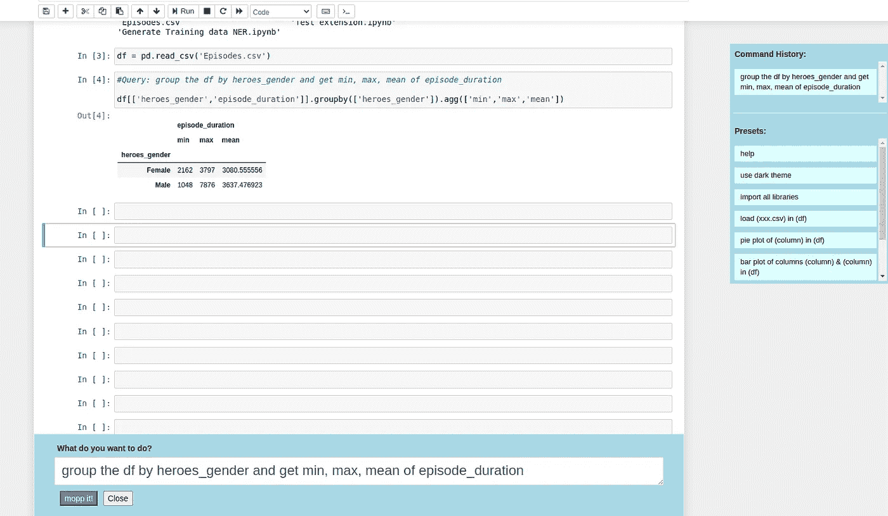
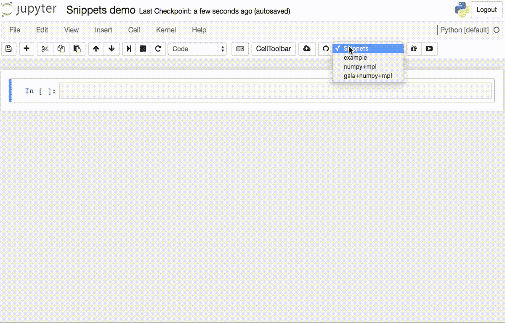
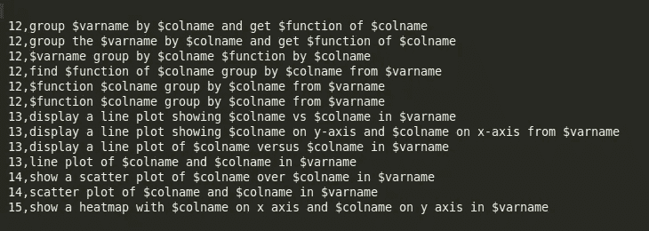
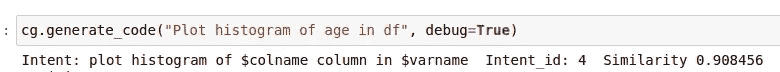
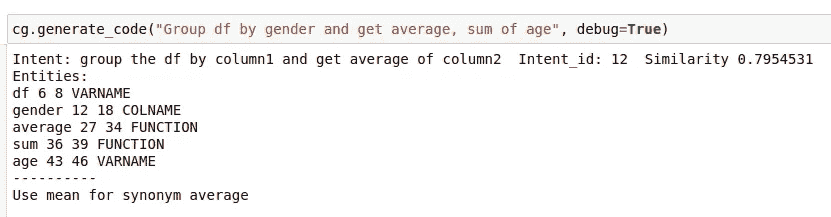
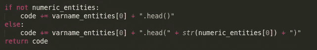

# 数据分析变得简单:Jupyter 笔记本的 text 2 代码

> 原文：<https://towardsdatascience.com/data-analysis-made-easy-text2code-for-jupyter-notebook-5380e89bb493?source=collection_archive---------12----------------------->

运行中的插件示例

## **灵感:GPT-3**

2020 年 6 月，OpenAI 推出了他们的新模型 GPT-3，它不仅具有未来的 NLP(自然语言处理)能力，还能够生成[反应代码](https://twitter.com/sharifshameem/status/1284421499915403264?lang=en)并简化[命令行命令](https://twitter.com/super3/status/1284567835386294273)。

观看这些演示对我们来说是一个巨大的鼓舞，我们意识到在进行数据分析时，很多时候，**我们经常忘记不常用的熊猫或 plotly 语法，需要搜索它们**。从 StackOverflow 复制代码需要相应地修改变量和列名。我们开始探索能够为人工查询生成现成代码的东西，比如:

> 在数据帧 df 的热图中显示降雨量和湿度

或者

> 按州对 df 进行分组，并获取用户年龄的平均值和最大值

Snippets 是我们使用了一段时间的一个扩展，但是在使用了一定数量的 Snippets 之后，UI 变得不直观了。虽然静态模板很好，但是我们需要更多的东西来处理用例的动态特性。

代码段扩展示例

为此，我们决定尝试建造一个新的 jupyter 扩展。不幸的是，我们没有 GPT-3 的测试版，所以使用那个神奇的模型不是一个选项。

# 简化任务:

我们希望构建一些可以在我们的桌面上运行的东西(使用 GPU)。我们最初试图将该问题视为聊天机器人问题，并从 Rasa 开始，但由于缺乏适当的训练数据，很快就停止了。

由于未能建立一个真正的生成模型，我们决定开发一个监督模型，该模型可以为培训管道中定义的用例工作，并且可以很容易地扩展。受 chatbot 管道的启发，我们决定将问题简化为以下几个部分:

*   生成/收集培训数据
*   意图匹配:用户想要做什么？
*   NER(命名实体识别):识别句子中的变量(实体)
*   填充模板:使用固定模板中提取的实体来生成代码
*   在 jupyter 扩展中换行

## 生成训练数据:

为了模拟最终“用户”将向系统查询什么，我们从一些我们认为自己用来描述英语命令的格式开始。例如:

> 从 **$varname** 开始，在 y 轴上显示 **$colname** ，在 x 轴上显示 **$colname**

然后，我们通过使用一个非常简单的生成器替换$colname 和$varname 来生成变体，以获得训练集中的变体。

一些示例(intent_id、ner 格式)

## 意图匹配:

在生成数据之后，该数据被映射为特定意图的唯一“intent_id ”,然后我们使用[通用语句编码器](https://tfhub.dev/google/universal-sentence-encoder/4)来获得用户查询的嵌入，并找到与我们预定义的意图查询(生成的数据)的余弦相似性。`Universal Sentence Encoder`类似于生成嵌入的`word2vec`，但是是针对句子而不是单词。

意图匹配的示例

## NER(命名实体识别):

然后，可以使用相同的生成数据来训练定制的实体识别模型，该模型可以检测列、变量、库名称。为此，我们探索了 [HuggingFace](https://huggingface.co/transformers/usage.html#named-entity-recognition) 模型，但最终使用 [Spacy](http://spacy.io/) 来训练一个定制模型，主要是因为 HuggingFace 模型是基于变压器的模型，与 Spacy 相比有点重。

实体识别示例

## 填充模板:

一旦实体被正确识别并且意图被正确匹配，填充模板就非常容易。例如，“显示 df 中的 5 行”查询将产生两个实体:一个变量和一个数字。这方面的模板代码写起来很简单。

df.head()或 df.head(5)

## 与 Jupyter 集成:

令人惊讶的是，这一个被证明是最复杂的，因为为 Jupyter 编写如此复杂的扩展有点棘手，而且几乎没有可用的文档或示例(与 HuggingFace 或 Spacy 等其他库相比)。经过一些尝试和错误，以及对现有扩展的一些复制粘贴，我们终于能够将所有东西打包成一个 python 包，可以通过`pip install`安装

我们必须创建一个前端和一个服务器扩展，当`jupyter notebook`被触发时，它就会被加载。前端将查询发送到服务器以获取生成的模板代码，然后将其插入到单元中并执行它。

## 演示:

演示视频由 [Sanyam Bhutani](https://medium.com/u/a08b1e531f9c?source=post_page-----5380e89bb493--------------------------------) 在 [Chai Time 数据科学](https://www.kaggle.com/rohanrao/chai-time-data-science?select=Episodes.csv)数据集上制作。

支持的命令的简短视频

## 局限性:

像许多 ML 模型一样，有时意图匹配和 NER 失败得很惨，即使意图对人眼来说是显而易见的。我们可以尝试改善这种情况的一些领域是:

*   收集/生成更高质量的英语句子训练数据。是一种我们还没有尝试过的技术，可以产生不同的方式来说同一个句子。
*   收集真实世界的变量名、库名，而不是随机生成它们。
*   尝试用基于变压器的模型 NER。
*   有了足够的数据，训练一个语言模型，像 GPT-3 那样直接做英语->代码，而不是在流水线中有单独的阶段。

那都是乡亲们！

我希望你喜欢读这篇文章。这个扩展的全部代码已经准备好安装在本地 GPU 机器上，在这里可以找到[。](https://github.com/deepklarity/jupyter-text2code)

Deepak 和我一起花了几个周末黑了这个。这些代码还不能用于生产，但是已经足够好了，人们可以自己修改和使用。我们希望听到反馈和改进意见。:)