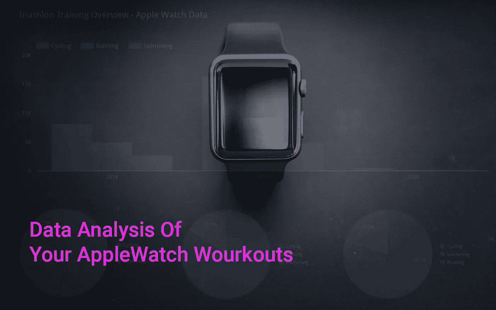
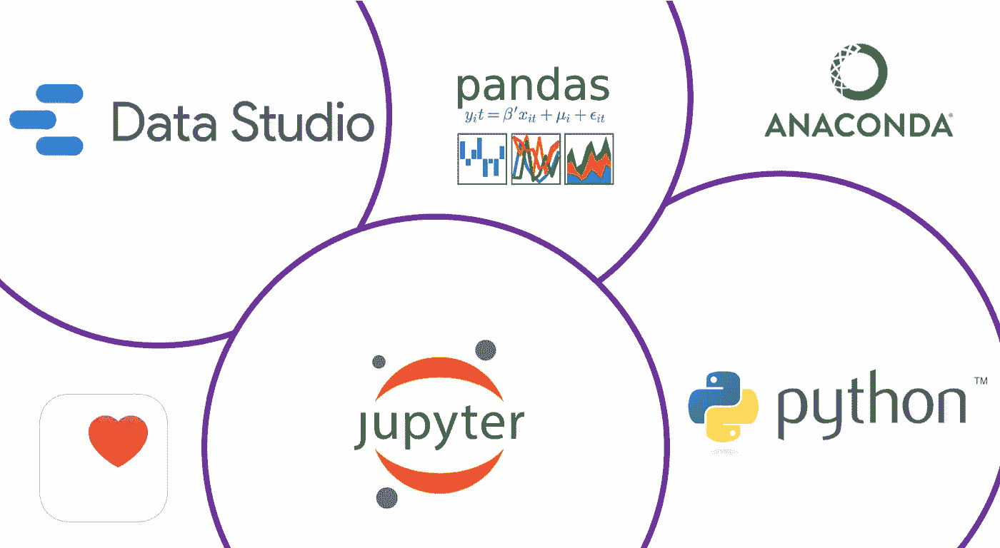
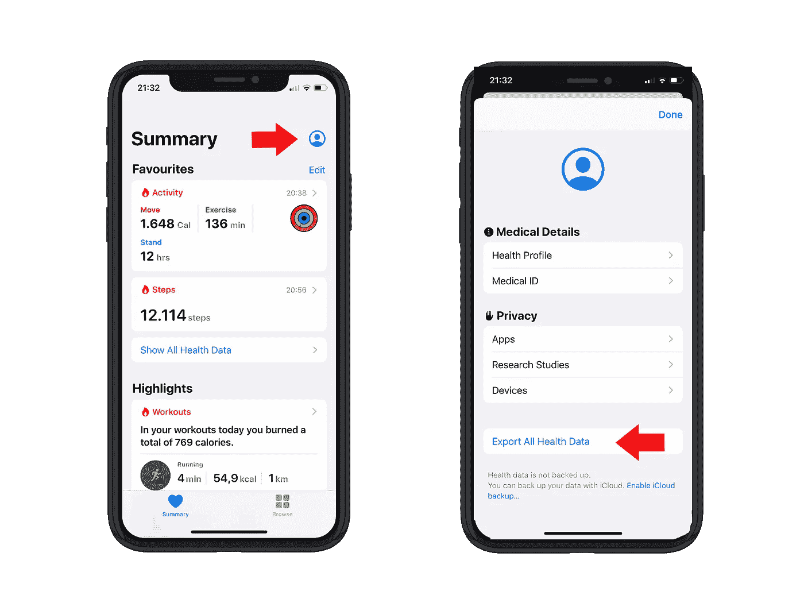
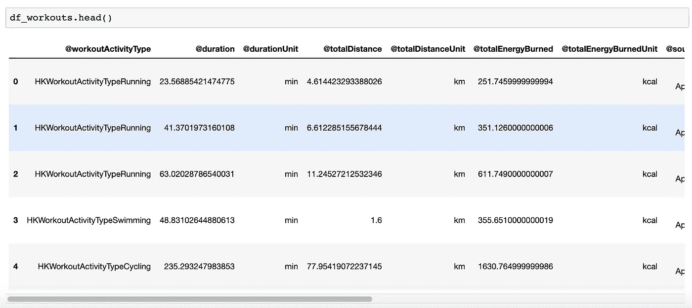
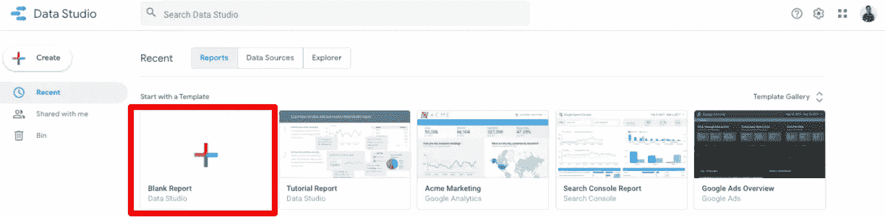
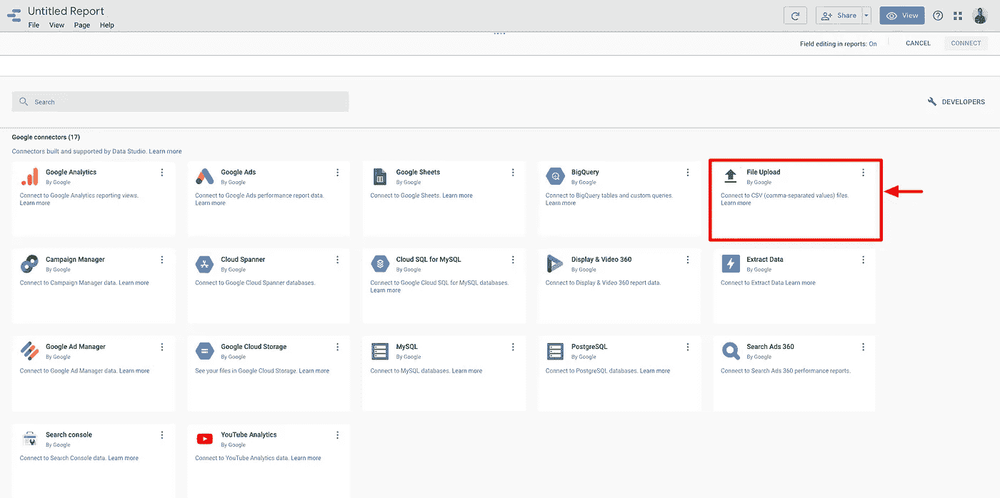
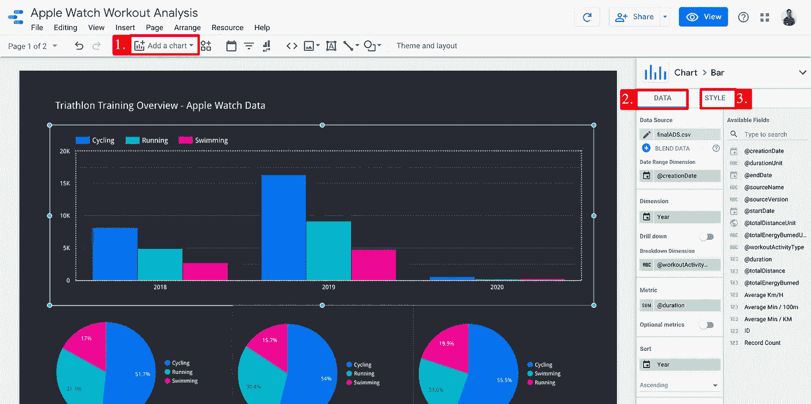
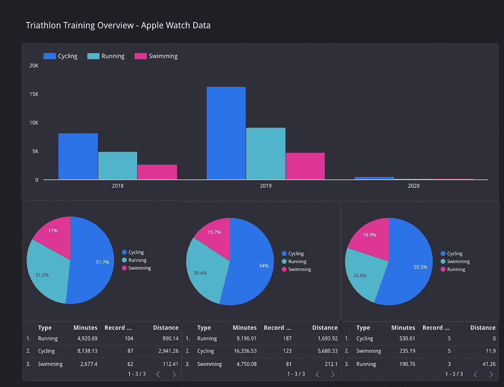
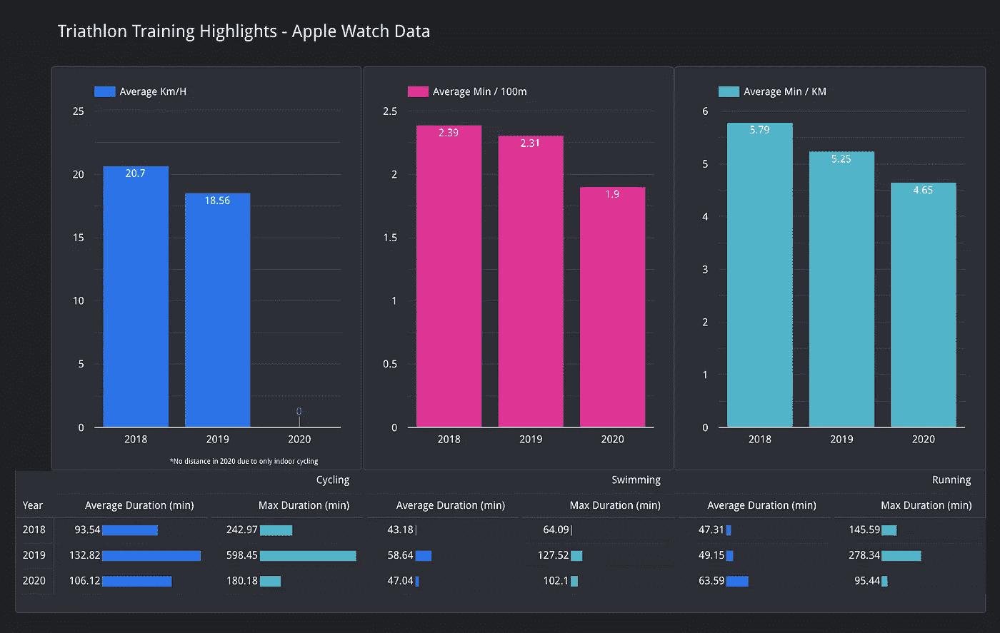

# AppleWatch 锻炼的数据分析

> 原文：<https://towardsdatascience.com/data-analysis-of-your-applewatch-workouts-672fe0366e7c?source=collection_archive---------17----------------------->

你是一个用 Apple Watch 跟踪锻炼的运动和数据极客吗？那么现在可能是时候了解更多关于你在过去几年中的表现发展了。读完这篇文章后，你会知道如何深入了解你的锻炼和运动模式。如果这还不够，深入数据分析可能是一个不错的第一个项目:你将学习如何从你的跟踪设备(在这种情况下是 Apple watch)中提取数据，如何清理和转换数据集，最后用 Google Data Studio 可视化它。我们开始吧！



你的 Apple Watch 锻炼数据分析。

这篇文章分为三部分。首先，你 iPhone 上的 Apple Watch 数据需要导出。其次，在编程语言 Python 的帮助下，读取、转换和清理接收到的 XML 文件。结果是一个完美的 CSV 文件，可以插入到谷歌数据工作室。如何做到这一点我们将在第三部分解释。

## 我们使用的工具

正如已经提到的，我们正在使用 Python 和它惊人的开源库。首先，我们使用 Jupyter Notebook，这是一个用于实时编码的开源应用程序，它允许我们讲述一个故事，并使代码可复制。要启动和运行 python，推荐使用 Anaconda。这里的[描述了如何设置和运行。对于数据可视化，您可以使用任何想要的工具。根据你的喜好，谷歌数据工作室的替代品是 Tableau、Grafana 或任何数据可视化工具。](https://www.anaconda.com/distribution/)



用于数据分析的工具

## 1.从您的 Apple 设备导出数据

首先，我们需要知道你的 Apple Watch 收集的所有数据在哪里可以找到。因此，从主屏幕打开健康应用程序。在右上角，您可以访问您的个人资料。滚动到底部，导出所有数据。不要担心，这可能需要一段时间。



从 Apple 导出您的健康记录。

您将得到一个 XML 文件。XML 代表可扩展标记语言，这意味着您的数据以非预定义的结构和纯文本格式存储。因此，如果您想看一下文件的内容，可以用标准的文本编辑器打开它。XML 在互联网上被广泛用于数据传输。下一步，我们用 python 获取这个文件并处理数据集。

## 2.使用 Python 进行数据转换和清理

在导出你所有锻炼的 XML 文件后，它现在就在你的笔记本电脑上。我们做的第一件事是将文件加载到 Jupyter 笔记本中(您应该已经安装了 Python 和 Jupyter 笔记本。如果没有，试试 Anaconda，或者看看[如何设置你的数据科学环境 mit Docker。](/hands-on-setup-your-data-environment-with-docker-dca629607148))

为了读取 XML 文件，加载了包 xmltodict，并使用它来读取我们的导出。在这种情况下，我们一方面将手表的所有“记录”数据保存在“记录列表”中，另一方面将实际锻炼数据保存在“锻炼列表”中。虽然我们将只处理锻炼数据，但知道还有更多可用的数据仍然是有用的，您可以立即开始处理这些数据。

```
#Reading the file and converting it as a dict. import pandas as pd
import xmltodictinput_path = '/Users/apple_health_export/export.xml'
with open(input_path, 'r') as xml_file:
    input_data = xmltodict.parse(xml_file.read())#Records list for general health data & imported as Pandas Data Frame
records_list = input_data['HealthData']['Record']
df_records = pd.DataFrame(records_list)#Workout list for workout data
workouts_list = input_data['HealthData']['Workout']
df_workouts = pd.DataFrame(workouts_list)
```



接下来，一些列必须转换成不同的格式。一方面，持续时间、距离和消耗的能量应为数字，日期格式应用于日期

```
#Convert selected columns to numeric so we can do calcuations
# convert just columns "..." and "..."
df_workouts[["[@duration](http://twitter.com/duration)", "[@totalDistance](http://twitter.com/totalDistance)", "[@totalEnergyBurned](http://twitter.com/totalEnergyBurned)"]] = df_workouts[["[@duration](http://twitter.com/duration)", "[@totalDistance](http://twitter.com/totalDistance)", "[@totalEnergyBurned](http://twitter.com/totalEnergyBurned)"]].apply(pd.to_numeric)
df_workouts.dtypes#convert dates to actual datetime
format = '%Y-%m-%d %H:%M:%S %z'df_workouts['[@creationDate](http://twitter.com/creationDate)'] = pd.to_datetime(df_workouts['[@creationDate](http://twitter.com/creationDate)'],format=format)df_workouts['[@startDate](http://twitter.com/startDate)'] = pd.to_datetime(df_workouts['[@startDate](http://twitter.com/startDate)'], format=format)df_workouts['[@endDate](http://twitter.com/endDate)'] = pd.to_datetime(df_workouts['[@endDate](http://twitter.com/endDate)'],format=format)df_workouts.dtypes
```

对于我们的锻炼分析，我们不需要所有的列。以游泳为例，我们在最后一栏中分解为 100 米组。如果您想了解详细信息，这可能会很有用，但出于我们的目的，我们只选择前 12 列，并且只保留锻炼活动类型游泳、跑步和骑自行车。

```
#drop unnecessary columns (all rows and column 1 to 12)
df_workouts = df_workouts.iloc[:,0:12]
df_workouts.head()#Remove HKWorkoutActivityTypeWalking and HKWorkoutActivityTypeSnowSports
df_workouts=df_workouts[df_workouts['[@workoutActivityType](http://twitter.com/workoutActivityType)'] != 'HKWorkoutActivityTypeWalking']
df_workouts=df_workouts[df_workouts['[@workoutActivityType](http://twitter.com/workoutActivityType)'] != 'HKWorkoutActivityTypeSnowSports']
```

由于健身程序的名称很长，原来的健身程序名称(如“HKWorkoutActivityTypeCycling ”)将替换为简单的“Cycling”。跑步和游泳也是如此。

```
#Rename Activity Types to Running, Cycling and Swimming
df_workouts["[@workoutActivityType](http://twitter.com/workoutActivityType)"]= df_workouts["[@workoutActivityType](http://twitter.com/workoutActivityType)"].replace("HKWorkoutActivityTypeCycling", "Cycling")
df_workouts["[@workoutActivityType](http://twitter.com/workoutActivityType)"]= df_workouts["[@workoutActivityType](http://twitter.com/workoutActivityType)"].replace("HKWorkoutActivityTypeRunning", "Running")
df_workouts["[@workoutActivityType](http://twitter.com/workoutActivityType)"]= df_workouts["[@workoutActivityType](http://twitter.com/workoutActivityType)"].replace("HKWorkoutActivityTypeSwimming", "Swimming")df_workouts.head(15)
```

最后但同样重要的是，检查数据帧的头部。如果它看起来像你想要的样子，让我们做一个 CSV 导出，并准备好我们的最终分析数据集插入到 Google Data Studio。

```
#save as csv (Don't forget to add '.csv' at the end of the path)finalADS = df_workouts.to_csv(r'/Users/finalADS.csv', header=True) 
```

## 3.使用 Google Data Studio 创建仪表板

最后但同样重要的是，我们正在可视化导出的 CSV 数据集，以探索我们的锻炼数据。Google Data Studio 是首选工具，因为它对每个人都是免费的，并提供了一种快速可视化简单数据的方法。如果你已经有一个谷歌账户，访问 https://datastudio.google.com/，你就可以开始了。Google Data Studio 提供了一些示例报告，但是在这种情况下，我们从头开始，使用“空白报告”并添加我们的 CSV 作为数据源。



在 Data Studio 中创建空白报表



Google Data Studio 中的 CSV 上传

Google Data Studio 将确认您的 CSV 成功上传。在我的例子中，第一列没有被命名为“ID ”,而是被追溯标记。之后，您可以开始创建您想要的图表。下面不会解释每一个图表，但是在 Google Data Studio 中如何创建一个图表的三个基本步骤。



使用 Google Data Studio 创建图表

1.  通过单击顶部导航栏上的概述按钮添加新图表。
2.  选择所需的图表类型后，接下来选择要显示的数据。首先，选择我们的“finalADS.csv”作为数据源。其次，应该定义“日期范围维度”。在这种情况下，我们想比较这些年来我们的锻炼行为是如何发展的。第三，我们的“分解维度”选择为“@workoutActivityType”。这让我们可以在游泳、骑自行车和跑步中分解我们的训练
3.  最后但同样重要的是，我们可以设计图表的样式。对于所有不同的图表，相同的颜色用于相同的锻炼活动类型。这样，我们可以轻松地将锻炼分配到相应的图表中。



谷歌数据工作室——铁人三项仪表板 I



谷歌数据工作室——铁人三项仪表板 II

## 结论

从运动的角度来看，从 2018 年到 2019 年，训练量几乎翻了一倍，另一方面，这些年来速度增加了，这是很惊人的。看起来运动的事情正朝着正确的方向发展，但你会发现这个项目更大的焦点是处理由 Apple Watch 设备创建的数据集。

虽然提取数据集非常容易，但要适应 XML 文件需要一些时间。但是我保证一旦你掌握了窍门，你会爱上它的。从那时起，这就是一个非常典型的数据分析过程，其中包含清理和转换的部分。最后但并非最不重要的是，我只能向不太复杂的项目推荐使用 Google Data Studio 进行数据可视化。它是免费的，它有大部分的选择，并且很容易共享。对于这个范围内的其他工具，你肯定要付出代价。

***************************************************************

如果您有任何问题或需要一些数据分析方面的支持，请随时通过 LinkedIn、Instagram 或其他任何地方联系。

***************************************************************

您可能也喜欢阅读的文章:

[使用 Docker](/hands-on-setup-your-data-environment-with-docker-dca629607148) 设置您的数据环境

[消除流失是增长黑客 2.0](https://blog.markgrowth.com/eliminating-churn-is-growth-hacking-2-0-47a380194a06)

[用数据误导&统计](/misleading-with-data-statistics-c6d506bdb9cf)