# 数据分析项目—电信客户流失

> 原文：<https://towardsdatascience.com/data-analysis-project-telco-customer-churn-fe5c0144e708?source=collection_archive---------7----------------------->

## 这个项目的假想背景:我是一名数据分析师，在一家电信公司工作。我的经理让我分析她提供的数据集，以获得可操作的见解，从而留住客户并增加客户的终身价值。


由[蔡斯·沙佩尔](https://unsplash.com/@chappelldigitalmarketing?utm_source=medium&utm_medium=referral)在 [Unsplash](https://unsplash.com?utm_source=medium&utm_medium=referral) 拍摄的照片

从数据集中提取可行的见解。在评估数据集后，我列出了所有出现在我脑海中的问题，并试图对所有问题进行调查，以找到真知灼见:

> 1.为服务付费的未订阅用户通常会在服务中停留多长时间？他们的平均 LTV(生命时间价值)是多少？
> 
> 2.退订和仍在订购的用户中有多少人使用了电话服务？
> 
> 3.有多少人使用多线路电话服务给那些退订但仍在订购的人？
> 
> 4.对于那些退订和订阅的人，有多少人使用了互联网服务？
> 
> 5.对于那些退订和付费的用户，有多少人使用和正在使用互联网服务的每个子集？
> 
> 6.对于那些仍然在用 LTV 高于泄露客户平均 LTV 的人来说，每个服务互联网服务有什么不同？
> 
> 7.有多少人订阅了每一种合同，而那些退订的人仍然在为服务付费？
> 
> 8.在“性别”、“伴侣”、“家属”、“电话服务”、“互联网服务”、“合同”和“支付方式”中，哪个变量对 LTV 的影响最大？

> 这个数据集是我在 [Kaggle](https://www.kaggle.com/blastchar/telco-customer-churn) 建立的 IBM 样本数据集。

## 该数据集的简要说明:

每行代表一个客户；每一列都包含列元数据中描述的客户属性。

数据集包括以下信息:

*   上个月内离开的客户—这一列称为流失。
*   每位客户已注册的服务—电话、多条线路、互联网、在线安全、在线备份、设备保护、技术支持以及流媒体电视和电影
*   客户账户信息——他们成为客户的时间、合同、支付方式、无纸化账单、每月费用和总费用
*   客户的人口统计信息—性别、年龄范围，以及他们是否有伴侣和家属

让我们从解释我在这个项目中的整个数据分析步骤开始:

> *第一步:收集数据*
> 
> *第二步:评估和清理数据*
> 
> *第三步:进行探索性数据分析以回答问题&创建可视化(* [*最终可视化代码*](https://github.com/YuehHanChen/Telco_Customer_Churn_Analysis/blob/master/Visualization.ipynb) *)*
> 
> *第四步:理解语言障碍*
> 
> *第五步:汇总*
> 
> *第六步:可行的见解*

## 从步骤 1 到步骤 3，你可以在这里看到完整的代码。

> *第一步:收集数据*

对于*stats models . API***模块，由于我将对第 8 个问题使用多元线性回归分析，所以我包括在这里。**

> ***第二步:评估和清理数据***

**在这里，因为这篇文章的目的是展示我做了什么和我进行数据分析项目的过程，所以我不会重复每个细节。相反，我会选择我做过的最重要的程序。如果你真的想检查我做的每一个细节，请看这里。**

## **评估:**

**通常，我喜欢一次查看所有的列，所以我使用 [pandas.set_option](https://pandas.pydata.org/pandas-docs/stable/reference/api/pandas.set_option.html) 来做这件事:**

**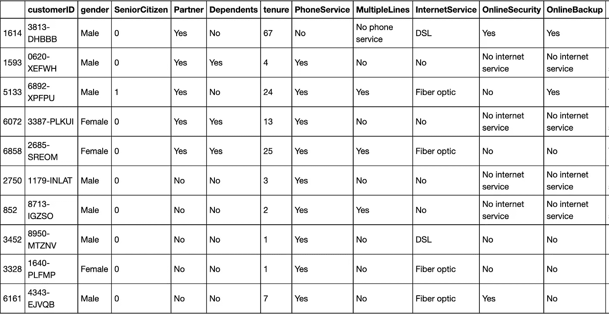****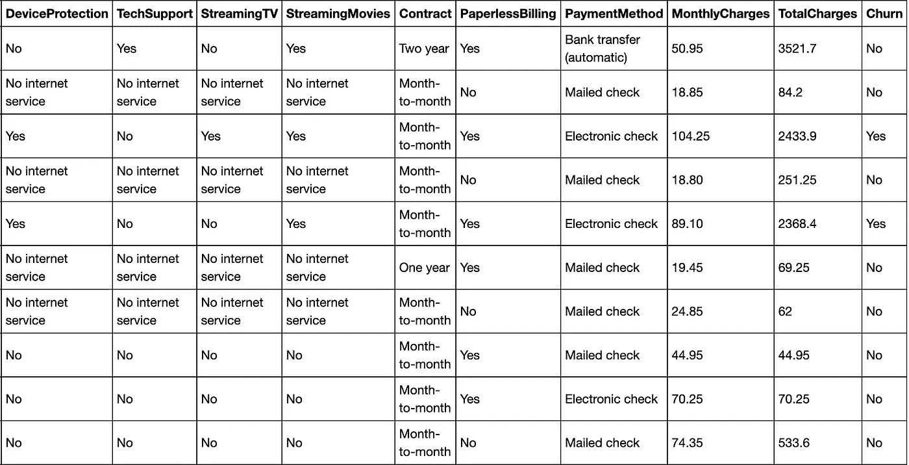**

```
df.describe()
```

**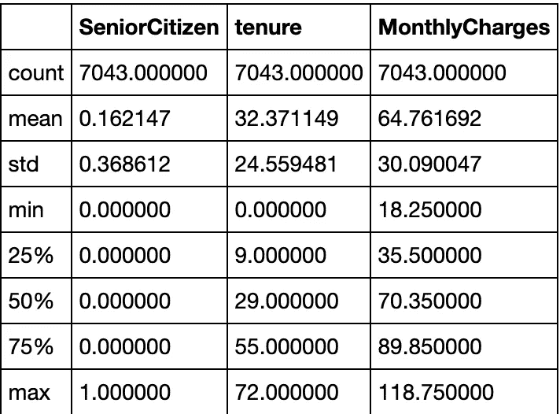**

```
df.Contract.value_counts()
```

**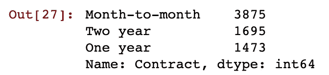**

**逐月:一年:两年约为 2.5: 1: 1**

```
*# show the distribution of tenure.*
plt.hist(data = df, x = 'tenure');
```

**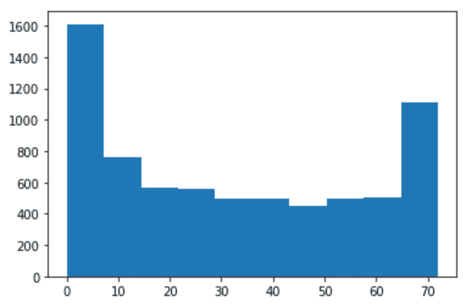**

**这显然不是正态分布。而且有两个高峰，所有客户中有两种极端的人，我会调查是什么服务让入住 70 个月以上的人最多。**

## **评估报告:**

**这里没有整洁的问题，只有两个问题需要考虑一个非常干净的数据集。以下是 **2 个质量问题:****

*   **“TotalCharges”的数据类型应该是 float64 类型，而不是 object 类型。**
*   **许多行的“总费用”不等于每个月的费用。**

**首先，我们应该复制原始数据集:**

```
df_copy = df.copy()
```

## ****清理 1:“总费用”的数据类型应该是 float64 类型，而不是对象类型****

**操作:为所有行赋予 None 值，然后将其转换为 float64 的数据类型。(稍后我会重新计算)**

```
df_copy.TotalCharges = **None**
df_copy.TotalCharges=df_copy.TotalCharges.astype(float)
```

**测试结果:**

```
df_copy.TotalCharges.dtype
```

**输出:dtype('float64 ')**

## **清洁 2:许多行的“总费用”不等于每个月的费用。**

**行动:重新计算，让每个任期乘以每月收费**

```
df_copy.TotalCharges = df_copy.tenure * df_copy.MonthlyCharges
```

**测试结果:**

```
df_copy[df_copy.tenure * df_copy.MonthlyCharges != df_copy.TotalCharges].shape
```

**输出:(0，21)**

**清理过程的最后一步:保存数据。**

```
*# store the clean data*
df_copy.reset_index(drop=**True**)
df_copy.to_csv('Telco-Customer-Churn_clean.csv')
```

> ***第三步:进行探索性数据分析以回答问题&创建可视化(* [*最终可视化代码*](https://github.com/YuehHanChen/Telco_Customer_Churn_Analysis/blob/master/Visualization.ipynb) *)***

**在编写任何可视化之前，我喜欢创建一个可重用的函数，这样我可以节省大量时间，而不必编写相同的代码:**

## **研究问题 1:退订付费服务的人通常会在服务中停留多久？他们的平均 LTV(生命时间价值)是多少？**

**首先，我提取了那些取消订阅服务的人，并检查了任期的分布。**

```
Churn_df = clean_df.query('Churn=="Yes"')
Churn_df.TotalCharges.describe()
```

****

**让我们看看它的分布:**

```
plt.hist(data = Churn_df, x = 'TotalCharges');
```

**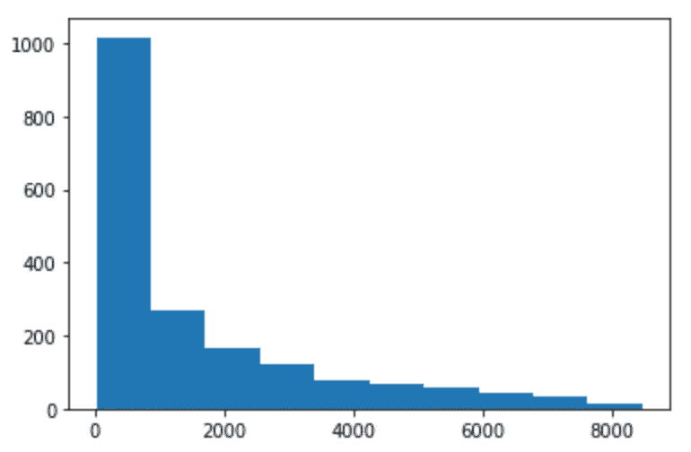**

**在查看了分布和 5 个数字的汇总后，我发现 80%左右的数据都非常高，所以我决定将它们分成 80%和剩下的 20%来查看每个数据的分布。(在现实生活中应用 80/20 法则。)**

```
*#find the 80th percentile of the data in total charges*
Churn_df.TotalCharges.quantile(0.8)
```

**产量:25000 万英镑 20000 万英镑 20001**

```
*# Divide the data by the 80th percentile of the data, and show the distribution of its TotalCharges under 80th percentile* 
TotalCharges_under80 = Churn_df.query('TotalCharges<=2827.59')
TotalCharges_above80 = Churn_df.query('TotalCharges>2827.59')
```

**让我们想象一下未订阅的客户按 80/20 分组的情况:**

**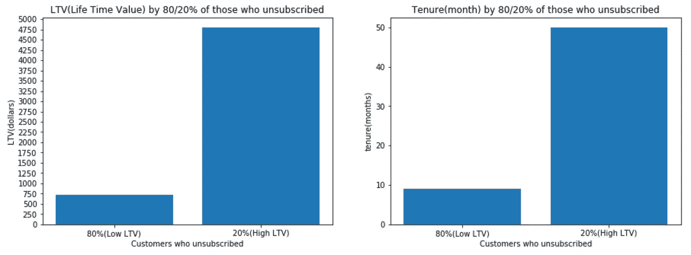**

**好了，现在，让我们来看看这张图，它综合了退订者和付费者。**

**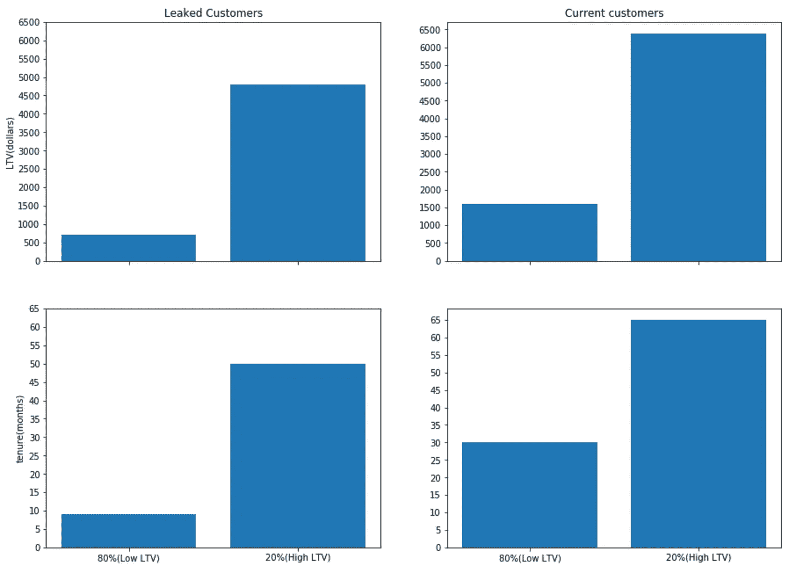**

**注意:80%(低 LTV)的泄露客户仅停留在 10 个月以下。80%退订者的平均 LTV 是 750 美元。另一方面，未订阅的前 20%的平均 LTV 是 4750 美元。每组总 LTV 之和的比率为 750*4: 4750 = 1: 1.6，这表明我们应该专注于服务那些 LTV 高的 20%客户，这些客户为我们带来了来自泄露客户的 60%(1.6/2.6)的收入。**

## **研究问题 2:退订和仍然订购的用户中使用电话服务的比例是多少？**

**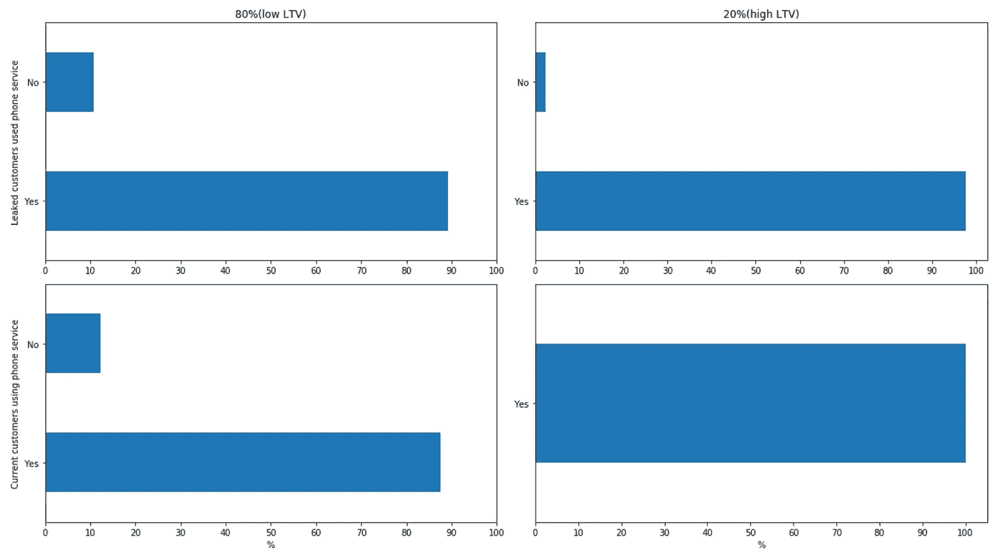**

**注:100%的人带来了高 LTV 使用和正在使用互联网服务。**

## **研究问题 3:对于那些退订并仍然订阅的人，使用多线路电话服务的人占多大比例？**

**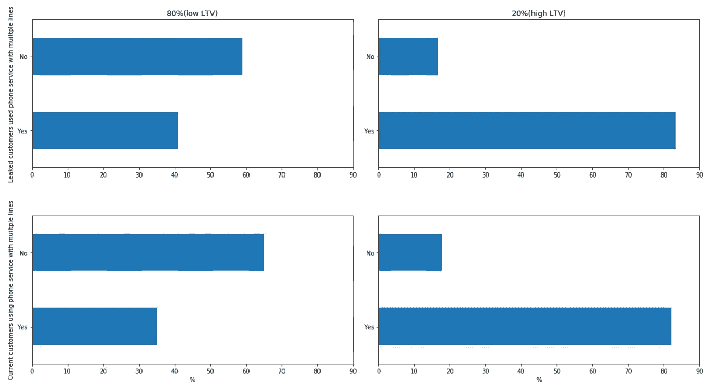**

**注:81%带来高 ltv 的人倾向于二手线路。那些仍然在为服务付费的人和那些退订的人之间没有太大的区别。**

## **研究问题 4:退订和订阅的人使用互联网服务的比例是多少？**

**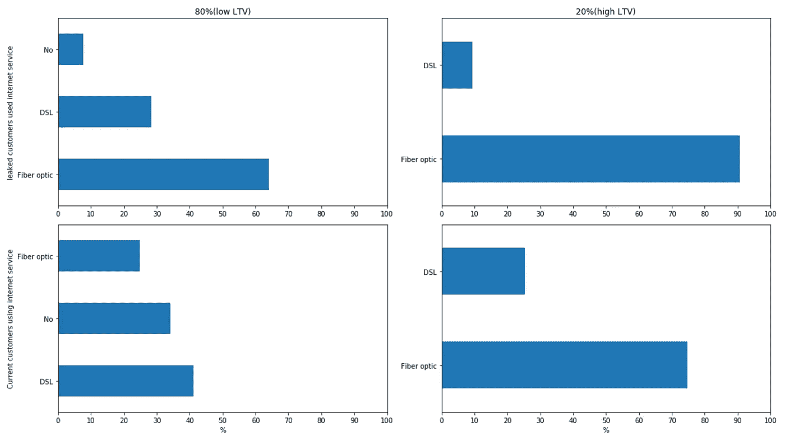**

**注:那些携带高 ltv 的人喜欢使用光纤(75%-90%)和 DSL(10%-20%)，他们中没有人使用互联网服务。而那些带来低 ltv 的人，就目前的客户而言，约 30%的人不使用互联网服务。**

**现在，让我们更深入地了解每个互联网服务子集的情况。**

## **研究问题 5:对于那些退订并仍在为服务付费的人来说，使用每个互联网服务子集的人的比例是多少？**

**首先，提取使用互联网服务的 LTV 低的 80%，并将互联网服务子集的每个比例保存在变量“比例 _ 互联网 _ 子服务”中:**

**然后提取使用互联网服务的 LTV 高的 20%，并将互联网服务子集的每个比例保存在变量“比例 _ 互联网 _ 子服务 _ 高于 80”中**

**其次，提取使用互联网服务的 LTV 低的 80%,并将互联网服务子集的每个比例保存在变量“paying _ proportion _ internet _ sub _ service _ under 80”**

**然后 e *提取使用互联网服务的 LTV 高的 20%，并将互联网服务子集的每个比例保存在变量“paying _ proportion _ internet _ sub _ service _ above 80”***

**让我们想象一下:**

**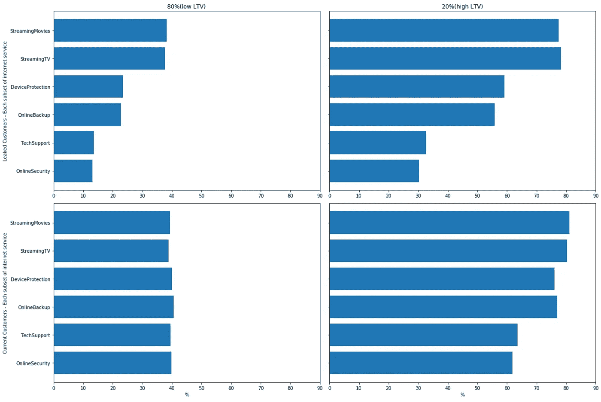**

**注:在当前客户的 80%(低 LTVs)数据中，40%的人平等地使用互联网服务的所有子集。在 80%的现有客户(低 ltv)中，流媒体电影和流媒体电视是人们使用的互联网服务的两大子集，设备保护和在线备份排在第二位，技术支持和在线安全排在第三位，这两者之间的差距接近整个数据的 10%。**

## **研究问题 6:对于那些仍在服务的 LTV 高于泄露客户平均 LTV 的客户，每个服务中的一般当前客户之间有什么差异？**

**首先，我提取了我想要调查的几组数据:**

## **1.让我们来看看多线路的电话服务:**

**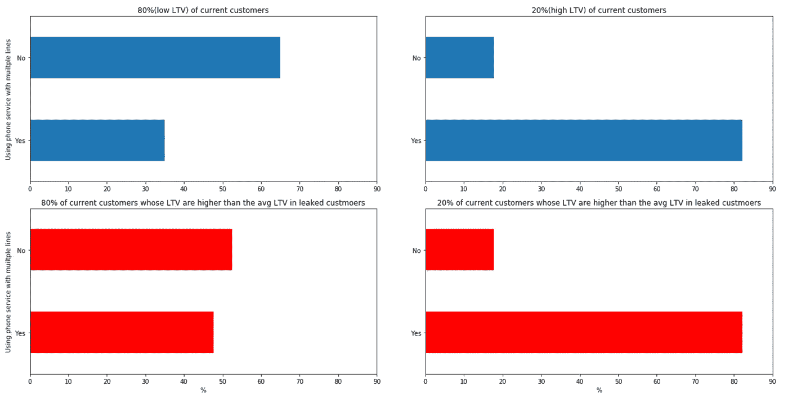**

## **2.对于互联网服务:**

**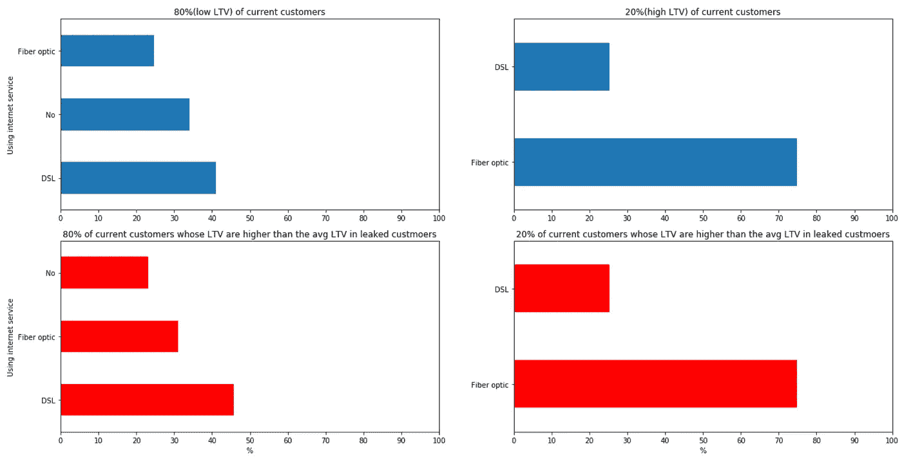**

**注意:在 80%的当前客户中，LTV 超过 80%泄露客户的平均 LTV 的人使用多条线路和互联网服务的可能性**比 80%的当前客户的平均水平**高 10%。**

## **研究问题 7:对于泄露且仍在支付服务的两组人，每组的每种合同的比例是多少？**

**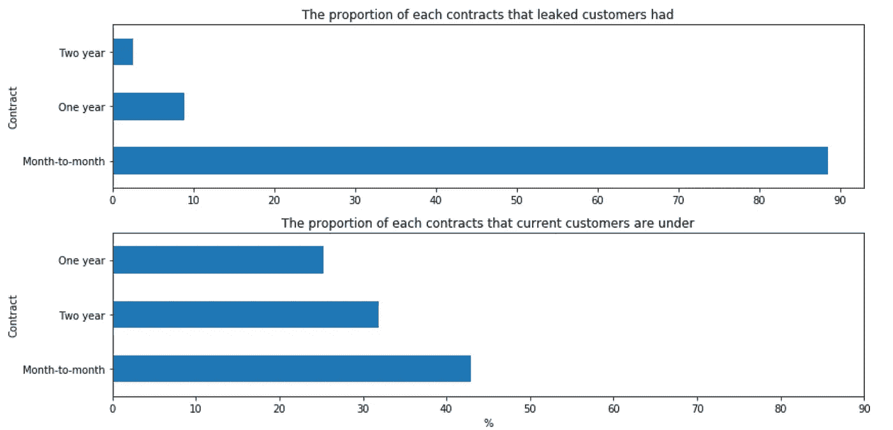**

**注意:89%的泄露者使用月合同，而只有 42%的当前客户使用月合同。**

## **研究问题 8:在“性别”、“伴侣”、“家属”、“电话服务”、“互联网服务”、“合同”和“支付方式”中，哪个变量对 LTV 的影响最大？**

**我对这些问题使用了多元线性回归，首先，因为它们大多数是分类变量，所以我需要将它们转换成虚拟变量:**

**使用多元线性回归:**

**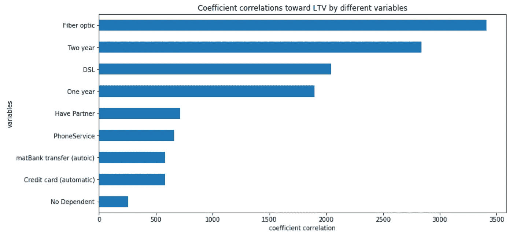**

**注:人们是否使用互联网服务是创造高 LTV 的最重要因素，年度合同次之。**

**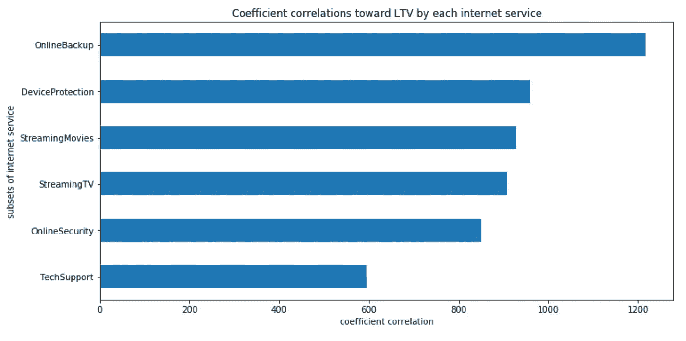**

**注意:在互联网服务的所有子集中，在线备份是创造高 LTV 的最重要因素**

> ***第四步:了解局限性***

**在得出任何结论之前，告知局限性总是更好的。在评估数据和进行探索性数据分析的过程中，我发现了一些局限性:**

***限制 1:在这个数据集中，我们只能看到每个变量的一种类型，而不是改变不同选项久而久之的真实世界情况，即在真实世界中，人们可能想尝试流媒体服务，但他们可能会改变主意，下个月使用技术支持。***

***局限性 2:我们不能将所有这些变量都视为客户离开的确切原因，因为他们可能会因为竞争对手提供的更好的价格或某个时候经济不景气等原因而离开。我们看不到他们泄露的时间，所以很难推断那些外部情况。***

> ***第五步:总结***

1.  **80%(低 LTV)的泄露客户仅停留在 10 个月以下。他们的平均工资是 750 美元。另一方面，前 20%的泄密者的平均 LTV 是 4750 美元。每组总 LTV 之和的比率为 750*4: 4750 = 1: 1.6，这表明我们应该专注于服务 20%的高 LTV 客户，这些客户为我们带来了 60%(1.6/2.6)的来自泄露客户的收入**
2.  **81%带来高 ltv 的人倾向于二手线路。那些仍然在为服务付费的人和那些退订的人之间没有太大的区别。**
3.  **那些带来高 ltv 的人喜欢使用光纤(75%-90%)和 DSL(10%-20%)，他们中没有人使用互联网服务。而那些带来低 ltv 的人，就目前的客户而言，约 30%的人不使用互联网服务。**
4.  **在 80%(低 LTVs)的当前客户中，40%的人平等地使用互联网服务的所有子集。在 80%的现有客户(低 ltv)中，流媒体电影和流媒体电视是人们使用的互联网服务的两大子集，设备保护和在线备份排在第二位，技术支持和在线安全排在第三位，这两者之间的差距接近整个数据的 10%。**
5.  **在 80%的当前客户中，那些 LTV 高于 80%泄露客户的平均 LTV 的人使用多条线路和互联网服务的可能性比 80%的当前客户高 10 %**。****
6.  **89%的泄露者使用月合同，而只有 42%的当前客户使用月合同。**
7.  **人们是否使用互联网服务是创造高 LTV 的最重要因素，年度合同次之。**
8.  **在互联网服务的所有子集中，在线备份是创造高 LTV 的最重要因素。**

> ***第六步:可行的见解***

**为了留住客户:**

1.  **开展营销活动，对目前在我们的其他互联网服务上订购流媒体电影和电视服务的用户进行追加销售。(根据 Q5 的图表，他们支付的互联网服务越多，他们停留的时间就越长。)**

**为了增加客户的终身价值:**

1.  **增加我们的流媒体电影和电视服务的营销预算，因为这两个领域的差距最大，分别为 80%(低 LTV)和 20%(高 LTV)。(基于 Q5 的图表)**
2.  **增加我们在线备份的营销预算，这是促成高 LTV 的最重要因素。(基于 Q8 的图表)**
3.  **增加我们对那些想使用多条线路的用户的营销预算。(基于 Q6 的图表)**

****

**弗兰基·查马基在 [Unsplash](https://unsplash.com?utm_source=medium&utm_medium=referral) 上拍摄的照片**

**最后，数据有更好的想法，但你应该始终怀疑任何洞察力和数据在某种程度上是错误的或有一些偏见，无论谁提供给你的是专家或可信度高的人。**

**感谢您花时间阅读这篇文章。**

**如果你是想找数据分析师实习生的雇主，这是我的 [LinkedIn](https://www.linkedin.com/in/yueh-han-chen/) 或者通过我的电子邮件([ychen596@insite.4cd.edu](mailto:ychen596@insite.4cd.edu))联系我**

**如果你也在数据科学/商业分析领域工作，请随时通过 IG( [@jchen_mmm](https://www.instagram.com/jchen_mmm/) )、电子邮件或下面的评论给我任何反馈！**