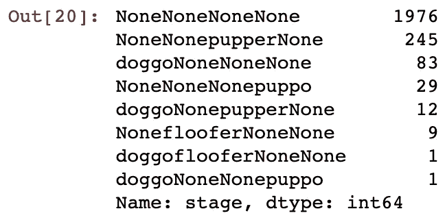
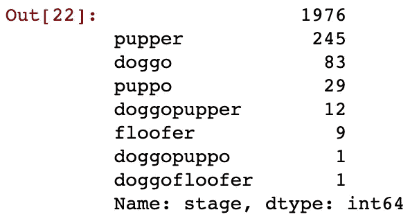
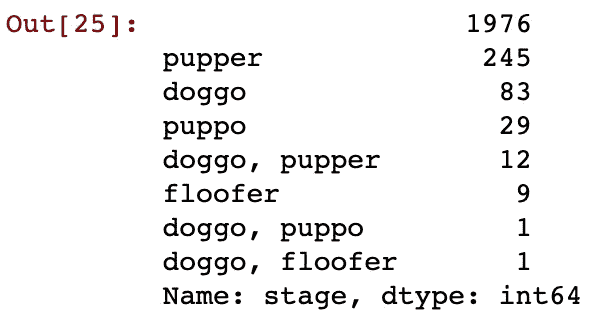
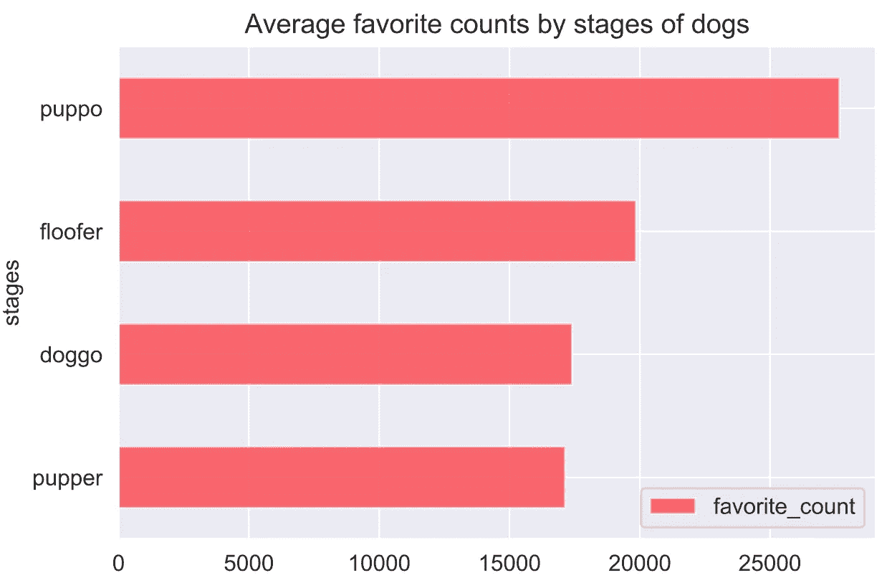
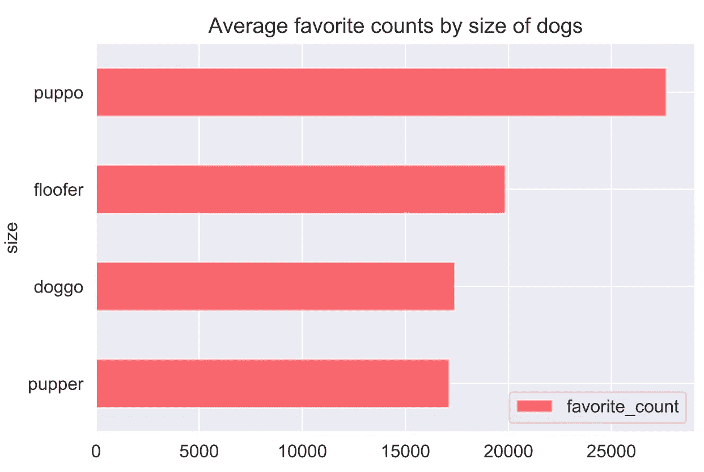
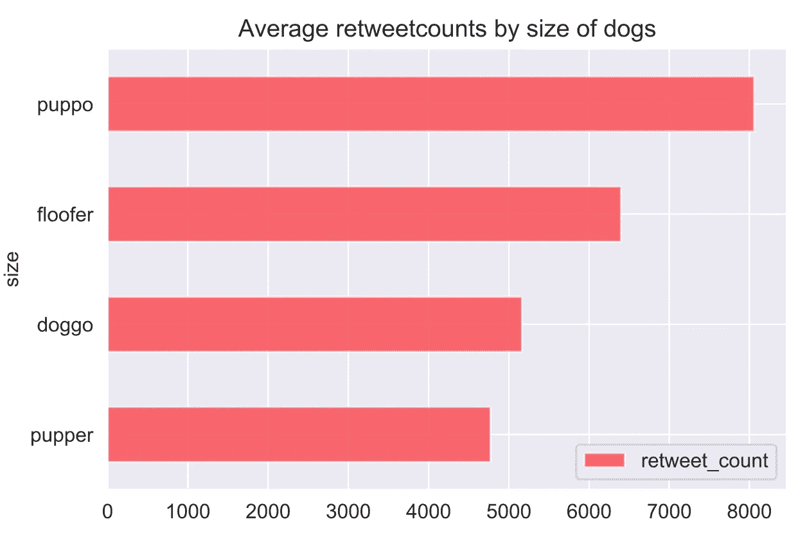
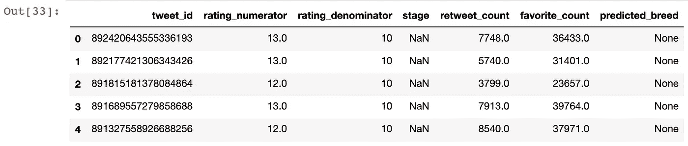
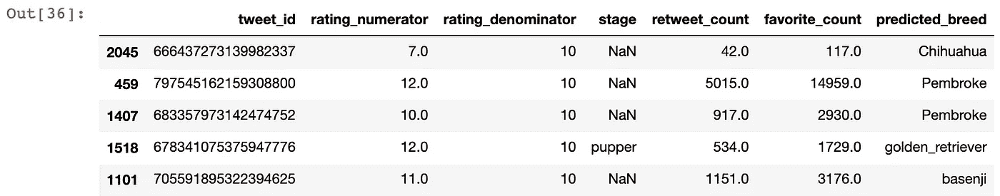
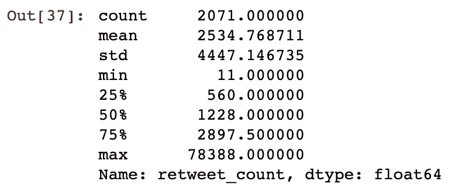
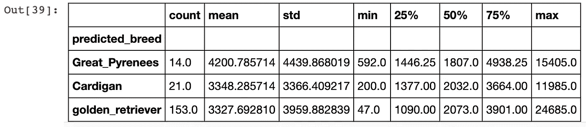

# 数据分析项目——WeRateDogs

> 原文：<https://towardsdatascience.com/data-analysis-project-weratedogs-16aad3f6c8c2?source=collection_archive---------22----------------------->

许多人都在为他们可爱的狗狗运营社交媒体账户。然而，他们中的大多数人通常不会很好地运营他们的社交媒体账户，因为他们不知道观众喜欢什么，也不知道是什么因素影响了他们的喜爱和转发量。


瓦莱丽·埃拉什在 [Unsplash](https://unsplash.com?utm_source=medium&utm_medium=referral) 上拍摄的照片

因此，我试图通过分析著名的狗评级 Twitter 帐户 [@weratedog](https://twitter.com/dog_rates?ref_src=twsrc%5Egoogle%7Ctwcamp%5Eserp%7Ctwgr%5Eauthor) 到**来调查以下这 2 个问题，帮助那些拥有或打算拥有狗宠物社交媒体帐户的人通过选择正确类型的狗来吸引更多观众(我有多无聊)**:

> 1.哪个阶段/尺寸的狗获得了最高的转发数和最喜欢的数？
> 
> 2.转发次数最多的前三种狗是什么？

> 一个简短的介绍@weratedog 是一个推特账户，用一个关于狗的幽默评论给人们的狗打分。该账户由大学生马特·尼尔森于 2015 年创建。从那以后，这个账户已经吸引了 880 万以上的关注者。

让我们从解释我在这个项目中的整个数据分析步骤开始:

> 第一步:使用 Twitter API 收集数据(这里是完整代码
> 
> 第二步:评估和清理数据([此处为](https://github.com/YuehHanChen/WeRateDogs-Twitter-Analysis/blob/master/wrangle_act.ipynb)的完整代码)
> 
> 第三步:进行探索性数据分析以回答问题并创建可视化效果([完整代码在此处](https://github.com/YuehHanChen/WeRateDogs-Twitter-Analysis/blob/master/act_report%20(1).ipynb))
> 
> 第四步:理解局限性
> 
> 第五步:总结
> 
> 第六步:可行的见解

> 步骤 1:使用 Twitter API 收集数据

在这个项目中，我使用了 [Tweepy](http://www.tweepy.org/) ，一个 Python 库，来查询 Twitter 的 API 以获取 WeRateDogs Twitter 数据。数据将包括转发次数和收藏次数。我将把这两条信息与我在做这个项目时参加的 Udacity 的数据分析师课程提供的额外数据结合起来。

而且，因为这篇文章的目的是展示我所做的，所以这不是一篇教程文章，所以如果你是一个初学者并且对如何使用 Tweepy 感兴趣，[这是一篇适合初学者的文章。](/my-first-twitter-app-1115a327349e)

```
Code:**import** **pandas** **as** **pd**
**import** **numpy** **as** **np**
**import** **os**

*#load twitter-archive-enhanced.csv into twitter_archive_df(*twitter-archive-enhanced.csv is the additional data provided by Udacity's course*)*
twitter_archive_df = pd.read_csv('twitter-archive-enhanced.csv')*#using Python's Tweepy library and store each tweet's entire set of JSON* 
*#data will be in a file called tweet_json.txt file.*

**import** **tweepy**#for the privacy, I put '...' instead of the real keys heehee
consumer_key = '...'  
consumer_secret = '...'
access_token = '...'
access_secret = '...'

auth = tweepy.OAuthHandler(consumer_key, consumer_secret)
auth.set_access_token(access_token, access_secret)

api = tweepy.API(auth, wait_on_rate_limit=**True**, wait_on_rate_limit_notify=**True**)

**import** **json**

page_no_exist = []
retweet_count_and_favorite_count = []#Writing and Reading Twitter JSON
**with** open('tweet_json.txt', mode="w") **as** file:
    **for** i **in** list(twitter_archive_df.tweet_id):
        **try**:
            tweet = api.get_status(str(i))
            file.write(json.dumps(tweet._json))
            retweet_count_and_favorite_count.append({
                "tweet_id" : str(i),
                "retweet_count" : tweet._json['retweet_count'],
                "favorite_count" : tweet._json['favorite_count']
            })
        **except**:
            page_no_exist.append(i)retweet_count_and_favorite_count = pd.DataFrame(retweet_count_and_favorite_count, columns=["tweet_id",'retweet_count', 'favorite_count'])
```

> 第二步:评估和清理数据([这里是完整代码](https://github.com/YuehHanChen/WeRateDogs-Twitter-Analysis/blob/master/wrangle_act.ipynb)

在评估过程中，我发现了一些问题，并记录在两个部分:**质量问题**和**整洁问题**:

***为质量问题:***

*   冗余转发行
*   多余的“回复用户推文”行
*   tweet_id 883482846933004288，778027034220126208 中的 rating _ 分子错误，给出了小数点后的数字而不是整数。
*   没有名字的狗，取了“a”或“an”而不是“None”
*   有些 rating_denominator 不是 10
*   “时间戳”、“tweet_id”的数据类型错误
*   源列中的行有 95%以上是重复的。

***为整洁问题***

*   同一类别的冗余列，现在分为["doggo "，" flooter "，" pupper "，" puppo"]列，但是我们只需要一个" stage "列

在这里，我挑选了下面两个我认为最有趣的清洁来展示，但是如果你想看我为这个项目做的整个清洁过程，请在这里查看清洁过程的完整代码。

## 清洁 1:没有名字的狗，但被赋予“a”或“an”的名字，而不是“None”

操作:查找错误名称列表，并使用 for 循环给出单个名称“无”。

```
Code:wrong_name_list = list(twitter_clean_df.query('name == "a" or name == "an"').index)**for** i **in** wrong_name_list:     
    twitter_clean_df.name[i] = "None"
```

测试结果:

```
**for** i **in** wrong_name_list:
    **if** twitter_clean_df.name[i] != "None":
        print("wrong name")(nothing is shown.)
```

## 清洁 2。同一类别的冗余列。原始数据集包含“doggo”、“flooter”、“pupper”和“puppo”列，但我们只需要一个“stage”列来包含它们。

动作:将四列(“doggo”、“flooter”、“pupper”、“puppo”)转换为一个“stage”列，然后删除这四列。

```
Code:twitter_clean_df['stage']=**None** # I try to add all the values from the four columns together, and then drop the "None" after that.twitter_clean_df['stage'] = twitter_clean_df.doggo + twitter_clean_df.floofer + twitter_clean_df.pupper + twitter_clean_df.puppotwitter_clean_df['stage'].value_counts()
```



好了，现在我要**去掉每行中所有的【无】**。

```
twitter_clean_df['stage'] = twitter_clean_df['stage'].map(**lambda** x: x.replace("None",""))twitter_clean_df['stage'].value_counts()
```



这大概是我想要的，但是我们可以看到一些狗被记录为两个阶段，所以让给他们在两个词之间的“，”符号。

(以“doggopupper”为例。我们应该把它写成“doggo，pupper”)

```
Code:
twitter_clean_df.loc[twitter_clean_df.stage == 'doggopupper', 'stage'] = 'doggo, pupper'
twitter_clean_df.loc[twitter_clean_df.stage == 'doggopuppo', 'stage'] = 'doggo, puppo'
twitter_clean_df.loc[twitter_clean_df.stage == 'doggofloofer', 'stage'] = 'doggo, floofer'
```

测试结果:

```
twitter_clean_df.stage.value_counts()
```



搞定了。

> 第三步:进行探索性数据分析，回答问题并创建可视化([完整代码在此](https://github.com/YuehHanChen/WeRateDogs-Twitter-Analysis/blob/master/act_report%20(1).ipynb))

让我们通过可视化来进行探索性的数据分析，从问题 1、2、3 开始！

## 研究问题 1:哪种类型的狗获得了最高的转发数和喜爱数？

```
# we only need the rows with stages
df_stage = df[df["stage"].isnull()==False]#visualization 'Average favorite counts by stages of dogs'by_stages = df_stage.query('stage=="pupper" or stage=="doggo" or stage=="puppo" or stage=="floofer"')favorite_counts_by_stages = pd.DataFrame(by_stages.groupby('stage').favorite_count.mean().sort_values())favorite_counts_by_stages['stages'] = favorite_counts_by_stages.indexfavorite_counts_by_stages.plot(x="stages",y='favorite_count',kind='barh',title="Average favorite counts by stages of dogs",color='r', alpha=0.6)
```



好了，就在完成所有的可视化之后，我发现 puppo 和 puppy 的意思是一样的 XDDD，都是小狗的意思。(我应该事先研究一下那些奇怪的术语...)而弗洛弗的意思是大狗，和人类一样大。doggo 是狗的正常尺寸。这里，我应该将阶段的名称改为“大小”,而不是使用阶段。

```
favorite_counts_by_stages.rename(columns={'stages':'size'}, inplace=True)favorite_counts_by_stages.plot(x="size",y='favorite_count',kind='barh',title="Average favorite counts by size of dogs",color='r', alpha=0.6)
```



```
#visualization 'Average retweet counts by the size of dogdf_size = df[df["size"].isnull()==False]by_size = df_size.query('size=="pupper" or size=="doggo" or size=="puppo" or size=="floofer"')retweet_count_by_sizes = pd.DataFrame(by_size.groupby('size').retweet_count.mean().sort_values())
retweet_count_by_sizes['size'] = retweet_count_by_sizes.index
retweet_count_by_sizes.plot(x="size",y='retweet_count',kind='barh',title="Average retweetcounts by size of dogs",color='r', alpha=0.6)
```



注意:它们看起来都像是小狗的转发数和喜爱数是其他狗的两倍。(既然 pupper 和 puppo 应该加在一起。)

## 研究问题 2:转发次数最多的前三种狗是什么？

由于 Udacity 提供的数据集有一个名为预测品种的列，有人使用了一个机器学习模型来预测每个帖子的狗图片。它包含了每个帖子的一些可能的品种的概率。

我的想法是从每个预测结果中选择最高的概率，看看哪个预测品种的平均转发数最高。

```
#extract data that has retweet_count and save them into variable "retweet_and_favorite_count"#get the index of ids with retweet_count
#create a column called 'predicted_breed' for putting the predicted breed later on.retweet_and_favorite_count = df[df["retweet_count"].isnull()==False]
id_with_retweet = list(retweet_and_favorite_count.tweet_id)
retweet_and_favorite_count['predicted_breed'] = Noneretweet_and_favorite_count.head()
```



好的，你可以看到最后一列叫做“预测品种”,包含“无”,用于以后存储预测品种。

我将使用 Udacity 提供的数据集“df_image”来查找包含预测品种的 id。

```
# find the ids that are also in the df_image, and save the id in has_data.has_data = []for i in id_with_retweet:
    if len(list(df_image[df_image['tweet_id']==i].p1_dog.index))!=0:
        has_data.append(i)

len(has_data)
```

输出:1643

我现在将使用 for 循环，通过选择每个预测品种的最高概率来确定它们的预测品种。

顺便说一下，Medium 中的代码格式很难阅读代码，如果你认为下面的结构有点复杂，请在这里查看原始的[代码](https://github.com/YuehHanChen/WeRateDogs-Twitter-Analysis/blob/master/act_report%20(1).ipynb)

```
for i in has_data: index = list(retweet_and_favorite_count[retweet_and_favorite_count['tweet_id']==i].index)[0]
    if list(df_image[df_image['tweet_id']==i].p1_dog.values)[0] == True:
        retweet_and_favorite_count.predicted_breed[index] = list(df_image[df_image['tweet_id']==i].p1.values)[0]
    elif list(df_image[df_image['tweet_id']==i].p2_dog.values)[0] == True:
        retweet_and_favorite_count.predicted_breed[index] = list(df_image[df_image['tweet_id']==i].p2.values)[0]
    elif list(df_image[df_image['tweet_id']==i].p3_dog.values)[0] == True:
        retweet_and_favorite_count.predicted_breed[index] = list(df_image[df_image['tweet_id']==i].p3.values)[0]
```

测试结果:

```
retweet_and_favorite_count[retweet_and_favorite_count["predicted_breed"].isnull()==False].sample(5)
```



```
*# assess the data*

retweet_and_favorite_count.retweet_count.describe()
```



通常，如果有一些数据超过平均值+- 3*std，意味着有一些异常值。在这种情况下，所有的品种都是预测的，所以我想创建一些标准来过滤掉离群值或不准确的数据。

我决定使用不保守的 3 个标准来提取结果:
1。品种应该至少有 10 个计数，因为数据会更稳定。
2。每个品种的标准差应低于 4447(整个数据集的标准差)
3。其均值大于 2534(整个数据集的均值)。

```
result_df = retweet_and_favorite_count.groupby('predicted_breed').retweet_count.describe()
result_df = result_df.query('count >= 10.0')
result_df = result_df[result_df['std'] < 4447]
result_df = result_df[result_df['mean'] > 2534]
result_df = result_df.sort_values(by=['mean'], ascending=**False**)
```

试验

```
result_df.head(3)
```



最后，我们来形象化一下。

```
*#visualization 'Top 3 highest average retweet counts by predicted breeds'*
locations = [1,2,3]
top3 = result_df.head(3)

mean_retweet_counts = list(top3['mean'])

labels =  list(top3.index)

plt.bar(locations, mean_retweet_counts, tick_label=labels)

plt.title('Top 3 highest average retweet counts by predicted breeds')
plt.xlabel('Breeds of dogs')
plt.ylabel('retweet counts');
```


*注:大 Pyenees、羊毛衫和金毛寻回犬是预测品种中平均转发次数最高的前 3 名。而且，排名第一的品种比排名第二的品种平均多 600 个计数。*

> 第四步:理解局限性

在得出任何结论之前，最好告知局限性，以及其他人为因素是否会影响数据源的参与。在评估数据和进行探索性数据分析的过程中，我发现我收集的数据和 Udacity 提供的数据集存在一些局限性。

# 限制:

*   限制 1:只有 15%的数据记录大小。然而，我们没有进行置信区间或假设检验来测试我们对规模的结论是否可信，所以观众应该在某种程度上怀疑我们的见解。
*   限制二:我不确定创造机器学习模型的人是如何预测品种的，所以预测的品种应该会受到观众一定程度的怀疑。我们的结论中没有 100%确定的事情。

> 第五步:总结

1.  与 doggo 和 floofer 相比，Puppy 的转发数和喜爱数是其他尺寸的狗的两倍。(既然 pupper 和 puppo 应该加在一起。)
2.  *就品种而言，大白熊、羊毛衫和金毛寻回犬是预测品种中平均转发次数最高的前三种。而且，排名第一的品种比排名第二的品种平均多 600 个计数。*

> 第六步:可行的见解

如果你想经营一个宠物社交媒体账户，并且你还没有决定哪种类型的狗是主角(如果你可以选择…)，或者如果你已经有一个狗宠物账户，并且你想收养或购买更多的狗，这里有一些见解:

1.去找小狗:)

2.就品种而言，选择*大白熊、卡迪根、金毛比其他狗更容易吸引观众的参与。*

所以，结合这两个观点:

**大白熊犬是你的首选！**


克里斯蒂娜·安妮·科斯特洛在 [Unsplash](https://unsplash.com?utm_source=medium&utm_medium=referral) 上的照片

感谢您花时间阅读这篇文章。

如果你是想找数据分析师实习生的雇主，这是我的 LinkedIn 或者通过我的电子邮件联系我([ychen596@insite.4cd.edu](mailto:ychen596@insite.4cd.edu)

如果你也在数据科学/商业分析领域工作，请随时通过 IG( [@jchen_mmm](https://www.instagram.com/jchen_mmm/) )、电子邮件或下面的评论给我任何反馈！