# 使用 Excel 进行数据分析

> 原文：<https://towardsdatascience.com/data-analysis-using-excel-885f337c85c?source=collection_archive---------9----------------------->

## 学习有用的 Excel 技术，为探索性数据分析创建强大的仪表板

在 Tableau 和 PowerBI 等工具出现之前，Microsoft Excel 是所有行业用来处理数据的最重要的工具。即使在今天，Excel 也因其强大的数据分析功能而被广泛使用。

在本文中，我将向您介绍一些非常有用的 Excel 方法来分析数据，并准备一个视觉上吸引人的仪表板呈现给最终用户。在本节中，我使用了 Kaggle 中共享的[空气质量数据](https://www.kaggle.com/rohanrao/air-quality-data-in-india)。这是数据集的快照，

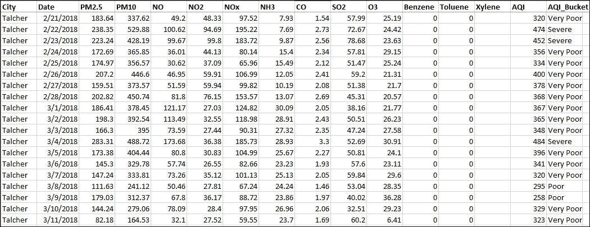

空气质量数据集

该数据针对印度各邦 2015 年至 2020 年的各种污染物水平，包括空气质量指数(AQI)。AQI 被定义为一个整体方案，该方案将单个空气污染相关参数(SO2、CO 等)的加权值进行转换。)转换成一个数字或一组数字。空气质量指数有助于公众以简单的方式了解空气质量。AQI 类别或桶用于根据值将 AQI 值分为六个类别，即:好(0-50)、满意(51-100)、中等(101-200)、差(201-300)、非常差(301-400)、严重(401-500)。

# 数据透视表

**Excel 最重要也是最广泛使用的功能之一是数据透视表。**这里我使用了一个数据透视表来根据年份和城市对数据进行分组。您可以选择整个数据，并从 Excel 的“插入”菜单中插入一个数据透视表

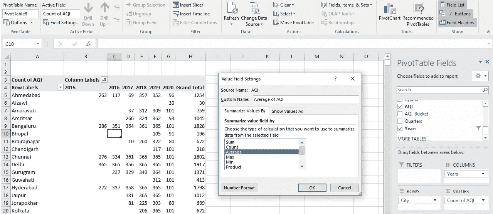

数据透视表

我按平均值汇总了值字段，因为我希望我的表显示每年的平均污染物水平。默认情况下，Excel 使用计数。您可以选择根据年、月或日过滤数据。使用数字格式选项减少小数位数或使其成为整数。数据透视表准备就绪后，您可以通过单击数据透视图选项，使用合适的数据透视表对数据进行可视化分析。这里我使用了堆积条形图来绘制数据。

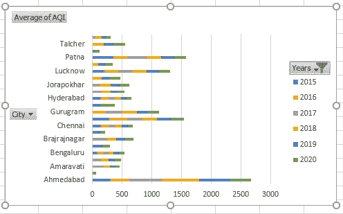

我还尝试在数据透视表中使用不同的值和过滤选项。这些图表非常适合在仪表板中使用，出于演示目的，将在下面讨论这些图表。**从图表中可以清楚地看到，由于 Covid19 锁定，印度所有邦的 AQI 在 2020 年都有所下降。**

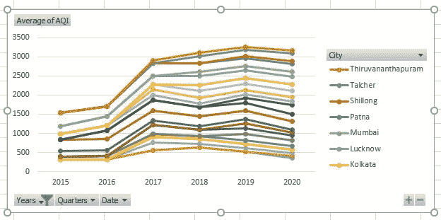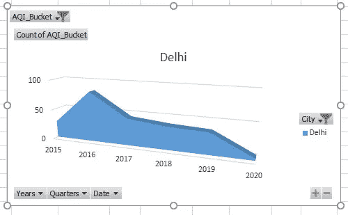

AQI 平均值和 AQI 类别计数

# 仪表盘

一旦所需的图表准备就绪，就该创建一个有吸引力的、自我解释和交互的仪表板了。在创建仪表板方面，Excel 与 Tableau 等任何其他分析工具一样出色。在一张新的纸上复制所有的图表。您可以从“页面布局”菜单中删除表单上的网格线。要使您的仪表板具有交互性并连接所有图表，您可以添加切片器。选择一个图表，并从“插入”菜单中为任何必填字段选择“切片器”。在这里，我为年份、日期、AQI 桶和城市选择了切片器。将切片器连接到所有图表，以便用户可以轻松地分析数据的各种组合。右键单击切片器并选择报告连接选项。选择所需的数据透视表以建立连接。这必须对所有切片器重复进行。**通过这种方式，您可以在 Excel 中在几分钟内创建高度交互式的仪表板。**

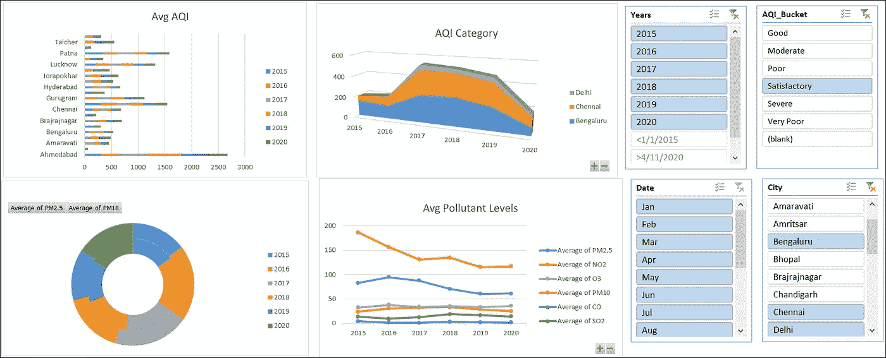

空气质量仪表板

**接下来，我将向您展示一些真正有用的 Excel 特性，它们将有助于有效地管理大型数据集。**我将使用 Kaggle 的 [Covid19 数据集](https://www.kaggle.com/krrai77/covid19-india-hospital-data)来解释这些特性。该数据探讨了印度各邦的医院数量及其应对 Covid19 的准备情况。这是数据集的快照，

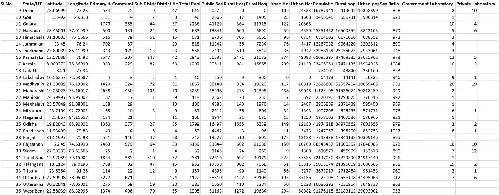

Covid19 数据集

# 纵向查找函数

**当数据集中有许多列和行时，Vlookup 是一个搜索特定数据的便捷功能。此外，该功能的另一个用途是，当许多用户处理特定数据集时，它可以用作一个简洁的查找表单。例如，在给定的数据集中，如果您想要快速找到某个特定州的公共卫生中心的数量，那么可以对该函数进行建模，以便从整个数据集中只提取所需的数据。**

您可以从 Excel 的“公式”菜单中插入 vlookup 函数。vlookup()函数的格式如下:
=VLOOKUP(要查找的内容，要查找的位置，包含要返回的值的范围内的列号，返回近似或精确匹配—表示为 1/TRUE，或 0/FALSE)。例如，对于上面给定的数据集，我有下面的 vlookup 函数，=VLOOKUP(G47，B1:I38，8，FALSE)。这是我使用 vlookup 函数对数据创建的输出。

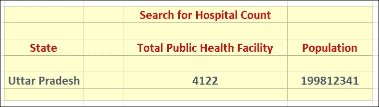

纵向查找函数

我在两个领域使用了 vlookup 函数，即公共卫生设施总量和人口。我使用的搜索字段是 State。因此，无论我想搜索哪个州的数据，我只需在 state 字段中输入，我的 vlookup 函数就会自动获取结果。这适用于任何数据集，如销售、财务等。用户可能希望在海量的行和表中搜索特定的数据。这种定制的数据搜索/查找可以在新的工作表中实现，并锁定公式的任何修改。用户可以像搜索表单一样简单地使用它，而不是搜索数据。

**与 Vlookup()类似，Excel 中还有几个其他的查找函数，分别是 Hlookup()、lookup()和 Xlookup()。关于其使用的更多信息可以从[微软](https://support.office.com/en-us/article/LOOKUP-function-446D94AF-663B-451D-8251-369D5E3864CB)门户获得。**

# 下拉列表

Excel 的另一个很酷的功能是向分类数据字段添加一个下拉列表。这在多个用户处理数据时会很方便。例如，如果多个用户正在分析同一个工作表，并且他们正在输入一些状态，那么您可以添加一个包含他们所有姓名或状态的字段，他们可以很容易地从下拉列表中进行选择。

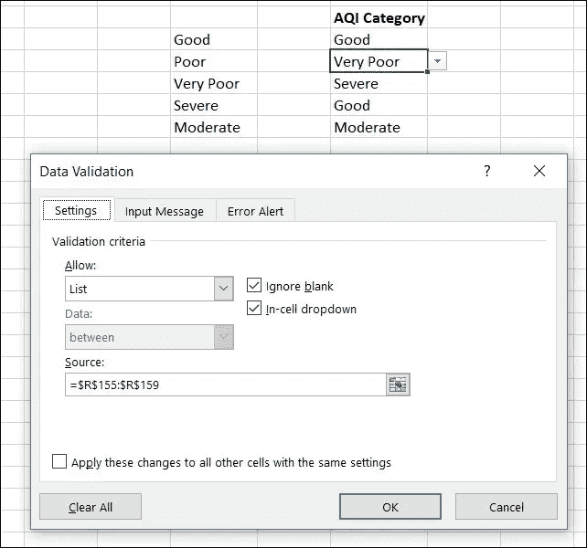

下拉列表

我在空气质量数据集中的 AQI 类别列中添加了一个下拉列表。首先，您需要在行或列中复制应该放入下拉列表的值集。接下来，选择要添加下拉列表的单元格，从数据菜单中选择数据有效性选项。在此，为“允许验证标准”选择“列表”,为“来源”选择您已输入要添加到列表中的分类值的行/列。瞧，你的列表准备好了，你可以把它复制到数据集中所有需要的单元格。用户只需从下拉列表中选择值，这反过来有助于您控制表中输入的内容。

# 重复删除和数据分割

数据清理是任何数据分析过程的关键要素。分析师的一项常见任务是消除数据中的重复值。在 Excel 中处理重复项，首先选择数据区域，然后从“数据”菜单中选择“删除重复项”选项。在这里，您可以选择数据验证要包括哪些列。单击“确定”按钮后，如果数据集中存在重复值，Excel 将显示已删除的重复值的数量。

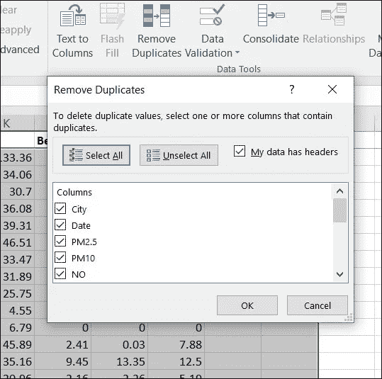

删除重复项

Excel 中另一个有助于处理由分隔符分隔的数据的有用功能是文本到列。这在处理日期和时间时非常方便。使用它，你可以很容易地根据月、日、年、小时等划分日期和时间。首先，您需要选择要拆分的数据，然后从“数据”菜单中选择“文字到列”选项。拆分为列是一个三步过程。在第一步中，您可以选择分隔符或固定宽度选项。在第二步中，您必须选择分隔符的类型。我选择了拆分日期列，因此指定/作为分隔符。在第三步中，您可以选择希望 Excel 粘贴拆分数据的位置。如下图所示，日期将被分为三列，稍后您可以将其重命名为日、月和年。因此，没有太多的麻烦，数据是根据您的要求分裂。

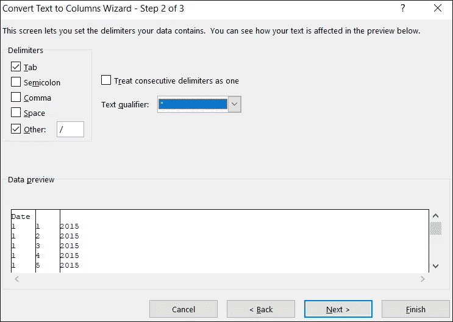

文字分列

**这些是一些最常用的 Excel 功能，对数据分析有很大帮助，在进行数据预处理和报告时节省了大量时间。**我已经使用相同的数据集通过 [Tableau](https://public.tableau.com/profile/rajeshwari.rai#!/vizhome/Covid19AirPollutionAnalysis/Dashboard1?publish=yes) 进行分析，并在 Kaggle 中编写了几个关于[空气质量分析](https://www.kaggle.com/krrai77/covid19-lock-down-impact-on-air-quality-india)和 [Covid19 影响](https://www.kaggle.com/krrai77/extensive-covid19-eda-and-visualization-for-india)的内核。