# 金融中的数据分析和可视化—使用 Python 对股票进行技术分析

> 原文：<https://towardsdatascience.com/data-analysis-visualization-in-finance-technical-analysis-of-stocks-using-python-269d535598e4?source=collection_archive---------7----------------------->

## *如何使用 Pandas、Matplotlib 和 Seaborn 等 Python 库从*日价量股市数据中获取洞察。

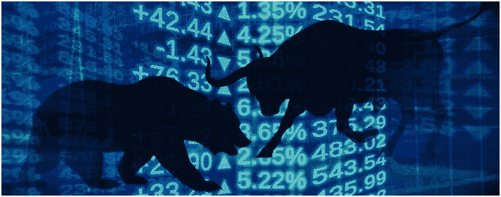

随着分析越来越多地渗透到我们生活的方方面面，金融业无疑是最早抓住这一趋势的行业之一。在本文中，我试图展示如何将数据分析和可视化技术融入金融领域。

# 1.关于数据

为了进行分析，我使用了在[国家证券交易所(NSE)](https://www1.nseindia.com/global/content/about_us/about_us.htm) 上市的以下股票从 2018 年 2 月中旬到 2020 年 2 月的两年历史数据

*   HDFC 有限公司
*   太阳制药工业有限公司
*   塔塔咨询服务有限公司
*   金达尔钢铁和电力有限公司
*   喜洋洋食品厂有限公司

我之所以选择这些股票，是因为我在最近的实习期间研究过这些股票。你可以选择自己的股票组合和时间周期来进行分析。

我选择的股票来自不同的板块和市值。随着本文的深入，您将会看到它的优势。首先，我们将单独研究 HDFC 股票，然后进行综合分析。对于这一部分，我已经从[雅虎财经](https://in.finance.yahoo.com/)下载了 HDFC 股票历史数据的 *csv* 文件。在下一节中，我们将使用一个非常棒的工具直接从网上提取股票价格。

# 2.了解数据和一般统计

导入必要的库—

```
import numpy as np 
import pandas as pd
import matplotlib.pyplot as plt
import seaborn as sns
import datetime
import warnings
warnings.filterwarnings('ignore')
```

从 *csv* 文件中读取数据并显示前几行—

```
HDFC_df = pd.read_csv(“HDFC.csv”) 
HDFC_df.head()
```

*输出:*

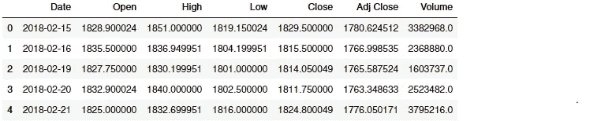

由于我们分析的时间范围很大，我们可以放宽对小数位数的考虑。

```
HDFC_df = HDFC_df.round(2)
HDFC_df.head(2)
```

*输出:*

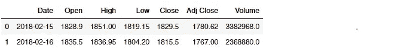

更好！现在，让我们决定数据集的形状—

```
HDFC_df.shape
```

*输出:* (491，7)

我们的 HDFC 数据集有 491 行 7 列。接下来，我们检查数据集是否有空值—

```
HDFC_df.isnull().sum()
```

*输出:*

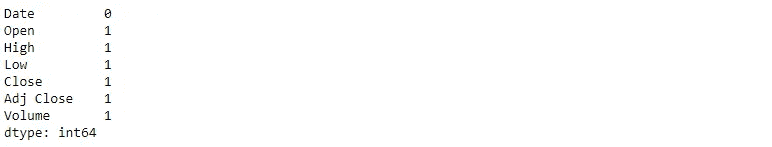

从数据集中删除空条目—

```
HDFC_df.dropna(inplace = True, axis = 0)
```

现在，让我们检查每一列的数据类型—

```
HDFC_df.dtypes
```

*输出:*

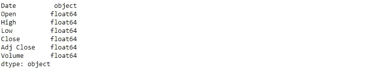

正如我们所看到的，'*日期*'列的格式不合适。Pandas 具有以更智能的方式处理时间序列数据的内置功能。但是为了利用 Pandas 的日期功能，我们需要确保' *Date'* 列的类型是' datetime64(ns)'。

```
HDFC_df['Date'] = pd.to_datetime(HDFC_df['Date'])
HDFC_df.head(2
```

为了得到我们进行分析的总持续时间——

```
HDFC_df[‘Date’].max() — HDFC_df[‘Date’].min()
```

*输出:*时间增量(' 729 天 00:00:00 ')

一年大约有 252 个交易日，平均每月 21 天，或每季度 63 天。在可能的 365 天中，有 104 天是周末(周六和周日)，证券交易所不营业。

接下来，我们将使用 Pandas 的 *describe()* 函数来获得关于 HDFC 股票在过去几个月中表现的高级概述

```
HDFC_df.iloc[-90:].describe().astype(int)
```

*输出:*

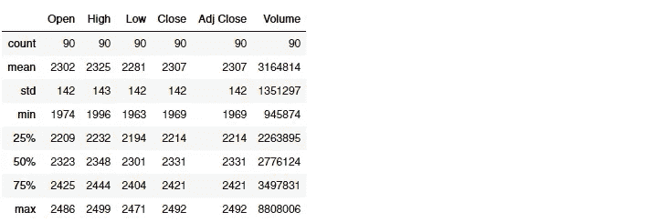

在过去的 90 天里，HDFC 股票的平均收盘价约为₹2307.大约 75%的时间里，该股在₹2421 下方交易，最高价为₹2492.单日最大交易量为 8808006 股，中位数为 2776142 股。

# 3.股票价格的总体变化

在我们继续深入研究之前，我们将把*‘Date’*列设置为 dataframe 的索引。它使绘图变得容易。

```
HDFC_df.index = HDFC_df[‘Date’]
```

现在画出股票在 2 年期间的收盘价(调整后),以了解股票在给定期间的总体表现。

```
HDFC_df[‘Adj Close’].plot(figsize = (15,8))
plt.show()
```

*输出:*

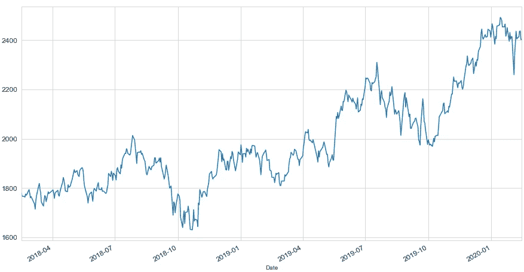

在上面的图中，如果你注意到，在 2018 年 9 月左右的某个时候，股票价格急剧下降。除了“九月效应”，HDFC 股价的普遍下跌还可以归因于中美之间不断升级的关税战，这场战争对印度金融市场产生了连锁反应。

# 4.每日百分比变化(每日回报)

股票价格的每日百分比变化是根据连续两天收盘价之间的百分比变化计算的。假设股票昨天的收盘价是₹500，今天的收盘价是₹550.所以，百分比变化是 10%。即((550–500)/500)* 100。这里没有神秘！

因此，我们将引入一个新列' *Day_Perc_Change* '，表示股票价格的每日回报。这可以使用 python 中内置的 *pct_change()* 函数来完成。

```
HDFC_df[‘Day_Perc_Change’] = HDFC_df[‘Adj Close’].pct_change()*100
HDFC_df.head()
```

*输出:*

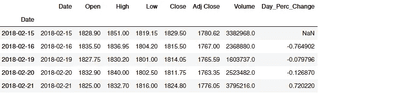

您会注意到在*‘Day _ Perc _ Change’*列中的第一个值是 NaN。我们将放弃这一行。

```
HDFC_df.dropna(axis = 0, inplace = True)
```

以图表的形式展示每日收益—

```
HDFC_df[‘Day_Perc_Change’].plot(figsize = (12, 6), fontsize = 12)
```

*输出:*

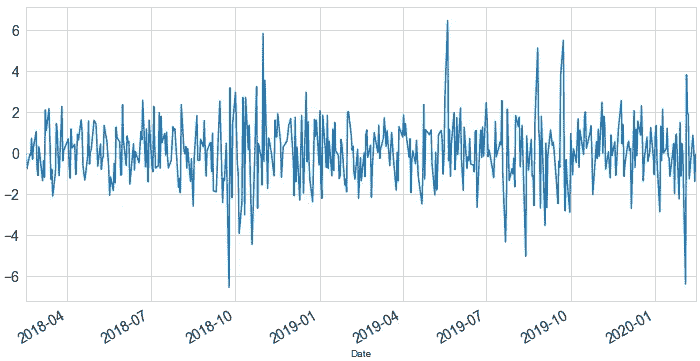

可以观察到，在大部分时间里，回报率在-2%到 2%之间，两侧都很少有超过 6%的峰值。

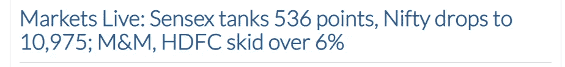

[2018 年 9 月 24 日来自 BusinessLine 的新闻文章](https://www.thehindubusinessline.com/markets/stock-markets/markets-live-sensex-opens-marginally-lower/article25025788.ece)

同样，你可以找到股票价格大幅上涨/下跌时的类似新闻文章。

绘制每日回报分布直方图—

```
HDFC_df[‘Day_Perc_Change’].hist(bins = 50, figsize = (10,5)) 
plt.xlabel(‘Daily returns’)
plt.ylabel(‘Frequency’)
plt.show()#satistics
HDFC_df.Day_Perc_Change.describe()
```

*输出:*

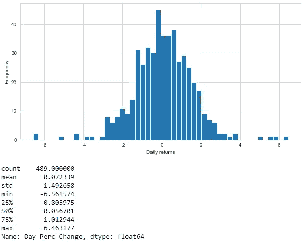

日线回报直方图以原点为中心。在过去的两年里，平均日回报率约为 0.072，大部分时间日回报率低于 1%，这意味着 HDFC 股票在此期间波动较小。在此期间，观察到正方向的最高%变化为 6.46%，负方向为 6.56%。显然，我们没有任何“牛市”或“熊市”的例子！

# 5.趋势分析

接下来，我们添加一个新列' *Trend* '，其值基于我们上面计算的每日百分比变化。趋势由以下关系决定——

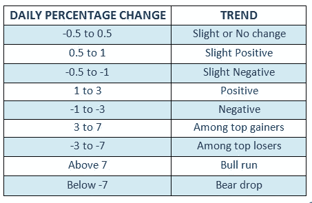

```
def trend(x):
  if x > -0.5 and x <= 0.5:
    return ‘Slight or No change’
  elif x > 0.5 and x <= 1:
    return ‘Slight Positive’
  elif x > -1 and x <= -0.5:
    return ‘Slight Negative’
  elif x > 1 and x <= 3:
    return ‘Positive’
  elif x > -3 and x <= -1:
    return ‘Negative’
  elif x > 3 and x <= 7:
    return ‘Among top gainers’
  elif x > -7 and x <= -3:
    return ‘Among top losers’
  elif x > 7:
    return ‘Bull run’
  elif x <= -7:
    return ‘Bear drop’HDFC_df[‘Trend’]= np.zeros(HDFC_df[‘Day_Perc_Change’].count())
HDFC_df[‘Trend’]= HDFC_df[‘Day_Perc_Change’].apply(lambda x:trend(x))HDFC_df.head()
```

*输出:*

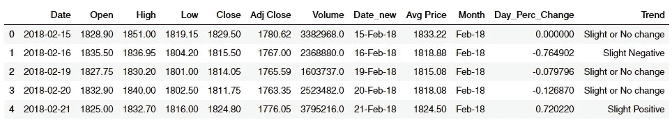

我们希望看到股票在过去两年的走势。这可以想象成一个饼图，每个扇区代表每个趋势发生的天数百分比。我们将为*‘趋势’*列绘制一个饼图，以可视化每个趋势类别的相对频率。

为此，我们将使用带有趋势列的 *groupby()* 函数，在绘制饼图之前，将具有相同趋势的所有日期聚合到一个组中。

用饼图可视化趋势频率—

```
DFC_pie_data = HDFC_df.groupby('Trend')
pie_label = sorted([i for i in HDFC_df.loc[:, 'Trend'].unique()])
plt.pie(HDFC_pie_data['Trend'].count(), labels = pie_label, 
        autopct = '%1.1f%%', radius = 2)

plt.show()
```

*输出:*

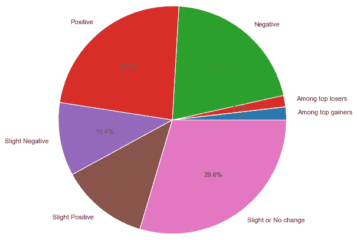

从 2018 年 2 月中旬到 2020 年 2 月，HDFC 股票在大约 1.8%的时间里涨幅居前，在 1.6 %的时间里跌幅居前。在大约 12.4%的时间里，该股在某一天表现良好。同样，在大部分时间内(约 29.6%)，股票价格变化很小。这些观察结果与我们在上一节看到的日收益率直方图一致。

# 6.每日回报和交易量

```
plt.stem(HDFC_df[‘Date’], HDFC_df[‘Day_Perc_Change’])
(HDFC_df[‘Volume’]/1000000).plot(figsize = (15, 7.5), 
                                 color = ‘green’, 
                                 alpha = 0.5)
```

*输出:*

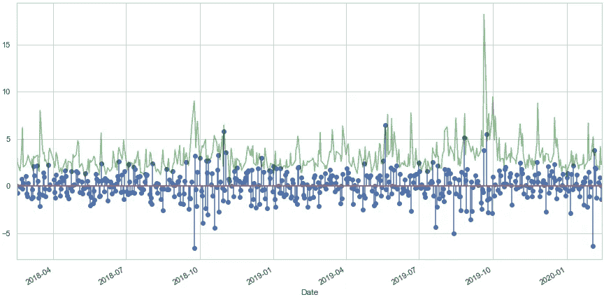

(*每日交易量的规模已缩小，以匹配每日回报规模)

通过将每日交易量(绿色)与每日回报(蓝色)并列，观察到每当股票交易量高时，股票价格就会有相对较高的上涨或下跌，从而导致高回报。因此，在某一天，如果发生非常规的高交易量，那么人们可以预期市场会发生巨大的双向变化。股票交易量与股票价格的涨跌相结合，通常是交易者和投资者对特定公司信心的指标。

# 7.基于配对图和联合图的股票相关性分析

> “永远不要把所有的鸡蛋放在一个篮子里”

每当我们寻求投资组合的多样化时，我们都不希望这些股票相互关联。数学上，任何一对股票之间的皮尔逊相关系数(也叫皮尔逊 R 值)应该接近于 0。背后的想法很简单——假设你的投资组合由高度相关的股票组成，那么如果一只股票下跌，其他股票也可能下跌，你就有可能失去所有投资！

我选择了上述股票进行相关性分析。所有这些股票都来自不同的行业和市值。你可以自由选择你感兴趣的股票。程序保持不变。

在上一节中，我们已经使用了预先下载的 *csv* 文件进行分析。在这一部分，我们将借助[熊猫网络数据阅读器](https://pandas-datareader.readthedocs.io/en/latest/)软件包提取股票价格。

```
# import package
import pandas_datareader.data as web# set start and end dates 
start = datetime.datetime(2018, 2, 15)
end = datetime.datetime(2020, 2, 14) # extract the closing price data
combined_df = web.DataReader([‘HDFC.NS’, ‘JINDALSTEL.NS’,    ‘JUBLFOOD.NS’,‘SUNPHARMA.NS’, ‘TCS.NS’, ‘^NSEI’],
‘yahoo’, start = start, end = end)[‘Adj Close’]
```

删除空值并显示前几行—

```
# drop null values
combined_df.dropna(inplace = True, axis = 0)# display first few rows
combined_df.head()
```

*输出:*

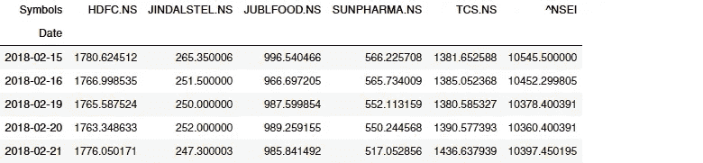

*(^ NSEI 是国家证券交易所指数——nifty 50 的符号)*

接下来，我们将使用 Seaborn [pairplot](https://seaborn.pydata.org/generated/seaborn.pairplot.html) 以成对方式分析不同股票之间的相关性。

```
# store daily returns of all above stocks in a new dataframe 
pct_chg_df = combined_df.pct_change()*100
pct_chg_df.dropna(inplace = True, how = ‘any’, axis = 0)# plotting pairplot  
import seaborn as sns
sns.set(style = ‘ticks’, font_scale = 1.25)
sns.pairplot(pct_chg_df)
```

*输出:*

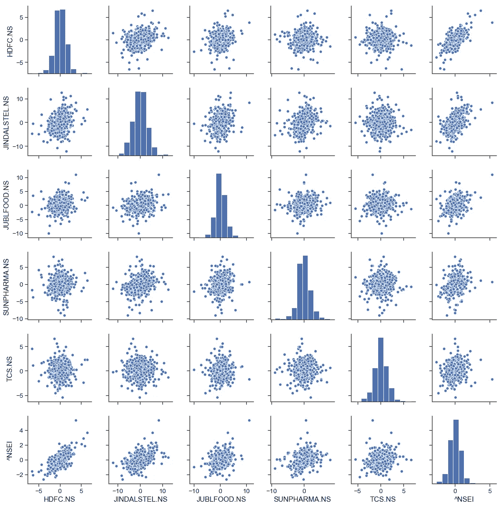

*请注意，相关性分析是针对股价的每日百分比变化(每日回报)而非股价进行的。*

如果仔细观察，下三角形区域中的图与上三角形区域中的图是相同的，只是轴互换了。因此，分析这两组图就足够了。对角线代表直方图，就像上面看到的 HDFC 股票一样。

**外卖:**

HDFC、金达莱钢铁、喜洋洋食品、太阳医药和 TCS 的股票可以包含在一个投资组合中，因为没有两只股票显示任何显著的相关性。

**缺点:**

虽然配对图提供了一堆股票之间所有可能组合的非常好的可视化，但它没有提供任何详细的信息，如皮尔逊的 R 值或零假设 p 值来量化相关性。这就是联合阴谋的由来！

虽然 Pair plot 提供了对所有可能相关性的直观了解，但 Seaborn [jointplot](https://seaborn.pydata.org/generated/seaborn.jointplot.html) 提供了每对股票的详细信息，如皮尔逊 R 值(皮尔逊相关系数)。皮尔逊的 R 值范围从-1 到 1。负值表示变量之间的负线性关系，而正值表示正关系。皮尔逊的 R 值越接近 1(或-1)表示强相关，而值越接近 0 表示弱相关。

除了 Pearson 的 R 值之外，联合图还在边缘显示了各自的直方图以及零假设 p 值。

这是一个太阳医药和金达尔钢铁以及金达尔钢铁和 HDFC 股票的联合图表的例子

```
from scipy.stats import statssns.jointplot(‘SUNPHARMA.NS’, ‘JINDALSTEL.NS’, pct_chg_df, kind = ‘scatter’).annotate(stats.pearsonr)sns.jointplot(‘JINDALSTEL.NS’, ‘HDFC.NS’, pct_chg_df, kind = ‘scatter’).annotate(stats.pearsonr)plt.show()
```

*输出:*

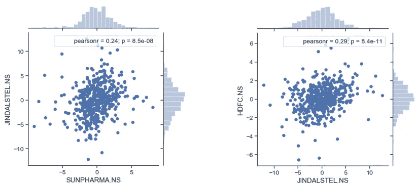

**外卖:**

*   金达尔钢铁公司诉太阳制药公司的皮尔逊 R 值为 0.24，非常小。这表明弱相关性。
*   同样，在 HDFC 诉金达尔钢铁公司一案中，皮尔逊的 R 值为 0.29，表明 HDFC 和金达尔钢铁公司股票之间的相关性较弱。

上述来自联合图的结果为我们提供了数字，以确定我们先前通过目视观察联合图得出的见解。

当心！相关性并不是决定投资组合中包含哪些股票和删除哪些股票的唯一参数。还有其他几个因素在起作用。最好征求专家的意见，做出明智的决定。

# 9.波动性分析

波动性是金融市场最重要的支柱之一。如果一只股票的价值在短时间内发生剧烈变化，那么这只股票就具有高波动性。另一方面，较低的波动性意味着股票价值在一段时间内趋于相对稳定。这些运动是由几个因素造成的，包括需求和供给、情绪、公司行为、贪婪和恐惧等。从数学上来说，波动性是用一种叫做“标准差”的统计方法来衡量的，这种方法衡量的是资产与其平均值的偏离程度。

我们已经计算了 HDFC 股票和其他几只股票的日内回报。接下来，我们将计算每日回报的 7 天滚动平均值(也称为移动平均值)，然后计算标准偏差(即方差的平方根)并绘制数值。放轻松，我们不用手动计算这一切；熊猫的‘rolling()’函数和‘STD()’函数只用一行代码就完成了我们的工作！

```
HDFC_vol = pct_chg_df[‘HDFC.NS’].rolling(7).std()*np.sqrt(7)
HDFC_vol.plot(figsize = (15, 7))
```

*输出:*

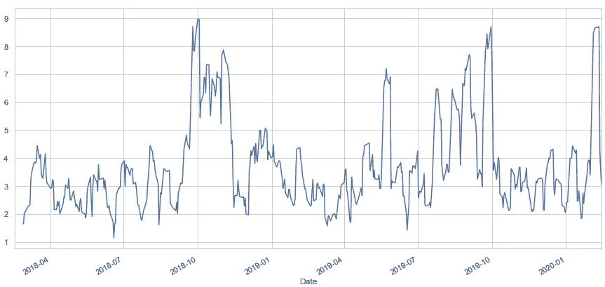

接下来我们将看到 HDFC 股票与太阳医药股票和 NIFTY50 指数的比较波动性分析。就像上面一样，我们用一行代码计算 7 天滚动平均值和标准差。熊猫确实使我们的生活变得容易！

```
volatility = pct_chg_df[['HDFC.NS', 'SUNPHARMA.NS', '^NSEI']].rolling(7).std()*np.sqrt(7)volatility.plot(figsize = (15, 7))
```

*输出:*

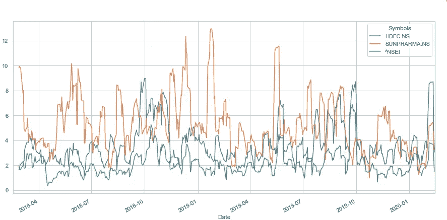

你可以观察到太阳医药的股票比 HDFC 的股票波动性高，而 Nifty 指数的波动性最小。这是意料之中的，因为阳光医药是一只中型股，与 HDFC 等大盘股相比，中型股通常具有更高的波动性。

许多交易者和投资者寻求更高波动性的投资，以获得更高的利润。如果一只股票不动，不仅波动性低，而且收益潜力低。另一方面，波动性非常高的股票或其他证券可能有巨大的利润潜力，但风险也同样高。

## 尾注

没有完全可靠的策略可以保证你的投资获利。在现实世界中，交易者在投资前会考虑很多因素。通过使用正确的策略和技术，我们只能增加我们的机会。我期待着在我的后续文章中介绍一些策略技术以及使用 python 的演示。

**参考文献:**

1.  *获取数据—* [*雅虎财经*](https://in.finance.yahoo.com/)
2.  *对于金融技术细节—* [*投资媒介*](https://www.investopedia.com/)

*————————* ***免责声明*** *—本文纯属教育目的，不为任何公司或股票背书。在做任何买卖股票的决定之前，请咨询专家。
————*