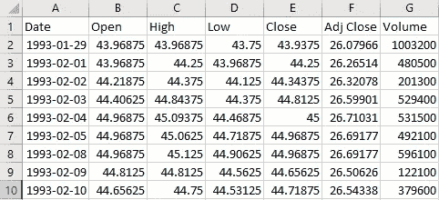
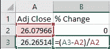
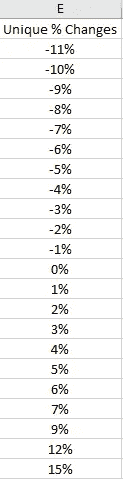
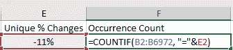
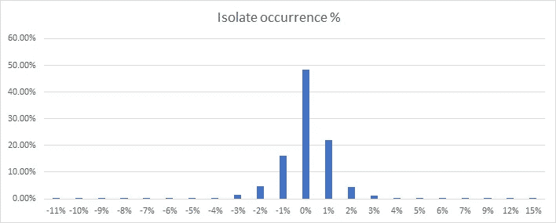
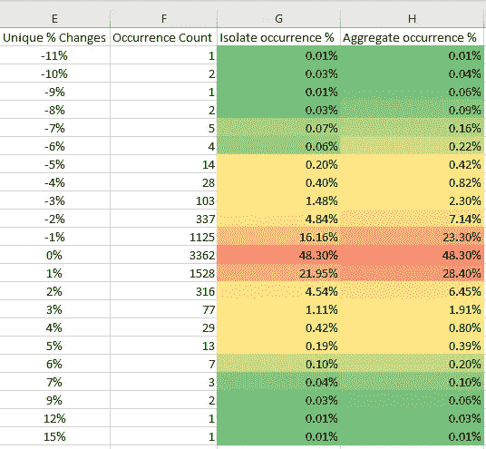

# 无需编程的数据分析

> 原文：<https://towardsdatascience.com/data-analysis-without-programming-e2564ce7d3ae?source=collection_archive---------39----------------------->

## 如何使用 Excel 分析资产的价格变化

数据分析不一定是硬科学。从业者经常谈论如何看待数据，好像它是精通业务的从业者专有的某种秘密。今天我将向您展示如何使用 Microsoft Excel 来分析价格变化情况。当然，我们可以使用 Python 或其他高级语言，用几行代码来完成。然而，在这里您将了解这些行背后的内容——以及您在那里导入和使用的库。

杰森·斯特鲁尔在 [Unsplash](https://unsplash.com?utm_source=medium&utm_medium=referral) 上的照片

你可以阅读这篇文章，也可以把它作为一个教程。不管怎样，我希望它能直观有趣。我将模拟 S&P500 综合指数的价格变化。也就是说，我将向你们展示这些年来间谍百分比变化的分布情况。

# 用 Excel 分析间谍

首先，我会从雅虎财经下载关于间谍的历史数据。为了准确再现这个实验，你需要使用从 1993 年 1 月 28 日到 2020 年 10 月 3 日的数据，你可以在这里下载数据[。如果您使用其他来源或其他时期的数据，您可能会获得稍微不同的结果。](https://query1.finance.yahoo.com/v7/finance/download/SPY?period1=728265600&period2=1601769600&interval=1d&events=history)

Excel 中的间谍数据截图

打开后。csv 文件，您的数据应该看起来像左边的图像。我们将只使用该数据中的一个字段:Adj Close。通过单击标题并单击删除，可以随意删除列 A、B、C、D、E 和 G。

下一步是计算价格变化百分比(R)。这样做的公式是 R =(闭-开)/开。

百分比价格变化的 Excel 实现

我已经在左边的图片中包含了 excel 公式。简单地说，我们正在计算从昨天到今天价格变化了多少。

复制整个 B 列的公式，计算我们收集的 6971 天数据的值。接下来，我们将识别包含在我们刚刚计算的变更集合中的唯一值。我们将整个 B 列复制并粘贴到 E 列，我们将使用“数据”菜单下的“删除重复项”工具。

间谍多年来独特的价值观变化。

关于间谍价格的变化，我们已经有了一些有趣的见解。我们知道它在一天内的最大变化是+15%。我们还发现最大贬值幅度为-11%。这些见解带来了一个有趣的问题:“这些变化每隔多久发生一次？”。如果回答了这个问题，我们可以更深入地了解间谍每天的变化模式。

幸运的是，Excel 为我们提供了计算这些值出现次数的公式。=COUNTIF(RANGE，CONDITION)公式计算该范围内满足条件的次数。

计算值-11%发生了多少次

我在左图中演示了 COUNTIF 公式的用法。在那里，我统计了-11%的发生率。

如果我们将该公式应用于所有值，我们将获得刚刚收集的数据中每个值的计数。我们可以计算出每个事件的百分频率。有了这些数据，我们可以制作一个直方图。

价格变化发生概率

现在我们有了更多的见解:

*   有将近 50%的概率价格完全不变。
*   价格上涨 1%的概率高于价格下跌 1%的概率

这个分析有出错的空间:价格上涨 1%的概率是一个 ***孤立的*** 概率。这意味着我们刚刚计算了价格增加***1%***的变化。更多时候，我们感兴趣的是知道价格会**上涨至少 1%** 。同样，我们有兴趣知道价格何时会 ***下降至少 1%*** 。

为了计算这些合计值，我们可以简单地将相关事件的概率相加。例如，为了计算价格下降至少 10%的概率，我们可以将价格下降 11%的概率和价格下降 10%的概率相加。如果我们用这些计算来填充图表，我们将得到以下结果。

演示孤立概率和聚集概率的电子表格。

我们看到，价格以任何百分比下降的实际概率是 23.3%，而价格以任何百分比上升的概率是 28.4%。我们通过分别将小于零的变化概率和大于零的变化概率相加来获得这些值。为了改进我们的数据可视化，我们还应用了条件格式菜单中的色标。

# 这个分析可以用来做什么？

像这样简单的分析会非常有用。例如，一些交易者使用潜在的发生概率来运行蒙特卡罗模拟。其他人提供期权，可以奖励他们一个低赔钱概率的溢价。在其他领域，我们可以找到事件发生的潜在概率分布，比如公共汽车通常会晚点多长时间。

如果你喜欢这篇文章，不要忘记关注我，这样当我发布新内容时你会得到通知！你也可以在 [Twitter](https://twitter.com/vnasilva) 或 [LinkedIn](https://www.linkedin.com/in/nascimentovictor/) 上关注我。直到下一个帖子！

*你能想到上述分析的任何应用吗？你将如何进一步探索它？把它留在下面的回复中吧！*