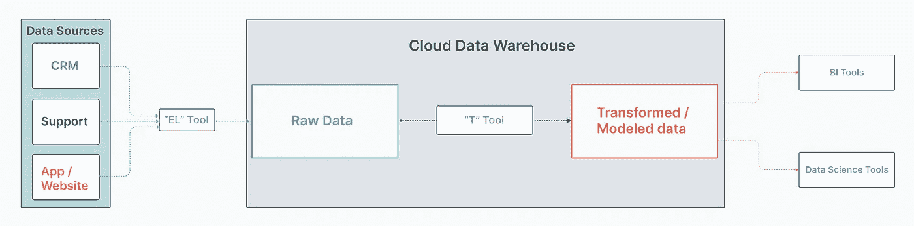
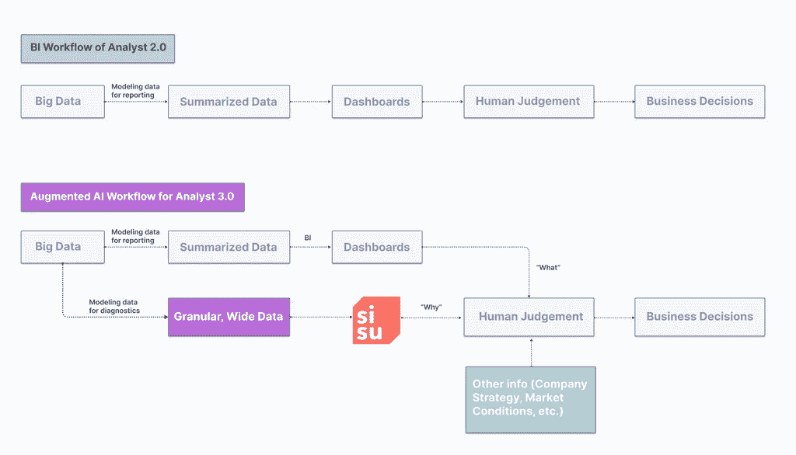

# Data Analyst 3.0:数据工作流的下一次变革

> 原文：<https://towardsdatascience.com/data-analyst-3-0-the-next-evolution-of-data-workflows-3f5939dd9b0a?source=collection_archive---------36----------------------->

## 随着云原生数据仓库和增强分析的进步，我们正在进入 BI 的第三阶段

像任何好的故事弧一样，自数据分析起源以来，我们已经走过了漫长的道路。BI 的第一阶段始于僵化的 IT 系统。第二阶段随之而来的是一波更加灵活、面向业务的工具，支持更加面向业务的数据分析师思维模式，以及一波漂亮、易于过滤但通常是静态的仪表盘。

如今，随着云原生数据仓库的兴起和可扩展推理方法的进步，我们正处于第三阶段的风口浪尖，这一阶段不仅能提供更好、更快的数据处理，还能让运营数据分析师以前所未有的方式影响业务决策。我把这个阶段称为数据分析师 3.0。

# 数据分析简史

在我们了解 Data Analyst 3.0 带来的因素之前，让我们先来看看我们已经取得了多大的进步。过去，It 团队中的一个人就可以获得成为“数据专家”所需的所有相关领域和技术技能数据不大也不广，这意味着人们可以获得新的数据技能(Excel、轻量级 SQL、SAS 等。)随着问题的出现，发送一个 CSV 来回答问题的过程运行得很好。

但是，从组织的角度来看，大多数数据请求在 IT 和业务之间的传递中失败了，因为技术人员不知道如何使他们的数据基础结构可供日常 Excel 用户使用。IT 团队提供的查询只能回答关于特定 KPI 的一个问题。这有两个主要问题:

*   一个问题，一个答案。这些问题只有一个答案，避免了大多数业务用户在采取行动前所依赖的那种反复提问。在 1.0 IT 模型中，这意味着每一个新问题都需要排队等待，直到人们完全停止提问。
*   **数据和决策之间的鸿沟。**拥有商业知识的人无法参与数据探索过程，而这正是所有发现发生的地方。因此，你得到的只是汇总的 KPI，而不是“啊哈”时刻。

幸运的是，随着更多以业务为中心的数据建模、BI 和可视化工具的兴起，这个系统在过去十年中已经基本消失了。这些现代工具定义了第二波 BI，并帮助 Data Analyst 2.0 成为团队中更加敏捷的成员。

在这些最终用户工具之下，第二波浪潮得到了多个平台的支持，这些平台使从我们存储的大量数据中获取价值变得更加容易。总的来说，这些工具构成了一个现代分析堆栈。

# 商业智能第二次浪潮的典型分析堆栈

这种分析堆栈的确切演变是一个有趣的话题，但我将把它留到另一篇文章中。

为了有效地导航和维护这个堆栈，企业需要的不仅仅是 IT 团队，因此出现了一些常见的角色:

*   **数据工程师**负责准备数据。这意味着将不同来源的数据加载到一个数据仓库中，然后将原始数据转换成转换后的表格，以便分析师和数据科学家进行分析。
*   **数据分析师**负责回答预期(报告)和意外(诊断)的业务问题。
*   **数据科学家**，他们使用统计算法和 ML 技术来解决重点业务问题(“假设”)。

你可以思考这些角色的区别的一种方式是，他们是在收集数据之前*行动还是在收集数据之后*行动。数据工程师负责数据收集(和转换)前的运营，分析师和数据科学家负责数据收集后的运营。

你可以思考这些角色的区别的一种方式是，他们是在收集数据之前*行动还是在收集数据之后*行动。数据工程师负责数据收集(和转换)前的运营，分析师和数据科学家负责数据收集后的运营。

# 数据分析师是怎么成为二等公民的？

就像谷歌的 Cassie Korzykov 在她的一篇颇有见地的文章中提到的那样，如果你的主要技能最接近数据分析师的技能，那么你很可能会觉得自己的“技术”专长被数据科学同行甩在了后面。就连就业市场也认为数据科学家的角色比你高一级。只有少数人意识到这两种角色完全不同。

数据科学家为特定问题提供高强度的解决方案。如果他们处理的问题不值得解决，企业最终会浪费他们的时间。他们是思想狭隘的工人，所以有必要指出他们需要努力解决的问题。为了确保你很好地利用他们的时间，你需要确定你已经有了正确的问题，或者需要一个广泛而浅显的方法来找到一个。

[这就是数据分析师可以帮助企业的地方](https://sisudata.com/blog/why-everyone-needs-a-dedicated-analyst-team)。数据分析师的主要目标是快速浏览大量数据集，与业务利益相关方保持联系，并挖掘潜在的洞察力。速度是他们的最高美德。结果是:该公司抓住了自己的脉搏，看到了以前未知的未知。这激发了决策者为数据科学家选择最有价值的任务的灵感。

# 今天的数据分析师工具包:用勺子挖大峡谷

不幸的是，如今许多数据分析师陷入了两难境地。他们坐拥丰富、广泛的数据宝库，但他们经常在总结数据以报告关键指标和深入、全面的指标诊断任务的双重角色之间左右为难。

这些第二波 BI 工具装备精良，可以创建丰富的滚动仪表板来回答“发生了什么”然而，根据我们的经验，在企业需要分析师增加最大价值的精确时刻，这些仪表板往往会出现问题(比如周一早上的会议，销售副总裁问，“为什么上个月 EMEA 的销售额下降了 50%？”).

通常，这是因为这些视图建立在简化的、聚合的数据视图上，这给数据探索和诊断带来了困难。[如果只对聚集进行操作，就无法详细探究](https://sisudata.com/blog/designing-datasets-four-principles-to-advance-data-diagnosis?utm_source=towardsdatascience&utm_medium=medium&utm_campaign=analyst-3-0)。创建集合的一部分是预先假定人们会问什么问题——就好像他们是被铸在石头里的一样。因此，数据分析师预先承诺他们希望在仪表板的有限空间中显示的内容。

当然，分析师可以在仪表板上添加“过滤器”或启用“向下钻取”,但随着列和每列中的唯一值的增长，他们可以分割数据的方式也在激增(50 家商店* 100 个 SKUs * 5 个优惠券代码* 20 个城市…你懂的)。这就是为什么自助式分析的梦想被一千个过滤器变成了死亡。

当出现特殊问题时，数据分析师通常会从头开始诊断。这是一个手动过程，涉及 SQL 获取粒度数据，添加相关维度，最后使用 Python/R 挖掘洞察力。这个过程是被动的，每次都需要从头开始，并且阻碍了决策速度。结果:企业最终陷入了与第一波 BI 浪潮相似的境地——企业利益相关者排队买票，这次是为了得到他们“为什么”问题的答案。

# Data Analyst 3.0 —自动找到“为什么”

数据分析师需要的是更快、更简单、更全面的方法来构建、监控和诊断精细的高维数据集，这是一种可以快速回答“为什么数据看起来是这样的？”的新范式以及“与上周相比有什么变化？”这种新的范式可以依托两项最新的技术进步:

**1。** **云原生存储和计算**:今天，在云仓库中存储数据不仅比以往任何时候都更便宜，而且从大型平面非规范化表中查询数据的速度比星型模式快 25%-50% *，这要归功于大规模并行处理的进步。基于这一新的现实，分析师需要重新思考他们如何为数据诊断和数据报告建模。

为了快速的数据诊断，[每个模型化的表应该绑定到一个值单元](https://sisudata.com/resource/designing-datasets-guide?utm_source=towardsdatascience&utm_medium=medium&utm_campaign=analyst-3-0)。例如，如果企业关心“平均交易值”和“订阅转化率”，那么您会希望分别在交易和用户粒度上创建模型化的表。另一件要记住的事情是数据的多样性。你应该在这些粒度表中包含每一个可能的维度，而不是挑选维度，这会导致人为偏见，并删除数据中可能的丰富信号。作为一名数据分析师，您并不知道您将被要求调查的所有后续问题，并且您希望能够追踪线索到任何地方。即使汇总导出可以回答您今天的顶级问题，相同的导出也不太可能回答您的后续问题。

**2。主动分析方面的进步**:分析师现在可以依靠【Sisu 等工具中可扩展推理方法的最新算法发展来探索数十亿个组合并确定最具影响力的事实，而不是手动使用仪表板过滤器和钻取来挖掘大表格中的见解。然后，由数据分析师根据他们能够获得的其他信息(如公司战略、业务背景和市场条件)来选择最佳答案。

在上面讨论的功能丰富的大表之上添加这种主动、自动的推理，使数据分析师能够:

*   快速回答因您的综合 BI 数据而产生的特别问题，并以同样的努力多回答 10 倍的问题。
*   让机器监控的智能警报处于自动驾驶状态，让他们高枕无忧，因为他们掌握着业务的脉搏，永远不会错过潜在的有用信息。

重要的是要记住，这个诊断数据层的目标不是取代 BI 工具，而是增强它。诊断数据层是智能“检查引擎”灯，以补充您的“速度表和煤气表”BI 仪表板。

# 一窥数据分析师的未来

这些进步从根本上改变了数据分析师在公司内部的工作方式。他们参加每周的业务会议，介绍所发生的事情(“照常营业”)*和*，分享业务的前瞻性解决方案。这个新发现的权威的中心是一个人工智能驱动的工作流程。

我们，Sisu 的[，正在利用这些在数据仓库、数据建模和人工智能方面的进步，并为像](https://sisudata.com/?utm_source=towardsdatascience&utm_medium=medium&utm_campaign=analyst-2-0)[三星](https://sisudata.com/customers/samsung/?utm_source=towardsdatascience&utm_medium=medium&utm_campaign=analyst-2-0)、 [Upwork](https://sisudata.com/customers/upwork?utm_source=towardsdatascience&utm_medium=&utm_campaign=analyst-2-0) 和 [Housecall Pro](https://sisudata.com/customers/housecall-pro?utm_source=towardsdatascience&utm_medium=social&utm_campaign=analyst-3-0) 这样的公司的分析师工作流程增压。这种转变一开始可能会有点吓人，但问问那些正在取得成功的公司，它们的情况如何。他们会告诉你他们感觉很好。

如果你想分享你对这篇文章的想法，或者想了解更多，请直接给我写信，地址是 sid@sisudata.com。

***[*five tran*](https://fivetran.com/blog/obt-star-schema)*，2020。已检索，2020 年 6 月 30 日*

*本帖原载于* [*Sisu 数据博客*](https://lnkd.in/gTcbsAS) *。*