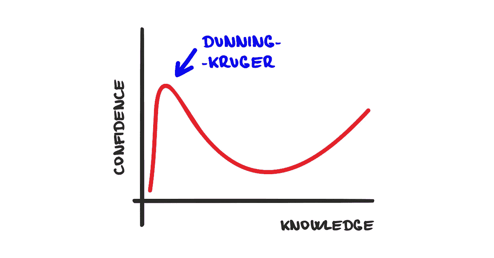
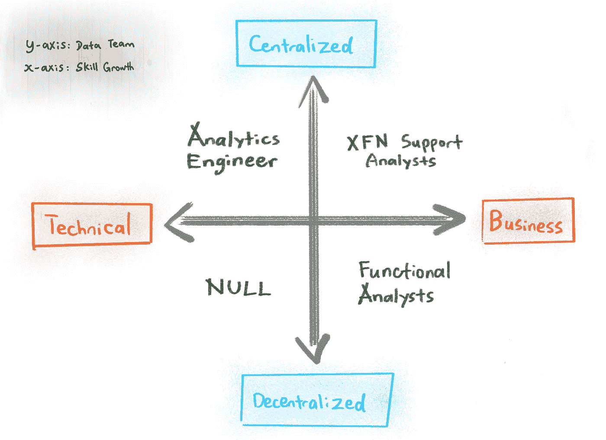
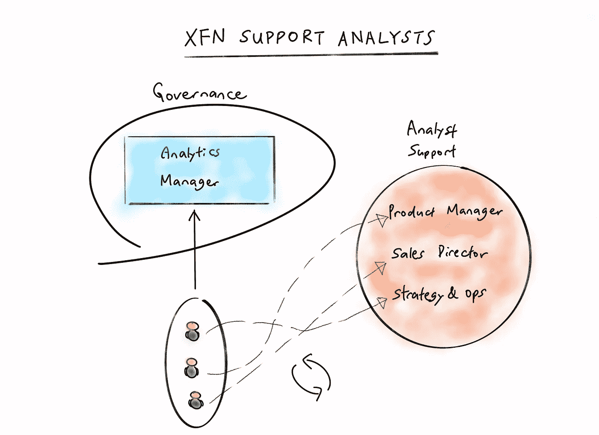
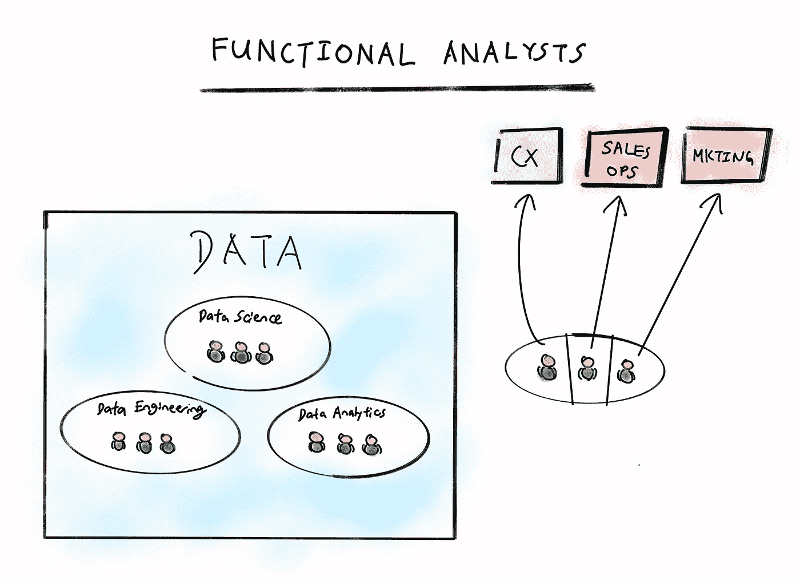

# 数据分析师墓地——死亡和绝望之谷

> 原文：<https://towardsdatascience.com/data-analyst-graveyard-the-valley-of-death-and-despair-8eaaf520f574?source=collection_archive---------35----------------------->

## 这篇文章讲述了为什么数据分析师的工作会失去意义。

数据分析师的坟墓。来自 [Unsplash](https://unsplash.com?utm_source=medium&utm_medium=referral) 的[肯尼·奥尔](https://unsplash.com/@greyharpoon?utm_source=medium&utm_medium=referral)的照片。

在我最近的帖子 [*数据分析师入门*](https://medium.com/swlh/data-analyst-primer-the-essential-guide-26bd7e9c2297) 中，我详细阐述了对数据分析师的需求是如何增长的，并强调了你可以采取的步骤，以获得第一份入门级工作。

今天这篇文章的目的是提供一个不同的视角，一个悲观的观点来讨论为什么数据分析师的工作会感觉没有意义。

通常，对理想工作的期望会欺骗我们。分析师不得不承担大量令人不快的责任，将看似理想的职业与实际情况区分开来。

# 数据分析师的邓宁-克鲁格效应

> 缺乏技能和意识:难以认识到自己的无能导致自我评估膨胀。

邓宁-克鲁格效应图。图片作者[作者](https://natworkeffects.medium.com)。

正如任何让你兴奋的闪亮的新技能或激情一样，通过谷歌搜索和在网上进行广泛的研究，你很容易对一个话题感到自信。新的分析师遇到了这个问题，他们对自己能够在组织中贡献的价值有着极高的期望。

这只是邓宁-克鲁格效应的另一个例子；**缺乏工作经验导致对自己产生影响的能力过于自信。**

## 绝望之谷

在埋头苦干并获得工作经验后，他们是否开始明白并不全是彩虹和阳光。无数的障碍出现了；没完没了的数据请求，缺乏分析的严谨性，非技术型的管理者，应有尽有。

新分析师由于粉碎的期望而陷入绝望的低谷，无法爬上开悟的斜坡。一种恐惧感开始袭来。然后你会怀疑这到底是不是适合你的职业。

坠入绝望的山谷。豪尔赫·依班娜在 [Unsplash](https://unsplash.com?utm_source=medium&utm_medium=referral) 上拍摄的照片。

你并不孤单。成为一名分析师可能是一份艰难且没有成就感的工作，通常是一个没有太多自主权的初级角色，你要工作 1-2 年才能找到更好的工作。

没有一份工作是没有起伏的，作为一名数据分析师也不例外。会有你喜欢的事情，也会有让你好奇的事情…为什么我会在这里？

# 组织层次结构

首先，你必须了解你在这个世界上的位置，才能理解为什么会出现这些问题。

**技术领域工作不如意的根本原因通常是职业目标错位。**加入一个不能提供你渴望的成长的错误团队，你会觉得自己的职业停滞不前，很快就会失去目标。

作为分析师，您的职责会有所不同，这取决于: ***(a)*** 数据团队是集中的还是分散的 *< y 轴>* ，以及****(b)***您的团队/经理优先考虑哪些能力 *< x 轴>。**

**

*数据分析师—四个象限。图片由[作者](https://natworkeffects.medium.com)提供。*

*这些部门并不相互排斥，因此您可能会发现自己同时承担着分析工程师和 XFN 支持分析师的职责。选择一个不适合你职业抱负和技能发展的职位，意味着你在公司的时间会更加痛苦。*

## *跨职能(XFN)支持分析师—集中的支持人员*

*集中式数据团队雇佣分析师作为集中式资源。分析师作为支持人员跨职能部门或产品团队工作。*

*到目前为止，这是希望投资数据分析的公司最常见的招聘方式。这并不奇怪，因为这是最具成本效益的选择，尤其是如果数据团队尚未证明其在发现业务洞察力方面的价值。*

*这个想法是雇佣一个或多个分析师同时接受来自多个团队的请求，如下图所示:*

**

*跨职能(XFN)支持分析师。图片来自[作者](https://natworkeffects.medium.com)。*

*集中式数据团队对他们的分析师拥有完全的控制权和治理权，但是将他们分配给组织内的其他团队。因此，这些分析师直接向分析经理报告，同时向他们支持的其他团队成员报告。*

*一些公司在团队之间轮换他们的分析师，这样工作不会变得乏味，而拥有更多分析师资源的大公司将提供较少的业务职能之间的流动性。*

*优先考虑的能力包括软技能，如 ***影响力、讲故事、沟通和数据可视化。****

*统计知识和编程之类的技术技能很重要，因为它们有助于实现特定的业务目标，例如，找到杠杆来增加 xx%的收入。*

***出色的 XFN 支持分析师:***

*拥有商业和技术技能，但不确定自己的职业发展方向？这是最适合你去发现的角色。XFN 支持分析师满足了他们为不同团队分析数据的好奇心。*

*为商业领袖处理数据，吸收他们在某个特定领域的知识，是你找到自己想要专攻的业务领域的敲门砖。*

*另一方面，你可能会在探索之后决定更喜欢发展你的技术技能。因为您直接向分析经理汇报，所以有机会获得发展技术技能的机会，并成为高级数据分析师，指导其他初级员工。*

*就灵活性而言，这个角色是你职业生涯的最佳选择。它允许自由探索，而不会过早地将自己束缚在某个职业轨道上。*

***导致 XFN 支持分析师失去目标感的场景:***

1.  ***领域知识薄弱。分析师对问题的直觉有助于人们在杂乱的数据海洋中找到信号。然而，你的直觉可能不如职能领导发达，任何建议或见解都会被质疑和拒绝。分析师最终会回答业务用户提出的问题。分析师最终成为一只报告猴子 ***(见第 2 点)*** 。***
2.  ***举报猴。**报告猴子响应数据请求，编写查询，为技术含量较低的业务用户构建仪表板。他们对 KPI 和部分业务的运行方式没有任何所有权，只是根据需要更改 SQL 或编程逻辑来回答另一个部门抛给他们的问题。*
3.  ***缺乏分析的严谨性。**企业优先考虑快速行动和采取行动。因此，您将不可避免地简化统计概念，以便业务用户理解和接受您的分析。越复杂的分析，即使是完全合理和科学准确的，也很可能作为存档的建议被抛弃，这对于一些人来说是难以接受的。*
4.  ***非技术利益相关者。**当业务领导要求刷新仪表板时，或者由于业务逻辑的变化导致数字不正确时，分析师必须全力以赴，手动强制自动刷新，并充当 IT 支持，完全由业务领导随心所欲。例外的是产品经理，他们通常更擅长技术，了解批处理和实时数据管道的局限性。*
5.  ***技术技能停滞。** XFN 支持希望在技术领导力方面有所发展的分析师关心如何利用技术高效地做事。示例包括编写高性能 SQL、版本控制以及使用各种工具和数据库。作为一名年轻的分析师，如果你的分析经理不重视你的技能发展，你可能会也可能不会有这样的机会。*

## *职能分析师——在业务领导的直接领导下工作*

*不属于集中数据团队的数据分析师直接向职能部门主管报告。职能部门主管或产品经理可以自由聘用他们自己的分析师，并对他们的发展承担全部责任，如下图所示:*

**

*功能分析师组织图。图片来自[作者。](https://natworkeffects.medium.com)*

*如果你发现自己想要发展技能，并且经常使用新工具和新技术，**离开。立刻。**担任这种角色的分析师如果希望提高自己的技术技能，将会经历 XFN 支持分析师的所有痛苦，甚至更多。*

*这些角色并不强调技术专长，相反，他们的座右铭是快速行动，找到为企业创造最大成功的见解。*

*像这样的角色优先考虑的能力是类似于 XFN 支持分析师的软技能，但是技术知识可以退居二线。*

*因此，招聘的技术技能门槛低于 XFN 支持分析师。职能分析师应该是雇用他们的各自业务职能或产品团队的主题专家。*

***擅长职能分析师的分析师:***

*功能分析师是他们领域的专家。他们来自各种各样的背景，并在他们选择的领域磨练了他们的直觉，知道在杂乱的数据海洋中去哪里寻找洞察力。*

*如果你擅长说服和简化复杂问题的艺术，使用普通的结构化框架 ***(80/20 原则、四象限、公式、维恩图)*** ，你会觉得在这个角色中如鱼得水。*

*功能分析师更像艺术家，而不是科学家。他们擅长预测各自的经理会对哪些数据感兴趣，并采取行动。他们很有说服力，让复杂的概念对日常的商业领袖来说很容易理解。*

*他们还拥有一套特定于其领域的技能，这使他们能够更有效地跟上速度和推动业务影响。例如，营销分析师应该对谷歌分析平台 SEM 有专门的了解，并了解营销团队跟踪的常见 KPI。*

***导致职能分析师失去目标感的场景:***

*为了不重复我自己的话，我假设如果你得到了这个职位，你希望磨练自己思考商业的技能，并拥有敏锐的商业思维。*

*还是那句话，如果你有增长技能的雄心，那就马上离开。*

1.  ***集中职能分析师**。为了节省成本，组织可以选择为一个业务职能 ***(如运营)*** 雇用分析师，并像上一节中描述的集中式数据团队一样运营。然后，功能分析师同时承担支持其他业务功能的责任。在这些场景中，职能分析师将经历 XFN 支持分析师所经历的**第 1、3、4 点。***
2.  ***分析麻痹**。对于功能分析师来说，数据不是一种完全探索问题空间的方法，而只是一种讲述故事和检查他们直觉的方法。这未必是一件坏事。由于时间限制，检查每一列的洞察力和混杂效应是不切实际的。当分析师的直觉与经理的直觉相差甚远，以至于整个分析需要重新进行，导致多轮返工时，问题就出现了。这可能导致分析瘫痪，特别是如果分析师正在为长期战略规划做研究。*

## *分析工程师—集中的技术专家*

*当需要一个更加可控的环境来进行数据分析时，专注于技术专业知识的集中团队中的数据分析师就会加入进来。*

*分析工程师引入工具、技术和代码实践 ***(数据管道测试、表命名约定、代码评审)*** 使其他分析师更加高效，他们的输出值得信赖。然而，这些角色并不多见，只是最近才作为 Fishtown Analytics 的革命性开源工具 [**dbt**](https://blog.getdbt.com/what-is-an-analytics-engineer/) 出现。*

*优先考虑的能力包括 ***dbt、Gitlab、高级 SQL 知识、Python、Airflow、Fivetran、Stitch、ETL。****

*如果你发现自己厌倦了这样的角色，并希望与业务部门更紧密地合作，你可以成为一名分析经理，或者回到支持业务职能的分析师岗位。*

***擅长分析工程师的分析师:***

*如果你有办法让分析师的工作流程更有效率，并且关心自动化、版本控制和良好的文档等概念，你将会在这样的角色中表现出色。*

*分析工程师通常希望成长为强大的技术领导者，并喜欢使用新的创新工具和技术，而不太关注业务的底线。*

***导致分析工程师失去目标感的场景:***

1.  ***缺乏商业影响力。**分析工程师在组织中的价值在于，他们能让周围的其他分析师更好、更高效地工作。这可能导致他们远离业务，以至于他们的工作在业务 KPI 上缺乏目的和意义。*
2.  ***没有得到商业利益相关者的认可。**商业领袖通常看不到分析工程师的直接产出，因为他们不是深入分析商业问题的人。这可能会让人觉得分析工程师没有给公司增加任何价值，其他分析师得到了所有的荣誉，而分析工程师在后台默默工作。*

# *数据分析师在组织内没有任何自主权。*

**

*数据分析师缺乏自主权。照片由[诺亚·布舍尔](https://unsplash.com/@noahbuscher?utm_source=medium&utm_medium=referral)在 [Unsplash](https://unsplash.com?utm_source=medium&utm_medium=referral) 上拍摄。*

*上述所有角色都有一个共同点，那就是缺乏自主性。*

*数据分析师很少能够领导数据驱动的变革，他们只是在构建别人认为是必须的分析和仪表盘。*

> **数据分析师所能做出的最令人窒息的行为，就是完全按照更高权威的突发奇想来构建分析和报告。**

*分析师基本上是处于更高权力位置的人的直接支持人员。因此，他们对他们支持的业务功能的 KPI 没有决策权或所有权，没完没了地响应用户或管理人员的请求。*

*此外，对于你的分析是否被使用或被执行，你没有发言权。仅仅为了满足别人的好奇心而研究别人提出的问题的答案，可能是分析师所能做出的最没有灵魂的行为。*

*这就是为什么分析师通常被聘用在初级职位，只需要 1-2 年的经验。把刚从学校毕业的人塑造成你心目中的理想分析师更容易。*

# *避免导致失去目标的场景*

**

*数据分析师失去目标。[公路旅行照片，Raj](https://unsplash.com/@roadtripwithraj?utm_source=medium&utm_medium=referral) 在 [Unsplash](https://unsplash.com?utm_source=medium&utm_medium=referral) 上。*

*尽管掌握了这些知识，我们还是无法避免上述所有情况。我们能做的是**通过不担任与我们的职业发展预期不一致的角色，将噩梦场景**最小化。*

*如果你不确定该何去何从，可以在一位关心你的成功、经验丰富的分析领导者手下跨职能工作。*

*对企业的特定功能感兴趣？寻找你尊敬的商业领袖，作为一名职能分析师跟踪他们。*

*或者，如果你只是喜欢技术，那么分析工程是你的职业道路。*

*在你加入任何组织之前，做一些调查，在面试阶段问一些关键问题，让你深入了解你将共事/支持的经理和同事，以及你可以学到的技能。确保它们符合你的职业发展预期。*

*   **这个职位优先考虑哪些技能？**
*   **我将与哪些职能团队一起工作/支持哪些职能团队？**
*   **数据团队结构是什么样的？**
*   **谁是我的经理和利益相关者？**

*您会发现，在寻求实施数据战略时，公司会利用我们讨论过的各种结构。*

*在同意一家公司之前，知道你向谁汇报，你服务的利益相关者，以及你可以向谁学习。如果公司不能提供你想要的成长，你会很痛苦，噩梦似乎永远不会结束。*

# *隧道尽头的光*

*然而，并非所有的希望都破灭了。如果你坚持几年，你可以进入更高级的职位，在那里你有责任监督其他分析师，拥有数据平台的整个部分，或者如果你成为业务经理/领导者，负责特定的业务 KPI。*

*在这些角色中，你有空间支持自己的想法，并在组织中发挥杠杆作用，以你认为合适的方式将事情变得更好。*

*初级分析师在工作几年后，与现实达成妥协，学会妥协，就像邓宁-克鲁格一样，可以从绝望的山谷中崛起，站在美丽的高原上俯瞰地平线。*

**

*俯瞰地平线的高原。[帕斯卡尔·阿梅兹](https://unsplash.com/@pascale_amez?utm_source=medium&utm_medium=referral)在 [Unsplash](https://unsplash.com?utm_source=medium&utm_medium=referral) 上拍照。*