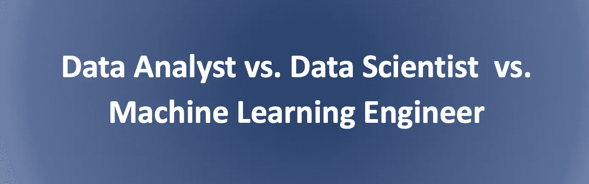
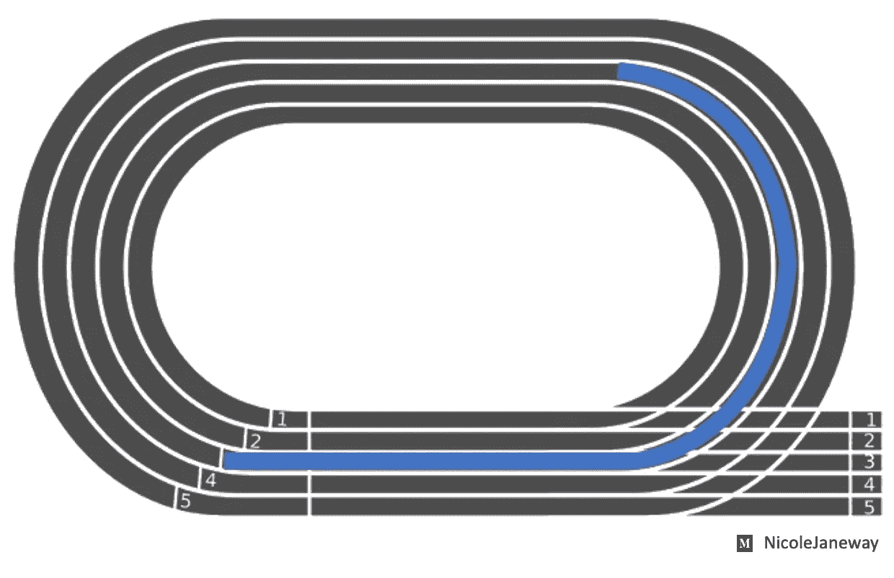
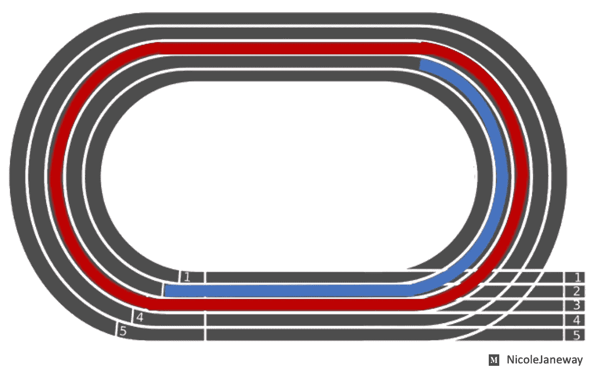
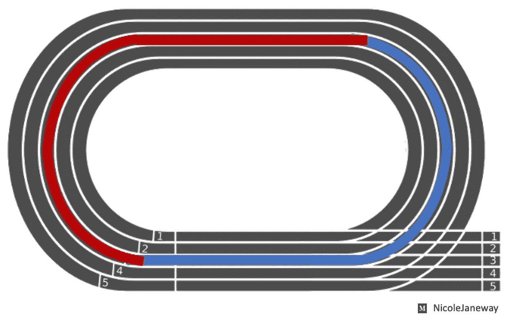

# 数据分析师、数据科学家和机器学习工程师有什么区别？

> 原文：<https://towardsdatascience.com/data-analyst-vs-data-scientist-2534fc1057c3?source=collection_archive---------19----------------------->

## 以田径运动会为例，探究这些常见职位之间的区别。

本文使用跟踪团队的比喻来区分数据分析师、数据科学家和机器学习工程师的角色。我们将从进行数据科学项目类似于跑接力赛的想法开始。希望这个类比能帮助你在教育、工作申请和项目人员安排方面做出更明智的选择。

# 🔵数据分析师

数据分析师能够从“起点”获取数据(即从存储中提取数据)，进行数据清理和处理，并创建仪表板或报告等最终产品。数据分析师还可能负责转换数据以供数据科学家使用，这是一项我们稍后将探讨的任务。

数据分析师能够跑半圈

你可能会说，数据分析师非常有能力跑完比赛的第一部分，但不会跑得更远。

# 🔴数据科学家

数据科学家拥有数据分析师的所有技能，尽管他们可能不太精通仪表板，可能在报告写作方面有点生疏。不过，就应用统计方法创建复杂数据产品的能力而言，数据科学家比数据分析师跑得更远。

数据科学家能够跑完整圈…

这位数据科学家能够跑完整圈。这意味着他们拥有查询数据、探索特性以评估预测能力、选择合适的模型进行训练和测试、进行超参数调整，以及最终获得通过分类或预测提供商业价值的统计驱动模型所需的技能。然而，如果组织让数据科学家承担所有这些职责(从数据接收到数据建模)，数据科学家将无法像只被要求跑完比赛的第二部分(专注于数据建模)那样跑得很好。

…如果数据科学家只负责跑完后半程，他会跑得更快

总的来说，如果业务分析师执行查询和数据清理步骤，允许数据科学家专注于统计建模，团队的绩效将会提高。

# 🔶机器学习工程师

机器学习工程师可以被认为是团队的秘密武器。你可能会把 MLE 理解为设计运动鞋的人，这种鞋能让其他跑步者以最高速度比赛。

机器学习工程师是一个多面手，能够开发先进的方法

机器学习工程师也可能专注于为数据科学团队带来最先进的解决方案。例如，与数据科学家的经典统计方法相比，MLE 可能更专注于深度学习技术。

机器学习工程师把它带到了一个新的高度。安德里亚·皮亚卡迪奥(Andrea Piacquadio)在[像素](https://www.pexels.com/photo/strong-sportsmen-ready-for-running-on-stadium-3764011/)上拍摄的照片。

随着统计学成为 Python 和 r 中易于实现的包的领域，这些职位之间的区别越来越模糊。不要误解我——对统计测试的基本理解在这个职业领域仍然是最重要的。然而，随着越来越多的频率，企业数据科学家被要求执行由深度学习驱动的模型。这是指由基于 GPU 的计算支持的数据科学领域，其中典型的模型包括神经网络，如 CNN、RNNs、LSTMs 和 transformers。

[谷歌大脑](https://research.google/teams/brain/)、 [OpenAI](https://openai.com/) 和 [Deep Mind](https://deepmind.com/) 等公司的机器学习研究人员设计新的算法方法，以在特定用例上实现最先进的性能，并最终实现构建人工通用智能的目标。

# 🚌ML 操作

另一个与数据科学相关的职称是 MLOps。这指的是生产模型的责任——换句话说，创建最终用户可以访问的模型版本。MLOps 专注于创建从数据摄取、预处理到模型推断(即，在现实世界中用于进行分类或预测)的强大管道。这个角色的职责与软件开发中 DevOps 从业者的职责密切相关。

MLOps 是公共汽车司机，负责把每个人送到田径运动会

# 摘要

我们探索了数据分析师、数据科学家和一些与机器学习相关的职位的职称，使用了跟踪团队的比喻。在将干净的数据传递给数据科学家进行建模之前，数据分析师可能会启动中继。机器学习工程师就像一个经验丰富的教练，专门从事深度学习。最后，MLOps 实践者就像负责带领团队参加田径运动会的公共汽车司机。

这是我在数据科学小组会议上笨拙地解释这些想法的一个短片。

关于另一个提升你的数据科学技能的视频，请查看我的关于在 Google Colab 中使用 Python 处理 GIS 数据的教程[。](/walkthrough-mapping-gis-data-in-python-92c77cd2b87a)