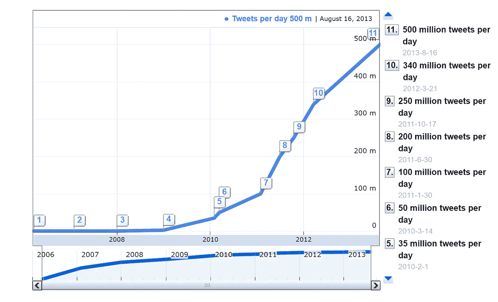
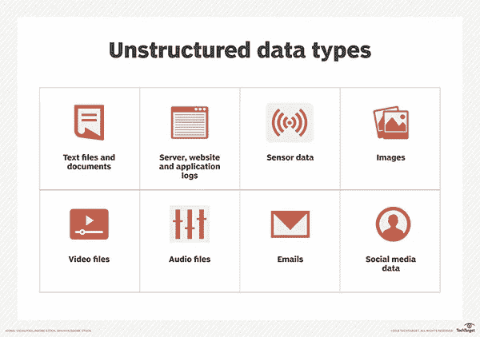

# 数据分析|大数据|案例研究:大数据的 V

> 原文：<https://towardsdatascience.com/data-analytics-big-data-case-study-vs-of-big-data-1d3dc5118759?source=collection_archive---------33----------------------->

## 我们来试着理解一下“大数据”中的大是多大！！

卢克·切瑟在 [Unsplash](https://unsplash.com?utm_source=medium&utm_medium=referral) 上的照片

# 大数据

术语“大数据”看起来是非常模糊的相对术语。所以还是用它不是什么来定义比较好。大数据不是常规数据。大数据不是常规业务数据。大数据不是一个经验丰富的数据分析师可以随时处理的事情。大数据不太适合熟悉的分析范式。大数据不适合 Excel 电子表格。大数据可能不适合你的普通电脑硬盘。

> *Doug Laney 在 2001 年的一篇关于大数据的文章中写道，描述大数据的方法之一是通过查看* ***的三个 V*******的量、速度和多样性。****

# *卷*

> **大数据是指那些太大而无法在你的电脑上运行的数据。**

*摩尔定律的一般观点，计算机科学中一个众所周知的观察结果，即计算机的物理容量和性能大约每两年翻一番。这意味着在某个时间对一个系统来说很重要的东西在另一个时间对另一个系统来说却很平常。*

**

*[https://www . mental loss . com/article/22332/was-Moores-law-accredible](https://www.mentalfloss.com/article/22332/was-moores-law-inevitable)*

*例如，在 Excel 中，单个电子表格中的最大行数随着时间的推移而增加。之前是 65000。现在超过了一百万，这看起来很多，但是如果你记录的是每秒钟发生数千次的互联网活动，那么一百万行可以很快达到。*

*另一方面，如果我们考虑照片或视频，我们需要立即将所有信息存储在内存中，这将是一个完全不同的问题。一般来说，手机拍摄照片的速度是每张照片两三兆字节，拍摄视频的速度是每分钟 18 兆字节或每小时 1 千兆字节。对于高质量的摄像机，它可以达到每分钟 18g。很快它就变成了非常大的数据。*

*现在，有些人称之为大量数据，意思是这和我们通常习惯的数据是一样的，只是多了很多。这就涉及到速度和多样性的问题。*

***速度***

> **对于速度而言，大数据是指数据以极快的速度流入。**

*在传统的科学研究中，从 200 个案例中收集数据可能需要几个月的时间，分析数据需要几周的时间，而发表研究则需要几年的时间。这种数据不仅收集起来很费时，而且一旦输入，通常也是静态的，不会改变。*

*作为一个例子，也许最熟悉的用于教授统计程序聚类分析的数据集是 Edgar Anderson 收集并由罗纳德·费雪分析的 Iris 数据，两人都在 1936 年发表了他们的论文。这个数据集包含四个测量值:三种鸢尾的花瓣和萼片的宽度和长度。它有大约 150 个案例，这个数据集每天都在使用。它是统计编程语言 R 中内置的数据集之一，近 80 年来没有改变过。*

*在天平的另一端，如果你对使用社交媒体平台的数据感兴趣，比如 Twitter，事实上，现在他们每秒钟在全球范围内处理超过 6000 条推文。这相当于每天大约 500，000，000 条推文，每年大约 200，000，000，000 条推文。事实上，一个简单的方法就是在网上设置一个实时计数器。在互联网直播统计中，它向我们展示了今天到目前为止大约有 355，000，000 条推文被发送，并且它们更新得非常快。即使一个简单的温度传感器通过串行连接连接到 Arduino 微处理器上，一次只发送一位数据，如果运行足够长的时间，最终也会淹没一台计算机。*

**

*[https://www.internetlivestats.com/twitter-statistics/](https://www.internetlivestats.com/twitter-statistics/)*

*现在，这种不断涌入的数据，更好地称为流数据，给分析带来了特殊的挑战，因为数据集本身是一个移动的目标。至少对于静态数据用户来说，流数据的要求和复杂性是非常令人望而生畏的。*

***品种***

> **Forester Research 最近的一项研究表明，多样性是引领公司采用大数据解决方案的最大因素。**

*现在我们来看大数据的第三个方面，多样性。例如，多样性在这里的意思是，它不仅仅是电子表格中格式良好的数据集的行和列。相反，我们可以有许多不同格式的数据手册。我们可以有非结构化的文本，比如书籍、博客文章以及新闻文章和推文的评论。一位研究人员估计，80%的企业数据可能是非结构化的，因此这是常见的大多数情况。这也可以包括照片、视频和音频。类似地，数据集包括像网络图数据这样的东西，这就是社会关系数据。或者如果在所谓的 NoSQL 数据库中处理数据集，你可能会有社交关系的图表。它也可能有层次结构和文档。*

**

*[https://cdn . ttgtmedia . com/rms/online images/business _ analytics-unstructured _ data _ desktop . png](https://cdn.ttgtmedia.com/rms/onlineImages/business_analytics-unstructured_data_desktop.png)*

*不适合传统关系数据库或电子表格的行和列的任何数量的数据格式，那么它将面临一些非常严重的分析挑战。*

# *结论*

****我们必须同时拥有三个 V——数量、速度和多样性，还是只有一个 V，才能拥有大数据？****

*这可能是真的，如果你同时拥有这三个 V，那么你就拥有了大数据，但其中任何一个都可能超出数据的标准方法。大数据意味着我们不能使用标准方法来处理它。因此，大数据会带来许多特殊的挑战。*

# *参考*

*[1]兰尼博士，2015 年。大数据的 10 大愿景和战略问题。Gartner 博客。*

*[2]s . Sagiroglu 和 and Sinanc，2013 年 5 月。大数据:综述。在 *2013 年国际协作技术与系统会议(CTS)* (第 42–47 页)。IEEE。*