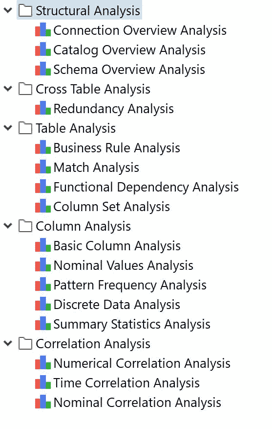
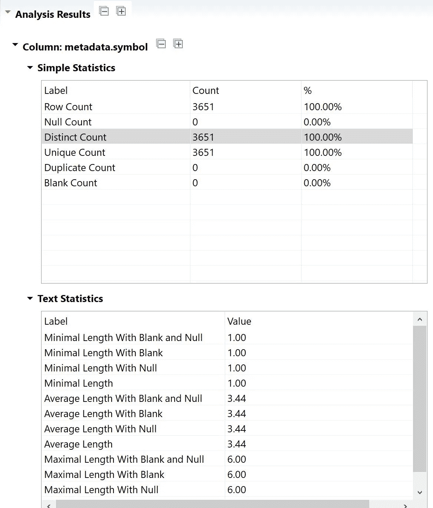
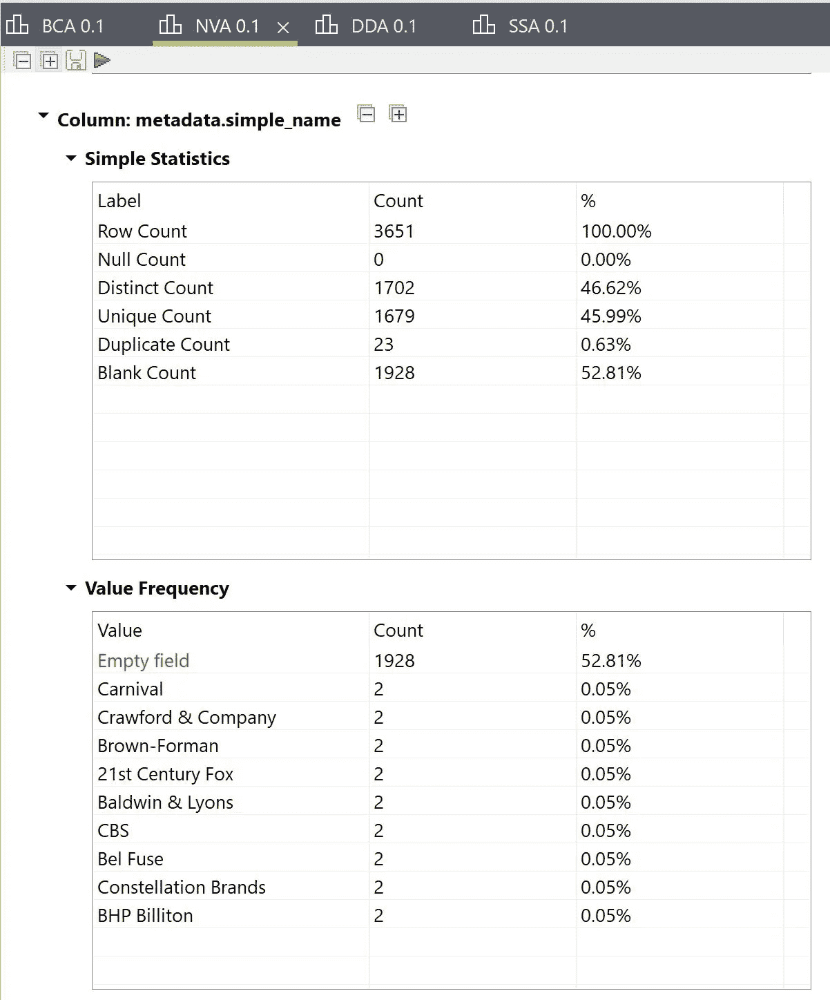
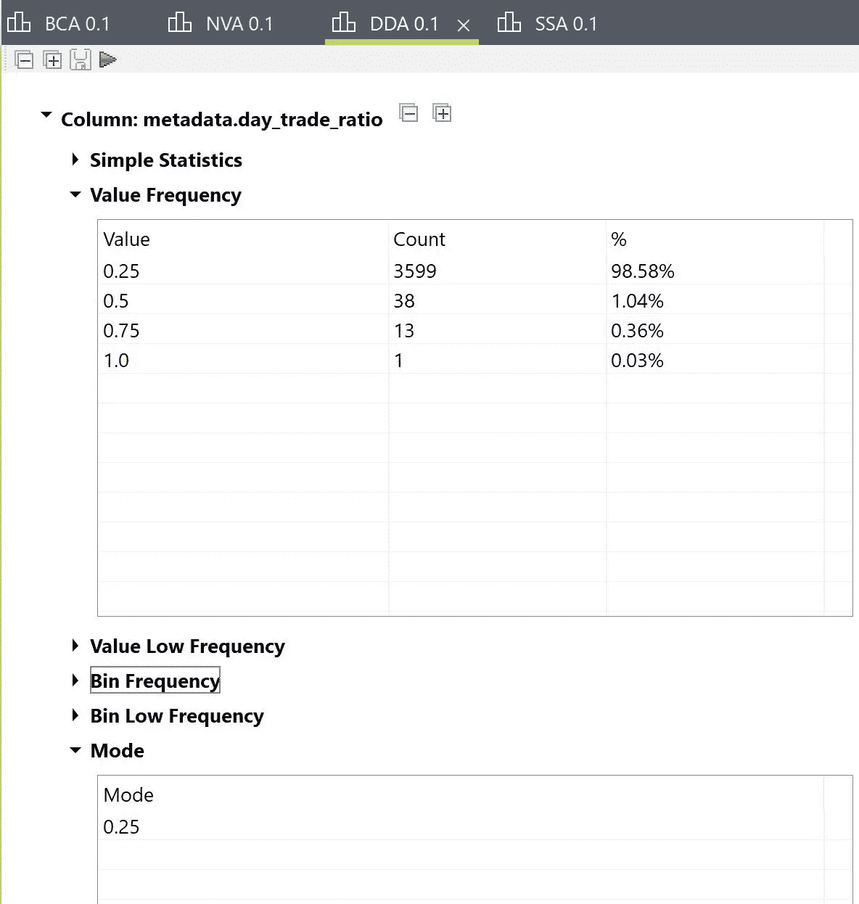
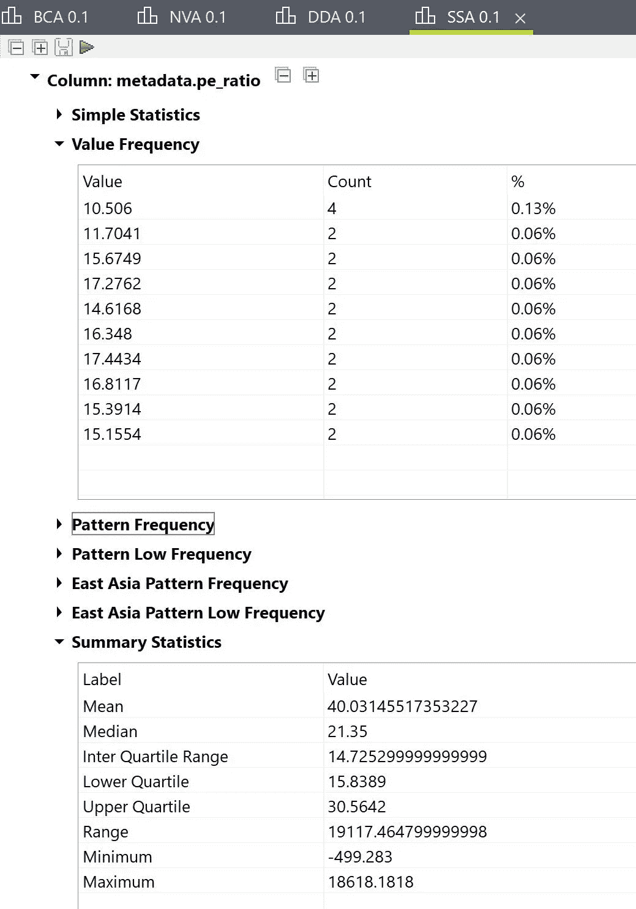

# 数据分析|数据分析|用例研究:投资数据

> 原文：<https://towardsdatascience.com/data-analytics-data-profiling-use-case-study-investment-data-adf872152db6?source=collection_archive---------23----------------------->

## 使用投资数据用例解释许多数据分析项目中涉及的主要阶段之一“数据剖析”。

D 数据概要分析是一个审查数据的过程，目的是更好地理解数据的结构、内容和内部关系，从而实现更高的数据质量。

Firmbee.com 在 [Unsplash](https://unsplash.com?utm_source=medium&utm_medium=referral) 上[的照片](https://unsplash.com/@firmbee?utm_source=medium&utm_medium=referral)

数据分析在以下方面非常重要:

*   [数据仓库](/data-warehouse-dimensional-modelling-use-case-study-ewallet-d9d16f559181)和商业智能(DW/BI)项目。
*   数据迁移项目。
*   源系统数据质量项目。

没有正确格式化、标准化或与数据库的其余部分正确集成的数据可能会导致延迟和问题，从而导致错失机会、迷惑客户和错误决策。

> 让我们试着用通俗的语言来说这个吧！！
> 
> 现在，让我们假设你正在为你的家人和同事举办一个晚宴。去买杂货，开始为晚餐准备食物。首先，你要试着列出可用的食品杂货，并根据将要到来的客人数量、儿童和成人的数量、素食者和非素食者的数量等来描述所需的食品杂货。这个**清单**除了数据分析外什么都没有，总可存储**杂货**是数据存储基础设施，总可用**杂货**现在将是数据库或数据仓库。

# 数据分析的类型

## 1.结构发现

克林特·王茂林在 [Unsplash](https://unsplash.com?utm_source=medium&utm_medium=referral) 上拍摄的照片

结构发现有助于确定数据是否一致以及格式是否正确。它使用基本统计数据来提供有关数据有效性的信息(如总和、最大值)。结构发现有助于了解数据的结构化程度，例如，pin 码的位数不正确的比例是多少。

## 2.内容发现

[乔·塞拉斯](https://unsplash.com/@joaosilas?utm_source=medium&utm_medium=referral)在 [Unsplash](https://unsplash.com?utm_source=medium&utm_medium=referral) 拍摄的照片

内容发现关注数据质量。数据需要及时有效地格式化、标准化，并与现有数据正确集成。例如，如果电话号码的格式不正确，这可能意味着无法联系到某些客户。

## 3.关系发现

裘德·贝克在 [Unsplash](https://unsplash.com?utm_source=medium&utm_medium=referral) 上的照片

关系发现识别不同数据集之间的连接。发现数据的各个部分是如何相互关联的。例如，数据库表之间的键关系，电子表格中单元格或表之间的引用。理解关系对于重用数据至关重要。应该通过保留关系来导入相关的数据源。

# 数据剖析技术

## 1.列剖析

列分析扫描整个表，并计算每个值在每列中出现的次数。这种方法有助于发现一列数据中的频率分布和模式。

## 2.跨列剖析

跨列分析由两个过程组成:键分析和依赖性分析。键分析通过搜索可能的主键来检查属性值的集合。相关性分析是一个更复杂的过程，它确定数据集中是否嵌入了关系或结构。这两种技术都有助于分析同一个表中数据属性之间的依赖关系。

## 3.跨表剖析

跨表分析使用外键分析来检查不同表中列集的关系，外键分析是对孤立记录的识别以及语义和语法差异的确定。这有助于减少冗余，还可以识别可以映射在一起的数据值集。

## 4.数据规则验证

数据规则验证以主动的方式使用数据分析来验证数据实例和数据集是否符合预定义的规则。这个过程可以通过批量验证或持续验证服务来实现。

# 数据分析工具

## 开放源码

*   Talend 开放式数据质量工作室
*   聚合分析器
*   Quadient 数据清除器

## 商业

*   信息科学中的数据剖析
*   Oracle 企业数据质量
*   SAS 数据流

# 用例

## 背景

[**红利增长投资数据**](https://www.kaggle.com/jonnylangefeld/dividend-growth-investment-data)

马库斯·斯皮斯克在 [Unsplash](https://unsplash.com?utm_source=medium&utm_medium=referral) 上拍摄的照片

股息增长型投资已经存在了很长时间，并且一直是一种广受欢迎的获得被动收入的方式。与任何其他投资一样，需要做出选择股票的详细决策。和其他投资一样，风险越高，潜在回报也越高。这个数据集应该支持由数据驱动的投资组合选择的决策。

[数据](https://github.com/jonnylangefeld/dividend-data-download)是使用 API 对 robinhood.com 所有可交易工具的快照。分析数据后可以解决的一些情况可能是“哪些股票确实具有最好的风险/回报比？”

投资数据集列描述

## 要求

交易经纪公司的数据治理部门希望基于这些数据构建报告和分析。因此，作为第一步，他们希望评估接收数据的质量。

他们想要回答的一些问题如下:

*   数据集的所有列都填充了有效数据吗？
*   特定属性的取值范围是什么？
*   属性中特定值出现的频率是多少？

## 解决方案设计

我们使用 Talend Open Studio for Data Quality 对 CSV dump 生成的数据集进行数据剖析(您可以按照提供的 [GitHub](https://github.com/jonnylangefeld/dividend-data-download) 链接中的步骤生成数据集)。

使用 **Talend** 可以完成许多不同类型的分析，但是我们将自己限制在这个简单的数据集上，其中大多数分析是柱状的。

> 我将尽可能用投资数据集的分析来解释每一部分。

Talend Open Studio 提供不同类型的数据质量分析|按作者分类的图片

**结构分析**

本节中可用的分析返回数据库内容的概述。它们为每个目录和/或模式等计算表的数量和每个表的行数。他们还计算索引和主键的数量，等等。

这将帮助您一目了然地看到哪个数据库包含的数据最多，哪些表是空的等等。

**交叉表分析**

该分析研究了几个表格。冗余分析是您想要检查两个表之间的关系的一个例子(也可以用作外键发现)。

**表格分析**

分析颗粒是行。例如，您想知道几行是否相同或相似。这将所有分析分组到“表格分析”文件夹下。行是属于所有列的一组单元格。在这种分析中，行是您分析的不可分割的元素。studio 允许用户选择关注哪些列。这里，您做了一个“部分”表分析，不可分割的元素不是一个完整的行，而是一组单元格(属于几列，但不是所有的列)。这种分析使您能够在选定的表上应用数据质量规则(DQ 规则)。

请注意，您可以创建 DQ 规则，并在稍后的分析准备阶段将它们分配给所创建的分析。

**列分析**

本节中的分析使您能够以列为基础分析数据。所有指标都是针对单个列计算的。与 excel 文件类似，焦点是一列并分析该列的每个单元格。

您可以从一个空的色谱柱分析开始，在这里您可以手动定义所有的设置，或者您可以使用一些预定义的分析，这些分析使用一组根据焦点选择的指示器。

或者，您可以使用语义感知分析向导，根据语义存储库中收集的信息自动配置列分析。以下是不同类型的列分析:

1.基本列分析

该向导生成一个空列分析，并打开分析编辑器。然后，您可以选择要分析的列，并在每个列上手动分配指标，例如空值数量、频率表、汇总统计、模式匹配指标等。

**专栏“符号”|作者图片的基本专栏分析**

2.名义值分析

这种分析使您能够分析名义数据。它创建了一个列分析，其中配置了适用于名义数据的指标。这种分析使用频率表和文本相关指标。

**专栏“简单名称”|作者图片的标称值分析**

3.离散数据分析

这种分析使您能够分析数字数据。它创建一个列分析，其中配置了适用于数字数据的指示器。这种分析使用 Bin 频率指示器，您可以进一步配置该指示器，以便根据您的需要离散化数据。

**列“日交易比率”的离散数据分析图片作者**

4.汇总统计分析

这种分析使您能够分析数字数据。它创建一个列分析，其中汇总统计指标自动添加到数字列中。这有助于您通过计算范围、四分位数范围以及平均值和中值来了解数值数据的形状。

“pe_ratio”栏的汇总统计分析 **|作者图片**

**关联分析**

此文件夹中的分析是探索性分析。它们帮助您探索列之间的关系，并可能帮助您发现数据中的其他质量问题。

# 结论

通过进行如上所示的分析，可以记录数据分析结果。稍后可以对其进行分析，以实现开发数据分析平台的复杂转换。

# 参考

Kaggle.com(2020 年)。*股息增长投资数据*。[在线]请访问:[https://www . ka ggle . com/jonnylangefeld/dividend-growth-investment-data](https://www.kaggle.com/jonnylangefeld/dividend-growth-investment-data)【2020 年 1 月 29 日访问】。

洞察，S. (2020)。*什么是数据概要分析，它如何让大数据变得更简单？*。[在线]Sas.com。可从以下网址获取:[https://www . SAS . com/en _ au/insights/articles/data-management/what-is-data-profiling-and-how-it-make-big-data-easy . html](https://www.sas.com/en_au/insights/articles/data-management/what-is-data-profiling-and-how-does-it-make-big-data-easier.html)【2020 年 1 月 29 日获取】。