# 电子商务零售中的数据分析

> 原文：<https://towardsdatascience.com/data-analytics-in-e-commerce-retail-7ea42b561c2f?source=collection_archive---------3----------------------->

## 电子商务不是蛋糕上的樱桃，而是新蛋糕

## 电子商务零售中的分析概念和应用，带有简单的演示和有趣的业务示例

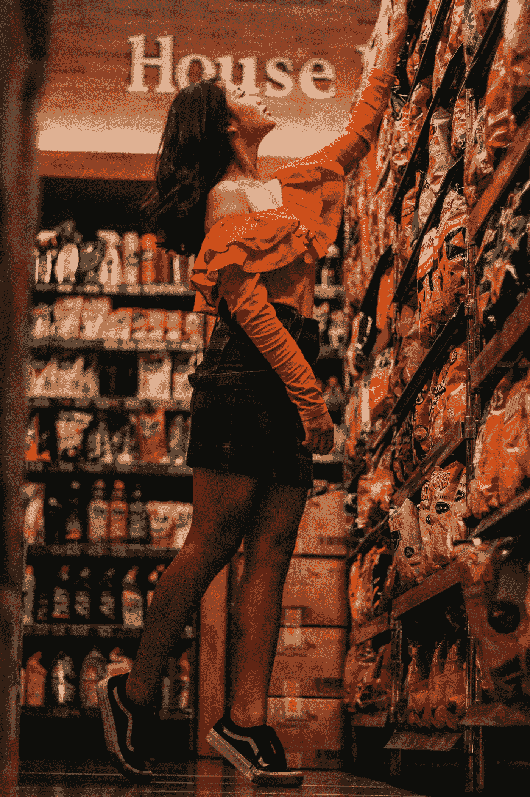

[陈](https://unsplash.com/@chanportofolio?utm_source=medium&utm_medium=referral)在 [Unsplash](https://unsplash.com?utm_source=medium&utm_medium=referral) 上拍照

 [## 听听这篇文章。

▶](https://app.blogcast.host/embedly/2464) 

# **简介**

最近，我帮助高露洁棕榄公司优化了亚马逊网上目录的产品策略。我应用数据科学方法来预测电子商务销售，预测产品的盈利能力，并优化公司的利润。最后，该项目获得了公司电子商务洞察和分析团队的认可。

本文是通过该项目获得的经验和知识的延伸。我将探索数据分析在电子商务零售业中的不同应用途径，尤其是像联合利华、雀巢、P&G 等跨国消费品公司。我会用我标志性的简单易懂、易读的方式来做这件事。

用联合利华全球电子商务副总裁克莱尔·亨纳的话说，

> “电子商务不再仅仅是面向未来的渠道。未来就在这里。”

我喜欢数字。所以，我先说一些数字。

2020 年第二季度，美国零售电子商务销售额从第一季度的 1604 亿美元飙升至 2115 亿美元。由新冠肺炎引起的封锁无疑促进了电子商务销售的增长。克莱尔说的很有道理，

> “许多人都是第一次来网上购物，这推动了渗透率的上升。”

让我们看看过去 5 年中 Q2 电子商务销售额占美国零售总额的百分比，这样你就能很好地感受到电子商务潜力的增长。

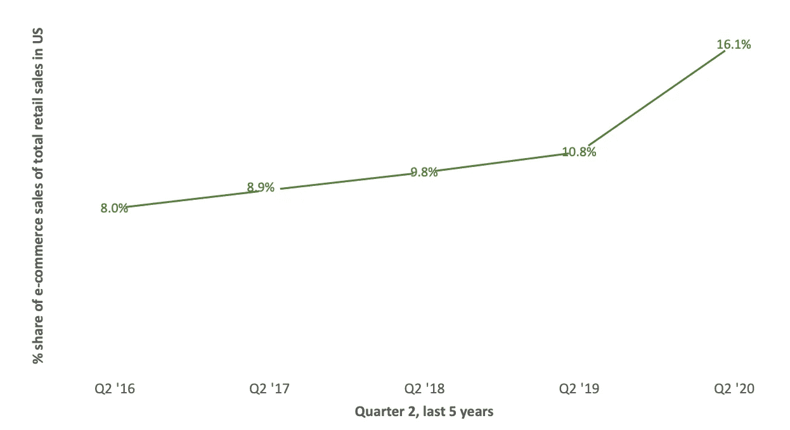

图 1:过去 5 年，Q2 电子商务销售额占美国零售总额的百分比(图片由作者提供)

此外，到 2024 年，美国电子商务销售额将超过 1 万亿美元，占零售总额的 18.1%。

让我们来看看 2020 年迄今为止顶级 CPG 公司的表现，与去年相比，电子商务销售额占零售总额的百分比份额。

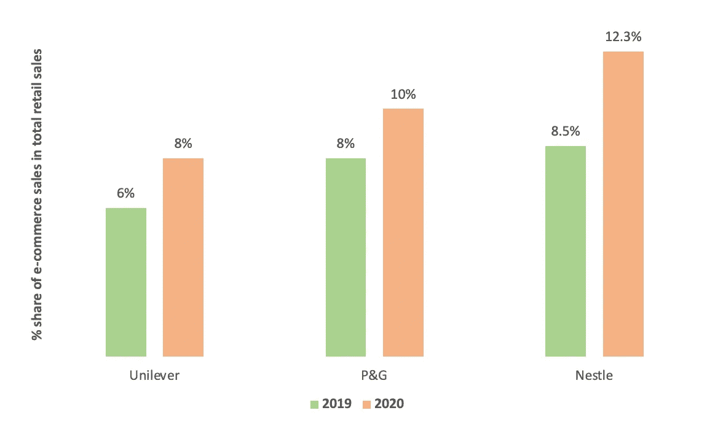

图 CPG 公司电子商务销售额占总零售额的百分比(图片由作者提供)

所以，现在你知道公司被赋予促进他们的电子商务销售的重要性。

现在，让我们深入探讨分析在帮助消费品公司扩大电子商务销售方面具有巨大潜力的不同途径。

# **1。产品推荐**

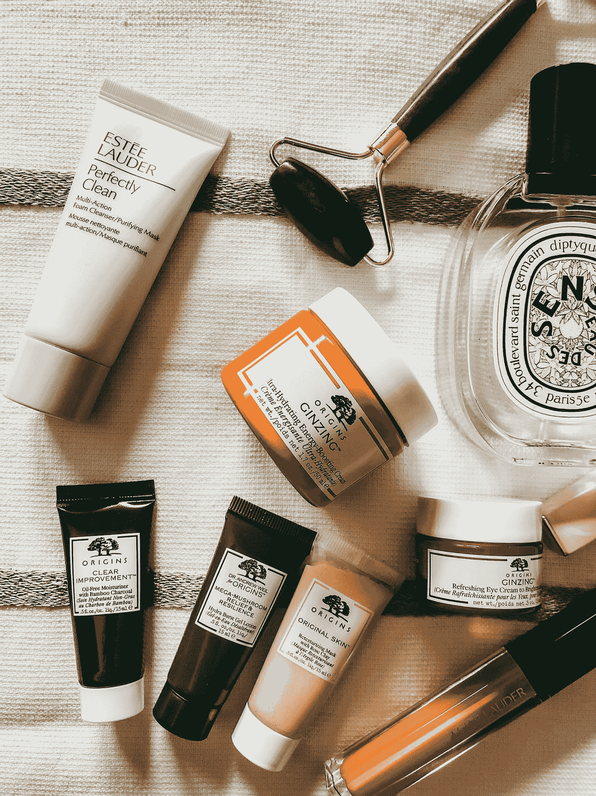

米凯拉·安波洛在 [Unsplash](https://unsplash.com?utm_source=medium&utm_medium=referral) 上的照片

你还记得你去百货商店的时候，友好的店主或店员在整个购物过程中帮助你吗？他知道你买的食物，你买的洗衣粉，或者你孩子喜欢的冰淇淋。他知道你的购物预算，并会提出建议。你最终还是买了他多次推荐的东西。不是吗？

这种与客户的关系正是公司所需要的。

产品推荐引擎是解决方案。什么是推荐引擎？

它只是“友好的店主”的自动化形式。它是一种使用机器学习算法向客户推荐他们可能感兴趣的产品的工具。这些建议可以通过以下渠道提出:

*   在网站内
*   电子邮件活动
*   在线广告

推荐引擎有两种类型:

**a)非个性化推荐引擎:**

这对于在不使用客户数据的情况下通过欢迎电子邮件或批量时事通讯发送建议非常有用。以下是一些有用的类别:

*   新产品，比如最近推出的一款新巧克力冰淇淋
*   **潮流产品**像一个快速销售的咖啡品牌，以帮助招募新客户
*   **滞销产品**比如打折的豪华香皂

**b)个性化推荐引擎:**

这是金子！它使用客户数据来推荐最佳优惠和促销。它使用深度学习算法和自然语言处理(NLP)来使客户体验尽可能个性化。这些算法使用来自以下领域的数据:

*   购买历史
*   最近的活动
*   在线行为
*   社交媒体浏览

这些算法非常强大，可以通过以下方式极大地促进电子商务销售:

*   提高转化率
*   增加客户的平均购买价值
*   降低跳出率和购物车废弃率

以下是目前亚马逊的推荐引擎给我展示的内容。看起来它知道我喜欢锻炼。

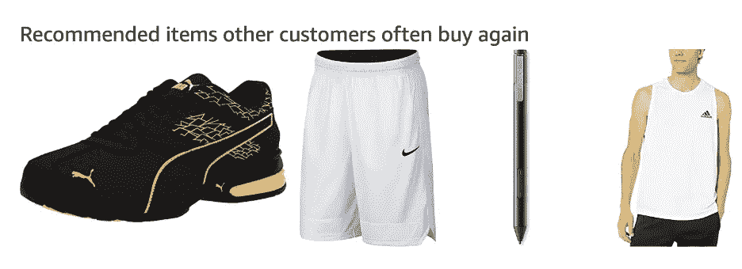

图 3 亚马逊推荐引擎(图片由作者提供)

麦肯锡报告称，顾客在亚马逊上购买的东西中，有 35%来自基于这种算法的产品推荐。

# **2。** **购物篮分析**

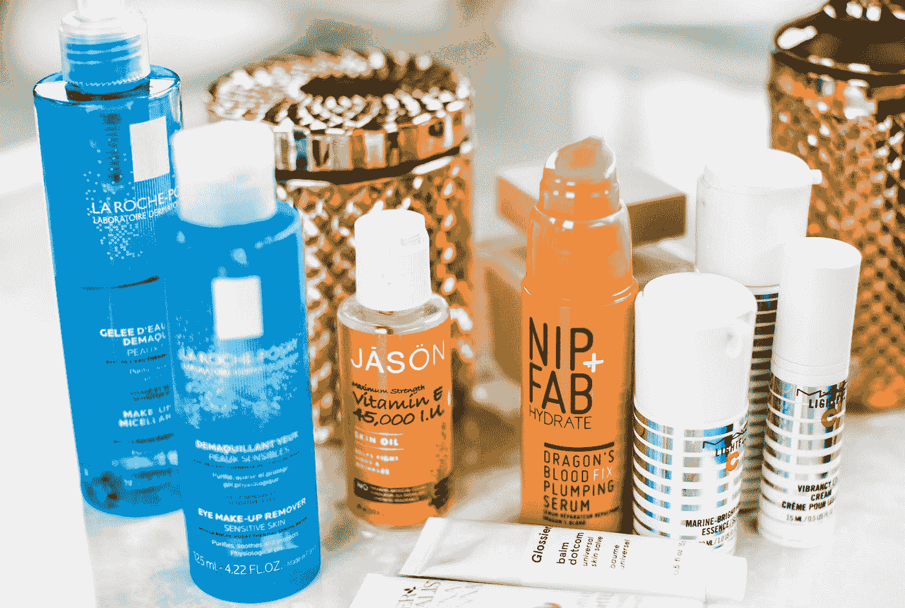

在 [Unsplash](https://unsplash.com?utm_source=medium&utm_medium=referral) 上由 [Charisse Kenion](https://unsplash.com/@charissek?utm_source=medium&utm_medium=referral) 拍摄的照片

购物篮分析是一种识别一起购买的一对/一组产品之间关联强度的技术。简而言之，它基于这样一个概念:如果客户购买了一种产品，他们或多或少会购买另一种相关产品。购物篮分析也使用机器学习/深度学习算法，如产品推荐引擎。

我将用我前面提到的高露洁-棕榄公司项目中的一个例子来解释这一点。我将一款儿童牙刷(无利可图的产品)与一款除臭剂、一款爸爸的产品(快消产品)捆绑销售，能够将组合的周总利润提高 8%。

[**关联规则学习**](https://en.wikipedia.org/wiki/Association_rule_learning#Support) 是一种用于发现产品之间关联的机器学习方法。它不考虑购买产品的顺序。让我用一个演示来解释一下。

该分析是对数百万个篮子进行的，但我将用 7 个篮子进行演示，并解释所使用的 3 个重要指标。让我们探索一下洗发水和护发素之间的联系(第 1 栏):

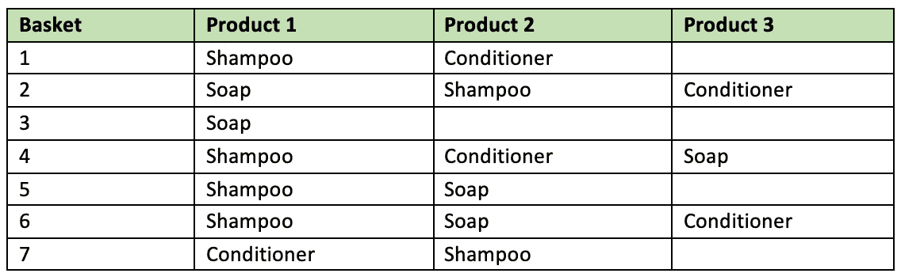

图 4 CPG 电子商务商店上的七篮子顾客(图片由作者提供)

## **a)支架**

**定义:**包含产品 x 和 y 的交易数量占交易总数的百分比

**业务含义:**表示两种产品一起购买的频率。

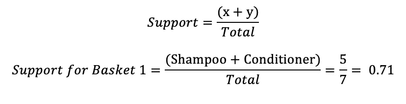

```
The association rule {shampoo} => {conditioner} has a support of 0.71 → Both products are bought together in 71% of the transactions
```

## b)信心

**定义:**包含产品 x 和 y 的交易数与包含产品 x 的交易数之比

**业务含义:**表示关联规则为真的频率，即两种商品一起购买的频率。

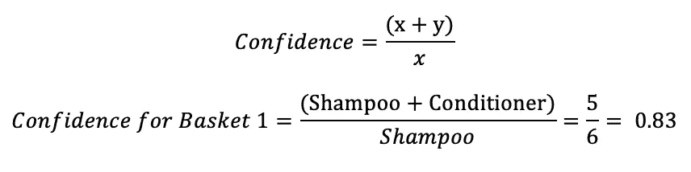

```
The association rule {shampoo} => {conditioner} has a confidence of 0.83 → 83% of the times the customer buys shampoo, conditioner is bought as well
```

## **c)提升**

**定义:**Lift 是置信度与预期置信度的比值。预期置信度就是产品 y 在篮子里的概率。

**业务含义:**规则的提升表明规则内的关联有多强，即规则在预测结果方面比一开始就假设结果要好多少。提升值越高，关联越强。

```
Lift = 1 → There’s no relation between the purchase of the products.Lift > 1 → The products are likely to be bought together. Higher the lift, the higher the chances.Lift < 1 → The products are unlikely to be bought together. They are substitutes.
```

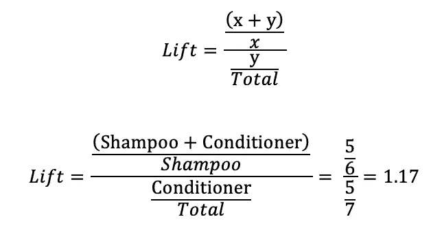

```
The association rule {shampoo} => {conditioner} has a lift of 1.17 → The probability of buying a conditioner with the knowledge that shampoo is already present in the basket is much higher than the probability of buying a conditioner without the knowledge about the presence of shampoo.The presence of shampoo in the basket increases the probability of buying conditioner.
```

我知道托举有点棘手。但我希望你现在明白了。

并且在此之后，[卡方分析](https://en.wikipedia.org/wiki/Chi-squared_test)对于确定关联规则的统计显著性是有用的。

# 3.价格优化

[**80%的人都说在网上电子商务商店购物最重要的方面是有竞争力的价格。**](https://blog.hubspot.com/marketing/why-people-buy-factors-influence-purchase-descision)


由 [Unsplash](https://unsplash.com?utm_source=medium&utm_medium=referral) 上的 [Bermix 工作室](https://unsplash.com/@bermixstudio?utm_source=medium&utm_medium=referral)拍摄的照片

所以，你知道设定最优价格并在客户满意度和公司利润之间取得平衡是多么重要。现在，让我们探讨与价格优化相关的 3 个重要概念:

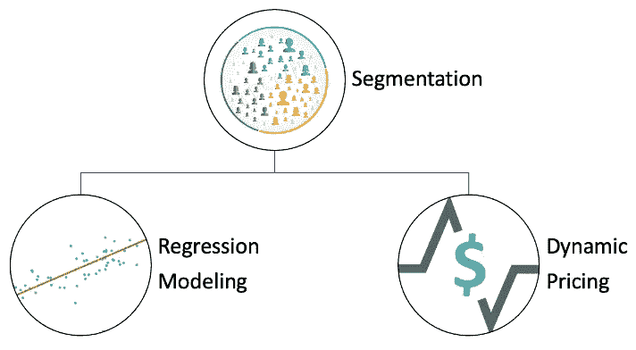

图 5 价格优化的概念(图片由作者提供)

## a)客户和产品的细分

这是价格优化的第一步，您将对相似的产品和客户进行分组。分类(监督)和聚类(非监督)算法对于这种分割是有用的。最佳技术取决于业务需求和数据类型。

顺便说一下，在我任职高露洁期间，我曾使用 K-均值聚类对具有相似销售趋势的产品进行分组。它帮助我为每个集群建立了一个预测模型，而不是许多模型。

并且，我在我的另一篇文章中已经提到了 [**RFM 客户细分**。快速阅读一下！](/a-b-testing-top-4-mistakes-with-business-cases-fixes-85e76767dfde?sk=ffaf71f7193d7a92a1c647a54e0069e9)

[](/a-b-testing-top-4-mistakes-with-business-cases-fixes-85e76767dfde) [## A/B 测试:业务案例的 4 大错误及解决方法

### 在你发现这篇文章之前，你可能忽略了这些

towardsdatascience.com](/a-b-testing-top-4-mistakes-with-business-cases-fixes-85e76767dfde) 

## b)回归建模

一旦细分完成，围绕销售、转换率、季节性、产品属性、营销渠道等的各种数据点的回归模型。帮助确定产品的最优价格。

让我给你一个假设的 CPG 行业的商业例子。联合利华的分析团队为个人护理产品建立的回归模型可以帮助它预测多芬除臭剂价格下降 5%可以促进 15%的销售。

## **c)动态定价**

你还记得上一次你最喜欢的产品在亚马逊大减价时降价，而其他电子商务商店也降价了吗？

这就是动态定价。它使用竞争对手的数据作为机器学习算法的输入，以确定不同时间的产品价格。这有助于产品在价格频繁波动的竞争市场中保持活力。

A/B 测试可以用来完善定价模型，但它需要大量的技术考虑，是一个完全不同的主题。改天再详细说。与此同时，你可能想看看我写的这篇关于 A/B 测试中出现的 [**大错误的文章，以及有趣的商业案例&修复**](/a-b-testing-top-4-mistakes-with-business-cases-fixes-85e76767dfde?sk=ffaf71f7193d7a92a1c647a54e0069e9) 。

[](/a-b-testing-top-4-mistakes-with-business-cases-fixes-85e76767dfde) [## A/B 测试:业务案例的 4 大错误及解决方法

### 在你发现这篇文章之前，你可能忽略了这些

towardsdatascience.com](/a-b-testing-top-4-mistakes-with-business-cases-fixes-85e76767dfde) 

# 4.请求预报


照片由[克里斯·利维拉尼](https://unsplash.com/@chrisliverani?utm_source=medium&utm_medium=referral)在 [Unsplash](https://unsplash.com?utm_source=medium&utm_medium=referral) 上拍摄

让我们想象一下**本杰明·富兰克林**和**亚伯拉罕·林肯**是电子商务商业大亨。

**富兰克林**似乎警告过不要低估电子商务零售中需求预测的潜力，

> "如果你没有计划，你就是在计划失败."

并且 **Lincoln** 似乎为你的电子商务公司提供了将需求预测纳入分析场景的完美策略。

> “给我六个小时砍树，我会用前四个小时磨斧子。”

需求预测是指使用分析技术来预测产品需求和销售。如果你提前了解销售趋势，你就能在以下几个方面比你的竞争对手更有优势:

## a)更好的库存管理

低估库存水平会导致库存缺货，从而引起客户不满。过高估计库存水平会导致库存积压，从而造成不必要的存储成本。

需求预测有助于制定明智的库存计划，避免畅销产品脱销和库存滞销造成的仓库空间浪费。

## b)更好的现金流管理

因为这些钱不会被积压在滞销的存货中，所以它可以帮助你合理地计划预算，并最佳地使用现金。因此，它帮助你降低财务风险。

## c)更好的定价策略

有效的需求预测也有助于改进定价策略。您可以对具有高需求预测的产品收取更多费用，反之亦然。您可以更好地规划营销预算、广告投资和折扣计划。

## d)更好的客户服务

预先了解产品需求及其波动有助于规划更好的客户服务。是时候举个商业例子了。

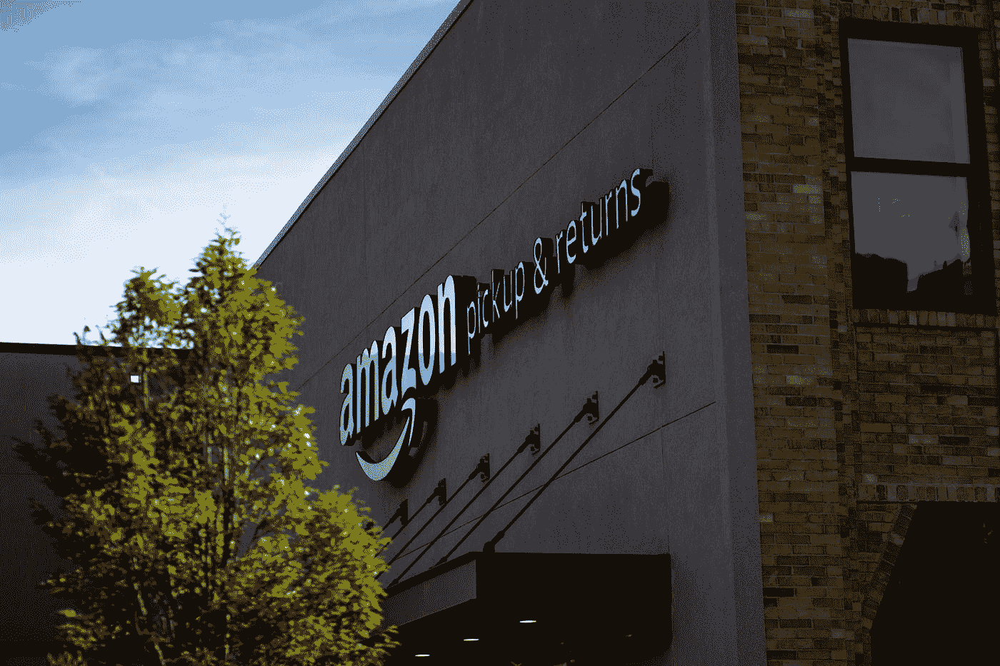

布莱恩·安杰洛在 [Unsplash](https://unsplash.com?utm_source=medium&utm_medium=referral) 上的照片

亚马逊在 2013 年申请了**【预期运输】**专利，利用预测模型在你购买之前将产品运送给你。亚马逊的算法会预测你的购买，并把产品送到离你最近的仓库。然后，亚马逊会等到实际购买。亚马逊认为，这将极大地缩短从购买到实际交付的时间，并促进公司的整体销售。

# **结论**

电子商务零售行业有更多的分析应用，但这些是对电子商务销售收入有直接影响的一些突出应用。我希望你喜欢读它。

以**乔尔·安德森(沃尔玛前首席执行官)**强有力的信息结束，

> “你不能只打开一个网站，就指望人们蜂拥而至。如果你真的想成功，你必须创造流量。”

**注:**如果你想看看我最近在高露洁棕榄做的项目，请在 [**我的 GitHub 账户**](https://github.com/ashishtomar99/ColgatePalmolive-Amazon_Profitability_IndustryPracticum/blob/master/README.md) 中找到代码和演示。根据 NDA 的要求，所有机密数据均已隐藏/匿名。

请随意看看我写的关于 **SQL:** 的其他文章

[](/indexing-for-sql-query-optimization-139b57db9fc6) [## SQL 查询优化的索引

### 是时候开始你的查询游戏了！

towardsdatascience.com](/indexing-for-sql-query-optimization-139b57db9fc6) [](/7-must-know-sql-querying-mistakes-fixes-321ee292a251) [## 7 必须知道 SQL 查询错误和修复

### 避免这些错误，提高你的查询技巧！

towardsdatascience.com](/7-must-know-sql-querying-mistakes-fixes-321ee292a251) 

请随时提供反馈，并关注我以获取更多关于数据分析的有趣文章。在 [LinkedIn](https://www.linkedin.com/in/ashish-tomar-565b1654/) 上与我联系。