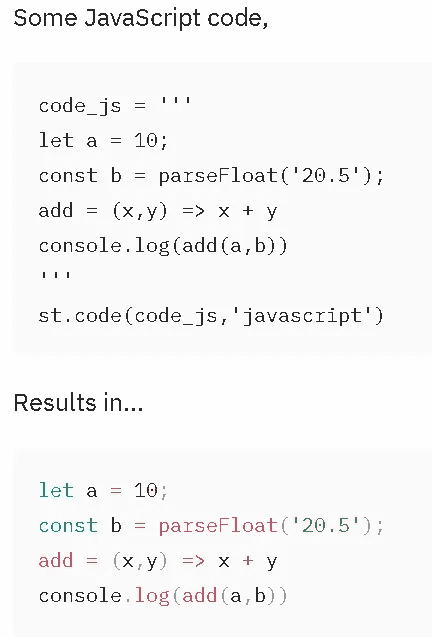
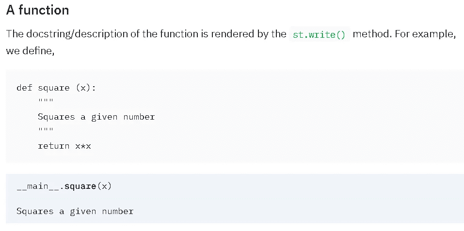
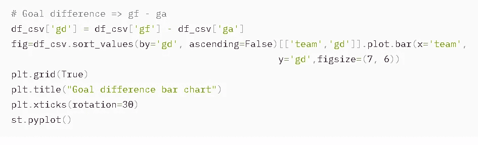

# 数据分析到 Web 应用程序:简化 it 变得简单

> 原文：<https://towardsdatascience.com/data-analytics-to-web-app-streamlit-made-easy-ed687266f0e8?source=collection_archive---------12----------------------->

## 我们展示了使用 Streamlit Python 包部署数据分析和进行交互式机器学习是多么容易。


图片来源: [Unsplash](https://unsplash.com/photos/Oadvsf3xH9E)

# 数据(分析/毫升)到应用程序—零痛苦

我们都想展示我们的数据分析技能。我们都想把这个很酷的机器学习模型包装在一个闪亮的包装中，并作为一个应用程序呈现给全世界。

如何将自己从 Jupyter 笔记本的二维世界中解放出来，向外界提供你的数据科学模型/管道？

[**细流**](https://docs.streamlit.io/en/stable/) 让它发生。无痛。

它用最少的代码从数据(分析或机器学习)过渡到一个闪亮的应用程序，几乎不需要学习和部署 web 服务框架(如 [Flask](https://flask.palletsprojects.com/en/1.1.x/) 或 [Django](https://www.djangoproject.com/) )。

数据科学家可以在实时网络服务器上测试和展示他们的模型或统计分析，同时摆弄数据和算法。

要了解更多关于这个伟大的 Python 包的历史和起源，请观看他们的 CEO 和创始人的系列视频。我发布的只是第一个视频链接，你应该看这个系列的所有四个视频。

> 我们都想把这个很酷的机器学习模型包装在一个闪亮的包装中，并作为一个应用程序呈现给全世界。

在本文中，我想介绍该框架的一些重要基础知识，让您立即开始创建数据驱动的应用程序之旅！

# 核心工作流程

## 安装

当然，您安装了 Streamlit。它正在快速更新。因此，建议使用`— U`。

```
pip install -U streamlit
```

## 创建第一个应用

他们有一个 Hello World 类型的应用程序供你尝试。但是当你可以编码的时候，为什么还要为此烦恼呢？为什么不用自己的数据/数学技能创建自己的第一个应用呢？

我们将创建一个简单的 web 应用程序来检查给定的数字是否是质数。

打开你最喜欢的 IDE/文本编辑器，输入…


我们可以将脚本保存为`is_prime.py`。然后，进入终端(命令提示符)运行这个应用程序，

```
streamlit run is_prime.py
```

你会看到一个网络服务器自动开始为你的应用服务！在终端中，您会看到类似这样的内容，


端口号可能会有所不同，这取决于运行的其他本地服务器以及它们如何使用特定端口。

> 数据科学家可以在实时网络服务器上测试和展示他们的模型或统计分析，同时摆弄数据和算法。

## 查看您的第一个应用并与之互动

你可以打开浏览器，进入`localhost:8502`。你会看到一些很酷的东西，像这样，


一个简单的小数学应用程序，包括标题和 HTML 格式的文本等等——不错！

## 我们是如何生成这个应用程序的？

那么，它们是从哪里来的呢？当然是从您的 Python 脚本中。让我们一段一段地重温这段代码，


因此`st.title()`函数创建了标题(基本上是一个 H1 HTML 标签)。

之后，我们在那些`"""..."""`标签中写了一段简单的降价。你可以在这些三重引号内放置任何降价，它们会呈现出美丽的效果。当然，它们遵循的降价语法与您在 Jupyter 笔记本降价单元格或 Github repo 的`Readme.md`文件中使用的相同。

下一个功能`st.header()`也是另一个降价。我们放了一个`*...*`语法来风格化它(斜体)。

下一部分是创建接受用户输入(数字)的文本框。


函数`st.number_input()`本质上创建了一个 HTML 表单/输入框，期望输入数字类型。默认情况下，它接受浮点数，因此，在下一行中，我们将其转换为`int`类型(因为我们正在检查输入的素性，它们应该是整数)。

下一个函数`st.write()`是一个非常强大的通用方法，用于呈现各种各样的对象——从简单的文本到 Pandas DataFrame 和 Matplotlib 可视化。这里，我们只是通过传递一个参数来编写一个简单的文本值，类似于我们传递给 Python `print()`函数的内容。

到目前为止，这么多代码将呈现如下(没有任何实际的数学计算)，


因此，用户只需输入一个数字，然后按回车键。您的代码将处理该输入。

接下来，在您的代码中，有一个简单的 Python 函数，它检查输入数字是否是质数。我们不会谈论这个功能，但让我们看看之后会发生什么。


因此，我们调用该函数并将返回值存储在两个变量中— `decision`和`divisor`。然后，我们用一个`if-else`子句编写两个`st.write()`函数——第一个简单地指出这个数是质数，第二个告诉这个数是非质数，同时显示最小的除数。同样，请注意我们如何简单地将一个类似 Python 的字符串传递给第二个`st.write()`函数。

用各种输入测试你的网络应用，看看结果。例如，如果我写 35，它会显示，


如果我写 251，它会显示，


我希望您对我们必须编写的代码流有所了解，以便用 Streamlit 构建简单的数学分析应用程序。

但是我们是数据科学家，我们不仅仅致力于解决数学问题。让我们开始吧！

# 构建机器学习应用的组件

## 成分

在我们能够构建一个有意义的机器学习应用程序之前，我们需要知道如何使用 Streamlit 将数据对象/组件放到我们的应用程序中。我们展示了在基于 Streamlit 的应用程序上呈现一些大部分数据组件是多么容易。

[**Python 脚本位于此处**](https://github.com/tirthajyoti/ML-apps-with-Streamlit) 。你可以下载并运行它。我不会通过重复代码来使文章变得单调，而只会在应用程序上显示结果。

## 创建格式良好的描述的基本降价

简单的 markdown 语法产生了这种带有多级标题、超链接和项目符号列表的描述。


还有，这个，


## 显示图像

默认的 markdown 图像标签不适合控制图像大小。所以，我们应该使用`st.image()`方法来显示图像。

这里有一个来自 Streamlit 网站的截图。图片存放在我的 [Github repo](https://github.com/tirthajyoti/Machine-Learning-with-Python) 上，我们只是传递 URL。


## 乳胶渲染

默认的降价已经处理了 LaTeX。我们可以单独使用`st.latex()`来渲染乳胶含量。


## 密码

我们可以使用`st.code()`通过可选的语法高亮来很好地呈现代码块。



## 原生 Python 对象

列表和字典之类的 Python 对象以一种漂亮的、视觉上吸引人的方式呈现。我们使用通用的`st.write()`方法进行渲染。



## Numpy 数组

Numpy 数组(一维和二维)也可以通过`st.write()`方法很好地渲染，尽管对于长数组，垂直渲染会变得难以处理。


## 熊猫数据框

我们可以通过使用`st.write()`或`st.dataframe()`方法来渲染熊猫数据帧。


**每次页面刷新**，代码都会生成新的随机数据，下面的**表格也会重新生成**。


## 在数据帧上应用过滤器

我们通过只选择那些`A1` > 0 和`A3` > 3 的行来过滤数据帧。注意，由于数据帧生成的随机性，**不能保证我们每次重新运行代码**时都会得到非空的数据帧。


## 将数据帧写入文件

我们可以很容易地向用户询问文件名，并将过滤后的数据写入该文件。当然，我们必须编写一些代码(例如，用户输入有效性、文件名检查逻辑等。)幕后，但由此产生的 app 界面干净清爽。


## 从 web 上读取数据文件

从远程托管的文件中读取数据、稍微格式化文件并在 DataFrame 中呈现就像下面的简短代码一样简单，


## 一个简单的条形图使用熊猫内置的'情节'模块

我们可以处理刚刚从 web 导入的数据集，并调用内置的绘图方法。



这产生了预期的 Matplotlib 驱动的绘图(类似于 Jupyter 笔记本)。


## 带有 Altair 库的折线图

除了 Matplotlib 之外，Streamlit 还支持许多高级和高度交互式的绘图库。其中之一是 Altair，它构建在 Vega 之上(而 Vega 又构建在无处不在且功能强大的 D3.js 之上)。

我们从数据框中取出一些列，并创建一个折线图。您可以缩放和平移图表，甚至可以看到图表后面的 HTML 代码。请看下面的视频。

> 除了 Matplotlib 之外，Streamlit 还支持许多高级和高度交互式的绘图库。

## 小工具魔术

我们可以很容易地用 Streamlit 创建交互性。这是它的主要吸引力之一！

假设我们有一个如下定义的函数，


我们可以只用一行代码创建一个滑块，


我们可以左右移动滑块，函数被动态评估，值可以实时显示。就像网络应用程序的预期行为一样。

## 函数的 Matplotlib 图

下面的代码使用普通的`Matplotlib`和一个**单个** `**Streamlit**` **调用** `**st.pyplot()**` **来绘制上面的函数。**

这个图表与上面的牛郎星图表不同，它不是一个动态图表。然而，注意`Matplotlib`代码包含了相当多的复杂性(甚至标题中的 LaTeX 格式的字符串)。所有这些都由`st.pyplot()`函数完美地处理。


# 一个交互式线性回归问题

最后，我们展示了如何使用来自 Streamlit 的简单小部件生成一个噪声水平**可调的线性回归数据集。**

## 交互式数据生成

在前两节中，我们介绍了 slider 小部件和 pyplot。在本节中，我们以动态的方式将它们结合起来。


下面，滑块可以调整，以调整噪音的水平。**每次你移动滑块，你基本上会产生一个新的线性回归问题**(具有相同的特征，但观察数据略有不同)。

下图显示了动态更新的数据与特性图，以说明这一点。

移动“噪音标准。dev”滑块从左端到右端，观察对观察数据的影响。**当你向右移动滑块**时，你是否看到观察到的数据变得*更嘈杂*？

## 以交互方式拟合模型！

接下来，我们用我们的数据拟合著名的`scikit-learn`包中的`LinearRegression()`模型，并显示模型系数和 *R* 度量。

请注意，随着新问题的产生，它们会有轻微的变化。注意，我们选择 a1 = 2.5，b1 = 5，估计值应该接近这些数字。

噪声平均值主要影响偏置项，而噪声标准差。dev 主要影响线性系数。您还会注意到，随着噪声 std 的增加， *R* 得分通常会降低。dev 增加，即**线性模型很难解释观察到的数据中的方差(如果噪声的扩散很大)**。

所有这些线性回归的东西并不新鲜。但是请注意**使用一个实时 web 应用**来适应众多模型(对应于动态生成的数据集)的建模练习看起来是多么容易，只需操作几个滑块！

# 摘要

暂时就这样了。然而，我相信你已经知道这个库有无限的可能性。

这里是他们官方的 [**API 参考指南**](https://docs.streamlit.io/en/stable/api.html) 这里是更多的 [**教程**](https://docs.streamlit.io/en/stable/tutorial/index.html) 。

您可以在后端创建真正复杂的数据分析和机器学习管道(使用 Jupyter Notebook 或复杂的 Python 模块网络，无论您喜欢什么)，并以最小的编码开销在一个简单、实时的 web 应用程序中呈现所有输出结果和可视化效果。

接下来，我计划构建基于 Streamlit 的应用程序，在后端进行更复杂的数据处理和可视化，并在我的媒体页面上与您分享。

敬请关注。

> **…使用实时网络应用**进行建模练习看起来是多么简单，只需操作几个滑块就能适应众多模型(对应于动态生成的数据集)！

A lso，你可以查看作者的 [**GitHub**](https://github.com/tirthajyoti?tab=repositories) **知识库**获取机器学习和数据科学方面的代码、思想和资源。如果你和我一样，对人工智能/机器学习/数据科学充满热情，请随时[在 LinkedIn 上添加我](https://www.linkedin.com/in/tirthajyoti-sarkar-2127aa7/)或[在 Twitter 上关注我](https://twitter.com/tirthajyotiS)。

[](https://www.linkedin.com/in/tirthajyoti-sarkar-2127aa7/) [## Tirthajyoti Sarkar - Sr .首席工程师-半导体、人工智能、机器学习- ON…

### 通过写作使数据科学/ML 概念易于理解:https://medium.com/@tirthajyoti 开源和…

www.linkedin.com](https://www.linkedin.com/in/tirthajyoti-sarkar-2127aa7/)