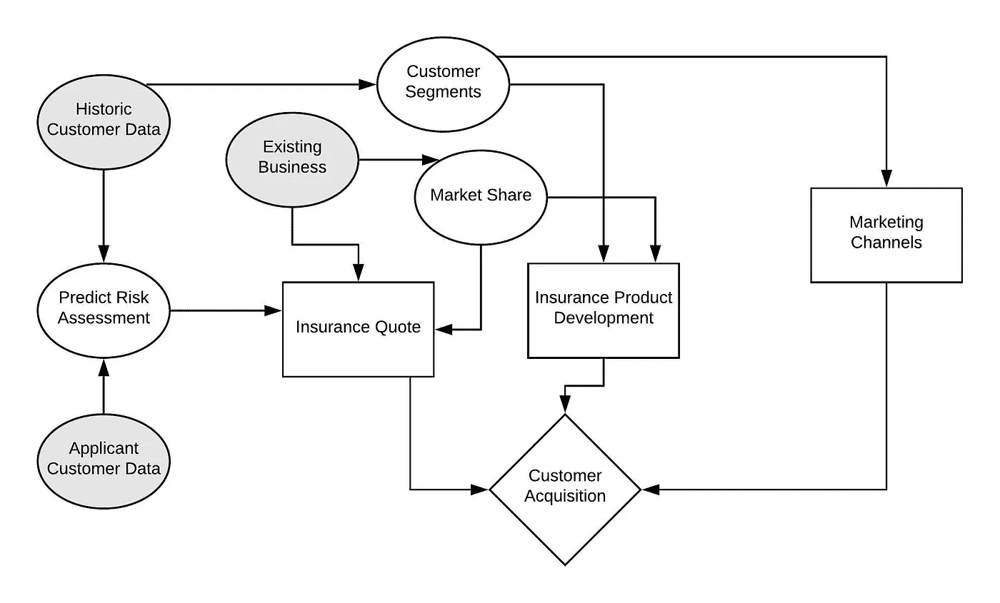
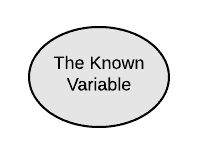
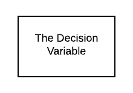

# 数据和决策模型——如何在数据科学项目中使用影响图？

> 原文：<https://towardsdatascience.com/data-and-decision-models-how-to-use-influence-diagrams-in-a-data-science-project-6f817be5430d?source=collection_archive---------52----------------------->

## 逐步构建影响图的方法

图片由 [Unsplash](https://unsplash.com?utm_source=medium&utm_medium=referral) 上的[新数据服务](https://unsplash.com/@new_data_services?utm_source=medium&utm_medium=referral)提供

# 价值链——概述

“价值链”是一个广泛使用的术语，它定义了五个关键领域，即需求分析、设计、实现、测试和演进。几个这样的流程模型与数据科学相关，但是没有正确的答案来说明哪一个是最好的。CSIRO、Pivotal(一家大数据公司)等多个组织以及 Miller 和 Mork 等作者提出了不同的价值链模型，以满足数据科学项目的需求。他们提出的模型没有明显的不同，但都是定制的，以满足不同的业务需求。下图说明了 Miller 和 Mork (2013)提出的数据模型。

数据科学项目的价值链改编自 IT Professional，Miller 和 Mork (2013 年)的《从数据到决策:大数据的价值链》

# 价值链—关键活动

简而言之，价值链通常被描述为一系列为项目创造价值的活动。这些活动包括从多个来源收集数据、清理和争论、与现有系统集成、分析关键绩效指标，以及最终展示结果以推动与组织目标一致的业务价值。数据科学家在所有领域都扮演着关键角色，但是在较大的组织中，这些角色通常是预定义的，并且不会重叠。例如，像 Novartis Health Care Pvt. Ltd .或 Common Wealth Bank，Australia 这样的大型制药和银行公司在一个数据科学项目中有多个预定义的角色，在该项目中，数据科学家需要分析数据并仅向不同的业务利益相关方提供关键陈述。

# 影响图

在制定和分析问题陈述时，数据科学家需要了解影响业务决策的关键杠杆。一般来说，涉众不熟悉数据模型或统计，因此存在模型结果可能与他们的业务直觉不一致的情况。这就是影响图出现的地方。影响图是不同的已知和未知变量如何影响商业决策的可视化展示，商业决策反过来又控制着结果。影响图可以让你对以下内容有一个 360 度的了解。

*   一个人可以从建立模型中获得的价值
*   对项目至关重要的附加信息
*   获取这些附加信息的成本

使用[清晰图表](https://app.lucidchart.com/documents/view/2ac02ad2-5a08-4b10-bb21-61a5ade589e0/0_0)开发的风险评估模型的影响图。这张影响图是在解决来自 [Kaggle](https://www.kaggle.com/c/prudential-life-insurance-assessment/overview/description) 的风险评估问题之前准备的垫脚石。

保诚金融公司是美国最大的保险公司之一。最近，他们观察到由于不正确的保险报价导致的大量客户流失。人寿保险和年金部门的利益相关者希望确定影响风险评估的驱动因素，以及它们如何满足不同的业务目标。影响图被开发来识别问题陈述的关键区域和杠杆，它们如何重叠以实现共同的业务目标。

# 影响图的组成部分

## 已知变量

已知变量代表数据科学家在项目开始时已知的度量。这包括对问题至关重要的数据源和属性、现有的性能指标、业务直觉等等。在上面的示例中，节点“历史客户数据”、“申请人客户数据”和“现有业务”是已知变量。

## 机会变量

机会变量表示在项目开始时未知的任何度量。它可能包括对模型至关重要的变量、对市场的商业理解、从外部来源获取的数据等。重要的是要明白，机会变量的值总会在未来被发现。在上面的例子中，“预测风险评估”、“市场份额”和“客户群”是机会变量。当仔细观察时，人们会发现市场份额只有在竞争对手的数据可用时才能估计出来。竞争对手的数据可以从外部来源获得，因此这个变量的值在项目开始时是未知的。

## 决策变量

决策变量由决策者来表示。它说明了不同的已知和未知变量如何影响商业选择，以及什么样的选择受到影响。在上图中，“保险报价”、“保险产品开发”和“营销渠道”是受数据科学项目期间研究的已知和未知变量影响的关键决策。

## 客观变量

目标变量被定义为数据科学项目想要推动的可能结果。目标变量应该与业务目标一致，并且属于受多个决策变量影响的更大范围。

# 如何制定影响图？

1.  确定项目所需的所有可能的变量集
2.  与利益相关者或数据工程和管理团队讨论不同变量的可用性
3.  从讨论中找出已知变量和偶然变量
4.  理解机会变量对项目或模型开发的影响。如果影响很大，就采购流程和所涉及的成本进行讨论
5.  分析受项目影响的所有业务决策
6.  使用在线工具将这些变量放到适当的位置，得出最终的影响图

# 摘要

影响图的数学理论旨在帮助理解各种可能性和成本如何协同工作。影响图通常被归类为解决问题的艺术。它教会我们认识问题中的关键变量、目标、已知和未知因素，以及不同的决策是如何被影响以达到共同目标的。

# 参考

H.G. Miller 和 P. Mork，“从数据到决策:大数据的价值链”，载于《IT 专业人员》，第 15 卷，第 1 期，第 57-59 页，2013 年 1 月至 2 月，doi: 10.1109/MITP.2013.11。

*关于作者:高级分析专家和管理顾问，帮助公司通过对组织数据的商业、技术和数学的组合找到各种问题的解决方案。一个数据科学爱好者，在这里分享、学习、贡献；你可以和我在* [*上联系*](https://www.linkedin.com/in/angel-das-9532bb12a/) *和* [*上推特*](https://twitter.com/dasangel07_andy)*；*