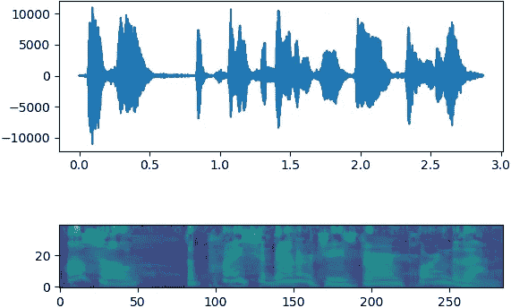
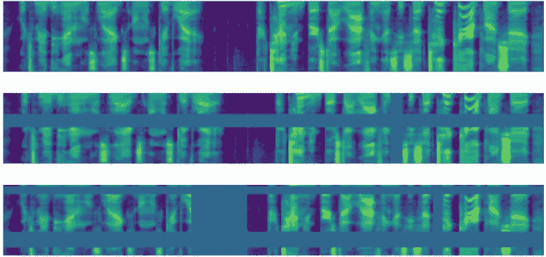
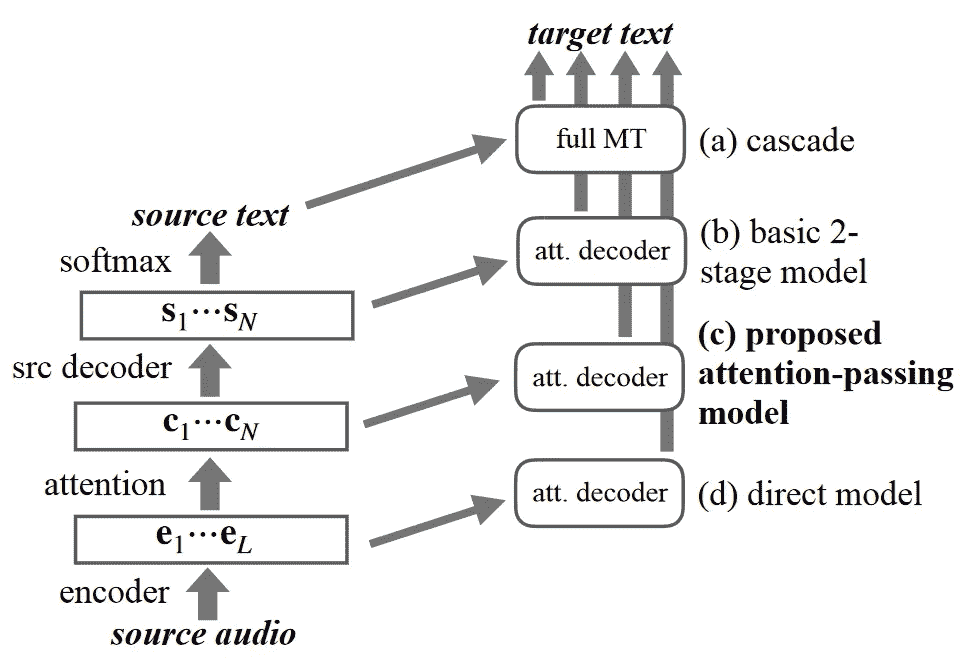

# 用于端到端语音翻译的数据增强

> 原文：<https://towardsdatascience.com/data-augmentation-for-end-to-end-speech-translation-be4a1bd9ffbf?source=collection_archive---------36----------------------->

## 如何利用音频和文本增强技术解决数据匮乏问题

亚历山大·辛恩在 [Unsplash](https://unsplash.com?utm_source=medium&utm_medium=referral) 上的照片

E 端到端(或直接)语音翻译是近年来备受研究界关注的一种语音翻译方法。它包括使用单个深度学习模型，该模型学习以端到端的方式生成输入音频的翻译文本。它的流行是由于实现这一困难任务的科学兴趣，也是由于实际应用中的预期效果。

 [## 机器可以学习翻译你的声音

### 我们如何为 IWSLT 2018 评估活动构建我们的端到端语音到文本翻译系统。

medium.com](https://medium.com/machine-translation-fbk/machines-can-learn-to-translate-directly-your-voice-fbk-iwslt18-bb284ccae8bc) 

使用单一模型很有吸引力，原因有很多:

1.  用单个模型解码比用(至少)自动语音识别(ASR)和机器翻译(MT)系统的流水线解码更快。
2.  缺少转录步骤可以防止早期不良决策的传播(错误传播)，可能会导致较高的质量。
3.  单个系统比级联系统更易于管理和使用，并且在部署时可以节省内存和 GPU 资源。

这有一个大问题。端到端的语音翻译需要来自 ASR 和 MT 的不同数据，虽然这两项任务已经研究了几十年，并且有大量数据可供他们使用(至少对于某些语言来说)，但这种新方法很少公开可用。在 ST 中，我们只有几十万个资源最好的语言的段对，而神经机器翻译系统(一个更简单的任务，因为输入是文本的)通常在几千万或几亿个句子对上训练。

那么，这么小的数据，怎么训练一个系统呢？到目前为止，答案是**数据扩充**:通过现有数据的转换创建合成数据。

数据增强是深度学习中常用的技术，因为这种方法以数据饥渴而闻名，模型可以通过添加数据来显著提高质量。经典的方法是改变输入样本，同时保持其类别标签不变。计算机视觉的一个例子是旋转图像:当从不同的角度观看时，输入图像会不同，但是内容是相同的。狗还是狗，猫还是猫，虽然是轮换的。这里可以找到一个实际的例子:

 [## 数据扩充:用几行 Python 代码增强您的影像数据集

### 为了表现良好，图像分类器需要大量的图像进行训练。深度学习算法可能无法分类…

medium.com](https://medium.com/@thimblot/data-augmentation-boost-your-image-dataset-with-few-lines-of-python-155c2dc1baec) 

在这篇文章中，我想重点介绍文本和音频增强技术，这些技术已被提议用于语音翻译，但也可用于涉及这些类型数据的其他任务。显然，旋转和移动像素是两种不适用于文本和音频的技术，因此我们需要更复杂的技术，有时涉及其他机器学习系统的使用。

# 音频增强

第一种方法类似于图像:改变输入但保留标签。ASR 社区广泛使用的一种方法是*速度扰动*，它包括使用像 [SoX](http://sox.sourceforge.net/) 这样的工具来扰动音频速度，同时保持翻译固定。例如，它被用于在 [IWSLT 2019](https://workshop2019.iwslt.org/59.php) [1]上的获奖作品，这是一个关于语音翻译的国际研讨会，每年都组织一次比赛。一种常见的做法是将速度(或持续时间，相当于我们的目的)乘以一个范围在[0.9–1.1]内的随机因子，这通常会产生一个仍然类似人类的音频，但听起来与原始音频不同。这种转换通常在数据集构建时离线应用。

另一种音频转换发生在*在线*。只有某些类型的转换可以在线应用，因为当前的语音翻译系统接收的输入是频谱图，而不是波形。为了在训练期间占用更少的磁盘空间并节省计算时间，数据集通常存储为光谱图，这需要计算功率并且比波形更紧凑。

同一话语的波形(上图)和声谱图(下图)。波形是时间序列，而声谱图就像一个矩阵:x 轴代表时间，y 轴代表频率。

SpecAugment [2]是去年提出的一种流行的谱图增强技术，并取得了巨大的成功。它包括三个步骤:
*i)时间弯曲*是一种复杂且计算昂贵的算法，它沿着时间轴移动声谱图的一部分； *ii)频率掩蔽*应用水平掩蔽，其覆盖整个时间维度的一些频率； *iii)时间屏蔽*应用垂直屏蔽，覆盖一些相邻时间步长的所有频率。时间和频率掩蔽是 SpecAugment 的两个最有效的组成部分，基本上迫使模型预测目标序列，同时对音频的一些频率或部分充耳不闻。这两种类型的遮罩在每次迭代中都有不同的宽度和位置，因此模型可以学习使用它们。

应用于原始输入的 SpecAugment(最上面的图像)。来自 SpecAugment 论文[2]

Nguyen 和他的同事最近提出了一个类似的想法，以在线方式干扰音频速度。他们的方法称为*时间拉伸*将输入频谱图划分为固定宽度的窗口，并使用从(0.8–1.25)中选取的不同随机因子收缩或拉伸每个窗口。利用这种技术，每个谱图将具有以不同且对比的方式随时间扰动的窗口，并且根据作者，它可以代替离线速度扰动。

# 迁移学习

在任务之间传递知识的最直接的方法，通常是当两者中的一个有更多的数据可用时，就是所谓的预训练。首先，在大资源任务上训练一个模型，然后对第二个任务使用相同的深度学习架构，并用从第一个任务中学习到的权重初始化权重。这正是将 MT 和 ASR 系统的知识转移到直接 st 系统的第一批方法之一[4，5，6]。使用将用于 direct ST 的相同架构(至少编码器端)训练 ASR 系统。使用将用于 direct ST 的相同解码器架构训练 MT 系统。最后，使用 ASR 中学习的编码器权重和 MT 中学习的解码器权重初始化 direct ST 系统。这种方法导致**更快的收敛**和更好的**翻译质量**，但是，解码器预训练似乎不如编码器预训练有效。为了克服这个问题，Bahar 等人[7]表明，如果在预训练的编码器之上再加一个“适配器”编码器层，解码器预训练会更有效。

# 两级解码

Kano 等人[8]提出了两阶段解码，作为更好地使用预训练组件的方法。它是一个由三个部件组成的网络，一个编码器和两个级联的解码器。第一个解码器生成源语言的句子，类似于 ASR 系统，而第二个解码器生成目标语言的文本。第二解码器利用第一解码器的**状态计算其注意力，就在它们被用于选择输出符号之前。在这个意义上，两级解码类似于级联系统，但是它**没有离散化源序列**以防止错误。为了提高效率，从预训练的 ASR 和 MT 模型初始化两阶段解码模型。Sperber 等人[9]提出了一个“注意力传递”模型，该模型改进了两阶段解码模型，以便进行更有效的预训练。它们识别两级解码中的问题，因为它将第一解码器输出作为注意力输入传递到第二解码器。解码器状态已经包含选择要生成的下一个字的信息，然后一种形式的*错误传播*再次出现在模型中。为了克服它，他们提出使用由第一解码器和编码器之间的注意力产生的*上下文向量*作为第二解码器注意力的输入。这样，他们假设第二解码器直接连接到相关的音频部分，并且第一解码器做出的一些早期决策不会引入错误。通过在同一训练中涉及 ASR、ST 和 MT 的多任务学习的巧妙方案，该模型似乎更具数据效率。**

级联、直接 ST、注意传递模型和两阶段解码模型的图示比较。鸣谢:Sperber 等人

# 知识蒸馏

如果你的数据被组织成三元组音频-抄本-翻译，那么机器翻译模型的知识可以通过知识提炼转移到直接的机器翻译模型。对于每个三元组，音频作为直接 ST 模型的输入，抄本作为 MT 模型的输入，然后直接 ST 模型根据 MT 模型生成的分布而不是基础事实进行训练。这种训练在某些方面是有用的:1)MT 模型生成的*软分布*比 one-hot ground truth 更容易学习；以及 2)MT 分布还包含 MT 模型知道但可能不存在于 ST 训练数据中的符号之间的一些关系。这样，直接 ST 模型可以学习比训练数据中存在的更大的词汇[11]。

# 监管不力

贾等人[12]提出使用现有系统为其他任务创建合成并行音频翻译数据:1)当只有音频抄本数据可用时，使用机器翻译系统将抄本翻译成目标语言；2)当只有并行的源-目标文本可用时，使用文本到语音(TTS)系统来生成源音频。使用这种方法，直接 ST 的训练数据可以增加几个数量级，并且用于这些任务的系统的质量确保数据是高质量的。他们还表明，使用 MT 比 TTS 更有效，可能是因为合成数据与真实条件下的人类语音不太相似。Pino 等人[13]也证实了类似的结果，他们还表明，这种数据扩充优于所有其他提出的方法，在某些情况下，也使得预训练无用。

# 多语言 ST

数据扩充的最后一项技术是多语言化。由于多语言机器翻译提高了低资源语言的翻译质量，Inaguma 等人[14]和 us [15]在两项平行工作中提出利用不同语言的数据。目标有两个:1)更多的数据来训练音频编码器，以及 2)类似语言之间的*正向传输*，这些语言可能具有类似的语法或相同的单词，如英语和法语。这两项研究的结果都是积极的，但是当使用其他数据增强技术时，是否也能保持多语言培训的收益还有待观察。

# 结论

对于直接 ST，已经提出了许多技术来利用比该任务可用的少数数据更多的数据。我个人建议建立一个最先进的系统，始终使用用强 ASR 模型预训练的编码器，通过用强 MT 系统生成合成翻译来扩充训练集，并在训练期间使用 SpecAugment。在我们的实验中，这种组合总是有效的，或者至少不会造成伤害。其他技术也是有用的，但当与其他方法结合使用时，它们的有效性会降低，如果它们增加了训练时间，这可能是一个问题。

如果你现在正在接近这个领域，而且如果你在基于音频和/或文本的相关领域中工作，我希望这种对直接 ST 的现有数据扩充方法的综述是有用的。特别是，通过使用针对其他任务的更多数据训练的其他组件生成数据，或者使用扭曲原始数据的在线增强技术，可以产生巨大的改进。

如果您对 direct ST 感兴趣，但不知道从哪里开始使用它，请查看我的教程:

 [## 开始使用端到端语音翻译

### 使用 Pytorch，您只需几个步骤就可以翻译英语演讲

towardsdatascience.com](/getting-started-with-end-to-end-speech-translation-3634c35a6561)  [## 阅读和撰写 ML 研究论文的技巧

### 从几十次同行评审中获得的经验教训

towardsdatascience.com](/tips-for-reading-and-writing-an-ml-research-paper-a505863055cf) 

# 参考

[1] Potapczyk，Tomasz 等人(2019)。三星用于 IWSLT 2019 端到端语音翻译任务的系统。IWSLT 2019 会议录。

[2] Park，Daniel S .等人，“SpecAugment:一种用于自动语音识别的简单数据扩充方法”继续进行。散客 2019(2019):2613–2617。

[3] Nguyen，Thai-Son 等，“用动态数据增强改进序列间语音识别训练” *arXiv 预印本 arXiv:1910.13296* (2019)。

[4] Weiss，Ron J .等，“序列到序列模型可以直接翻译外国语音。” *Proc。散客 2017*(2017):2625–2629。

[5] Bérard，Alexandre 等，《有声读物的端到端自动语音翻译》 *2018 IEEE 声学、语音和信号处理国际会议(ICASSP)* 。IEEE，2018。

[6] Bansal，Sameer 等人，“高资源语音识别的预训练改善低资源语音到文本的翻译。”NAACL-HLT 会议录*。2019.*

[7]巴哈、帕尼尔、托拜厄斯·比施克和赫尔曼·内伊。“端到端语音到文本翻译的比较研究”ASRU 会议录。(2019 年 a)。

[8] Kano，Takatomo，Sakriani Sakti 和中村聪。"面向端到端英日语音翻译的结构化课程学习."(2017).

[9] Sperber，Matthias 等人，“鲁棒和数据高效的端到端语音翻译的注意力传递模型”*计算语言学协会汇刊*7(2019):313–325。

[10]刘，，等.《端到端语音翻译与》*过程。散客 2019*(2019):1128–1132。

[11]辛顿、杰弗里、奥里奥尔·维尼亚尔斯和杰夫·迪恩。"从神经网络中提取知识." *arXiv 预印本 arXiv:1503.02531* (2015)。

[12]贾，叶，等.“利用弱监督数据改进端到端语音到文本的翻译”*ICA ssp 2019–2019 IEEE 声学、语音和信号处理国际会议(ICASSP)* 。IEEE，2019。

[13] Pino，Juan 等人，“利用间接训练数据进行端到端自动语音翻译:交易技巧”*第十六届国际口语翻译研讨会论文集*。2019.

[14] Inaguma，Hirofumi，等，“多语言端到端语音翻译”*《ASRU 论文集》* (2019)。

[15]迪甘吉、马蒂亚·安东尼诺、马泰奥·内格里和马尔科·图尔奇。“一对多多语言端到端语音翻译。”ASRU 论文集(2019)。