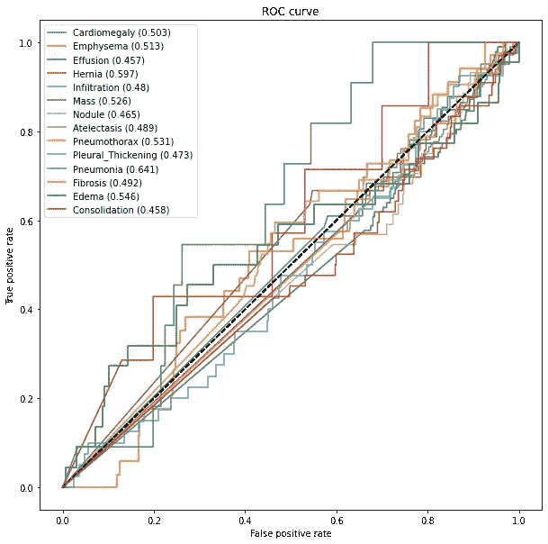

# 医学图像中的数据增强

> 原文：<https://towardsdatascience.com/data-augmentation-in-medical-images-95c774e6eaae?source=collection_archive---------18----------------------->

## [实践教程](https://towardsdatascience.com/tagged/hands-on-tutorials)

## 如何通过重塑和重采样数据来提高视觉模型的性能


[疾控中心](https://unsplash.com/@cdc?utm_source=medium&utm_medium=referral)在 [Unsplash](https://unsplash.com?utm_source=medium&utm_medium=referral) 上拍摄的照片

机器学习的普及以奇妙的方式改变了我们的世界。机器学习的一些著名应用允许我们做以前不可想象的事情，比如确定一幅图像是不是热狗。


截图来自 HBO 在《硅谷》节目中“SeeFood Technologies”开发的 Not Hotdog 应用。

随着 TensorFlow 和 PyTorch 等开源神经网络框架的发布，开发图像识别和分类应用程序的便利性在过去几年得到了简化。这些神经网络框架的使用是基于标记的训练数据的可用性，这在云基础设施中变得更加容易访问。神经网络需要大量的数据来适当地加权各层之间的函数。然而，在医学成像等领域，大量标记的训练数据并不总是可用的。对于那些对医学成像数据感兴趣的人，可以在 Giorgos Sfikas 的 GitHub 找到大量资源。在 [Neptune.ai](https://neptune.ai/blog/data-augmentation-in-python) 上可以找到关于数据增强技术和工具的一个很好的资源。

如何有效地训练一个神经网络，用有限的训练数据对医学图像进行分类。一个答案是增加你已经有的标签数据，并将转换后的图像输入到你的模型中。扩充有两个目的。首先，理论上来自增强的附加标记训练数据将提高您的图像分类模型准确性**【警告！！！**会导致过度拟合】。第二，转换将允许模型在方向变化上进行训练。当在测试或真实世界数据中遇到微妙的变化时，可能提供模型灵活性。

**它真的有用吗？**

以下是经过数据增强和未经数据增强训练的模型的准确性。我将在本文后面更详细地介绍这些结果。


使用不同形式增强的 x 射线多类分类的性能高于随机的类别数涉及大于 0.5 的曲线下面积(AUC)分数。图片作者。

一个小训练集的不错的改进。我只使用了 40GB 总数据中的 2GB 来训练模型。数据增强让我想起了半监督学习，因为你正在创建新的标记数据来训练模型。数据扩充也类似于过采样技术。对于那些有兴趣了解更多关于半监督方法的人，请查看下面这篇由 Andre Ye 撰写的文章。

[](/supervised-learning-but-a-lot-better-semi-supervised-learning-a42dff534781) [## 监督学习，但是更好:半监督学习

### 为什么半监督学习是 ML 的未来

towardsdatascience.com](/supervised-learning-but-a-lot-better-semi-supervised-learning-a42dff534781) 

数据扩充最常用于图像。数据扩充有两个主题。第一个是图像转换，第二个是合成图像创建。出于本文的目的，我将主要关注使用 python 在医学成像中的图像转换应用。本演示中使用的部分代码改编自 [deeplearning.ai](https://www.deeplearning.ai/) 的《医疗诊断人工智能》课程。代码库可以在 [GitHub](https://github.com/Datadolittle/augmentation) 上找到，用于建模的数据可以从 [NIH 临床中心胸部 x 光数据库](https://nihcc.app.box.com/v/ChestXray-NIHCC/folder/36938765345)中获得。

## 我们如何执行数据扩充？

python 中的图像操作可以使用多个库来执行。 [PIL](https://python-pillow.org/) 和[增强器](https://github.com/mdbloice/Augmentor)是两个可以直接在图像上操作的库的例子。Augmentor 还包括一个流水线功能，可以一次处理多个图像。出于本文的目的，我利用了 keras _ 预处理的一部分 [ImageDataGenerator](https://www.tensorflow.org/api_docs/python/tf/keras/preprocessing/image/ImageDataGenerator) 。图像增强的类型包括旋转、裁剪、缩放、颜色范围变化、灰度和翻转。增强器，还包括一个随机噪声分段创建对象检测模型。执行任何类型的数据扩充时，请务必记住模型的输出以及扩充是否会影响最终的分类。例如，在 X 射线数据中，心脏通常在图像的右侧，然而下图显示了水平翻转增强无意中产生了一种医学状况，称为 situs inversus。


如果位置很重要，数据扩充可能会产生分类标签问题。黄色圆圈突出心脏。这是水平翻转的同一个图像。图片作者。

## 本文中使用的数据扩充

出于本文的目的，我使用了三个级别的数据扩充。首先，我运行了一个没有任何增强图像的模型。接下来，我使用了基本的颜色正常化增强。最后，我使用复杂的增强技术创建了一个模型，比如缩放、旋转和裁剪图像，如下例所示。


复杂增强训练中使用的数据增强示例。图片作者。

# 实现增强方法(代码)

## 数据和库

完整代码可以在文章 [GitHub](https://github.com/Datadolittle/augmentation) 上找到。本教程的数据可以从 [NIH 临床中心胸部 x 光](https://nihcc.app.box.com/v/ChestXray-NIHCC/folder/37178474737)数据库中找到。在这个例子中，我只利用了 images_001.tar.gz 中的数据，它被解压缩成大约 5K 的图像(~2GB)。还有，我下载了图片标签为[Data _ Entry _ 2017 _ v 2020 . CSV](https://nihcc.app.box.com/v/ChestXray-NIHCC/folder/36938765345)。用于执行数据扩充的库需要 [keras](https://anaconda.org/conda-forge/keras) 和[keras-预处理](https://anaconda.org/conda-forge/keras-preprocessing)。我用 conda 安装了这些包。

```
### Augmentation
from keras.preprocessing.image import ImageDataGenerator, array_to_img, img_to_array, load_img### Visuals
import matplotlib.pyplot as plt
import pandas as pd### Modeling
from tensorflow.keras.applications.densenet import DenseNet121
from tensorflow.keras.layers import Dense, GlobalAveragePooling2D
from tensorflow.keras.models import Model
from keras.models import load_model
from keras import backend as K
```

创建模型时，我遇到了以下错误:

```
AttributeError: module 'tensorflow.python.framework.ops' has no attribute '_TensorLike'
```

解决方案:在 keras 导入调用之前添加 tensorflow，如下所示

```
from tensorflow.keras.applications.densenet import DenseNet121
from tensorflow.keras.layers import Dense, GlobalAveragePooling2D
from tensorflow.keras.models import Model
```

## 准备图像和元数据

为了给 x 射线图像分配标签，我需要将元数据中的 condition 列二进制化。这项研究中有 15 个独特的条件:

```
['Cardiomegaly', 'Emphysema', 'Effusion', 'Hernia', 'Infiltration', 'Mass', 'Nodule', 'Atelectasis','Pneumothorax','Pleural_Thickening', 'Pneumonia', 'Fibrosis', 'Edema', 'Consolidation', 'No Finding']
```

在 x 光检查中，病人可能有不止一种情况。我使用 scikit-learn 将数据转换成适当的格式，其中包含 14 种条件的二进制值，不包括“无发现”类别。

```
from sklearn.preprocessing import MultiLabelBinarizer
### Binarise labels
mlb = MultiLabelBinarizer()
expandedLabelData = mlb.fit_transform(df["labels"])
labelClasses = mlb.classes_### Create a DataFrame from our output
expandedLabels = pd.DataFrame(expandedLabelData, columns=labelClasses)
expandedLabels['Images'] = df['Image Index']
expandedLabels['ID'] = df['Patient ID']
```

我将路径添加到相应的 x 射线图像，作为多列二进制数据帧中的新列。

接下来，为了测试建模性能，我将数据分为训练组(80%)和测试组(20%)。下图显示了训练数据集中类的频率。


训练数据中条件的频率。图片作者。

## 建造生成器来增强图像

ImageDataGenerator 能够将图像处理成一个生成器对象，以避免将所有图像转换加载到内存中。ImageDataGenerator 也能够直接从熊猫数据帧创建生成器。我用下面的代码构建了生成器:

```
def get_train_generator(df, image_dir, x_col, y_cols, shuffle=True, batch_size=8, seed=1, target_w = 320, target_h = 320): ### Perform data augmentation here
    image_generator = ImageDataGenerator(rotation_range = 5, shear_range = 0.02,zoom_range = 0.02, samplewise_center=True, samplewise_std_normalization= True)

    ### Create the image generator
    generator = image_generator.flow_from_dataframe(
            dataframe=df,
            directory=image_dir,
            x_col=x_col,
            y_col=y_cols,
            class_mode="raw",
            batch_size=batch_size,
            shuffle=shuffle,
            seed=seed,
            target_size=(target_w,target_h))

    return generator
```

**要更改增强量，通过调整 ImageDataGenerator 中调用的变量来更改分配给 image_generator 的值。**要调用该生成器，请使用以下代码行:

```
IMAGE_DIR = "images/"
train_generator = get_train_generator(training, IMAGE_DIR, "Images", labels)
```

我还为测试数据构建了一个生成器。

## 构建深度学习模型

我使用了一个来自 imagenet 的 [DenseNet121 架构](https://arxiv.org/abs/1608.06993)来预训练模型。

```
### Pre-trained model
base_model = DenseNet121(weights='imagenet', include_top=False)x = base_model.output### Add spatial average pooling and logistic layer
x = GlobalAveragePooling2D()(x)
predictions = Dense(len(labels), activation="sigmoid")(x)model = Model(inputs=base_model.input, outputs=predictions)
model.compile(optimizer='adam', loss='categorical_crossentropy')### Build model and predict
model.fit(train_generator, validation_data=valid_generator,steps_per_epoch=100, validation_steps=25, epochs = 10)predicted_vals = model.predict(valid_generator, steps = len(valid_generator))
```

## 可视化输出

使用 AUC 曲线可视化模型预测。每次迭代的 AUC 值保存在下表中:


按增强状态划分的 AUC 值。图片作者。

我为每种情况和增强状态创建了 AUC 曲线。

```
import numpy as np
from sklearn.metrics import roc_auc_score, roc_curvedef get_roc_curve(labels, predicted_vals, generator):
    auc_roc_vals = []
    for i in range(len(labels)):
        try:
            gt = generator.labels[:, i]
            pred = predicted_vals[:, i]
            auc_roc = roc_auc_score(gt, pred)
            auc_roc_vals.append(auc_roc)
            fpr_rf, tpr_rf, _ = roc_curve(gt, pred)
            plt.figure(1, figsize=(10, 10))
            plt.plot([0, 1], [0, 1], 'k--')
            plt.plot(fpr_rf, tpr_rf,
                     label=labels[i] + " (" + str(round(auc_roc, 3)) + ")")
            plt.xlabel('False positive rate')
            plt.ylabel('True positive rate')
            plt.title('ROC curve')
            plt.legend(loc='best')
        except:
            print(
                f"Error in generating ROC curve for {labels[i]}. "
                f"Dataset lacks enough examples."
            )
    plt.show()
    return auc_roc_valsauc_rocs = get_roc_curve(labels, predicted_vals, valid_generator)
```

## 没有增加



无增强模型的性能。图片作者。

## 基本增强


具有基本增强的模型的性能。图片作者。

## 复合扩增


具有复杂扩充的模型的性能。图片作者。

下表总结了使用增强功能的模型的性能:


使用不同形式增强的 x 射线多类分类的性能高于随机的类别数涉及大于 0.5 的曲线下面积(AUC)分数。图片作者。

## 讨论和结论

在本文中，我介绍了数据扩充的概念，并在一个小型多类识别任务中演示了它的相对性能改进。数据增强是一种有用的工具，可以扩展深度学习模型的可用标记数据量。我描述了一些类型的数据扩充，并介绍了在不考虑分类方向的情况下进行扩充的潜在缺陷。在这个数据集中，复杂的增强在胸部 x 光片中表现不佳。疝通常出现在腹部底部附近的组织中。通过复杂的增强，由于颜色调整或旋转，我可能会改变模型区分疝和周围组织的能力。


显示食管裂孔疝相对位置的图像。图片来自维基百科。

建模只利用了全部可用数据的一小部分。超过 4000 幅训练图像(在复杂扩增中为 24000 幅)时，数据扩增的优势可能更加明显。这篇文章的代码可以在 [GitHub](https://github.com/Datadolittle/augmentation) 上找到。同样，对于那些对医学成像数据集感兴趣的人来说，可以在 [Giorgos Sfikas 的 GitHub](https://github.com/sfikas/medical-imaging-datasets) 找到大量资源。我的名字是[科迪·格利克曼](https://codyglickman.com/)，可以在 [LinkedIn](https://www.linkedin.com/in/codyglickman/) 上找到我。一定要看看我下面的其他文章:

[](/creating-photo-mosaics-using-python-49100e87efc) [## 使用 Python 创建照片镶嵌

### 一步一步的教程，让你自己的美丽的图像

towardsdatascience.com](/creating-photo-mosaics-using-python-49100e87efc) [](/to-beard-or-not-to-beard-that-is-the-question-b46864d7e003) [## 刮胡子，还是不刮胡子，这是个问题

### 使用深度学习对有胡须和无胡须的照片进行年龄分类

towardsdatascience.com](/to-beard-or-not-to-beard-that-is-the-question-b46864d7e003) [](/what-or-why-in-machine-learning-e2a73da528c8) [## 机器学习中的什么或为什么

### 使用 Python 解释模型的综合指南

towardsdatascience.com](/what-or-why-in-machine-learning-e2a73da528c8) 

旋转增强。图片作者。