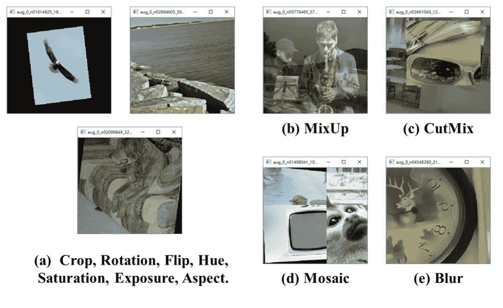
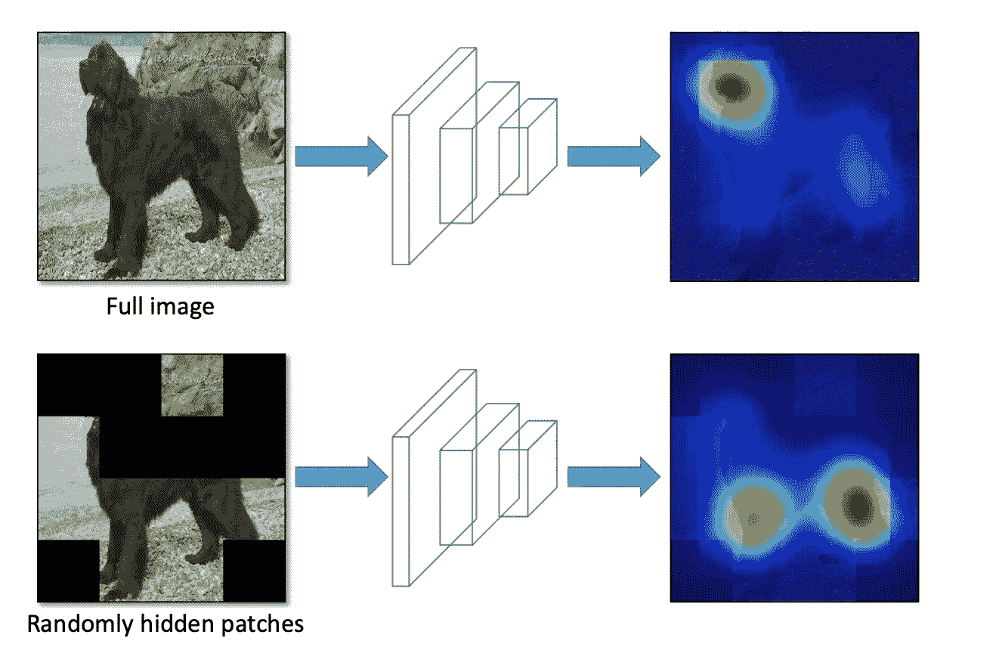
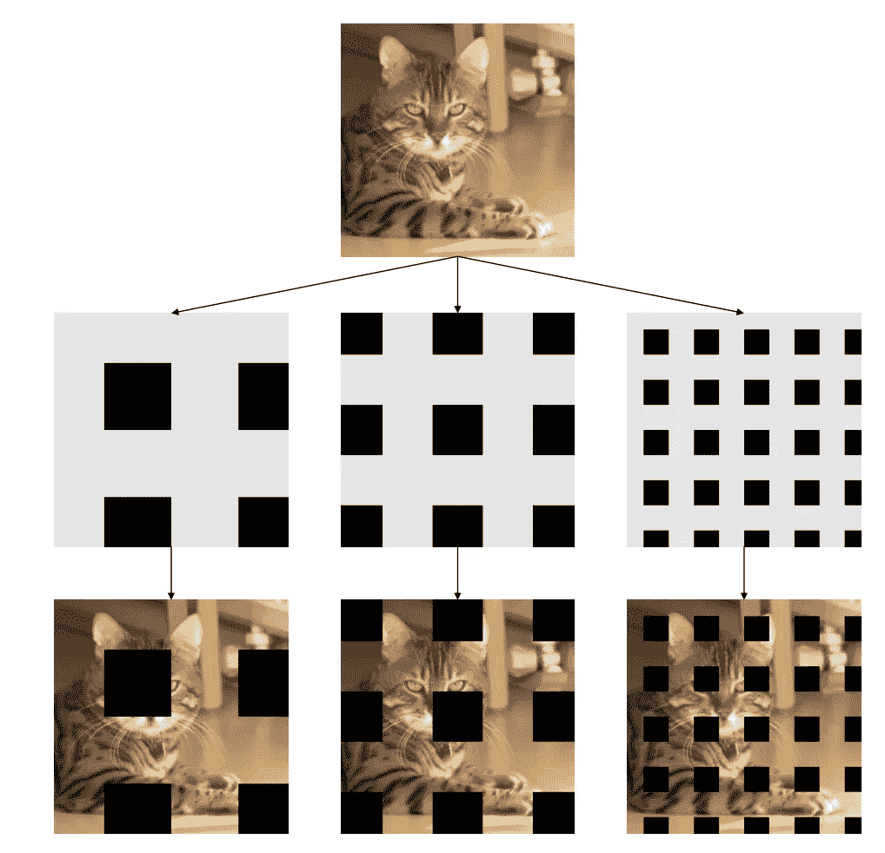
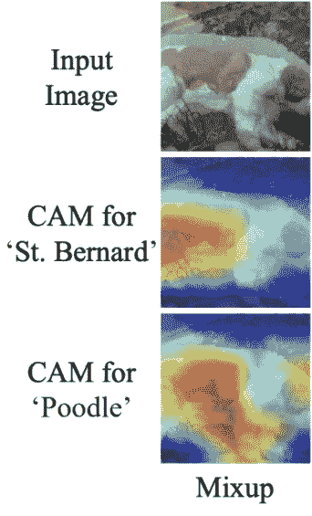
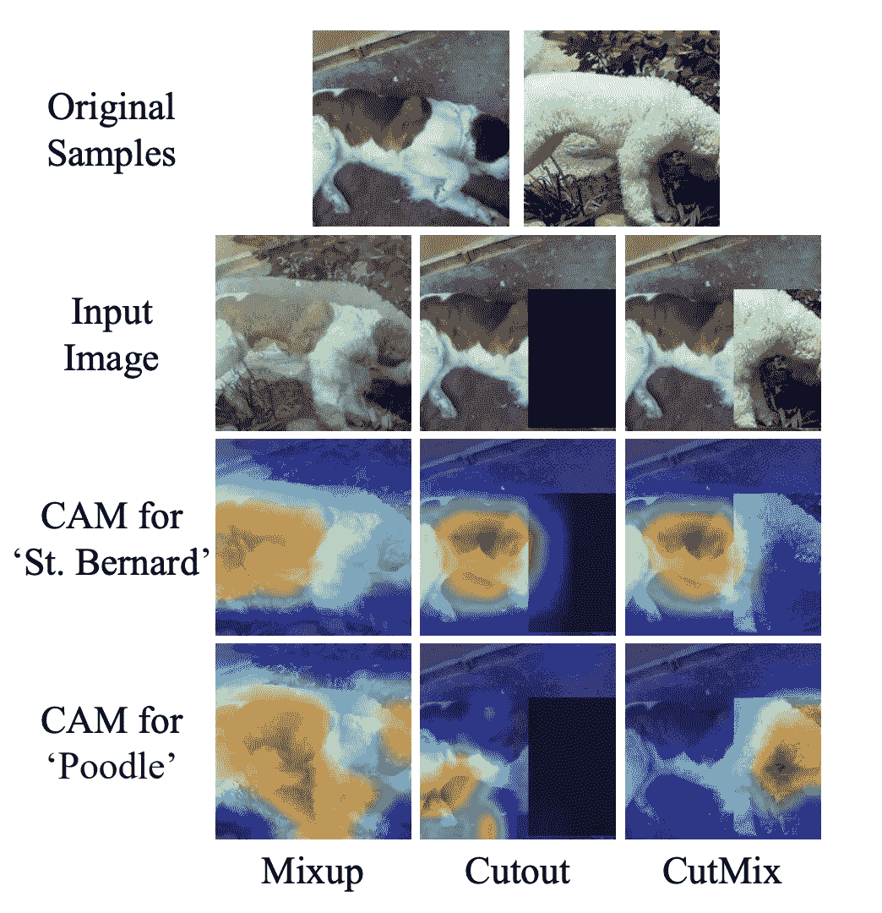
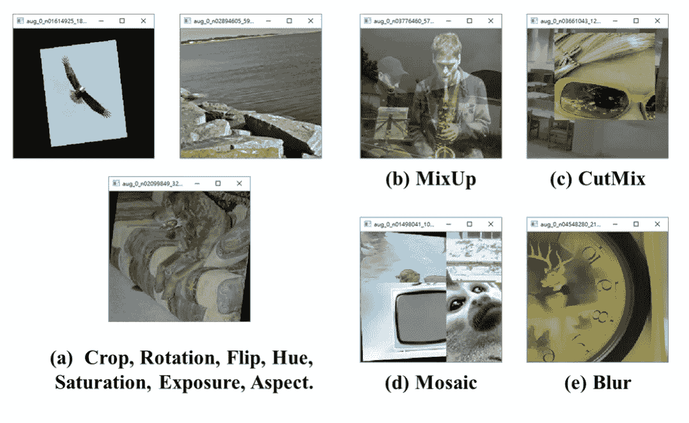

# YOLOv4 中的数据扩充

> 原文：<https://towardsdatascience.com/data-augmentation-in-yolov4-c16bd22b2617?source=collection_archive---------11----------------------->

## YOLOv4 的“秘密”不是架构:而是数据准备。注意:我们也在博客上发布了 YOLOv4 中的[数据增强。](/data-augmentation-in-yolov4-c16bd22b2617)

[号物体探测空间](https://blog.roboflow.com/object-detection/)继续快速移动。不到两个月前，谷歌大脑团队发布了用于[物体检测](https://blog.roboflow.com/the-ultimate-guide-to-object-detection/)的 EfficientDet，挑战 YOLOv3 作为(近)[实时物体检测](https://blog.roboflow.com/the-ultimate-guide-to-object-detection/)的首要模型，并推动了物体检测的可能性。我们写了一系列的帖子[来比较 YOLOv3 和 EfficientDet](https://blog.roboflow.ai/yolov3-versus-efficientdet-for-state-of-the-art-object-detection/) 、[训练 YOLOv3 定制数据](https://blog.roboflow.ai/releasing-a-new-yolov3-implementation/)、[和训练 EfficientDet 定制数据](https://blog.roboflow.ai/training-efficientdet-object-detection-model-with-a-custom-dataset/)，我们发现了令人印象深刻的结果。

* *点击此处查看我们关于如何在您的自定义数据集上训练 YOLOv4 的教程[。](https://blog.roboflow.ai/training-yolov4-on-a-custom-dataset/)

现在 YOLOv4 已经发布，显示 COCO 平均精度(AP)和每秒帧数(FPS)分别提高了 10%和 12%。在这篇文章中，我们将看到作者如何通过深入研究 YOLOv4 中使用的 [**数据增强技术**](https://blog.roboflow.com/boosting-image-detection-performance-with-data-augmentation/) **的细节来实现这一突破。**

```
The founder of Mosaic Augmentation, Glen Jocher has released a new YOLO training framework titled YOLOv5\. You may also want to see our post on [YOLOv5 vs YOLOv4](https://blog.roboflow.ai/yolov5-improvements-and-evaluation/) This post will explain some of the pros of the new [YOLOv5 framework](https://blog.roboflow.ai/yolov5-improvements-and-evaluation/).[YOLOv5 Breakdown](https://blog.roboflow.ai/yolov5-improvements-and-evaluation/)
```



([引文](https://arxiv.org/pdf/2004.10934.pdf))

数据增强对于计算机视觉的重要性并不新鲜！请看我们一月份的帖子，解释了 [*图像预处理和增强对于计算机视觉*](https://blog.roboflow.ai/why-preprocess-augment/) *有多重要。*

# YOLOv4 中的一包赠品是什么？

YOLOv4 的作者在他们题为“一袋赠品”的论文中包括了一系列的贡献可以采取一系列步骤来提高模型的性能，而不会增加推理时的延迟。因为它们不能影响模型的推理时间，所以大多数都在训练管道的[数据管理](https://blog.roboflow.com/label-management-for-computer-vision/)和[数据扩充](https://blog.roboflow.com/boosting-image-detection-performance-with-data-augmentation/)方面进行了改进。这些技术改进并扩大了训练集，从而将模型暴露给原本看不到的场景。 [**计算机视觉中的数据增强**](https://blog.roboflow.com/boosting-image-detection-performance-with-data-augmentation/) **是从您的数据集获得最大价值的关键，最新的研究继续验证这一假设。**

# 计算机视觉中的数据增强

[图像增强](https://blog.roboflow.com/boosting-image-detection-performance-with-data-augmentation/)从现有的训练数据中创建新的训练样本。不可能为我们的模型在推理中可能看到的每一个真实世界的场景真正捕捉图像。因此，调整现有的训练数据以推广到其他情况允许模型从更广泛的情况中学习。

YOLOv4 的作者引用了许多技术，这些技术最终启发了他们的免费包。我们在下面提供一个概述。

# 变形

**光度失真—** 这包括改变图像的亮度、对比度、饱和度和噪声。(例如，写于[计算机视觉中的模糊数据增强](https://blog.roboflow.ai/using-blur-in-computer-vision-preprocessing/)。)


在我们的平台上调节亮度

**几何扭曲—** 这包括随机缩放、裁剪、翻转和旋转。这些类型的增强可能特别棘手，因为边界框也会受到影响并且必须更新。(例如，我们已经写过如何在计算机视觉中使用[随机裁剪数据增强。)](https://blog.roboflow.ai/why-and-how-to-implement-random-crop-data-augmentation/)


在我们的平台上翻转图像

这两种方法都是像素调整，这意味着原始图像可以通过一系列变换轻松恢复。

# 图像遮挡

**随机擦除—** 这是一种数据扩充技术，用随机值或训练集的平均像素值替换图像区域。通常，它是通过改变图像擦除的比例和擦除区域的纵横比来实现的。在功能上，这成为一种正则化技术，它防止我们的模型记忆训练数据和过度拟合。


([引文](https://arxiv.org/pdf/1708.04896.pdf)

**剪切—** 正方形区域在训练期间被屏蔽。剪切区域仅对 CNN 的第一层隐藏。这非常类似于随机擦除，但是在覆盖的遮挡中有一个常量值。目的是相似的:我们减少过度拟合。


([引文](https://arxiv.org/pdf/1708.04552.pdf))

**捉迷藏—** 将图像分成 SxS 补丁网格。以某种概率隐藏每个补丁(p_hide)。这允许模型学习对象看起来像什么，而不仅仅学习对象的单个部分看起来像什么。



([引文](https://arxiv.org/pdf/1704.04232.pdf))

**网格遮罩—** 图像区域以类似网格的方式隐藏。类似于捉迷藏，这迫使我们的模型学习构成单个对象的组成部分。



([引文](https://arxiv.org/pdf/2001.04086.pdf))

**混合—** 图像对及其标签的凸叠加。([此处纸](https://arxiv.org/pdf/1710.09412.pdf))



([引文](https://arxiv.org/pdf/1905.04899.pdf))

# YOLOv4 中部署的数据增强策略

现在，我们将访问 YOLOv4 在培训期间部署的数据增强策略。研究过程的特点是一系列的实验，所以我们可以想象作者实验了许多没有进入最终论文的策略。这进一步证明了**在定制视觉任务中，在自己的** [**训练/测试集**](https://blog.roboflow.com/train-test-split/) 上探索各种数据增强策略非常重要。

**CutMix —** 通过从一幅图像中剪切部分并将其粘贴到增强图像上来组合图像。图像的剪切迫使模型学习基于大量特征进行预测。参见上面的“捉迷藏”,在没有剪切的情况下，该模型专门依靠狗的头部来进行预测。如果我们想准确地识别一只头藏起来的狗(可能藏在灌木丛后面)，这是有问题的。在 CutMix 中，剪切部分被替换为另一个图像的一部分以及第二个图像的基本事实标签。在图像生成过程中设置每个图像的比率(例如，0.4/0.6)。在下面的图片中，你可以看到 CutMix 的作者如何证明这种技术比简单的混合和剪切更好。



([引文](https://arxiv.org/pdf/1905.04899.pdf)

**拼接数据增强—** 拼接数据增强将 4 幅训练图像按一定比例合成一幅。Mosaic 是 YOLOv4 中引入的第一个*新的*数据增强技术。这允许模型学习如何在比正常情况下更小的尺度上识别对象。它还鼓励模型在帧的不同部分定位不同类型的图像。


([引文](https://arxiv.org/pdf/2004.10934.pdf))

马赛克数据增强 YouTube 视频！

**类别标签平滑—** 类别标签平滑不是一种图像处理技术，而是对类别标签的直观改变。通常，边界框的正确分类被表示为类的一个热点向量[0，0，0，1，0，0，…]，并且基于该表示来计算损失函数。然而，当一个模型对接近 1.0 的预测变得过于确定时，它通常是错误的、过度拟合的，并且在某种程度上忽略了其他预测的复杂性。根据这种直觉，对类标签表示进行编码以在某种程度上评估这种不确定性是更合理的。自然，作者选择 0.9，所以[0，0，0，0.9，0…]来表示正确的类。

**自我对抗训练(SAT)——**该技术通过转换输入图像，使用模型的状态来通知漏洞。首先，图像通过正常的训练步骤。然后，损失信号被用于以对模型最有害的方式来改变图像，而不是通过权重来支持。后来在训练中，模型被迫面对这个特别困难的例子，并围绕它学习。在我们这里讨论的技术中，这种技术可能是最不直观的，也是最接近建模的。

🎉现在我们对 YOLOv4 中使用的所有数据增强技术有了一个全面的了解！



([引文](https://arxiv.org/pdf/2004.10934.pdf)

# 在您自己的计算机视觉项目中使用数据增强

我们很高兴地看到，模型性能的进步与模型架构一样关注数据扩充。在看到 YOLOv4 和 YOLOv3 在数据扩充方面的差异时，我们怀疑这些“免费赠品”技术对任何架构都是有用的。

祝你好运建设！

*想把理论付诸实践？试试我们的教程* [*如何训练 YOLOv4*](https://blog.roboflow.ai/training-yolov4-on-a-custom-dataset/) *。*

想看看增强技术是如何不断发展的吗？在 [YOLOv5](https://blog.roboflow.ai/yolov5-improvements-and-evaluation/) 上查看这篇文章。