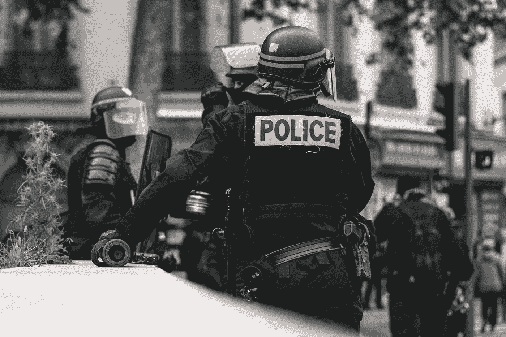

# 关于美国治安和种族的有数据支持的文章

> 原文：<https://towardsdatascience.com/data-backed-articles-on-american-policing-and-race-75f74f08afa2?source=collection_archive---------55----------------------->

[ev](https://unsplash.com/@ev?utm_source=medium&utm_medium=referral) 在 [Unsplash](https://unsplash.com?utm_source=medium&utm_medium=referral) 上的照片

## 数据说明了什么是不公正

距离我上一篇文章已经很久了。我的文章通常不是关于一个有趣的数据集或问题，而是一个统计学习技术或概念的展示。我计划很快回到这个话题，但我想我应该解决一个最近备受关注的话题，但这个话题已经存在了几个世纪；美国的种族与治安。

我想对美国的警察暴力和种族问题做一些探索性的数据分析，并以此为例说明统计学如何应用于重要的社会问题。然后，我认为这是一个坏主意，因为有很多出色的工作是由比我更了解数据生成过程的人完成的，因为他们已经沉浸在数据中多年了。相反，我整理了一些我读过的有趣文章的链接，这些文章集中在警察暴力和种族的数据上。在 2014 年的抗议之后，学术界对这一主题有了更多的关注，但我选择了更容易理解的数据新闻文章。下面是三个链接。

## [关于警察枪击的数据说明了什么](https://www.nature.com/articles/d41586-019-02601-9)

《自然》上的这篇文章提供了一个关于美国种族和警察杀人的主要数据库的概览。它也关注学术文献中的争论。

## 在大城市，警察杀死的人越来越少，但是在美国的郊区和农村，警察杀死的人越来越多

Samuel Sinyangwe 是零战役的数据科学家。这篇文章是关于从 2013 年到现在警察杀人和枪击的趋势，主要在城市，郊区和农村层面进行了细分。

## [为什么统计数据没有捕捉到警察系统偏见的全部程度](https://fivethirtyeight.com/features/why-statistics-dont-capture-the-full-extent-of-the-systemic-bias-in-policing/)

这是另一篇讨论分析警察暴力数据困难的特殊原因的文章；在暴力发生前谁遇到了警察的选择偏差。

最后，我想链接到三个关于警察枪击和暴力的主要数据库:[致命遭遇](https://fatalencounters.org/)、《华盛顿邮报》的[致命力量](https://www.washingtonpost.com/graphics/investigations/police-shootings-database/)和[描绘警察暴力](https://mappingpoliceviolence.org/)。如果你选择在这个话题上做你自己的数据分析，请记住在数据收集中可能存在的偏见。

警察暴力并不是统计学和计量经济学揭示美国不同种族群体之间差异的唯一领域(见[种族财富差距](https://www.brookings.edu/blog/up-front/2020/02/27/examining-the-black-white-wealth-gap/))。《走向数据科学》的大多数读者都非常关注机器学习和预测，我也是其中之一。但我们不能忘记探索性数据分析和统计对于假设检验和推断的价值，当涉及到识别不公正和评估纠正它们的政策时。

## 关于本文收益的说明

每当这篇文章的收入达到可执行的数额时，我将把它们捐给零号运动。零运动倡导证据和数据驱动的政策，减少警察暴力的发生率，提高美国的警务质量。