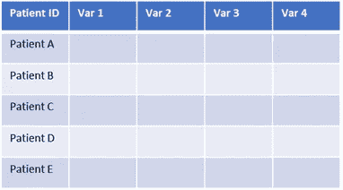
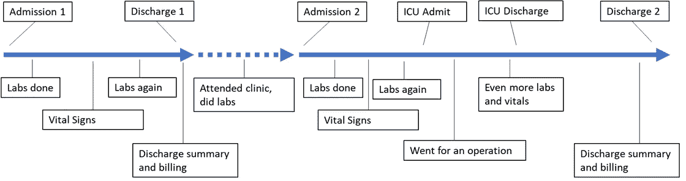
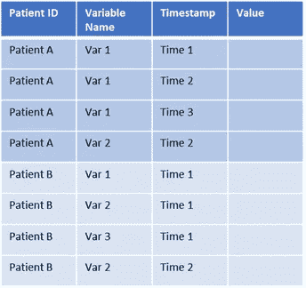
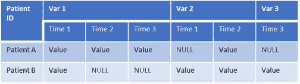
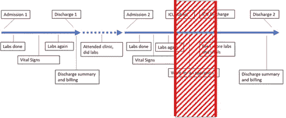
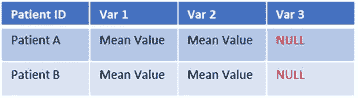

# 电子病历的数据木工(一)

> 原文：<https://towardsdatascience.com/data-carpentry-for-electronic-medical-records-cb3aba015df4?source=collection_archive---------46----------------------->

## 第一部分:数据的形状

*电子病历(EMR)中的数据可能很复杂，难以浏览。这一系列文章是为那些希望理解数据分析师做什么并交流他们对数据操作和分析的意图的临床医生而写的。*

# 我们希望数据是什么样的

大多数临床医生都熟悉平面数据。这是一种数据在二维表中的格式，通常每行一个患者，每个属性一列(如患者年龄、实验室值、出院日期)。数据分析师也可能将此描述为整洁的数据。*然而，电子病历数据很少像这样结构化！*

平面数据:临床医生通常想要什么(图片由作者提供)

患者生成的大多数数据都是通过多个非周期性事件产生的。我们需要考虑如何在数据库中表示它们。

患者时间表示例(图片由作者提供)

# 真实的数据是什么样的

数据库通常以**【长】**格式表示数据。在长表格中，变量的每个*观察值*都有一行。一个变量可以在不同时间进行多次观察(如系列肌钙蛋白)。因此，每个变量可能不止一行，每个患者也可能不止一行。表格之所以“长”,是因为通常行数比列数多。

一张长桌(图片由作者提供)

长表格通常被转换成**‘宽’**格式。数据集中的每个*患者*都有一行。该表有多列，代表不同时间点的变量测量值。它“宽”是因为列比行多。这个过程被称为**旋转**，因为数据被翻转到它的一侧。我们可以理解宽格式几乎就像一条时间线。

宽桌子——由上面的长桌子改造而成(图片由作者提供)

您可能会注意到，宽表中有许多单元格包含空值。空值是空白。这是不定期临床测量的反映，对于每个患者，临床测量不会在完全相同的时间发生。您可能想知道为什么 EMR 数据库不像这样存储数据——这是因为这种结构要求每个时间点都有一个新列，但是该列中的许多值都是空值。就存储而言，这将是非常低效的！

这个表还不够整洁，因为每个变量下有多列。这由两级列标签表示。为了使数据集整洁，我们需要将每个变量折叠成一列。

# 划界和聚合

要折叠每个变量下的列，我们必须**划定**相关的时间段，然后**汇总**该时间段内的观察值。

在 ICU 入院开始和结束之间(定界)，平均毛细血管血糖(总量)*(图片由作者提供)*

界定可确保我们排除与研究无关的时间段。例如，如果我们对一个病人的 ICU 入院感兴趣，我们应该划定入院的开始和结束日期。

聚合是接受几个值，输出一个值的任何规则。医学中常见的聚合规则包括寻找平均值、中值、最大值或最小值以及第一个或最后一个值。

在上面的示例中，我们可能指定了时间 1 到时间 2 的界限，并使用平均值进行了聚合。请注意，Var 3 具有空值，因为从时间 1 到时间 2 没有相关的观察值。这给了我们一个整洁的表格——每个病人一行，每个变量一列！

整洁的桌子(图片由作者提供)

# 注意:为什么划定一个范围很重要？

当我们想到一个离散事件时，很容易直接指定一个集合(例如，在入住 ICU 之前测量的“最后”肌酐值)。这可能适用于大多数情况，但我们应该小心——如果患者在一年前有“最后”数值(例如，患者从 A&E 直接入住 ICU，入住时尚未报告实验室)，该怎么办？强烈建议定界以获得有效和一致的结果！

*在这篇文章中，我们了解了电子医疗记录数据是如何构建的，以及我们如何让它变得整洁——从长到宽，通过定界和聚合。请继续关注电子病历数据木工的更多内容！*