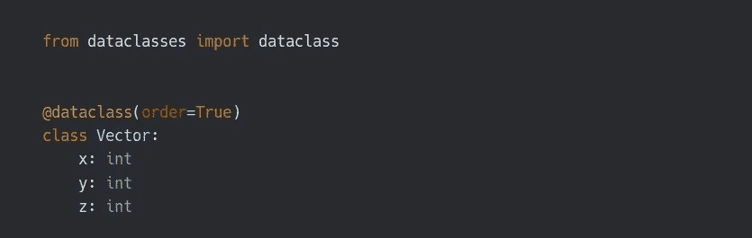

# Python 中的数据类

> 原文：<https://towardsdatascience.com/data-classes-in-python-8d1a09c1294b?source=collection_archive---------4----------------------->

数据类适用于 Python 3.7 或更高版本。您可以将数据类用作数据容器，但不仅限于此。数据类还为您编写模板代码，并简化创建类的过程，因为它附带了一些免费实现的方法。让我们开始吧！

# 你的第一个数据类

让我们创建一个数据类，它表示 3d 坐标系中的一个点。

`@dataclass` decorator 用于创建一个数据类。`x`、`y`和`z`是我们数据类中的字段。请注意，您需要使用类型注释来指定字段的数据类型，并且记住类型注释不是静态类型声明，这意味着某人仍然可以为`x`、`y`或`z`字段传递除`int`之外的任何数据类型。

默认情况下，数据类带有实现的`__init__`、`__repr__`和`__eq__`方法，因此您不必自己实现这些方法。

然而`__init__`、`__repr__`和`__eq__`没有在我的`Coordinate`类中实现，由于数据类，我仍然可以使用这些方法。这对节省时间很有好处。

# 字段的默认值

您可以为字段分配默认值。让我们把重点放在例子上。正如您在`pi`字段中看到的，您可以为数据类中的字段分配一个默认值。

# 自定义字段和数据类

您可以通过使用 dataclass decorator 或 field 函数的参数来自定义字段和数据类。当我在例子中定制任何东西的时候，我会解释，我也会在文章的最后给出字段和数据类的所有参数。

# 数据类是可变的还是不可变的？

默认情况下，数据类是可变的，这意味着您可以为字段赋值。但是，您仍然可以通过将`frozen`参数设置为`True`来使其不可变

**易变的例子**

**不可变的例子**

当我们将`frozen`设置为`True`时，我们不能再给字段赋值了。您可以在下面的示例中看到异常输出。

# 比较数据类

假设您想要创建一个表示一个`Vector`的数据类，并且您想要比较它们。你会怎么做？为此，你需要像`__lt__`或`__gt__`这样的方法来比较它们。

默认情况下，数据类的`order`参数为`False`。当你设置为`True`时；`__lt__`、`__le__`、`__gt__`和`__ge__`方法将自动为您的数据类生成。所以你可以比较对象，就好像它们是字段**的元组一样。**

让我们来看看下面的例子。我们可以比较`v2`和`v1`，因为我们将`order`设置为`True`。但是这里有一个比较逻辑的问题。当你说`v2 > v1`时，它会像`(8, 15) > (7, 20)`一样比较这两个向量。所以`v2 > v1`的输出会是`True`。

> 回想一下，元组比较是逐个位置进行的。它首先将`8`与`7`进行比较，其结果为`True`，然后比较结果为`True`。如果它们相等，那么它将比较`15` > `20`，然后结果将是`False`。

回想了一下元组是怎么比较的，很明显这个比较没有任何意义。我想用向量的大小来比较它们。这里的问题是，当创建每个实例时，你不想自己计算一个`Vector`的大小。

在这种情况下，我们将受益于`field`函数和`__post_init__`方法。`field`功能将帮助我们自定义`magnitude`字段。`__post_init__`方法将帮助我们确定初始化后向量的大小。

我们通过使用来自数据类的`field`函数来定制`magnitude`字段。通过将`init`设置为`*False*`，我们基本上是说我们不想要`__init__`方法中的`magnitude`参数。因为我们希望在初始化后使用`__post_init__`方法来确定它的值

# 将其转换为字典或元组

你可以在一个元组或字典中得到你的数据类的属性。您所需要的就是从数据类中导入`asdict`和`astuple`函数。

# 遗产

可以像 Python 中的普通类一样对数据类进行子类化。

使用继承时有一个常见的错误。当默认设置`lang`字段为`Python`时，必须为`lang`字段之后的字段提供默认值。

要了解原因，让我们看看我们的`__init__`方法是什么样子的。回想一下，有默认值的参数应该在没有默认值的参数之后。

让我们通过为`salary`字段提供默认值来修复它。

# 从老虎机中获益

默认情况下，属性存储在字典中。我们可以从插槽中获得更快的属性访问，并使用更少的内存。请注意，我不会详细讨论插槽，因为这是另一个要讨论的主题。

我们可以使用插槽来使用更少的内存和更快地访问属性。

# 数据类参数

我们已经更改了 dataclass decorator 中的一些参数来定制我们的数据类。让我给你一个参数列表。

*   `init` : `__init__`方法将在您的数据类中生成，如果`True`。(默认为`True`)
*   `repr` : `__repr__`方法将在您的数据类中生成，如果`True`。(默认为`True`)
*   `eq` : `__eq__`方法将在您的数据类中生成，如果`True`。(默认为`True`)
*   `order` : `__lt__`、`__le__`、`__gt__`和`__ge__`方法将在您的数据类中生成，如果`True`。(默认为`False`)
*   `unsafe_hash` : `__hash__`方法将在您的数据类中生成，如果`True`。(默认为`False`)
*   `frozen`:如果`True`，则不能分配给字段。(默认为`False`。)

请注意，如果`order`为`True`，则`eq`必须为`True`，否则`ValueError`将引发异常。

# 字段参数

*   `init`:如果`True`，该字段包含在生成的`__init__`方法中。(默认为`True`)
*   `repr`:如果`True`，该字段包含在生成的`__repr__`方法中。(默认为`True`)
*   `compare`:如果`True`，该字段包含在生成的比较和相等方法中。(默认为`True`)
*   `hash`:如果`True`，该字段包含在生成的`__hash__`方法中。(默认为`None`)
*   `default`:如果提供，这将是该字段的默认值。
*   `default_factory`:如果提供，这必须是一个零参数的可调用函数，当该字段需要默认值时，将调用该函数。
*   `metadata`:这可以是一个映射，也可以是一个空字典。

# 结论

这是对数据类的温和介绍。我希望你喜欢它。感谢您的阅读，别忘了在 Medium 上关注我！