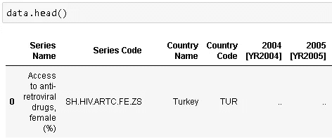
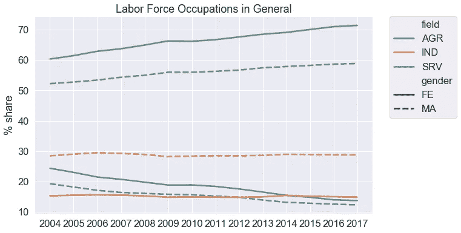
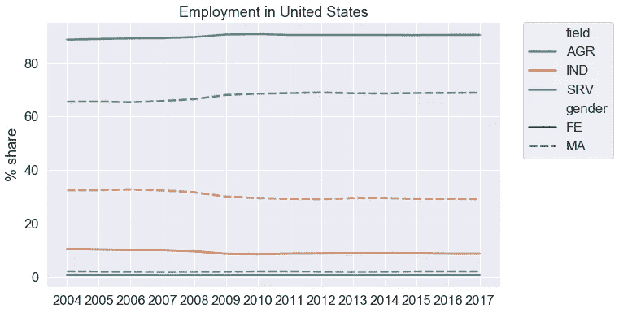

# 数据清理和分析以及额外的故事

> 原文：<https://towardsdatascience.com/data-cleaning-and-analysis-with-a-bonus-story-36b3ae39564c?source=collection_archive---------18----------------------->

人是企业中最关键的部分。人给人创造价值，卖给人。因此，人们及其生活的变化影响着每一项业务。人口特征和人们的生活方式在不久的过去发生了巨大的变化。塑造和定义一个国家人口的关键指标，如生育率、死亡率、预期寿命、肥胖、劳动力职业分布一直在变化。这些变化对于关键业务决策始终至关重要，因为人是所有业务的核心。

Worldbank.org 拥有关于人口的社会和社会经济指标的全面数据集。根据性别统计，不同国家的劳动力、生育率和死亡率、预期寿命、肥胖和人口年龄分布数据均可获得。

 [## 性别统计|数据库

### 选择已被修改。随时单击“应用更改”以使用所做的更改刷新报告…

databank.worldbank.org](https://databank.worldbank.org/source/gender-statistics) 

通过使用 worldbank.org 现有的数据，我将试图展示最近发生了什么变化，并解释这些变化。我将更多地关注数据分析部分，所以这更像是一个有奖金故事的数据分析项目。有许多有用和信息丰富的统计数据，但这些数据并不是一种清晰、易于分析的格式。我需要使用 pandas 来为探索性数据分析准备数据，并使用 matplotlib 和 seaborn 来进行可视化。

所有的代码都可以在 Github 上的[这里](https://github.com/SonerYldrm/gender_statistics)找到。

# **为分析准备好数据**

```
# Importing necessary libraries
import numpy as np
import pandas as pd
import matplotlib.pyplot as plt
import seaborn as sns
%matplotlib inline# read the data into a pandas dataframe
data = pd.read_csv('data.csv')data.shape
(2237, 19)
```

初始数据集有 2237 行和 19 列。这些列是国家名称和代码、年份、系列名称和代码。系列名称和代码列描述了数据是什么。我下载了 4 个不同大洲 4 个国家 15 年(2004-2018)的数据。



指标有 500 多个。我的分析计划是使用 25 个指标来比较不同大洲的 4 个不同国家。为了过滤初始数据集，我创建了一个列表，其中包括我要分析的指标的系列代码。然后我用 **isin()** 方法创建了一个遮罩来过滤初始数据帧。

```
mask **=** data['Series Code'].isin(code_list)
data1 **=** data[mask]data1.shape
(100, 19)
```

我们现在有 4 个不同国家 15 年(2004-2018)的 25 个属性。列名可以简化。例如，“2004 [YR2004]”可以写成 2004，国家名称列可以删除，因为国家代码清楚地显示了国家。

```
data1.columns = ['series_name', 'series_code', 'country_name', 'country_code', '2004', '2005', '2006', '2007', '2008', '2009', '2010', '2011','2012', '2013', '2014', '2015', '2016', '2017', '2018']data1 = data1.drop('country_name', axis=1)
```

**缺失数据**

处理缺失值是数据清理的关键步骤。我们首先需要找到缺失的值，然后根据数据的特征和属性决定如何处理它们。对于所有数据集，没有一种最佳的方法来做到这一点。这在很大程度上取决于数据集。

```
data1.isna().any().sum()
0
```

我们的数据集中似乎没有缺失数据，但我知道有些单元格没有任何信息。有些行带有“..”这些值实际上是缺失值，但熊猫无法检测出它们是缺失值。因此，目视检查数据集也非常重要。我将使用 dataframes **replace()** 方法用 NaN 替换这些值。

```
data1.replace('..', np.nan, inplace=True)data1.isna().sum()
series_name      0
series_code      0
country_code     0
2004            10
2005             9
2006            10
2007            10
2008            10
2009            10
2010             5
2011            10
2012            10
2013             6
2014             5
2015             7
2016             7
2017            16
2018            40
dtype: int64
```

**isna()。any()** 返回一个布尔值，如果该列中有任何缺失值，则该值为真。另一方面，**是一种()。sum()** 将返回一列中缺失值的总数。

下一步是决定如何处理这些丢失的值。2018 列包含 100 个空值中的 40 个，因此我将删除整个列。

```
data1 = data1.drop('2018', axis=1)
```

pandas drop()函数的一个重要参数是**轴**，用于指定列(1)或行(0)。

正如所料，缺少的值大多在同一行中，因为某些属性没有任何特定国家的值，这导致该行中的大多数值都是 NaN。因此，我将根据该行中 NaN 值的阈值删除行。删除 2018 列后，我们有 14 年(2004-2017)的数据，我将使用 70%的阈值。

```
data1 = data1.dropna(thresh=14*0.7, axis='rows')
```

之后，还剩下一些缺失的值。可以接受用同一国家前一年的数值来填充这些数值，这不会对结果产生很大影响。为此，我将对行使用带有 **ffill** 方法的 **fillna()** 。

```
data1 = data1.fillna(method='ffill', axis=0)#Make sure no missing values left
data1.isna().sum().sum()
0
```

值的数据类型是不适于数值分析的对象。因此，我需要更改数字列的数据类型。

```
years = ['2004', '2005', '2006','2007', '2008', '2009', '2010', '2011', '2012', '2013', '2014', '2015','2016', '2017']for year in years:
    data1 = data1.astype({year:'float'})
```

我们的数据集现在包括 90 行和 17 列。我的分析最初旨在基于 15 年期间的 25 个不同属性来比较 4 个不同的国家。由于数据不可用，我删除了一些列和行。删除这些行和列后，有些属性没有所有 4 个国家的数据。为了进行全面彻底的分析，我将只使用包含所有 4 个国家数据的属性。

```
data1.shape
(90, 17)attributes = data1.series_name.value_counts() == 4# Filter attributes with 4 values 
attributes = attributes[attributes.values == True]# Make a list from series index
attributes_list = list(attributes.index)# Use this list as filter
mask1 = data1['series_name'].isin(attributes_list)
data1 = data1[mask1]data1.shape
(72, 17)
```

我们现在有 4 个不同国家 14 年的 18 个属性。这些属性是:

```
attributes_list
['Prevalence of obesity, female (% of female population ages 18+)',
 'Life expectancy at birth, female (years)',
 'Employment in services, female (% of female employment) (modeled ILO estimate)',
 'Fertility rate, total (births per woman)',
 'Population ages 15-64 (% of total)',
 'Employment in industry, male (% of male employment) (modeled ILO estimate)',
 'Employment in agriculture, female (% of female employment) (modeled ILO estimate)',
 'Contributing family workers, female (% of female employment) (modeled ILO estimate)',
 'Employment in industry, female (% of female employment) (modeled ILO estimate)',
 'Prevalence of obesity, male (% of male population ages 18+)',
 'Population ages 65 and above (% of total)',
 'Labor force, female (% of total labor force)',
 'Contributing family workers, male (% of male employment) (modeled ILO estimate)',
 'Employment in services, male (% of male employment) (modeled ILO estimate)',
 'Life expectancy at birth, male (years)',
 'Population ages 0-14 (% of total)',
 'Employment in agriculture, male (% of male employment) (modeled ILO estimate)',
 'Death rate, crude (per 1,000 people)']
```

# **探索性数据分析**

我计划基于三个主要主题来分析这些数据:

1.  雇用
2.  肥胖
3.  年龄分布、预期寿命、生育率和死亡率

**就业**

就业属性显示了农业、服务业和工业这三个不同领域中劳动力职业的百分比。我将使用 series_name 列中的描述来过滤这些属性。

Pandas 有许多有用的矢量化字符串操作。我将使用 **contains()** 方法如下:

```
employment = data1[data1.series_name.str.contains('Employment')]employment.shape
(24, 17)
```

4 个国家有 6 个属性:男性和女性在农业、服务业和工业的就业情况。

我将尝试使系列代码更具信息性，并删除 series_name 列，以便更容易分析和可视化。比如 SL。AGR.EMPL.FE.ZS 指农业就业(女性)。我将从这段代码中导出 AGR 和 FE，并使用矢量化字符串操作 **split()生成单独的列。**然后使用 pandas **concat()** 函数将结果数据帧与原始数据帧合并:

```
split1 = employment.series_code.str.split(".", expand=True)
employment = pd.concat([employment, split1], axis=1)
```


原始列(不显示年份)


从 split()返回的列

```
# To simplify, drop series_code, 0, 2 and 4
# Rename 1 and 3 to be more informativeemployment = employment.drop(['series_code', 0, 2, 4], axis=1)
employment.rename(columns={1:'field', 3:'gender'}, inplace=True)# New columns
employment.columnsIndex(['series_name', 'country_code', '2004', '2005', '2006', '2007', '2008','2009', '2010', '2011', '2012', '2013', '2014', '2015', '2016', '2017','field', 'gender'],dtype='object')# Can drop series_name as well because field and gender columns
# are enough to describe the data
employment_new = employment.drop('series_name', axis=1)
```

以列的形式列出年份不便于分析和可视化。因此，我将创建一个 year 列，并将所有年份作为行项目列出。熊猫已经在**中内置了**()【融化】功能来完成这个任务。

```
employment_new = employment_new.melt(id_vars=['country_code', 'field', 'gender'],
                   var_name='year',
                   value_name='employment')
```


就业数据框架的最终版本

让我们看看劳动力职业是如何随着时间的推移而变化的。使用 seaborn lineplot 的色调和风格参数，我们可以在同一个图表上看到男性和女性的每个职业。我还认为，如果图形上有许多线条，最好将图例放在图形之外。下面代码片段的最后一行找到了图例。

```
sns.set_context("notebook", font_scale=1.5, rc={"lines.linewidth": 2.5})
plt.figure(figsize=(10,6))
ax = sns.lineplot(x='year', y='employment', hue='field', style='gender', ci=None, data=employment_new)
ax.set_title('Labor Force Occupations in General')
ax.set_xlabel('')
ax.set_ylabel('% share')
ax.legend(bbox_to_anchor=(1.05, 1), loc=2, borderaxespad=0.)
```



总的来说，无论男女，超过一半的劳动力从事与服务相关的工作。这并不奇怪，因为与服务相关的工作在零售、运输、医疗保健、分销和许多其他行业无处不在。虽然与服务相关的工作有增加的趋势，但在工业或农业部门工作的人数却在减少。农业是过去的主要职业，但随着生产力的提高和技术带来的便利，农业工作减少了。近期仍有下降趋势。同样，近年来，越来越多的机器参与到工业中，使得大部分工作自动化并由机器完成，这反过来减少了男性和女性的工作岗位。

在劳动力分布方面，国与国之间可能存在差异。下面截取的代码展示了如何为荷兰创建一个线图。同样，只需更改 mask 中的国家代码，我们就可以为其他国家创建相同的可视化效果。

```
#Labor force occupations in Netherlands
sns.set_context("notebook", font_scale=1.5, rc={"lines.linewidth": 2.5})
maskNLD = employment_new.country_code == 'NLD'
plt.figure(figsize=(10,6))
ax = sns.lineplot(x='year', y='employment', hue='field', style='gender', data=employment_new[maskNLD])
ax.set_title('Employment in Netherlands')
ax.set_xlabel('')
ax.set_ylabel('% share')
ax.legend(bbox_to_anchor=(1.05, 1), loc=2, borderaxespad=0.)
```



有一个有趣的趋势引起了我们的注意。在发达国家，美国和荷兰，劳动职业份额不随时间变化。2004 年和 2017 年的数值差不多。然而，在发展中国家，我们看到了很多变化。

除土耳其外，所有国家的女性都比男性更多地从事与服务相关的工作。我认为这是因为土耳其女性比过去更多地加入了劳动力大军。2015 年后，服务领域女性份额超过男性份额。

Seaborn 允许我们通过提供许多参数和选项来定制可视化。例如，我们可以在同一个图形上使用色调、风格和大小参数来可视化不同的类别。我用色调和风格来区分职业和性别。另一方面，有时在同一个图表上显示不同的类别并不是一个好的选择，因为它看起来很复杂，很难阅读。在这种情况下，我们可以通过使用子图在一个可视化图形上绘制多个图形:

```
# Create masks to filter employment dataframe
mask00 = (employment_new.field == 'AGR') & (employment_new.gender == 'MA')
mask01 = (employment_new.field == 'AGR') & (employment_new.gender == 'FE')fig, axs = plt.subplots(ncols=2, figsize=(18,6))
sns.set_context("notebook", font_scale=1.3, rc={"lines.linewidth": 2.})
sns.lineplot(x='year', y='employment', hue='country_code', data=employment_new[mask00], legend=False, ax=axs[0])
axs[0].set_title('Male Employment in Agriculture')
axs[0].set_ylabel('% Share')
axs[0].set_xlabel('')
sns.lineplot(x='year', y='employment', hue='country_code', data=employment_new[mask01], ax=axs[1])
axs[1].set_title('Female Employment in Agriculture')
axs[1].set_ylabel('')
axs[1].set_xlabel('')
axs[1].legend(bbox_to_anchor=(1.05, 1), loc=2, borderaxespad=0.)
```


农业工作

上面的图表也显示了土耳其和中国农业就业的下降趋势，而美国和荷兰的农业就业份额保持稳定。

**肥胖**

我使用 **str.contains()** 函数从初始数据帧中过滤肥胖数据:

```
obesity = data1[data1.series_name.str.contains('obesity')]
```

应用同样的步骤，我创建了肥胖数据框架:


每个国家的肥胖程度不同，但它们有一个共同点:肥胖正在增加。这对我们的健康绝对不是一个好兆头。土耳其的一个有趣的区别是，女性的肥胖率远远高于男性，而在其他国家，女性和男性的肥胖率非常接近。

**年龄分布、预期寿命、生育率和死亡率**

初始数据集具有许多与人口统计学相关的属性。我将尝试了解我们的数据集中包括的 4 个不同国家的总人口年龄组、死亡率、生育率和出生时预期寿命。

通过对初始数据框架应用与就业和肥胖相同的步骤，我获得了 4 个不同的数据框架:年龄分布、预期寿命、生育率和死亡率。

为了简单起见，并且能够更容易地比较一些属性，我将把这些数据帧合并成一个。Pandas 内置的 **merge()** 函数使得合并数据帧变得非常简单。数据帧的共同点或您想要组合数据帧的条件由' **on** 参数指定:

```
population_new = pd.merge(population, life_exp, on=['country_code','year'])
```

应用 **merge()** 函数后，最终数据帧如下:


世界人口正在老龄化。据世界卫生组织(世卫组织)称，世界人口老龄化是生育率持续下降和预期寿命延长的结果。这种人口结构的变化导致 60 岁以上人口的数量和比例不断增加。因此，历史上第一次老年人比年轻人多的时代正在迅速到来。

让我们用现有的数据来证实这些:


如上图所示，14 岁及以下的人口在减少，而 65 岁及以上的人口在增加。这一趋势适用于我们数据中包含的所有国家。

```
mask1 = population_new.ages == '0014'
mask2 = population_new.ages == '65UP'fig, axs = plt.subplots(ncols=2, figsize=(20,6))sns.lineplot(x='year', y='share', hue='country_code', data=population_new[mask1], legend=False, ax=axs[0])
axs[0].set_title('14 and under')
axs[0].set_ylabel('% Share')
axs[0].set_xlabel('')sns.lineplot(x='year', y='share', hue='country_code', data=population_new[mask2], ax=axs[1])
axs[1].set_title('65 and UP')
axs[1].set_ylabel('')
axs[1].set_xlabel('')
axs[1].legend(bbox_to_anchor=(1.05, 1), loc=2, borderaxespad=0.)
```


正如世卫组织所言[，人口老龄化的主要原因是预期寿命增加和生育率下降:](https://www.who.int/features/qa/72/en/)


可以肯定地说，一般来说，女人比男人长寿。以下数据证实了这一点:


在这四个国家中，土耳其男人享受生活的时间最少。往好的方面看，土耳其男性的预期寿命也在增加。

人口老龄化意味着比以前有更多的老年人。这可能是与服务相关的工作数量增加的原因之一。

最后，我还想检查不同国家的死亡率。根据 worldbank.org 的定义，粗死亡率是指年中估计的每 1，000 人口中一年内发生的死亡人数。死亡率属性在男性和女性之间没有区别。


死亡率本身并不能告诉我们太多。为了获得关于人口的一些见解，我们需要一起分析死亡率、出生率和移民数据。

**结论**

我们讨论的特征不会在短时间内改变，但企业应该及时采取行动，因为我们的生活方式和生活方式对每个企业都至关重要。

与大多数企业一样，我们可以在做出关键决策之前，利用数据来审视全局并获得更多洞察力。