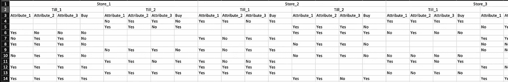
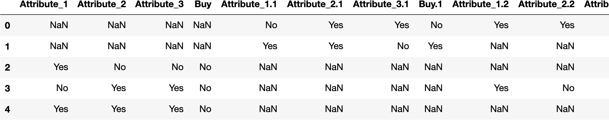
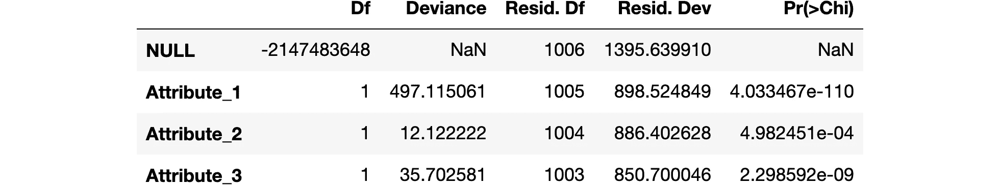

# Python 和 R 中的数据清理和探索性分析

> 原文：<https://towardsdatascience.com/data-cleaning-and-exploratory-analysis-in-python-and-r-608de56124e2?source=collection_archive---------37----------------------->

## 结合使用 Python 和 r，深入研究一些杂乱的真实世界的数据。


照片由[在](https://unsplash.com/@thecreative_exchange?utm_source=medium&utm_medium=referral) [Unsplash](https://unsplash.com?utm_source=medium&utm_medium=referral) 上的创意交流

这本笔记本是关于使用 Python 和 R 的组合来执行数据预处理和对杂乱数据集的一些探索性统计分析。面向未来数据科学家的博客和文章经常反复强调使用混乱的真实世界数据的必要性，以及学习数据清理和预处理对这一职业的重要性。然而，我们大多发现带有标准数据集的博客和教程跳过了预处理步骤。同样，现实世界的数据分析可能需要 EDA 和统计分析的结合。为此，可能需要数据科学家同时使用 Python 和 R，并根据手头的微任务在它们之间切换。

在本教程中，我分享了一些数据处理和探索性分析的步骤，这是我在博士期间的一次实验的一部分。我为此引入了一个玩具数据集，但是数据的结构和杂乱程度与我遇到的相似。假设一家零售公司在不同的地理位置有五家商店。每个商店都有两个结账柜台。该公司正在测试一种新产品，他们只把它放在计费柜台上。收银员应该在结账时向顾客推销商品。收银员还会问每位顾客三个关于产品的问题，然后问他们是否想购买该产品。这些问题是关于产品的三个属性，顾客必须回答“是”——如果他们喜欢这个属性，或者回答“否”——如果他们不喜欢这个属性。因此，对于产品的每个副本，我们的数据集中有 4 列——3 列用于属性，1 列用于记录客户最终是否购买该商品。所有的值都是绝对的——“是”或“否”。

但是，数据的存储方式——它存储在一个 csv 文件中，但有 40 列——5 个商店中的每个商店和每个商店中的两个计费柜台都有单独的记录。因此，我们得到了多级列，如下图所示。



## 混乱的数据

数据存储的方式还有一个问题。如果您查看商店 1 的数据，并比较两个收银台，您会发现记录是互斥的。也就是说，对于访问钱柜 1 的客户，钱柜 2 的相应记录为空。以这种方式存储它可能有一些有效或懒惰的原因。但是现在，作为一名数据科学家，我们已经有了这个数据集。

所以我们开始。我们首先读取 csv 文件，并将其存储为熊猫数据帧。注意，我们使用 header=[2]将第三行用作标题，跳过前两行。

```
import pandas as pd
d1 = pd.read_csv('https://raw.githubusercontent.com/sagaruprety/data_science/master/multi_attribute_buying_behaviour.csv', header=[2])
d1.head()
```



## 合并商店内的收银台

我们看到熊猫把这些柱子标上了“.”扩展。因此{Store_1，Till_1}的“购买”变量仍然是“购买”，但{Store_1，Till_2}的“购买”变量是“购买. 1”。类似地，{Store_2，Till_1}的“Buy”变量是“Buy.2”。还要注意的是，对于任何商店，如果是从其他收银台购买的，商品记录将被注册为 NaN。

这里总共有 40 列——4 个变量 x 5 个商店 x 每个商店 2 个收银台。

我们数据处理的最终目标是合并所有收银台和所有商店的商品记录。这将产生一个只有四列的数据帧——对应于三个属性和购买决定。

第一步是将商店的两个收银台的数据合并成一个。我们迭代数据帧的列，用空字符串(“”)替换 nan，然后连接对应于商店任意两个收银台的列。新的数据帧存储在不同的变量 d2 中。

```
columns = ['Attribute_1', 'Attribute_2', 'Attribute_3', 'Buy']
num_stores = 5
d2 = pd.DataFrame()
for col in columns:
  for i in range(num_stores):
    if i == 0:
      d2[col+'.'+str(i)] = d1[col].fillna('') + d1[col+'.1'].fillna('')
    else:
      d2[col+'.'+str(i)] = d1[col+'.'+str(2*i)].fillna('') + d1[col+'.'+str(2*i+1)].fillna('')
d2.info()<class 'pandas.core.frame.DataFrame'>
RangeIndex: 202 entries, 0 to 201
Data columns (total 20 columns):
 #   Column         Non-Null Count  Dtype 
---  ------         --------------  ----- 
 0   Attribute_1.0  202 non-null    object
 1   Attribute_1.1  202 non-null    object
 2   Attribute_1.2  202 non-null    object
 3   Attribute_1.3  202 non-null    object
 4   Attribute_1.4  202 non-null    object
 5   Attribute_2.0  202 non-null    object
 6   Attribute_2.1  202 non-null    object
 7   Attribute_2.2  202 non-null    object
 8   Attribute_2.3  202 non-null    object
 9   Attribute_2.4  202 non-null    object
 10  Attribute_3.0  202 non-null    object
 11  Attribute_3.1  202 non-null    object
 12  Attribute_3.2  202 non-null    object
 13  Attribute_3.3  202 non-null    object
 14  Attribute_3.4  202 non-null    object
 15  Buy.0          202 non-null    object
 16  Buy.1          202 non-null    object
 17  Buy.2          202 non-null    object
 18  Buy.3          202 non-null    object
 19  Buy.4          202 non-null    object
dtypes: object(20)
memory usage: 31.7+ KB
```

## 合并所有商店的数据

正如我们在上面看到的，我们已经将钱柜级别的信息合并到商店级别。下一步，我们将所有商店的记录合并为一个。我们创建对应于这五个商店的数据帧子集，然后将它们一个接一个地追加。

```
num_stores = 5
store_dfs = [pd.DataFrame() for _ in range(num_stores)]
col_ind = 0
for col in columns:
  for store in range(num_stores):
    store_dfs[store][col] = d2.iloc[:, col_ind]
    col_ind+=1
store_dfs[4].head()
```


上面是商店 5 对应的数据框。同样，我们有对应于每个商店的数据框架。请注意，下面每一行都有 202 行。

```
store_dfs[4].info()<class 'pandas.core.frame.DataFrame'>
RangeIndex: 202 entries, 0 to 201
Data columns (total 4 columns):
 #   Column       Non-Null Count  Dtype 
---  ------       --------------  ----- 
 0   Attribute_1  202 non-null    object
 1   Attribute_2  202 non-null    object
 2   Attribute_3  202 non-null    object
 3   Buy          202 non-null    object
dtypes: object(4)
memory usage: 6.4+ KB
```

现在，我们将对应于每个商店的数据帧一个接一个地追加，并重置索引，否则索引将从 0 到 201 循环重复 5 个数据帧。

```
df = store_dfs[0]

for i in range(1,num_stores):
  df = df.append(store_dfs[i])

df.reset_index(drop=True, inplace=True)
df.info()<class 'pandas.core.frame.DataFrame'>
RangeIndex: 1010 entries, 0 to 1009
Data columns (total 4 columns):
 #   Column       Non-Null Count  Dtype 
---  ------       --------------  ----- 
 0   Attribute_1  1010 non-null   object
 1   Attribute_2  1010 non-null   object
 2   Attribute_3  1010 non-null   object
 3   Buy          1010 non-null   object
dtypes: object(4)
memory usage: 31.7+ KB
```

## 使用 R 进行神奇命令的统计分析

注意，最终的数据帧具有 202×5 = 1010 行和 4 列。它代表整个公司的数据，而不是商店和钱柜的数据。现在让我们对数据进行一些基本的统计分析。r 是统计分析中最流行的语言之一，我们将在这里使用它。Jupyter(代表 JUlia PYThon R)笔记本允许我们在 PYThon 笔记本中嵌入代码片段。

为此，我们首先需要下载下面的 R 包:

```
%load_ext rpy2.ipython
```

%R 是一个神奇的命令，它帮助我们从 Python 切换到 R。以%R 开头的任何一行代码都将使我们能够用 R 编写。

下面的代码行指示机器获取名为 df 的 python 变量，并将其转换为同名的 R 变量。所以我们把熊猫的数据帧转换成 R 数据帧。

```
%R -i df
```

接下来，我们检查 R 数据帧的结构。这表明不同属性的值在内部存储为字符串。

```
%R str(df)'data.frame':	1010 obs. of  4 variables:
 $ Attribute_1: chr  "No" "Yes" "Yes" "No" ...
 $ Attribute_2: chr  "Yes" "Yes" "No" "Yes" ...
 $ Attribute_3: chr  "Yes" "No" "No" "Yes" ...
 $ Buy        : chr  "No" "Yes" "No" "No" ...
```

## 转换为 R 数据框架中的分类变量

下面几行代码将不同属性的值存储为分类变量(在 R 中称为因子)。但是我们看到有三种类型的分类变量。有一个空字符串，这是由于数据集中缺少一些值。

请注意，您还可以使用神奇的命令%%R，该命令使整个单元格用于 R。

```
%%R
df$Attribute_1 <- as.factor(df$Attribute_1)
df$Attribute_2 <- as.factor(df$Attribute_2)
df$Attribute_3 <- as.factor(df$Attribute_3)
df$Buy <- as.factor(df$Buy)
str(df)'data.frame':	1007 obs. of  4 variables:
 $ Attribute_1: Factor w/ 2 levels "No","Yes": 1 2 2 1 2 1 1 2 2 2 ...
 $ Attribute_2: Factor w/ 2 levels "No","Yes": 2 2 1 2 2 2 2 2 2 2 ...
 $ Attribute_3: Factor w/ 2 levels "No","Yes": 2 1 1 2 2 2 2 1 2 2 ...
 $ Buy        : Factor w/ 2 levels "No","Yes": 1 2 1 1 1 1 1 2 2 2 ...
```

## 使用 Pandas 从数据帧中删除空字符串

这是我们一开始就应该检查的。我们很容易在熊猫身上做到这一点。注意，空值不是 NaN，而是空字符。所以我们需要首先将它们转换成 NaN，然后使用 pandas dropna 函数删除具有 NaN 值的行。

```
import numpy as np
df.replace(to_replace='', value=np.NaN, inplace=True)
df.dropna(inplace=True)
```

现在再次运行上面这段 R 代码，我们得到一个 R 数据帧，其中有两级分类变量。

```
%R -i df
%R df$Attribute_1 <- as.factor(df$Attribute_1)
%R df$Attribute_2 <- as.factor(df$Attribute_2)
%R df$Attribute_3 <- as.factor(df$Attribute_3)
%R df$Buy <- as.factor(df$Buy)

%R str(df)'data.frame':	1007 obs. of  4 variables:
 $ Attribute_1: Factor w/ 2 levels "No","Yes": 1 2 2 1 2 1 1 2 2 2 ...
 $ Attribute_2: Factor w/ 2 levels "No","Yes": 2 2 1 2 2 2 2 2 2 2 ...
 $ Attribute_3: Factor w/ 2 levels "No","Yes": 2 1 1 2 2 2 2 1 2 2 ...
 $ Buy        : Factor w/ 2 levels "No","Yes": 1 2 1 1 1 1 1 2 2 2 ...
```

## 分析数据

现在我们可以对数据进行一些分析。目的是找出这三个属性中哪一个对购买决策影响最大。我们首先使用 xtabs 来计算跨类别频率。这让我们可以一瞥每个属性对购买决策的影响。

```
%%R
print(xtabs(~Buy+Attribute_1, data=df))
print(xtabs(~Buy+Attribute_2, data=df))
print(xtabs(~Buy+Attribute_3, data=df))Attribute_1
Buy    No Yes
  No  372 122
  Yes  48 465
     Attribute_2
Buy    No Yes
  No  267 227
  Yes 180 333
     Attribute_3
Buy    No Yes
  No  272 222
  Yes 155 358
```

## 逻辑回归分析

请注意，在上述矩阵中，Attribute_1 似乎对购买决策产生了重大影响。几乎 80%喜欢新产品属性 1 的顾客会购买它，几乎 90%不喜欢属性 1 的顾客最终不会购买它。其他两个属性的分数倾向于 50-50，情况就不一样了。

由于我们在这里处理分类变量，我们需要使用广义线性模型(GLM)的二项式家族来分析不同属性的影响。所以我们在数据中拟合了一个逻辑回归模型。

在下面的总结中，我们发现属性 1 在购买决策中的重要影响，因为相应的 p 值非常低。

负截距意味着如果所有属性的值都为“否”，那么客户极不可能购买该产品，这是有道理的。请注意，在逻辑回归中，输出变量“购买”被转换为对数优势比例。因此，负值实际上意味着不利于客户购买产品。

如果您不熟悉逻辑回归背后的概念和内涵，请参考[这个解释逻辑回归的优秀视频系列。](https://www.youtube.com/watch?v=yIYKR4sgzI8&list=PLblh5JKOoLUKxzEP5HA2d-Li7IJkHfXSe)

```
%%R
logistic <-glm(Buy~Attribute_1+Attribute_2+Attribute_3, data=df, family = "binomial")
print(summary(logistic))Call:
glm(formula = Buy ~ Attribute_1 + Attribute_2 + Attribute_3, 
    family = "binomial", data = df)

Deviance Residuals: 
    Min       1Q   Median       3Q      Max  
-2.0684  -0.5250   0.5005   0.6474   2.4538  

Coefficients:
               Estimate Std. Error z value Pr(>|z|)    
(Intercept)     -2.9599     0.2241 -13.206  < 2e-16 ***
Attribute_1Yes   3.3681     0.1912  17.620  < 2e-16 ***
Attribute_2Yes   0.5579     0.1757   3.174   0.0015 ** 
Attribute_3Yes   1.0479     0.1782   5.881 4.07e-09 ***
---
Signif. codes:  0 ‘***’ 0.001 ‘**’ 0.01 ‘*’ 0.05 ‘.’ 0.1 ‘ ’ 1

(Dispersion parameter for binomial family taken to be 1)

    Null deviance: 1395.6  on 1006  degrees of freedom
Residual deviance:  850.7  on 1003  degrees of freedom
AIC: 858.7

Number of Fisher Scoring iterations: 5
```

## 预测购买决策的逻辑回归模型

我们想知道我们是否应该考虑所有这三个变量，以便对数据建模，或者某个变量，比如 Attribute_2，是否对购买决策没有贡献。我们可以使用如下所示的 Anova 技术对此进行测试。

attribute_1 的偏差比其他的高得多。属性 2 和属性 3 对购买决策的影响不大。因此，如果您想让模型更简单，可以单独使用 attribute_1 来预测购买决策。虽然当使用所有三个属性时，剩余偏差是最低的，所以使用所有三个属性的模型是最适合的。

```
%R anova(logistic, test='Chisq')
```



我们可以使用这个拟合模型对新客户进行预测。比如我们下面看到，如果一个客户不喜欢第一个属性，但喜欢其他两个，那么购买该产品的概率是 0.2。

```
%%R
new_customer <- data.frame(Attribute_1=as.factor('No'), Attribute_2=as.factor('Yes'), Attribute_3=as.factor('Yes'))
new_customer_buys <-predict(logistic, new_customer, type='response')
paste(new_customer_buys)[1] "0.205188948698921"
```

## 结论和未来设想

所以这只是一些真实世界数据科学工作的介绍。我们从一个非常杂乱的数据集开始准备数据，以便进行一些统计分析和预测。同样，我们使用 Python 和 R 的组合来实现这个目的。这个模型非常简单，只有三个 atrtibutes。即便如此，仅凭其中一个就足以预测决定。

对于那些对决策的行为方面感兴趣的人来说，如果收银员以不同的顺序向顾客提出这三个问题，预测是否会改变，这将是一个有趣的想法。机器学习模型不考虑特征的顺序。我们知道，人类的回答受到提问顺序的影响(顺序效应)。因此，当机器学习模型的特征对应于人类决策/答案/判断时，ML 模型在预测决策时也需要考虑特征的排序。

感谢您阅读这篇文章。我仍在学习数据科学和分析的行业，希望能得到这篇文章各方面的反馈。