# 数据清理和预处理—为银行存款的订阅建模

> 原文：<https://towardsdatascience.com/data-cleaning-and-preprocessing-modelling-subscription-for-bank-deposits-e810bd1ab5da?source=collection_archive---------21----------------------->

## 探索数据以获得洞察力

对数据的探索一直让我着迷。可以隐藏在原始数据中的见解和信息令人振奋地发现和交流。在这篇文章中，我选择探索来自 UCI 机器学习知识库的银行营销数据，以揭示暗示客户是否会订阅定期存款的见解。所以，是的！你猜对了！这是一个分类问题。数据已经被清理了，至少在某种程度上，没有丢失值，所以不需要太多的数据清理，因此我的重点将放在探索性数据分析(EDA)上。

我在下面概述了我计划遵循的步骤:

1.电子设计自动化(Electronic Design Automation)

a.单变量分析

b.双变量分析

c.洞察力探索

2.预处理

a.数据转换

b.特征工程

3.系统模型化

a.模型开发

b.模型评估

c.模型比较

## 步骤 1:探索性数据分析(EDA)

数据来源于 [UCI 机器学习库](https://archive.ics.uci.edu/ml/datasets.php)。该数据代表一家葡萄牙银行机构营销活动(电话)的结果，包括 41188 个观察(行)和 21 个特征(列)，其中包括客户的年龄、工作、教育等数据。、经济和社会属性，如就业变化率、雇员人数等。因变量(目标)用“y”表示，它表示营销活动的结果，无论被调查者订购押金是“是”还是“否”。功能的详细描述可以在[这里](https://archive.ics.uci.edu/ml/datasets/Bank%2BMarketing)找到

让我们从探索开始——首先加载所有将要使用的库

```
# Ignore warningsimport warningswarnings.filterwarnings('ignore')# Handle table-like data and matricesimport numpy as npimport pandas as pd# Modelling Algorithmsfrom sklearn.tree import DecisionTreeClassifierfrom sklearn.svm import SVCfrom sklearn.ensemble import RandomForestClassifier, GradientBoostingClassifierfrom sklearn.neural_network import MLPClassifierfrom xgboost import XGBClassifierfrom sklearn.metrics import accuracy_score, confusion_matrix, classification_report# Modelling Helpersfrom sklearn.preprocessing import StandardScalerfrom sklearn.model_selection import train_test_split# Visualisationimport matplotlib as mplimport matplotlib.pyplot as pltimport matplotlib.pylab as pylabimport seaborn as sns# read in the datadf = pd.read_csv('data/bank-additional-full.csv', sep=';')df.head()
```

让我们来看看使用 pandas 库中的 describe 方法对数据的描述。

```
data.select_dtypes(include=[“int64”, “float64”]).describe().T
```

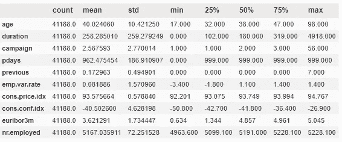

数据描述

从数据中，我们可以观察到平均年龄为 40 岁，最大年龄为 98 岁，最小年龄为 17 岁。余额是以欧元表示的年平均余额。试着理解剩下的数据描述。在试图理解数据的同时，您可以尝试回答以下问题:

## 单变量分析

为了使这一步和下一步更容易和可重复，我创建了一个类来可视化数据。这个类有不同的功能来使探索和洞察力的交流变得容易。下面是我是如何做到的:

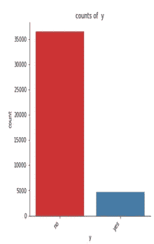

目标分布

似乎有更多的客户没有申请定期存款。这当然是一个不平衡的阶级问题。

1.这个类不平衡的问题如何影响你的模型性能？

2.哪些数据技术方法可能有用？

**注意:**关于如何处理这些问题的更多细节将在转换步骤中提供。

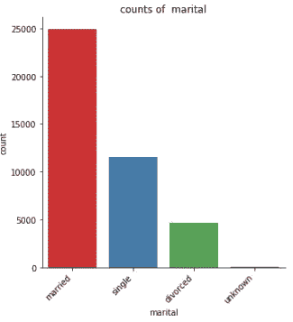

婚姻状况分布

生成了更多的可视化效果，以了解数据集中每个要素的分布情况。

## 双变量分析

比较一个特征相对于另一个特征的分布对于分类任务，目标是主要特征，而另一个特征可以被选择来观察它们的关系

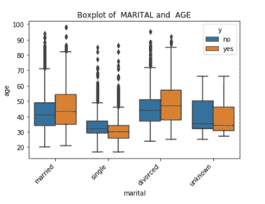

按目标分列的婚姻状况分布 y

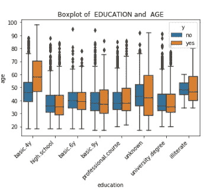

按目标分列的教育分布 y

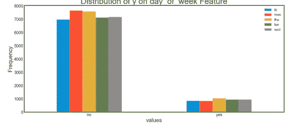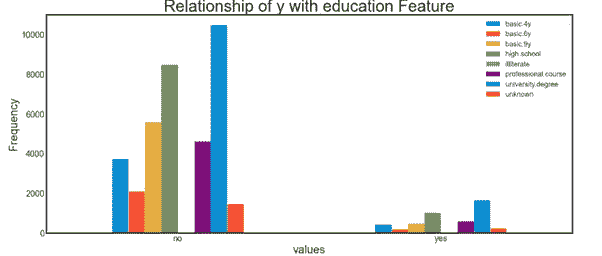

## 洞察力探索

根据上述单变量和双变量分析的结果，可以推断:

1.在一列中有一些类似的值，如婚姻状况和 basic.4y、basic.6y 和 basic.9y 的离婚和单身类别，它们可以替换为 basic，因为它们都指同一事物。

2.婚姻状况的分布在已婚和单身(单身+离异)之间相对均衡

3.近似的 90%的目标对定期订阅说不，留给我们的任务是为一个好的模型平衡数据

4.大多数受访者没有个人贷款。

5.大多数回答者都有大学学位

6.电话在周末没有接通，一周中每天记录的电话数量相对相等

7.近似的 65%的受访者是通过手机联系的

8.大多数电话发生在 5 月。前几次竞选活动在夏季的不均衡可能会影响未来竞选活动的结果。

## 步骤 2:预处理(数据转换)

为了准备建模数据，我们将执行以下操作:

1.复制原始数据，以便所有转换都在重复数据上完成

2.指定目标列并从数据中删除

3.将一些相似的特征映射到一个中以进行适当的编码

4.使用 One Hot 编码技术将对象数据类型列转换为整数

5.使用健壮的 scaler 算法缩放数据:之所以选择这个算法，是因为它不太容易受到离群值的影响。

6.修正不平衡部分的数据更多信息[此处](https://machinelearningmastery.com/smote-oversampling-for-imbalanced-classification/)

7.使用主成分分析进行降维

8.将目标列添加回数据中

9.返回转换后的数据框

为了使这些步骤更容易，我使用了一个类，其中所有的步骤都相应地实现了。下面是一个截图，展示了如何做到这一点

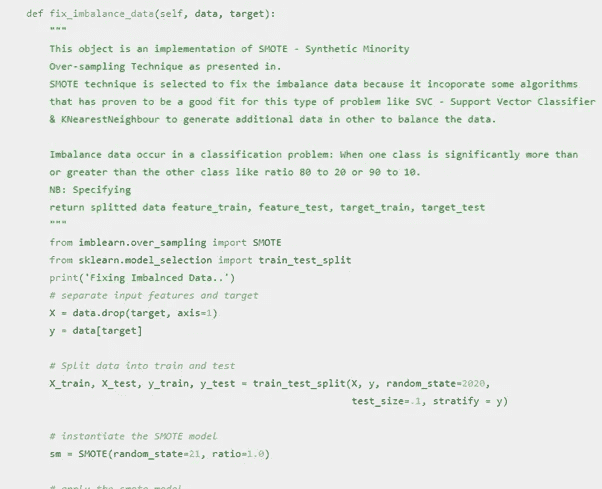

数据转换代码

每一步都有一个功能，使其更具可重复性。将列的相似类别映射在一起，以进一步提高预测模型的性能；使用 imblearn smote 模块对少数类(在我们的案例中是对定期存款订阅说“是”的回答者的数量)进行过采样，从而处理一个热编码数据不平衡；然后进行降维，以降低由一位热编码技术引起的数据复杂性。

## 特征工程

这是向数据集中现有要素添加更多要素的过程。这可以通过特征转换和/或特征聚合来完成。下面显示了一个示例

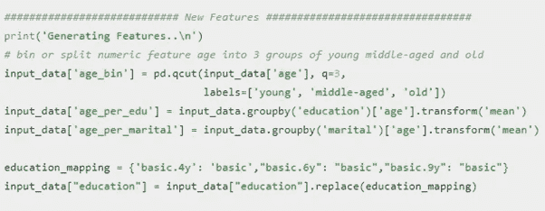

特征工程

在一线时代，一个数字特征被转换成包括年轻人、中年人和老年人的类别。年龄也通过一些分类列(如婚姻)进行汇总，并使用平均值进行转换，以获得每个平均年龄的教育额外特征。

## 第三步:建模

模型开发

在这个阶段，建立了机器学习模型。预测分类变量“y”的最简单和最易解释的模型是逻辑回归。因此，它被用作有待改进的基准模型。在拟合模型时，使用了分层的 5 折交叉验证，因为它对每个折进行采样，使得每个折都是整个数据的良好代表。StratifiedKFold 将数据打乱并分割一次，因此测试集不会重叠，这是执行交叉验证的好方法。

实施逻辑回归模型

```
################ LOGISTIC REGRSSION #########################def run_logistic_regression(self, X_train, X_val, Y_train, Y_val):model_name = '26-08-2020-20-32-31-00-log-reg.pkl'# initialze the kfoldkfold, scores = KFold(n_splits=5, shuffle=True, random_state=221), list()# split data index to train and testfor train, test in kfold.split(X_train):# specify train and test setsx_train, x_test = X_train[train], X_train[test]y_train, y_test = Y_train[train], Y_train[test]# initialize the modelmodel = LogisticRegression(random_state=27,  solver='lbfgs')# trainmodel.fit(x_train, y_train)# predict for evaluationpreds = model.predict(x_test)# compute f1-scorescore = f1_score(y_test, preds)scores.append(score)test_pred = model.predict(X_val)print('f1-score: ',score)print("Average: ", sum(scores)/len(scores))
```

建立的其他模型包括 XGBoost、多层感知器、支持向量机、随机森林。

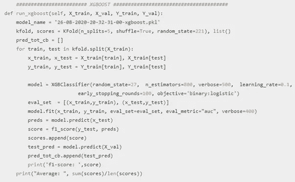

实现 xgboost 模型

选择这些模型是因为它们在检测数据中的隐藏模式和非线性相关性/关系方面的复杂方法。

## 模型评估

用于该数据的评估指标是 recall_score、f1_score 和受试者操作特征(ROC)曲线。他们被选中是因为:

1.数据高度不平衡，偏向公司的负面，即亏损，因此 f1_score 将有助于检测敏感性和特异性之间的调和平均值。

2.在这里，较高的召回分数比较高的精确度更好，因为召回分数 aka(敏感度)是在所有相关实例中检索到的实例的分数。在我们的情况下，识别将订阅定期存款的客户比识别可能订阅或可能不订阅的客户更重要。

3.ROC 曲线有助于解释每个模型如何很好地解释数据中的方差。越接近 1 越好，并且应该高于 0.5，这比随机猜测要好。

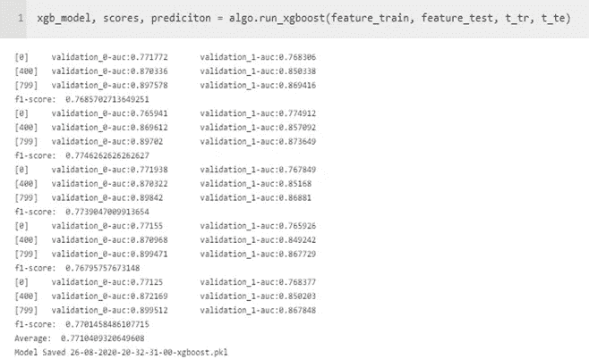

模型评估

评估模型的代码

```
def eval_model(self, target_test_data, prediction):from sklearn.metrics import accuracy_score,confusion_matrix,recall_score, f1_score, precision_scorefrom sklearn.metrics import classification_reportconfusion_matrix = confusion_matrix(target_test_data, prediction)print('Accuracy Score: ', accuracy_score(target_test_data, prediction))print('F1-Score: ', f1_score(target_test_data, prediction))print('Recall: ', recall_score(target_test_data, prediction))print('Precision: ', precision_score(target_test_data, prediction))print(confusion_matrix)print(classification_report(target_test_data, prediction))def plot_auc_curve(self, model, model_name, test_data, target_test_data):from sklearn.metrics import roc_auc_scorefrom sklearn.metrics import roc_curvelogit_roc_auc = roc_auc_score(target_test_data, model.predict(test_data))fpr, tpr, thresholds = roc_curve(target_test_data, model.predict_proba(test_data)[:,1])plt.figure()plt.plot(fpr, tpr, label=f'{model_name} (area under curve = %0.2f)' % logit_roc_auc)plt.plot([0, 1], [0, 1],'r--')plt.xlim([0.0, 1.0])plt.ylim([0.0, 1.05])plt.xlabel('False Positive Rate')plt.ylabel('True Positive Rate')plt.title(f'Receiver operating characteristic ({model_name})')plt.legend(loc="lower right")plt.savefig(f'{model_name}_ROC')plt.show()
```

评估模型

准确度分数:0.84676465465

f1-得分:0.41941391337

召回:0 . 48667 . 38686868661

精度:0.36466868665

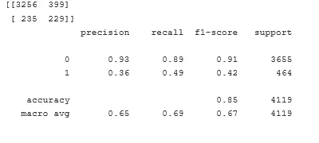

分类报告

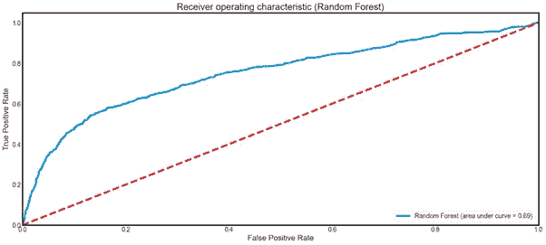

受试者工作特征曲线

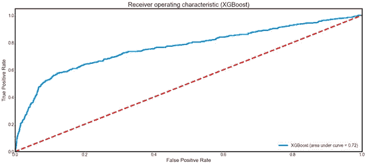

xgboost roc 曲线

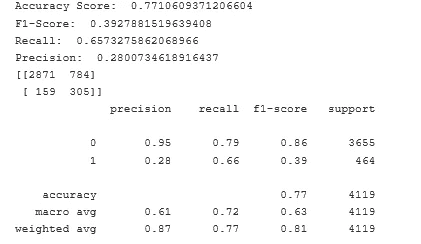

分类报告

该模型对于类别 0(没有订阅押金的回答者)的预测和召回率较高，但是对于类别 1(订阅的回答者)的预测和召回率较低。0 班的 F1 分数很高，而 1 班的 F1 分数低于 0.5。总的来说，该模型似乎不能很好地预测定期存款的受访者。曲线下的面积为 0.72，大大高于随机猜测的概率面积(0.5)。给定上述分类报告的结果，可以假设对 ROC 曲线下面积的最大贡献来自正确识别的 0 级。

## 模型比较

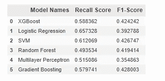

建造的模型

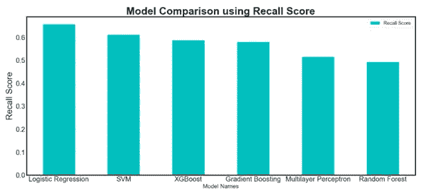

在所有模型中，逻辑回归具有最高的回忆得分值。

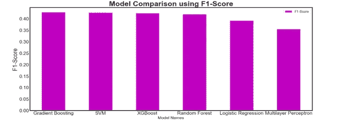

就 f1-得分而言，梯度推进模型具有最高的性能。

结论

支持向量机为 F1 分数和回忆分数给出了稳定和可靠的模型性能。较高的 F1 分数表明，该模型可以很好地预测现有客户的存款订阅活动是否成功。这是在 [10 academy training](http://10academy.org) 中每周挑战的一部分。

有详细分析代码的笔记本可以在[这里](https://github.com/Abuton/Modelling-Subscription-for-Bank-Deposits)找到