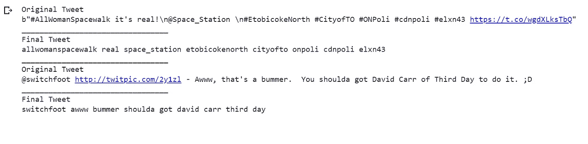

# 社交媒体数据 NLP 的数据清理，只需两个简单的步骤。

> 原文：<https://towardsdatascience.com/data-cleaning-for-nlp-of-social-media-text-in-2-simple-steps-6ca48fa99c17?source=collection_archive---------19----------------------->

## 在本文中，我们将利用 Twitter 数据来演示如何使用 Regex 和 NLTK 执行数据清理。

如果你处理过机器学习或数据科学问题，你应该知道数据清理是构建算法的关键步骤。算法的质量将取决于数据清理的效果。在处理 NLP 时，数据清理变得更加复杂。在这里，我们必须使用单词和语法字符。这就是为什么为了使这个任务更简单，我们将在 Twitter 数据上演示简单的步骤。所以，事不宜迟，让我们开始吧。

注意: 1】这里我们假设一个人知道如何用 Python 编程，并且理解机器学习的概念。2]根据您的应用，下面列出的步骤可能会有细微的变化。

我们将使用 Regex 和 NLTK。Regex 或正则表达式是一个文本字符串，用于描述从大量文本中提取信息时的搜索查询。文档可在此处找到:

 [## 7.2.re —正则表达式操作— Python 2.7.17 文档

### 这个模块提供了类似于 Perl 中的正则表达式匹配操作。无论是图案还是字符串…

docs.python.org](https://docs.python.org/2/library/re.html) 

NLTK 或自然语言工具包为计算语言学提供了库和程序。以下是相同的文档:

 [## 自然语言工具包— NLTK 3.4.5 文档

### NLTK 是构建 Python 程序来处理人类语言数据的领先平台。它提供了易于使用的…

www.nltk.org](https://www.nltk.org/) 

首先，我们将导入上面提到的库。

这里我们已经导入了 Regex (re)和 NLTK。从 NLTK 库中，我们下载了 ***停用词*** 模块。停用词是被认为是不相关的词，可以在分析文本时删除。注意，这里我们使用 NLTK 中给出的默认停用词。您可以根据手头问题的要求制作停用词文件并导入。最后，我们做了一套所有的停用词。

# 第一步:清理正文。

在这一步中，我们将从文本数据中去除“噪音”。在社交媒体文本数据的背景下，我们将以下内容视为噪音:

1] Html 标签和属性(即/ ]+>/)。

2] Html 字符代码(即&…；).

3]网址和空白。

我们使用正则表达式来做同样的事情。如果你不熟悉正则表达式，我推荐你参考本教程。

 [## Python 正则表达式

### 正则表达式(RegEx)是定义搜索模式的字符序列。比如上面的代码…

www.programiz.com](https://www.programiz.com/python-programming/regex) 

现在我们将在一个列表中收集 tweets 数据。为了这个教程，我在这里只导入了两条 tweets。

现在，我们将创建一个函数，该函数将原始推文列表作为输入，去除“噪声”并生成干净推文列表作为输出。

正如你所看到的，我们计划删除所有的 HTML 字符，标点符号，网址以及空白。此外，我们将字符串中的所有大写字母转换为小写字母。这里我们使用 Regex 的 re.sub()方法。这个方法扫描字符串，并用空格替换我们想要删除的子字符串。

在 re.sub()中，我们在第一个参数中指定正则表达式模式，在第二个参数中指定新字符串，在第三个参数中指定要处理的字符串。

上面的函数为给定的 tweets 生成以下输出。

正如你所看到的，输入的 tweetss 有 URL 和标签，而输出的 tweet 更简洁，并且是小写形式。

# 第二步:删除停用词。

现在我们有了一个更简单、更整洁的 tweets，我们通过删除不必要的单词来进一步清理它们。停用词给我们的文本分析增加了冗余，因此通过移除这样的词，我们可以使我们的分析更加准确。

类似于步骤 I，我们将定义一个新的函数来删除停用词。

这个函数将一列 tweet 作为输入，将 tweet 拆分成单独的单词，删除停用词，并生成一列干净的 tweet 作为输出。

我们将第一步的输出作为第二步的输入。上述函数产生以下输出。

你可以看到原始推文和最终推文之间的差异。最终的推文非常紧凑，只有相关的词。

如果你觉得这篇文章有用，请给它鼓掌，它会有很大的帮助！！

关注我的 [**中型**](https://medium.com/@agastidukare) 获取更多此类教程&文章。

如果你愿意，在 [**LinkedIn**](https://www.linkedin.com/in/agastidukare/) 上连接。

如果您有任何疑问或发现代码/概念中的任何错误，请随时在评论中写下。这是我试图与世界分享我在数据科学领域所知道的一切！

图片来源:[https://www.geotab.com/blog/data-cleaning/](https://www.geotab.com/blog/data-cleaning/)