# Python 中的数据清理:终极指南

> 原文：<https://towardsdatascience.com/data-cleaning-in-python-the-ultimate-guide-2020-c63b88bf0a0d?source=collection_archive---------1----------------------->

## 清洁什么和如何清洁的技巧。

来源: [Pixabay](https://pixabay.com/photos/rubber-ducks-bath-ducks-fun-bathing-3412065/)

对于本指南的更新版本，请访问【Python 中的 数据清理技术:终极指南。

在拟合机器学习或统计模型之前，我们总是*必须*清理数据。没有模型会用杂乱的数据创造出有意义的结果。

> [**数据清理**](https://en.wikipedia.org/wiki/Data_cleansing) 是从记录集、表或数据库中检测和纠正(或删除)损坏或不准确记录的过程，指的是识别数据中不完整、不正确、不准确或不相关的部分，然后替换、修改或删除脏的或粗糙的数据。

好长的定义啊！这当然不好玩，而且非常耗时。

来源:[kdnuggets.com](https://www.kdnuggets.com/2017/09/cartoon-machine-learning-class.html)

为了使*更简单*，我们用 Python 创建了这个新的完整的分步指南。你将在*中学习如何* *找到并清理*的技巧:

*   缺失数据
*   不规则数据(异常值)
*   不必要的数据—重复数据、重复数据等等
*   不一致的数据—大写、地址等

**进一步学习**:我们推出了一门课程[Python for Data Analysis:step-by-step with projects](https://www.justintodata.com/courses/python-for-data-analysis-projects-online-course/)，其中包括一整节更新的数据清理等内容！请在这里查看。

在本指南中，我们使用来自 Kaggle 的俄罗斯住房数据集。这个项目的目标是预测俄罗斯的房价波动。我们不会清理整个数据集，但会展示其中的示例。

在我们进入清理过程之前，让我们简单地看一下数据。

从这些结果中，我们了解到数据集有 30，471 行和 292 列。我们还识别特征是数字变量还是分类变量。这些都是有用的信息。

现在，我们可以浏览“脏”数据类型的清单，并逐一修复它们。

让我们开始吧。

来源: [GIPHY](https://media.giphy.com/media/P1SDU8YUuQb2o/giphy.gif)

# 缺失数据

处理[缺失数据](https://en.wikipedia.org/wiki/Missing_data) /value 是数据清理中最棘手但最常见的部分之一。虽然许多模型可以忍受数据的其他问题，但大多数模型不接受缺失数据。

**如何发现？**

我们将介绍三种技术来了解关于数据集中缺失数据的更多信息。

*   **技巧 1:缺失数据热图**

当要素数量较少时，我们可以通过热图可视化缺失的数据。

下图展示了前 30 个特性的缺失数据模式。水平轴显示功能名称；纵轴显示观察值/行数；黄色代表丢失的数据，而蓝色代表其他数据。

例如，我们看到 *life_sq* 特性在许多行中都有缺失值。而*楼层*特征仅在第 7000 行附近有少量缺失值。

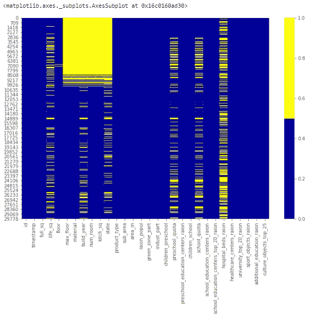

缺失数据热图

*   **技术#2:缺失数据百分比列表**

当数据集中有许多要素时，我们可以为每个要素列出缺失数据百分比。

这将生成一个列表，显示每个要素缺失值的百分比。

具体来说，我们看到 *life_sq* 特性缺失了 21%，而 *floor* 只缺失了 1%。这个列表是一个有用的总结，可以补充热图可视化。

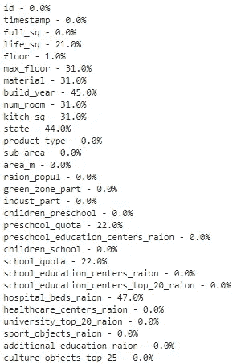

缺失数据%列表-前 30 个要素

*   **技术#3:缺失数据直方图**

当我们有许多特征时，缺失数据直方图也是一种技术。

要了解更多关于观察值中缺失值模式的信息，我们可以通过直方图来可视化它。

该直方图有助于识别 30，471 个观察值中缺失值的情况。

例如，有超过 6000 个没有缺失值的观察值和接近 4000 个有一个缺失值的观察值。

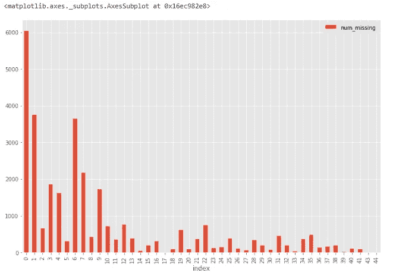

缺失数据直方图

**该怎么办？**

没有一致同意的解决丢失数据的方法。我们必须研究特定的特征和数据集，以决定处理它们的最佳方式。

下面介绍了处理缺失数据的四种最常见的方法。但是，如果情况比平常更复杂，我们需要创造性地使用更复杂的方法，比如缺失数据建模。

*   **解决方案#1:放弃观察**

在统计学中，这种方法被称为列表删除技术。在这个解决方案中，只要它包含一个缺失值，我们就丢弃整个观察值。

*只有当*我们确定缺失的数据不具有信息性时，我们才执行此操作。否则，我们应该考虑其他解决方案。

可能有其他标准用于删除观察值。

例如，从缺失数据直方图中，我们注意到只有极少量的观察值总共缺失超过 35 个特征。我们可以创建一个新的数据集 *df_less_missing_rows* 删除超过 35 个缺失特征的观测值。

*   **解决方案 2:放弃这个功能**

类似于解决方案#1，我们*只有在确信这个特性不能提供有用信息时才*这样做。

例如，从缺失数据百分比列表中，我们注意到 *hospital_beds_raion* 具有高达 47%的缺失值百分比。我们可能会放弃整个功能。

*   **解决方案#3:估算缺失值**

当特征是数值变量时，我们可以进行缺失数据插补。我们用未缺失的同一要素的数据的平均值或中值替换缺失值。

当特征是一个分类变量时，我们可以通过众数(最频繁值)来估算缺失数据。

以 *life_sq* 为例，我们可以用它的中值替换这个特性的缺失值。

此外，我们可以一次对所有数字特征应用相同的插补策略。

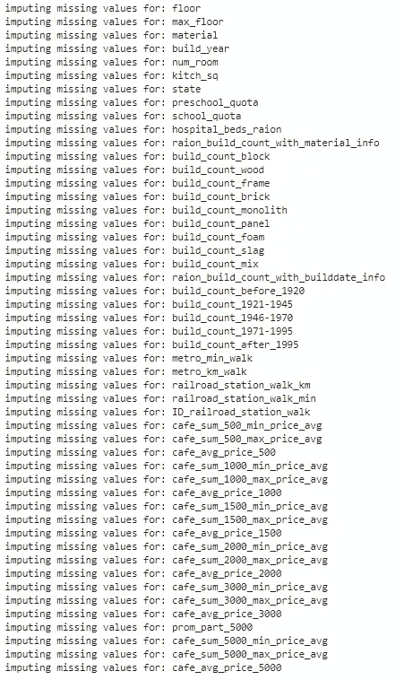

幸运的是，我们的数据集没有分类特征的缺失值。然而，我们可以一次对所有分类特征应用模式插补策略。

*   **解决方案 4:更换缺失的**

对于分类特征**，**，我们可以添加一个新的类别，其值为“_MISSING_”。对于数字特征**，**我们可以用一个特定的值代替，比如-999。

这样，我们仍然将丢失的值作为有价值的信息保存。

# 不规则数据(异常值)

[异常值](https://en.wikipedia.org/wiki/Outlier)是与其他观测值*明显*不同的数据。它们可能是真正的异常值或错误。

**如何发现？**

根据特征是数值的还是分类的，我们可以使用不同的技术来研究它的分布以检测异常值。

*   **手法#1:** [**直方图**](https://en.wikipedia.org/wiki/Histogram) **/** [**方框图**](https://www.khanacademy.org/math/statistics-probability/summarizing-quantitative-data/box-whisker-plots/a/box-plot-review)

当特征是数字时，我们可以使用直方图和箱线图来检测异常值。

下面是特征 *life_sq* 的直方图。

由于可能存在异常值，数据看起来非常不准确。

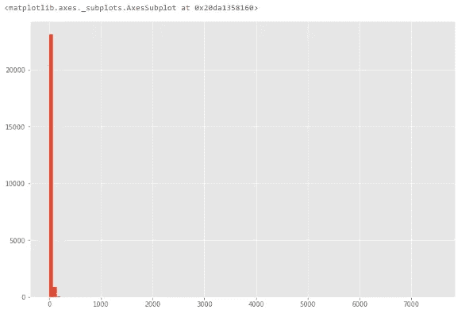

柱状图

为了更仔细地研究这个特征，让我们画一个方框图。

在该图中，我们可以看到有一个值超过 7000 的异常值。

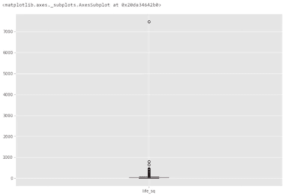

箱形图

*   **技巧 2:描述性统计**

此外，对于数字要素，异常值可能过于明显，以至于箱线图无法显示它们。相反，我们可以看看他们的描述性统计数据。

例如，再次针对特性 *life_sq* ，我们可以看到最大值是 7478，而 75%四分位数只有 43。7478 值是一个异常值。

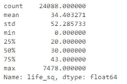

*   **技巧三:条形图**

当特征是绝对的时。我们可以用柱状图来了解它的类别和分布。

比如特色*生态*分布合理。但是，如果有一个类别只有一个名为“其他”的值，那么这将是一个离群值。

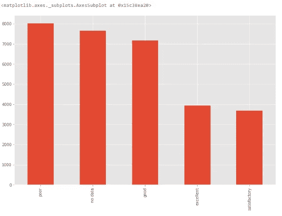

条形图

*   **其他技术:**许多其他技术也可以发现异常值，比如散点图、z 得分和聚类。本文没有涵盖所有这些内容。

**做什么？**

虽然离群值不难检测，但我们必须确定正确的解决方案来处理它们。它高度依赖于数据集和项目的目标。

处理异常值的方法有点类似于缺失数据。我们要么放弃，要么调整，要么保留它们。我们可以参考缺失数据部分来寻找可能的解决方案。

# 不必要的数据

在为缺失数据和异常值做了所有的努力之后，让我们来看看不必要的数据，这更简单。

所有输入模型的数据都应该服务于项目的目的。不必要的数据是那些没有增加价值的数据。由于不同的原因，我们涵盖了三种主要类型的不必要数据。

## 不必要的类型#1:无信息/重复

有时一个特征是无用的，因为它有太多的行是相同的值。

**如何发现？**

我们可以创建一个具有高百分比相同值的特性列表。

例如，我们在下面指定显示 95%以上的行是相同值的特性。

我们可以逐一研究这些变量，看看它们是否能提供信息。这里就不展示细节了。

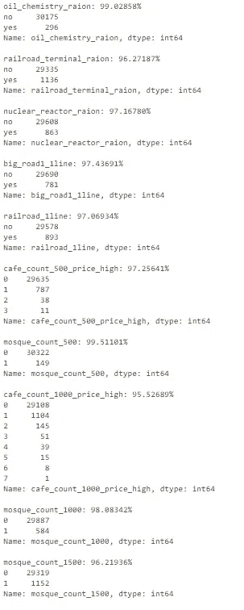

**该怎么办？**

我们需要了解重复特征背后的原因。当它们真的毫无意义时，我们可以把它们扔掉。

## 不必要的类型 2:不相关

同样，数据需要为项目提供有价值的信息。如果特性与我们在项目中试图解决的问题不相关，它们就是不相关的。

**如何发现？**

我们需要浏览这些特征，找出不相关的特征。

例如，记录多伦多气温的功能并不能为预测俄罗斯房价提供任何有用的信息。

**该怎么办？**

当特性没有服务于项目的目标时，我们可以删除它们。

## 不必要的类型#3:重复

重复数据是指存在相同观测值的副本。

重复数据主要有两种类型。

*   **重复类型#1:基于所有特征**

**如何发现？**

当观测值中所有要素的值都相同时，会出现这种重复。很容易找到。

我们首先删除数据集中的唯一标识符 *id* 。然后，我们通过删除重复项来创建一个名为 *df_dedupped* 的数据集。我们比较两个数据集(df 和 df_dedupped)的形状，找出重复行的数量。

第 10 行是完整的重复观测。

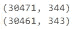

**该怎么办？**

我们应该删除这些重复的，我们已经这样做了。

*   **重复类型#2:基于关键特征**

**如何发现？**

有时，根据一组唯一标识符删除重复数据会更好。

例如，两笔交易同时发生、面积相同、价格相同、建造年份相同的几率接近于零。

我们可以设置一组关键特性作为事务的唯一标识符。我们包括*时间戳、满 _ 平方、寿命 _ 平方、楼层、建造 _ 年份、房间数量、价格 _ 文档*。我们检查是否有基于它们的副本。

基于这组关键特征有 16 个副本。

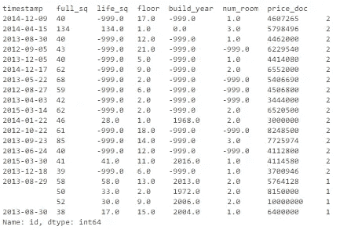

**该怎么办？**

我们可以根据关键特征删除这些重复项。

我们在名为 *df_dedupped2* 的新数据集中删除了 16 个重复项。

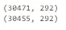

# 不一致的数据

让数据集遵循特定的标准来适应模型也很重要。我们需要以不同的方式探索数据，找出不一致的数据。很多时候，这取决于观察和经验。没有固定的代码来运行和修复它们。

下面我们介绍四种不一致的数据类型。

## 不一致类型#1:大写

分类值中大小写用法不一致是一个常见的错误。这可能会导致问题，因为 Python 中的分析是区分大小写的。

**如何发现？**

让我们看看*子区域*特征。

它存储了不同地区的名称，看起来非常标准化。

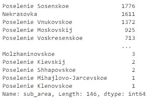

但是有时在同一特性中会出现不一致的大写用法。“Poselenie Sosenskoe”和“pOseleNie sosenskeo”可以指同一地区。

**该怎么办？**

为了避免这一点，我们可以把所有的字母小写(或大写)。

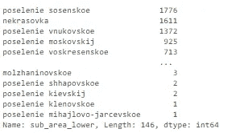

## 不一致的类型#2:格式

我们需要执行的另一个标准化是数据格式。一个例子是将特征从字符串转换为日期时间格式。

**如何发现？**

特征*时间戳*是字符串格式，而它表示日期。

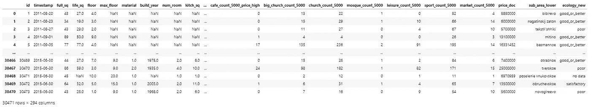

**怎么办？**

我们可以使用下面的代码转换它并提取日期或时间值。在此之后，按年份或月份分析交易量组就更容易了。

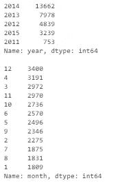

**相关文章:** [如何像老板一样在 Python 中操纵日期和时间](/how-to-manipulate-date-and-time-in-python-like-a-boss-ddea677c6a4d)

## 不一致的类型#3:分类值

不一致的分类值是我们讨论的最后一种不一致类型。分类特征的值数量有限。有时由于错别字等原因可能会有其他值。

**如何发现？**

我们需要观察特征来找出这种不一致性。让我们用一个例子来说明这一点。

我们在下面创建一个新的数据集，因为我们在房地产数据集中没有这样的问题。例如，*城市*的值被错误地输入为“多伦多”和“特隆托”。但两者都指的是正确的值“多伦多”。

识别它们的简单方法是模糊逻辑(或[编辑距离](https://en.wikipedia.org/wiki/Edit_distance))。它测量我们需要多少个字母(距离)来改变一个值的拼写以匹配另一个值。

我们知道类别应该只有四个值:“多伦多”、“温哥华”、“蒙特利尔”和“卡尔加里”。我们计算所有值与单词“多伦多”(和“温哥华”)之间的距离。我们可以看到，可能是错别字的那些与正确的单词之间的距离较小。因为它们只相差几个字母。

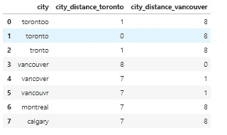

**做什么？**

我们可以设置标准来将这些错别字转换成正确的值。例如，下面的代码将距离“toronto”两个字母以内的所有值都设置为“toronto”。

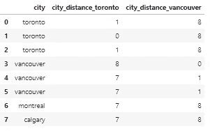

## 不一致类型#4:地址

地址功能可能会让我们很多人感到头疼。因为向数据库输入数据的人通常不遵循标准格式。

**如何发现？**

我们可以通过查看找到杂乱的地址数据。即使有时我们不能发现任何问题，我们仍然可以运行代码来标准化它们。

出于隐私原因，我们的数据集中没有地址列。因此，我们创建一个新的数据集 *df_add_ex* ，其特征*地址*。

我们可以看到，地址功能相当混乱。

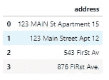

**该怎么办？**

我们运行下面的代码来小写字母，删除空白，删除句号和标准化的措辞。

现在看起来好多了。

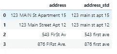

我们*做到了*了！我们走过了多么漫长的旅程啊。

**进一步学习**:如果你喜欢这篇文章，你可能会喜欢我们的新课程[Python for Data Analysis:step-by-step with projects](https://www.udemy.com/course/python-for-data-analysis-step-by-step/?referralCode=C8B8B507FB1197183455)，它包括一个更新的数据清理的完整部分，等等！
请看这里的。

清除所有阻碍你适应模型的“脏”数据。

*是*清洗*的*老板！

来源: [GIPHY](https://media.giphy.com/media/M36MfordpR5EQ/giphy.gif)

感谢您的阅读。

我希望这个数据清理指南对你有所帮助。请留下任何评论，让我们知道你的想法。

在你离开之前，别忘了 [*报名参加刚刚进入数据快讯*](https://www.justintodata.com/) ！或者在[推特](https://twitter.com/JustintoData)、[脸书](https://www.facebook.com/justintodata/)上与我们联系。
所以您*不会*错过我们任何新的数据科学文章！

 [## 如何在线学习数据科学:你需要知道的一切——进入数据

### 这是利用在线资源进入数据科学的完整路线图/课程。你是否想学习…

www.justintodata.com](https://www.justintodata.com/how-to-learn-data-science-online-all-you-need-to-know/)  [## 预测时间序列的三个步骤:LSTM 与 TensorFlow Keras -只是进入数据

### 这是利用在线资源进入数据科学的完整路线图/课程。你是否想学习…

www.justintodata.com](https://www.justintodata.com/forecast-time-series-lstm-with-tensorflow-keras/)  [## 如何像老板一样操纵 Python 中的日期和时间——只处理数据

### 这是利用在线资源进入数据科学的完整路线图/课程。你是否想学习…

www.justintodata.com](https://www.justintodata.com/manipulate-date-and-time-in-python/)