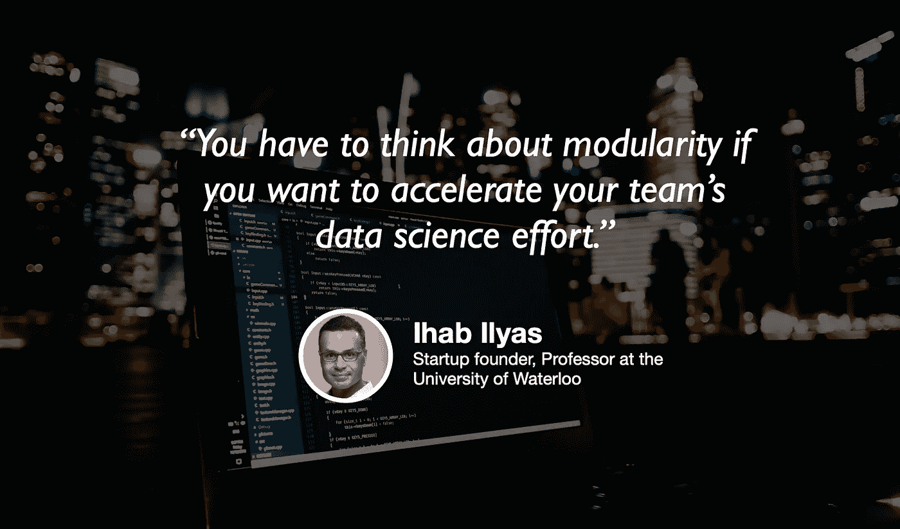

# 数据清理终于实现了自动化

> 原文：<https://towardsdatascience.com/data-cleaning-is-finally-being-automated-8cc964ea2e12?source=collection_archive---------21----------------------->

## [苹果](https://podcasts.apple.com/ca/podcast/towards-data-science/id1470952338?mt=2) | [谷歌](https://www.google.com/podcasts?feed=aHR0cHM6Ly9hbmNob3IuZm0vcy8zNmI0ODQ0L3BvZGNhc3QvcnNz) | [SPOTIFY](https://open.spotify.com/show/63diy2DtpHzQfeNVxAPZgU) | [其他](https://anchor.fm/towardsdatascience)

## Ihab 易勒雅斯在 [TDS 播客](https://towardsdatascience.com/podcast/home)

*编者按:迈向数据科学播客的“攀登数据科学阶梯”系列由 Jeremie Harris 主持。Jeremie 帮助运营一家名为*[*sharpes minds*](http://sharpestminds.com)*的数据科学导师初创公司。可以听下面的播客:*

说数据清理占数据科学家工作的 80%是老生常谈，但这在方向上是正确的。

这太糟糕了，因为像数据探索、可视化和建模这样有趣的事情是大多数人进入数据科学的原因。因此，行业内正在大力推动尽可能自动化数据清理，这是一件好事。

这项工作的领导者之一是滑铁卢大学教授伊哈布·易勒雅斯，他是两家公司 Tamr 和 Inductiv 的创始人，两家公司都专注于数据科学生命周期的早期阶段:数据清理和数据集成。Ihab 非常了解数据清理和数据工程，并有一些关于该领域未来方向的非常棒的见解可以分享——包括一旦自动化了数据清理，数据科学家还有什么工作要做。

以下是我从对话中最大的收获:

*   数据清理涉及很多事情，其中之一就是处理丢失的值。历史上，缺少的值通常由主题专家手动填充，他们可以对数据进行有根据的猜测，但自动化技术在大规模应用时可以工作得很好(通常做得更好)。
*   这些自动化策略的范围从相当简单的方法(例如，用数据集中其他点的中值或平均值替换某个值)到更复杂的技术(例如，使用预测模型猜测缺失值)。
*   数据科学生命周期的不同部分之间的区别通常是任意的，但明确定义数据清理、数据探索和建模之间的界限对于确保问题能够以包容和模块化的方式得到解决是至关重要的。这个想法是构成 DataOps 的数据科学最佳实践的一部分，data ops 是我们之前在播客中讨论过的一个主题。
*   很明显，像建模一样，数据清理也不能避免自动化。因此，数据科学家很可能会发现自己在未来越来越多地学习他们的主题专业知识、沟通和工程技能，而不是将时间花在处理缺失值、超参数优化或模型选择上。

你可以在 Twitter 上关注 Ihab，这里是 T1，你也可以在 Twitter 上关注我，这里是 T2，这里是 T3。