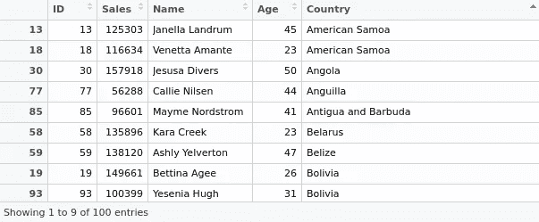
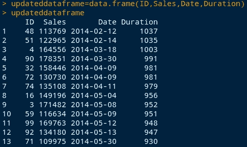
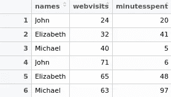
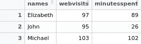

# R 中的数据清理、合并和争论

> 原文：<https://towardsdatascience.com/data-cleaning-merging-and-wrangling-in-r-26c2cd3649f4?source=collection_archive---------31----------------------->

## 这里有一些整理数据和在 r 中进行常见数据操作的有用技巧。

在任何上下文中处理数据的一个大问题是数据清理和数据集合并的问题，因为通常情况下，您会发现自己必须整理多个文件中的数据，并且需要依赖 R 来执行通常在 Excel 中使用 VLOOKUP 等命令执行的功能。

下面是一些关于 R 如何用于数据操作的有用例子。虽然 Python 的 pandas 库传统上被认为是这一领域的赢家，但 R 经常使用的数据操作技术实际上非常强大。

让我们来看看其中的一些。

# 数据清理和合并功能

对于示例 1–7，我们有两个数据集:

*   **sales:** 该文件包含变量 Date、ID(即产品 ID)和 sales。我们将它加载到 R 中，命名为 mydata。
*   **客户:**该文件包含变量 ID、年龄和国家。我们将它加载到 R 中，命名为 mydata2。

这些数据集可以在下面的 [GitHub 仓库](https://github.com/MGCodesandStats/rtutorial-data-cleaning)获得。

下面是 R 中用来清理数据集的流行技术的例子，以及如何有效地格式化变量以方便分析。以下函数特别适用于面板数据集，其中混合了横截面和时间序列数据。

## **1。在数据帧中存储变量**

从一个简单的例子开始，让我们选择客户数据集。假设我们只希望在数据中包含变量 ID 和 Age。为此，我们将数据框定义如下:

```
dataframe<-data.frame(ID,Age)
```

## **2。使用合并功能模拟 VLOOKUP**

通常，有必要将不同数据集中的两个变量组合起来，类似于在 Excel 中使用 VLOOKUP 根据特定标准连接两个变量。如果你不熟悉 VLOOKUP 函数，你可能会发现 Spreadsheeto 的这个指南特别有用。

在 R 中，这可以使用 merge 函数来完成。

例如，假设我们希望将 sales 数据集中的 Date 变量与 customers 数据集中的 Age 和 Country 变量链接起来，用 ID 变量作为公共链接。

因此，我们做如下工作:

```
mergeinfo<-merge(mydata[, c("ID", "Sales")],mydata2[, c("ID", "Age", "Country")])
```

这样做后，我们看到在 R 中形成了一个新的数据集，它连接了我们选择的变量:



**3。使用 as.date 格式化日期并计算持续时间**

假设我们现在希望计算当前日期和销售文件中列出的销售日期之间的天数。为了实现这一点，我们可以使用 as.date，如下所示:

```
currentdate=as.Date('2016-12-15')
dateinfile=as.Date(Date)
Duration=currentdate-dateinfile
```

回到上面的例子，假设我们现在希望将这个持续时间变量与其余的数据结合起来。

因此，我们现在可以将我们的新 Duration 变量与上面的 merge 函数结合起来，并且可以这样做:

```
durationasdouble=as.double.difftime(Duration, units='days')
updateddataframe=data.frame(ID,Sales,Date,durationasdouble)
updateddataframe
```



**4。使用 as。POSIXct 和 format 来计算秒之间的差异**

虽然在上面的例子中情况并非如此，但在我们拥有包含时间的日期的情况下，经常会出现这样的情况，例如“2016–10–13 19:30:55”。

有时，我们可能希望找出两个日期的秒数之间的差异。对此，作为。POSIXct 是比 as.Date 更合适的选项。

```
date_converted<-format(Date, format="%Y-%m-%d %H:%M:%S")
new_date_variable<-as.POSIXct(date_converted)
seconds<-diff(new_date_variable,1)
```

当我们定义秒变量时，它会给出两个日期之间的秒差。然后，这是一个简单的算术问题，以获得分钟和秒的差异。

```
minutes<-seconds/60
hours<-minutes/60
```

**5。grepl:从变量中删除一个字符串的实例**

让我们看看国家变量。假设我们希望从变量中删除所有“Greenland”的实例。这是使用 grepl 命令完成的:

```
countryremoved<-mydata2[!grepl("Greenland", mydata2$Country),]
```

**6。使用头尾功能删除观察值**

如果我们希望从变量中删除某些观察值，例如销售额，可以使用 head 和 tail 函数。head 函数允许我们删除前 30 行，而 tail 函数允许我们删除后 30 行。

当使用以这种方式编辑的变量进行计算时，例如回归，as.matrix 函数也用于将变量转换为矩阵格式:

```
Salesminus30days←head(Sales,-30)
X1=as.matrix(Salesminus30days)
X1

Salesplus30days<-tail(Sales,-30)
X2=as.matrix(Salesplus30days)
X2
```

**7。使用“聚集”功能**复制 SUMIF

```
names <- c("John", "Elizabeth", "Michael", "John", "Elizabeth", "Michael")
webvisitsframe <- cbind("24","32","40","71","65","63")
webvisits=as.numeric(webvisitsframe)
minutesspentframe <- cbind("20", "41", "5", "6", "48", "97")
minutesspent=as.numeric(minutesspentframe)
```

假设我们已经创建了如下表格，并希望获得在任何特定时间段内网站访问量和在网站上花费时间的总和:



在这种情况下，我们可以通过使用 r 中的聚合函数来复制 Excel 中的 SUMIF 函数(其中与特定标识符相关联的值被求和)，这可以按如下方式完成(其中 raw_table 是上面指定的表):

```
sumif_table<-aggregate(. ~ names, data=raw_table, sum)
sumif_table
```

因此，与标识符(在本例中是名称)相关联的值总结如下:



根据堆栈溢出中的示例，plyr 和 data.table 库也可用于实现相同的结果，如下所示:

```
library(plyr)
ddply(nametable, .(names), summarise, Sum_webvisits = sum(webvisits), Sum_minutesspent = sum(minutesspent))

library(data.table)
DT <- as.data.table(nametable)
DT[ , lapply(.SD, sum), by = "names"]
```

**8。使用 diff()函数**计算滞后

当进行时间序列分析时，经常需要计算特定变量的滞后时间。为了在 R 中做到这一点，我们使用 diff()函数。

在本例中，我们创建一个矩阵，以价格数据作为列名，以年份作为行名:

```
pricedata <- matrix(c(102, 90, 84, 130, 45), ncol=1)
colnames(pricedata) <- c('Price')
rownames(pricedata) <- c('2012', '2013', '2014', '2015', '2016')
pricedata.table <- as.table(pricedata)
pricedata.table
Year	Price
2012	102
2013	90
2014	84
2015	130
2016	45
2\. Lag = 1diff(pricedata.table,1)
Year	Price
2013	-12
2014	-6
2015	46
2016	-85
3\. Lag = 2diff(pricedata.table,2)
Year	Price
2014	-18
2015	40
2016	-39
4\. Differences = 2diff(pricedata.table,differences=2)
Year	Price
2014	6
2015	52
2016	131
```

**9。按列表分隔(对面板数据集有用)**

假设我们有一个需要分离的数据集，例如通过 ID。手动操作会导致一个相当混乱的过程。相反，我们可以使用 unique 和 split 函数来形成一个列表。这里有一个如何做到这一点的例子。

使用包含日期、姓名和 id 的数据框:

```
> Date<-c("20/02/2017","21/02/2017","22/02/2017","20/02/2017","21/02/2017","22/02/2017")
> ID<-c("20","20","20","40","40","40")
> Name<-c("Brian","Brian","Brian","Adam","Adam","Adam")
> df<-data.frame(Date,ID,Name)
> df
        Date ID  Name
1 20/02/2017 20 Brian
2 21/02/2017 20 Brian
3 22/02/2017 20 Brian
4 20/02/2017 40  Adam
5 21/02/2017 40  Adam
6 22/02/2017 40  Adam
```

但是，我们希望通过按 ID 过滤将观察结果分成两个单独的列表。我们将这样做，如下所示:

```
> listofids=as.character(unique(df$ID))
> mylist <- split(df, df$ID)
> mylist

$`20`
        Date ID  Name
1 20/02/2017 20 Brian
2 21/02/2017 20 Brian
3 22/02/2017 20 Brian$`40`
        Date ID Name
4 20/02/2017 40 Adam
5 21/02/2017 40 Adam
6 22/02/2017 40 Adam
```

这是完整的列表。如果我们希望一次调用一个(通过 ID 作为我们的唯一标识符，我们可以这样做:

```
> mylist[1]
$`20`
        Date ID  Name
1 20/02/2017 20 Brian
2 21/02/2017 20 Brian
3 22/02/2017 20 Brian
> mylist[2]
$`40`
        Date ID Name
4 20/02/2017 40 Adam
5 21/02/2017 40 Adam
6 22/02/2017 40 Adam
```

# 结论

上面的例子说明了我们在 R 中进行数据操作过程的各种方法，以及复制普通 Excel 函数(如 VLOOKUP)的技术。非常感谢您的宝贵时间，上面例子的相关 GitHub 库再次在[这里](https://github.com/MGCodesandStats/rtutorial-data-cleaning)可用。

你也可以在 michael-grogan.com 的[找到更多我的数据科学内容。](https://www.michael-grogan.com/)

*免责声明:本文是在“原样”的基础上编写的，没有担保。本文旨在提供数据科学概念的概述，不应以任何方式解释为专业建议。*