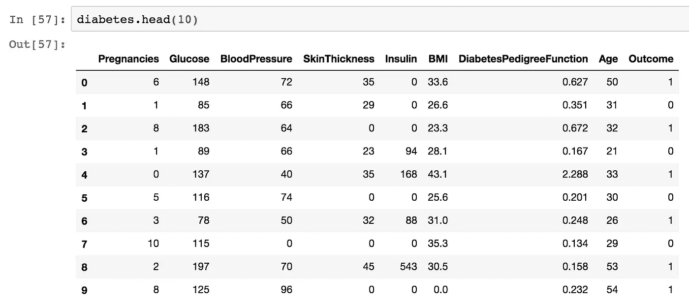
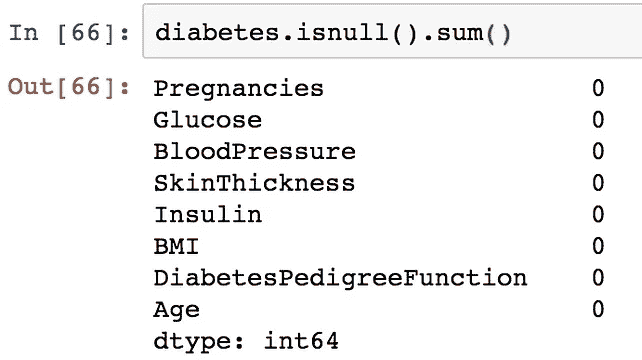
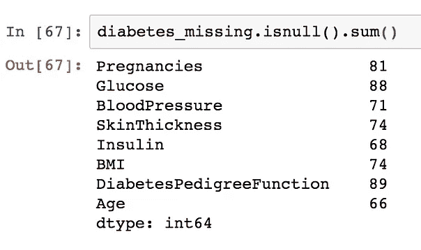
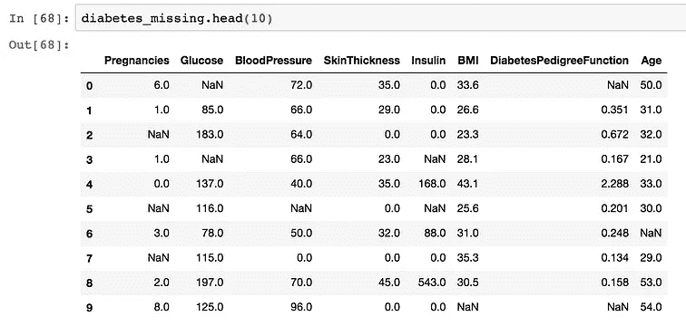
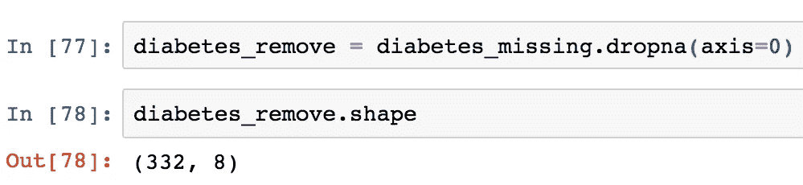
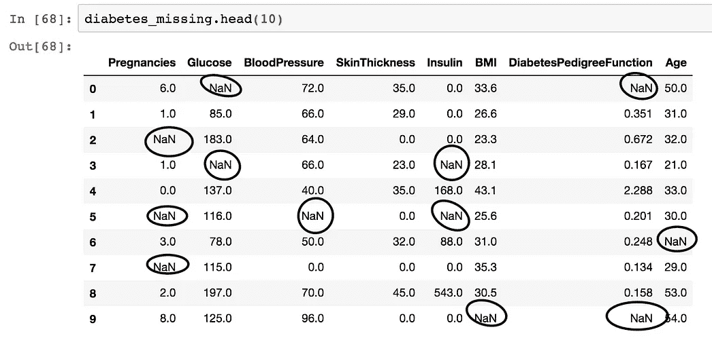
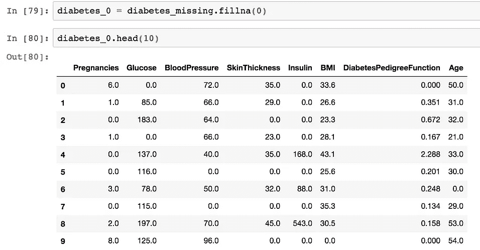

# Python 数据清理系列:第 1 部分

> 原文：<https://towardsdatascience.com/data-cleaning-series-with-python-part-1-24bb603c82c8?source=collection_archive---------33----------------------->

## 数据预处理

## 回到基础——处理缺失值


“计算机上的代码”由[马库斯·斯皮斯克](https://unsplash.com/@markusspiske?utm_source=medium&utm_medium=referral)在 [Unsplash](https://unsplash.com?utm_source=medium&utm_medium=referral) 上发表

> 垃圾进，垃圾出——嘿

几个月前，我和我的一个朋友聊天，他最近申请了班加罗尔一家 IT 公司的高级数据科学职位。作为面试过程的一部分，为了解决一个业务问题，他得到了一个数据集。他开始解释他的方法，很快就被面试官打断了。当我问他原因时，他说，“他们关心的只是我选择的用于数据的算法。”

数据科学领域已经存在了相当一段时间。尽管如此，仍然有很多人低估了干净数据的价值。机器学习算法的好坏取决于输入的数据。
因此，在将你的数据输入你的算法之前，对其进行清理和辩论是至关重要的。

本系列将有助于向该领域的新手灌输有关数据预处理的最佳实践，并为社区中的老成员提供全面的复习。

# 缺少值的情况

研究人员在进行研究时通常会采取非常谨慎的措施。许多此类研究的主要结果是收集数据。不幸的是，许多研究最终都丢失了信息。必须处理缺失值，因为它们会对我们的机器学习算法的预测能力产生负面影响。然而，[某些算法](https://en.wikipedia.org/wiki/Gradient_boosting)会绕过丢失的值。

数据中缺少值的原因很多。调查数据集的参与者可能选择不共享信息，数据录入人员可能会犯错误，收集数据的自动机器可能会出错等。

> 我们必须接受人为错误是不可避免的——并围绕这一事实进行设计——唐纳德·伯威克

维基百科定义了三种缺失数据:

*   *完全随机失踪(MCAR)*
*   *随机失踪(3 月)*
*   *非随机缺失(MNAR)*

我不会详细说明其中的复杂性，但是你可以在这里阅读。

通常，我们会发现数据中缺失值的多种表现形式。有时它们由单个特殊字符表示，如`.`(句号)、`*`(星号)。其他时候可以用`N/A`、`NaN`或者`-999`来代表。

让我们看一个这样的数据集。

# 资料组

我们将使用的数据集是来自 UCI 机器学习知识库的糖尿病数据集。可以从[这里](https://www.kaggle.com/uciml/pima-indians-diabetes-database)下载。让我们快速地看一看。



糖尿病数据集的前 10 个值。

```
# Check number of rows and columns after removing outcome variable.diabetes.shapeOutput:
(768, 8)
```

该数据具有 768 个观察值/行和 8 个变量/列。这里面似乎也没有缺失的价值。让我们通过在每一列中随机插入缺失值来解决这个问题。我们将以 0.1 或 10%的因子在每一列中引入缺失值。



注意数据中的某些观察值是如何被称为`NaN`的。这是 Python 中缺失值的默认表示法。接下来，让我们讨论一些处理这些值的技术。

# 处理缺失值

## 移除观察值

也称为 [**列表式删除**](https://en.wikipedia.org/wiki/Listwise_deletion) ，这种技术简单地涉及删除整个观察值，如果它有一个或多个丢失的值。如果在非常大的数据集中有少量缺失值，可以选择这种方法。



我们观察到，在**列表式删除**之后，超过一半的数据集被擦除。看起来我们已经失去了很多有价值的信息让我们的准模特去学习。
此外，它还会影响 [**统计检验**](https://en.wikipedia.org/wiki/Power_(statistics)) 的功效，因为它们需要大样本量。显然，在这种情况下，这种方法似乎不太合适。

## 用 0 插补

在这种方法中，数据中所有缺失的值(用`NaN`表示)都被替换为数字`0`。



*Python 中的 pandas 库有一个名为* `*pandas.DataFrame.fillna*` *的方法可以帮助我们完成这个任务。*

起初，这种方法似乎是一个有吸引力的选择，因为我们能够保留我们所有的观察结果。此外，这是一种快速的估算方法。然而，仔细观察各个列，我们可以看到，将 0 加到一堆行上会在数据集中引入大量的**偏差**。实际上，那些丢失的条目可能具有远离数字 0 的值。

## 中心值插补

**中心值插补**是一种将缺失值替换为各自的中心趋势度量值的方法，又称**均值**、**中位数**、**众数**。对于数值变量，最好使用平均值或中值，而对于分类变量，则使用众数。
这背后的原因是，对于分类变量而言，均值和中值没有意义，因为分类变量具有定性属性而非定量属性。因此，为了说明集中趋势，我们使用 Mode，因为它是最频繁出现的值。

Python 的`scikit-learn`库有一个名为`SimpleImputer`的模块，它执行中心值插补。
`strategy`参数用于设置我们需要的插补类型。

这种形式的插补有其优点，特别是对于低方差数据。如果我们有非常不稳定的特征，用这种方法估算可能不是一个好主意。然而，与以前的技术相比，它通常是一种快速且更好的估算方法。


照片由[艾米丽·莫特](https://unsplash.com/@emilymorter?utm_source=medium&utm_medium=referral)在 [Unsplash](https://unsplash.com?utm_source=medium&utm_medium=referral) 上拍摄

# 作为输入者的学习算法

到目前为止，我们只研究了处理缺失值的简单方法。当我们的数据变得复杂时，我们需要更好的估算方法。
在这一部分，我们将看看几个我们喜爱的学习算法，以及它们如何帮助我们估算缺失值。

## 回归插补

回归插补是相当不言自明的。这种形式的插补使用多元线性回归原理来插补数值。如果你需要线性回归的复习，那么看看我的线性回归系列。

[](/linear-regression-moneyball-part-1-b93b3b9f5b53) [## 线性回归:钱球—第 1 部分

### 大众体育故事的统计案例研究

towardsdatascience.com](/linear-regression-moneyball-part-1-b93b3b9f5b53) 

为了概括线性回归，我们挑选一个因变量或输出 ***y*** ，并使用多个自变量 ***X*** 来拟合一个能够预测**y 的函数。*使用 ***X*** 中的变量作为输入量或**回归量**来预测**。***

**在**回归插补**中，带有缺失值的一列被选作我们的 *y* ，其余的列被用作输入变量**X来拟合**y .该函数用于预测 ***y.*** `scikit-learn`列中的缺失值。******

**虽然回归插补似乎可行，但它也有局限性。由于我们使用拟合值作为插补的输出，我们的插补值将非常精确。
这是因为与正常的线性回归模型不同，回归插补缺少一个 [**误差**](https://en.wikipedia.org/wiki/Errors_and_residuals) 项。完全消除了这些估算值的不确定性。**

## **k-最近邻插补**

**也被称为 **Knn 插补**，这种插补形式使用[K-最近邻算法](https://en.wikipedia.org/wiki/K-nearest_neighbors_algorithm)来插补数值。**

**这个算法很好解释。它查看 k 个条目，并比较它们与有缺失值的条目之间的“距离”。这里的 k 值由用户定义。k 的合适值的经验法则是取观察次数(N)的平方根。**

****

**乔恩·泰森在 [Unsplash](https://unsplash.com?utm_source=medium&utm_medium=referral) 上的照片**

**k-NN 算法使用距离度量来选择与我们感兴趣的行最近的邻居。
用于数字属性的最常见的距离[度量](https://en.wikipedia.org/wiki/Metric_(mathematics))通常是曼哈顿距离( [L1 范数](https://en.wikipedia.org/wiki/Taxicab_geometry))或者欧几里德距离( [L2 范数](https://en.wikipedia.org/wiki/Euclidean_distance))。在分类变量中，最流行的距离度量是[余弦相似度](https://en.wikipedia.org/wiki/Cosine_similarity)、[雅克卡距离](https://en.wikipedia.org/wiki/Jaccard_index)和[汉明距离](https://en.wikipedia.org/wiki/Hamming_distance)。计算距离后，缺失值由“相邻”行的多数投票(分类)或平均值/加权平均值(数值)确定。**

**在上面的例子中，k=3**

**k-NN 插补是一种非常有效的插补方法。对于小型、中型数据集，它通常能获得非常好的结果。在大数据集上，算法的运行时间大大增加。此外，对于特别具有大量特征(列)的数据集，会出现[维数灾难](https://en.wikipedia.org/wiki/Curse_of_dimensionality)问题。**

# ****结论****

**在这篇博文中，我们来看看一些插补方法，以处理缺失数据。作为数据科学领域的从业者，我们必须理解每种方法的优势和局限性。这将帮助我们在构建数据预处理管道时做出明智的决策。
请注意，以上插补技术列表并非详尽无遗。还有许多其他的高级方法来处理缺失值，这超出了本文的范围。一种这样的插补类型是[小鼠插补](https://www.ncbi.nlm.nih.gov/pmc/articles/PMC3074241/)。**

**如果你喜欢这个帖子，请在媒体上关注我，并在 LinkedIn 上给我发一个邀请。查看我关于数据科学的其他帖子。下次见。✋**

## ****参考文献:****

**[1][https://sci kit-learn . org/stable/modules/classes . html # module-sk learn . impute](https://scikit-learn.org/stable/modules/classes.html#module-sklearn.impute)
【2】[https://en . Wikipedia . org/wiki/attubation _(统计)](https://en.wikipedia.org/wiki/Imputation_(statistics))**