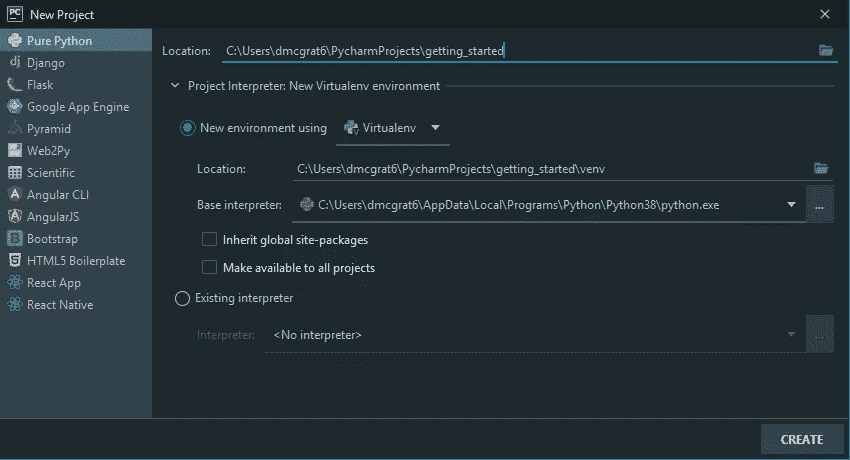
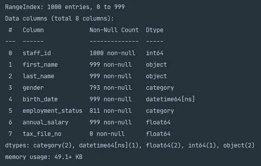
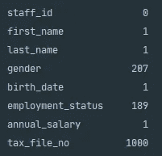
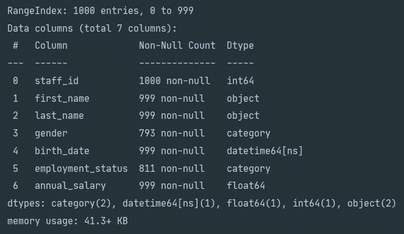
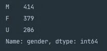
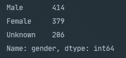

# 使用 Python Pandas 清理数据

> 原文：<https://towardsdatascience.com/data-cleaning-using-python-pandas-f6fadc433535?source=collection_archive---------12----------------------->

## 使用内置 Pandas 函数在分析前清理数据的综合指南

[斯坦 Y](https://unsplash.com/@stanyw?utm_source=medium&utm_medium=referral) 在 [Unsplash](https://unsplash.com?utm_source=medium&utm_medium=referral) 上拍照

# 介绍

随着时间的推移，公司会产生和收集大量数据，根据公司的不同，这些数据可能以多种不同的形式出现，如用户生成的内容、求职者数据、博客帖子、传感器数据和工资单交易。由于可以生成数据的源系统数量巨大，以及参与数据生成的人数众多，我们永远无法保证我们接收到的数据是干净的记录。这些记录可能由于缺少属性而不完整，它们可能在用户输入的文本字段中有不正确的拼写，或者它们可能有不正确的值，例如将来的出生日期。

作为一名数据科学家，在探索阶段尽早发现这些数据质量问题，并在进行任何分析之前进行清理，这一点非常重要。由于允许未经清理的数据通过我们的分析工具，我们可能会因基于不正确的数据得出质量低劣的调查结果而承担错误地代表公司或用户数据的风险。今天我们将使用 [Python](https://www.python.org/) 和 [Pandas](https://pandas.pydata.org/pandas-docs/stable/index.html#) 来探索一些可用于清理数据集的内置函数。

# 入门指南

对于今天的文章，我们使用的是为 Python 构建的集成开发环境 [PyCharm](https://www.jetbrains.com/pycharm/) 。对于初学者来说，这是一个非常好的工具，因为它简化了虚拟环境的创建和特定 Python 包(如 Pandas)的安装。使用虚拟环境允许您管理项目依赖性，而不会影响操作系统的默认 Python 安装。

首先打开 Pycharm 并从导航栏中选择`File > New Project`。在这里，您可以使用`Location`命名您的项目，或者创建一个新的虚拟环境，或者引用一个现有的虚拟环境。

PyCharm 的“新项目”对话框显示了命名项目的位置和虚拟环境创建路径。

为了让你开始，我们在下面创建了一个基本的 Python 脚本和一个 [CSV 文件](https://gist.github.com/deanjamesss/f8f5781fb682fb728e9674dda9813982)，这两个文件在整篇文章中都将被引用。这两个文件都可以下载并保存到您的项目根目录下。最终的剧本可以在[这里](https://gist.github.com/deanjamesss/3ccb847193ed93c22f7a1df61181d6ff)找到。

Python 代码片段读取 CSV 文件，将特定列转换为默认数据类型，并重命名列。

上面的脚本演示了在将文件读入内存后的一些数据帧操作。在第 5–7 行，我们覆盖了许多 Pandas 的默认配置，这些配置在处理较大的文件时会在打印时截断控制台输出。为了将数据读入内存，我们在第 10 行使用 Pandas 内置函数`read_csv()`,它将一个文件名作为参数。在第 13–15 行，我们设置了三列的数据类型，这有很多好处。首先，通过减少内存占用，设置数据类型可以提高处理数据帧行的性能。其次，丰富了我们在运行 Pandas `.describe()`内置函数时得到的描述性统计输出。在第 18 行，我们执行了一个列重命名，这是一个将通用列名转换成更有意义的名称的常用方法。

# 清理数据帧

为了了解数据集的哪些方面需要清理，我们首先需要了解我们正在处理哪些数据。最好的方法是使用熊猫内置函数`.info()`和`.describe()`。

调用熊猫内置函数后的控制台输出。信息()。

上面的`.info()`的结果清楚地显示了非空元素的数量，因此可以使用第一行的 RangeIndex 推导出空元素的数量。总结这一点的一个快速方法是调用`df.isnull().sum()`，它对每一列中的空元素的数量进行求和。

调用熊猫内置后的控制台输出。isnull()。sum()函数。

如果我们需要知道空元素占整个数据集的百分比，那么我们可以做以下事情。

用于计算缺失元素占整个数据集的百分比的 Python 代码片段。

## 删除列

调用`.info()`和`.isnull().sum()`后跳出的一个元素是跨越 1000 条记录有 1000 个空值的`tax_file_no`。移除这些类型的行最简单的方法是使用 Pandas `.dropna()`。`.dropna()`功能采用`.dropna(axis=0, how='any', thresh=None, subset=None, inplace=False)`的形式。`axis`参数决定该函数是应用于行`axis='index'`还是列`axis='columns'`。`how`参数可以是`how='any'`或`how='all'`，这意味着如果*任何*或*所有*元素都为空值，则可以删除该列或行。`thresh`参数允许您设置列或行中所需的非空元素的最小数量，否则将被删除。`subset`参数是可选的，可以接收列名列表，如果列表为空，那么`.dropna()`函数将应用于所有列或行。`inplace`可以是`True`也可以是`False`，如果是`True`则返回`None`。对于我们的例子，我们将使用`df.dropna(axis='columns', how='all', inplace=True)`。执行`.dropna()`并将数据帧信息打印到控制台后，您会注意到`tax_file_no`列不再包含在内。

来自的控制台输出。执行后的 info()。显示 tax_file_no 列的 dropna()已被删除。

## 删除行

在检查完完全为空的列之后，有必要检查是否有任何行没有包含足够的可用元素。我们可以通过使用`.dropna(thresh=2)`删除任何少于两个元素的行来实现这一点。

Python 代码片段显示了如何检查将被移除的少于两个元素的行。

在第 2 行，我们删除所有少于两个元素的行。然后，第 3 行返回原始数据帧中其索引不存在于`under_threshold_removed`中的任何行，即被删除的行。它通过否定`~`熊猫内置的`.index.isin()`功能来实现这一点。在我们的示例中，返回一条只包含雇员编号的记录。

## 填充缺失值

在某些情况下，我们可能希望保留包含缺失值的行，而不是在缺失时给它们一个默认值。对于这个例子，我们将把性别列中的空值映射到未知的 *U* 。熊猫提供了一个内置功能，可以实现这个`.fillna(value=None, method=None, axis=None, inplace=False, limit=None, downcast=None)`。

熊猫`.fillna()`在清理数据或操作数据帧时是一个非常强大的功能。`value`参数可以接受一个字典，该字典允许您指定将在特定列上用来填充空值的值。这样做的好处是当您不希望对数据帧中的所有空元素应用相同的空填充值时。`method`参数允许您根据序列中的其他值填充空值。您可以将方法设置为`ffill`，它将使用序列中存在的最后一个有效值来填充空值。`bfill`方法选项执行类似的功能，但填充值取自系列中出现的下一个有效值。`axis`和`inplace`参数获得与上述`.dropna()`功能相同的结果。如果您已经设置了`method`参数，您可以使用`limit`参数告诉`.fillna()`向前/向后检查连续空值的最大数量，以达到有效值。如果`method`参数为`None`，则`limit`参数可用于设置系列中空值的最大数量，该数量将由传递的值填充。

由于`gender`列具有分类数据类型，在我们将缺失值映射到 *U* 之前，我们首先需要在序列中创建一个新的类别。

Python 代码片段显示了如何在映射系列中缺失的值之前添加新类别。

要添加一个新的类别，我们需要将`gender`列隔离为一个系列，并调用`.add_categories()`。这将允许你使用接受列表的`new_categories=[]`来传递新的类别。一旦创建了新类别，您就可以使用`.fillna()`并引用新类别。要查看所做的更改，您可以调用`df['gender'].value_counts()`，这将隔离`gender`列，并为系列中的每个类别提供一个值计数。

显示 206 个缺失值的控制台输出现在映射到性别列中的新类别 U。

## 提高可读性

在这种情况下，我们理解类别 M、F 和 U 背后的含义，但是，接收数据的利益相关者可能不理解。为了提高分析的可读性，我们可以将类别重命名为更有意义的名称。

Python 代码片段显示了如何重命名性别列中的类别。

上面的代码片段使用了内置函数`.rename_categories()`，该函数接受一个将当前类别映射到新类别的字典。下面显示了重命名的结果。

显示性别列中新重命名的类别的值计数的控制台输出。

# 摘要

作为一名数据科学家，在你的职业生涯中，你会遇到不完整和质量差的数据集。为了生成高质量的分析，我们需要确保我们正在清理数据，以便准确地表示数据集。Pandas 提供了各种各样的内置功能，可用于在分析之前清理和操作数据集。它允许您删除不完整的行和列，填充缺失的值，并通过类别重命名提高数据集的可读性。

感谢您花时间阅读我们的故事，我们希望您觉得它很有价值。