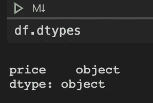
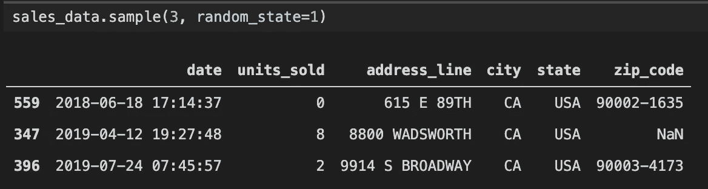
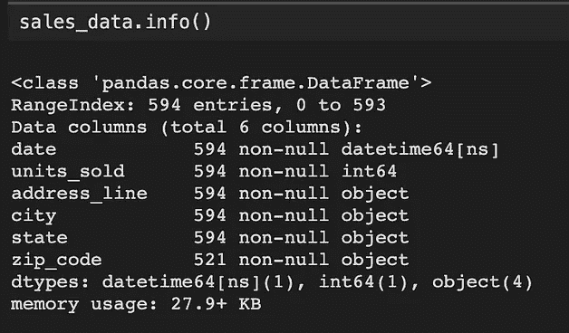
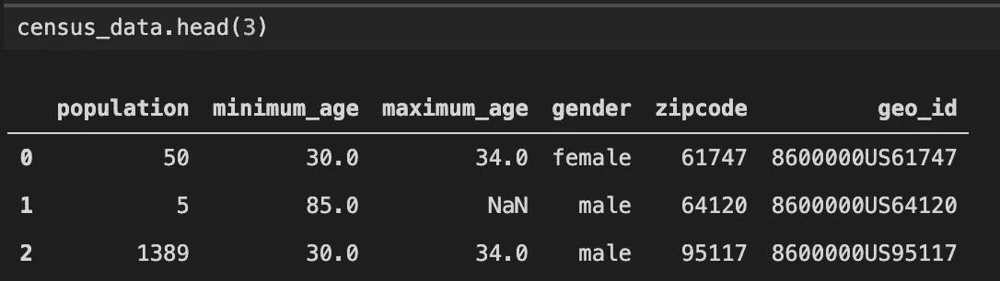
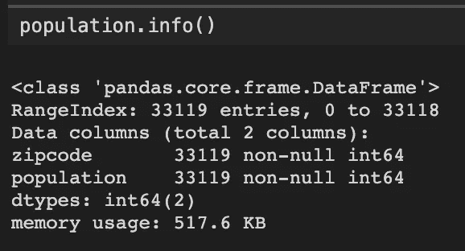
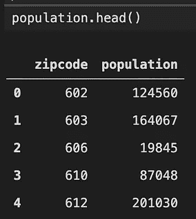
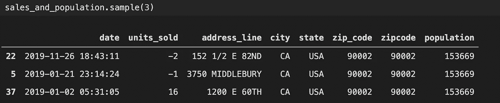
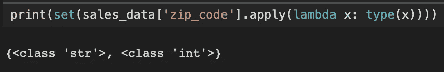
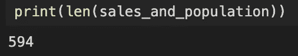

# 用熊猫清理数据——避免这个错误！

> 原文：<https://towardsdatascience.com/data-cleaning-with-pandas-avoid-this-mistake-7af559657c2c?source=collection_archive---------18----------------------->


[https://unsplash.com/photos/FOsina4f7qM](https://unsplash.com/photos/FOsina4f7qM)

Pandas 是 Python 中一个非常有用的数据操作包。在很大程度上，函数是直观的，快速的，易于使用的。但是有一次，我花了几个小时调试管道，发现在 Pandas 列中混合类型会导致管道中出现各种问题。多读一点去发现我的意思，避免以后这样做。

# **什么是混合型栏目**

混合类型正是您所想的:它们是具有多种类型(string、integer、float 等)的列。在 pandas 中，创建混合型列非常容易:

```
import pandas
df = pd.DataFrame({"price": [9.99, "$9.99"]})
print(list(map(type, df["price"])))
```

这输出**【浮点，str】**。这些混合类型列将始终使用“object”数据类型作为其 d type:



这是因为 Pandas 在幕后使用了 Numpy 数组，Numpy 的 dtypes 之一就是 Python 对象本身。因此，当多个类型被引入到一个列中时，Pandas 将使用这个“全部捕获”选项，而不是抛出一个错误(当您有字符串时，请参阅下面的参考资料，了解为什么它是一个对象数据类型，至少在 Pandas 1.0 之前是这样)。如果创建一个全是整数的熊猫序列，然后添加一个字符串，就可以看到这一点。

```
import pandas as pd
int_series = pd.Series([1, 2, 3])
print(int_series.dtype)  # dtype('int64')
int_series.loc[3] = "4"
print(int_series.dtype)  # dtype('O')
```

这是由设计决定的，类似于将数据输入 Excel 电子表格的设计模式。

# **这会导致问题**

假设您有几个文件要合并。

```
sales_data = pd.read_csv("data/sales_data.csv", parse_dates=["date"])census_data = pd.read_csv("data/population_by_zip_2010.csv")
population = census_data.groupby("zipcode")["population"].sum().reset_index()
```



我们需要合并邮政编码，但是为了这样做，我们需要首先清理 **sales_data** 邮政编码。让我们从 9 位数的邮政编码中提取出前 5 位数。有一些缺失值，假设经过调查，我们知道 2018 年之前所有缺失的邮政编码是 90001，之后所有缺失的邮政编码是 90002。

```
sales_data["zip_code"] = sales_data["zip_code"].str[:5]sales_data.loc[sales_data["zip_code"].isna() & (sales_data["date"] < pd.to_datetime("2018-01-01")), "zip_code"] = 90001sales_data.loc[sales_data["zip_code"].isna() & (sales_data["date"] >= pd.to_datetime("2018-01-01")), "zip_code"] = 90002
```

现在，我们准备合并

```
sales_and_population = pd.merge(sales_data, population, left_on="zip_code", right_on="zipcode")
```



看起来不错，对吧？


嗯，这似乎太低了。现在你可能想知道这是不是因为右边的数据框**人口**中缺少数据。但不是，这是因为左边的 dataframe **sales_data** 的 **zip_code** 列中有混合类型。



当我们用 90001 和 90002 替换缺失的邮政编码时，引入了我们的 int。这些是唯一成功连接到**人口**数据框架的行，该数据框架的 dtype 为 **int** 。为了避免这个问题，我们需要在合并之前将我们的类型转换为 int 类型。

```
sales_data = sales_data.astype({"zip_code": int})sales_and_population = pd.merge(sales_data, population, left_on="zip_code", right_on="zipcode")
```



**关键提示**:用熊猫清理数据的时候要小心——类型不是强制的，以后可能会让人头疼，所以要经常检查你的类型，必要的时候进行强制转换！

# 参考

[](https://github.com/sm14159/pandas-mixedtype/blob/master/notebook/pandas-mixedtypes.ipynb) [## sm 14159/熊猫-混合型

### 此时您不能执行该操作。您已使用另一个标签页或窗口登录。您已在另一个选项卡中注销，或者…

github.com](https://github.com/sm14159/pandas-mixedtype/blob/master/notebook/pandas-mixedtypes.ipynb) 

*   [人口普查数据](https://www.kaggle.com/census/us-population-by-zip-code)
*   [随机地址来源](https://ca.postcodebase.com/)
*   [另一个例子显示了处理货币时的类似问题](https://pbpython.com/currency-cleanup.html)
*   [NumPy 数据类型的解释](https://stackoverflow.com/questions/34881079/pandas-distinction-between-str-and-object-types)