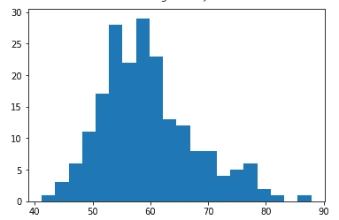
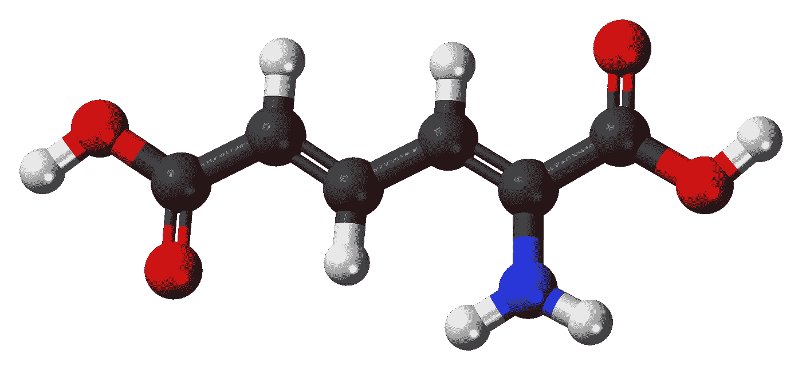

# 数据清理—从哪里开始？

> 原文：<https://towardsdatascience.com/data-cleansing-where-to-start-90802e95cc5d?source=collection_archive---------44----------------------->

[PublicCo](https://pixabay.com/users/PublicCo-5009832/) 在 [Pixabay](https://pixabay.com/photos/calm-relaxation-waves-tide-tidal-2213615/) 上的照片

## 数据清理/争论指南和清单

事实证明，数据科学家和数据分析师将把大部分时间花在数据预处理和 EDA 上，而不是训练一个机器学习模型。作为最重要的工作之一，数据清洗的确非常重要。

我们都知道我们需要清理数据。我想大多数人都知道。但是从哪里开始呢？在本文中，我将提供一个通用的指南/清单。因此，一旦我们开始一个新的数据集，我们就可以像这样开始数据清理。

# 方法论(C-R-A-I)

照片由 [geralt](https://pixabay.com/users/geralt-9301/) 在 [Pixabay](https://pixabay.com/illustrations/business-idea-growth-business-idea-3189797/) 上拍摄

如果我们问自己“为什么我们需要清理数据？”我认为，很明显，这是因为我们希望我们的数据遵循一些标准，以输入某种算法或以一致的规模可视化。因此，让我们首先总结一下我们希望我们的数据有哪些“标准”。

在这里，我总结了清洗数据集应该具备的 4 个主要标准。我会称之为“CRAI”。

*   **一致性**

每一列数据在同一比例尺上应该是一致的。

*   **合理性**

每列中的所有值都应符合常识。

*   **原子数**

数据条目不应重复，数据列不应分割。

*   **完整性**

数据条目应该具有所有可用的特性，除非空值有意义。

好的。请记住这 4 个标准。我会用更多的例子来解释它们，希望它们能成为你能记住的东西。

# 一致性

由[absolute vision](https://pixabay.com/users/AbsolutVision-6158753/)在 [Pixabay](https://pixabay.com/illustrations/ring-binders-aligned-organization-2654130/) 上拍摄的照片

不管是连续的还是分类的，绘制柱状图都是很有帮助的。我们需要注意最小值/最大值、平均值和分布的形状。然后，用常识去发现是否有潜在的不一致。

例如，如果我们对一些人进行抽样，其中一列数据是他们的体重。假设直方图如下。

很明显 80 到 100 之间几乎没有。运用我们的常识就足以找出问题所在。也就是说，一些重量以千克为单位，而另一些重量以磅为单位。

当我们有多个数据源时，这种问题很常见。其中一些可能对相同的数据字段使用不同的单位。

清洗之后，我们可能最终会得到一个这样的分布，看起来不错。

# 合理性

由[拍摄的照片在](https://pixabay.com/users/MMillustrates-8219771/)[的](https://pixabay.com/illustrations/unordered-chaos-3192273/)上展示

这也要靠我们的常识，但通常更容易被发现。一些常见的例子:

*   人的年龄、体重、身高不应该是负数。
*   一些分类数据(如性别)会有特定的枚举值。否则，它是无效的。
*   大多数类型的文本值(如人名和产品名)不应该有前导空格和尾随空格。
*   有时候我们可能还需要注意特殊字符。大多数情况下，它们应该被剥离出来。

# 原子数

照片由 [Pixabay](https://pixabay.com/illustrations/aminomuconic-acid-metabolism-836134/) 上的 [WikimediaImages](https://pixabay.com/users/WikimediaImages-1185597/) 拍摄

这个很好理解。我们的数据集中不应该有任何重复的行。当我们有多个数据源时，不同的数据源可能会存储重叠的数据，这种情况很常见。

将唯一性检查留在一致性和合理性检查之后是很重要的，因为如果我们不解决一致性和合理性问题，将很难找出重复的行。例如，一个人的名字可能在不同的数据源中以不同的方式呈现，比如`González`和`Gonzalez`。一旦我们意识到一些非英语名字的存在，我们需要注意这类问题。

因此，尽管删除重复的行通常并不难，但是这样做的另一个问题可能会影响清理后的数据的最终质量。

违反原子性的另一种类型是一列可能是可分的，这意味着一列中隐藏了多个特性。为了最大化数据集的价值，我们应该把它们分开。

例如，我们可能有一个表示客户名称的列。有时可能需要将它分为名和姓。

# 完整

由 [Pixabay](https://pixabay.com/illustrations/puzzle-solution-business-piece-2692245/) 上的[absolute vision](https://pixabay.com/users/AbsolutVision-6158753/)拍摄的照片

根据数据源和数据结构的设计方式，我们可能会在原始数据集中丢失一些数据。这种数据丢失有时并不意味着我们丢失了一些数据条目，而是我们可能丢失了某些列的一些值。

发生这种情况时，确定“null”或“NaN”值在数据集中是否有意义非常重要。如果没有，我们可能需要删除该行。

但是，消除缺少值的行并不总是最好的主意。有时，我们可能会使用平均值或其他技术来填补空白。这取决于实际情况。

# CRAI 方法的使用

照片由 [blickpixel](https://pixabay.com/users/blickpixel-52945/) 在 [Pixabay](https://pixabay.com/photos/drill-milling-milling-machine-444499/) 上拍摄

好吧，我希望上述例子分别解释了什么是“CRAI”。现在，让我们举一个真实的例子来练习！

假设我们的数据集中有一个地址列，我们应该做什么来确保它是干净的？

## **C —** 一致性

1.  地址可能包含街道后缀，如“street”和“St”、“Avenue”和“Ave”、“Crescent”和“Cres”。检查我们是否在那些对中有两个术语。
2.  同样，如果我们在地址中有州名，我们可能需要确保它们是一致的，比如“VIC”和“Victoria”。
3.  检查地址的单元号表示。“Abc 街 24 号第 9 单元”应与“Abc 街 9/24 号”相同。

## R —合理性

1.  例如，在一个国家，邮政编码必须遵循特定的格式。例如，在澳大利亚必须是 4 位数。
2.  如果地址字符串中有国家，我们可能需要注意这一点。例如，数据集是关于在几个国家开展业务的一家国际公司的所有客户。如果出现不相关的国家，我们可能需要进一步调查。

## a——原子性

1.  最明显的原子性问题是我们应该将地址分成几个字段，比如街道地址、郊区、州和邮政编码。
2.  如果我们的数据集是关于家庭的，比如一份健康保险。更值得注意的是不同数据条目的重复地址。

## 一、诚信

1.  这是关于数据集中的整个数据条目(按行)。当然，我们需要删除重复的行。
2.  检查是否有任何数据条目的地址丢失。根据业务规则和数据分析目标，我们可能需要删除没有找到地址的行。此外，地址通常不应该能够被导出，所以我们不应该需要填补空白，因为我们不能。
3.  如果在原子性检查中，我们发现一些行具有相同的地址，并且根据业务规则这可以被确定为重复的，我们可能需要合并或消除它们。

# 摘要

由 [Pixabay](https://pixabay.com/photos/bible-book-close-up-document-1868359/) 上的[像素](https://pixabay.com/users/Pexels-2286921/)拍摄的照片

这是我第一次使用新数据集时通常遵循的“CRAI”方法。

事实证明，这种方法是通用的，这意味着它应该适用于几乎所有的场景。然而，也正是因为它的普遍性，我们应该更加关注将影响如何应用 CRAI 清理数据集的领域知识。

 [## 通过我的推荐链接加入 Medium 克里斯托弗·陶

### 作为一个媒体会员，你的会员费的一部分会给你阅读的作家，你可以完全接触到每一个故事…

medium.com](https://medium.com/@qiuyujx/membership) 

**如果你觉得我的文章有帮助，请考虑加入灵媒会员来支持我和成千上万的其他作家！(点击上面的链接)**