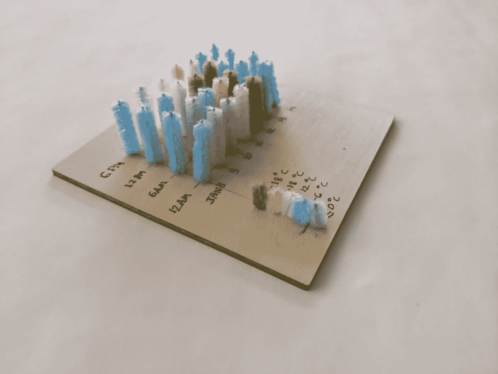
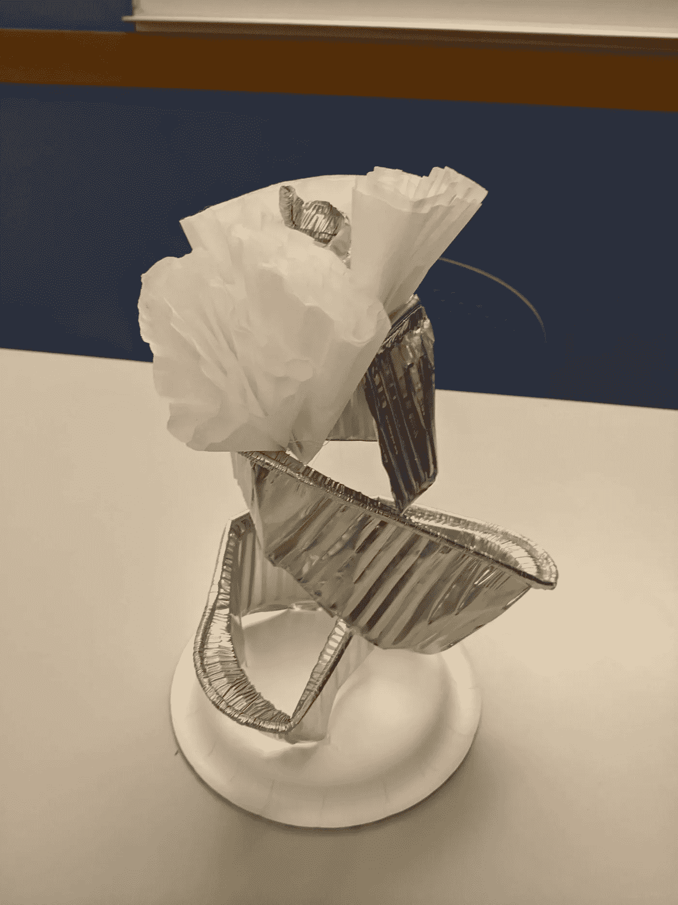
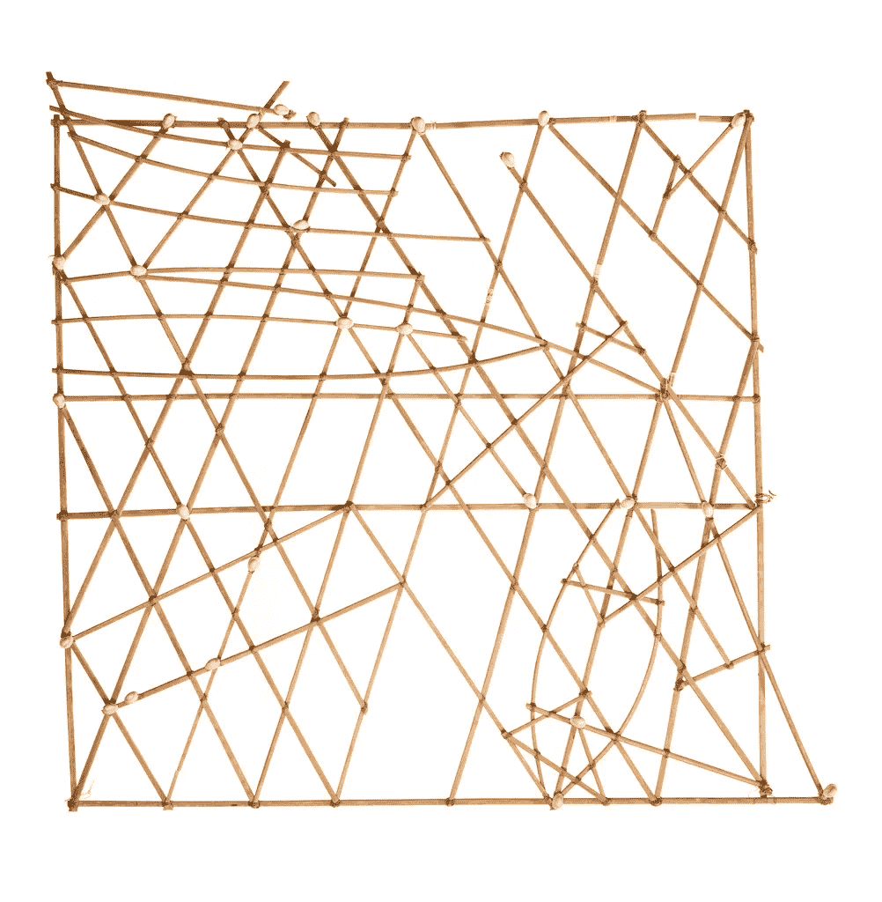
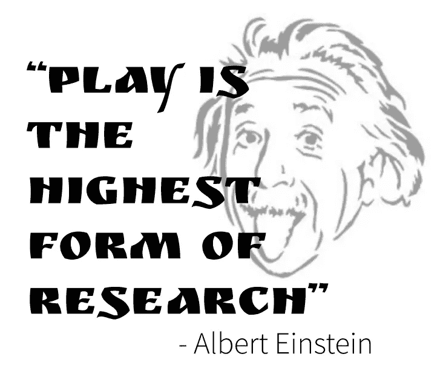

# 数据加工:为什么我们都应该玩数据

> 原文：<https://towardsdatascience.com/data-crafting-how-play-craft-changes-data-comprehension-9e5839f90e48?source=collection_archive---------35----------------------->

## 从一个新的角度看待数据和数据表示

一个很好的数据加工的例子来自我们的一个参与者，周天琦。

我最近主持了一个关于数据加工的研讨会。这个想法(通过制作数据来弄脏我们的手)是在我和哈佛医学院的定量研究员娜塔莉·弗拉迪斯的一次谈话中自发产生的。

事情是这样的:娜塔莉热爱手工艺，生活在数据中。我爱数据可视化，偶尔大杂烩的东西，相信**大人玩不够**。在一月份，我们希望促成一个有创意的、动手操作的数据约会——让数据**变得平易近人** 并建立一个专家可以探索其数据的**新方面的空间。**

玩耍的价值是有科学依据的。但是在数据的背景下玩？那是比较新的。该领域的大多数文献都专注于培养儿童的数据素养，虽然设计经常整合游戏的各个方面来激发新的工作，但它未能有效地渗透到其跨学科邻居数据可视化中。

游戏来自好奇、探究和探索。通过保持好奇心并允许自己去探索，我们**在没有期望或竞争压力的情况下学习新技术**，并且**发现世界未知的一面**。当我们被某样东西吓倒时，或者当我们已经习惯了它，把它与世俗联系起来时，这一点尤其重要。

但是我们认为数据是严峻的——完美的——这使得它很难处理。

将普通大众所认为的数据的复杂性(如果你愿意，可以说是一种内在的信念)与可视化的 [**修辞力量**](https://www.dhi.ac.uk/san/waysofbeing/data/data-crone-kennedy-2016.pdf) 结合起来——这是我们发现很难对其进行事实检查、调试和评论的主要原因——我们发现了一个难题:数据及其表示是不可接近的。

我指的是数据，作为一个无形的大概念，很可怕。人们回避它。那些经常与数据打交道的人(如分析师、研究人员和科学家)通常只理解一个概念，一个角度，即数据是什么，因此他们在表示和处理所述数据的方式上受到限制。因为数据感觉很难处理。

这就是数据加工的由来。数据应该有趣，应该平易近人，应该被玩弄。娜塔莉和我能想到的最好的方法就是手工制作。

但是首先为什么要制作？什么是手工艺？和[数据物理化](https://www.researchgate.net/publication/333429485_Data_Physicalization)有什么区别？

> “工艺是纪律和想象力、奉献和灵感的结合。当这些东西互相缠绕，并对这种炼金术给予认真的关注，那么一个人的手艺就可以实现了”——罗莎妮·卡什

从历史上看，手工艺是一种熟练的劳动，为未来的观众维护传统艺术。为了应对 19 世纪有害的工厂环境，手工艺的定义演变成了反工业化，提升了消费者和生产者的福祉。然后(在 20 世纪)工作室工艺增加了新的含义:对一致性的反叛。

我们对工艺的现代理解建立在传统艺术的基础上——从绗缝到其他。手工艺通过创造任何东西，不管是材料还是技术，从定制的椅子到手工啤酒到手工制作的绒球，充当一种个人代理的形式。最重要的是，现代手工艺是任何人都能做的事情*。*

让我们回到最初的问题:*什么是数据加工？*它代表数据，这里有:

*   一个**对工艺**的强调，因此期望和规范的限制被忽略，所有的感官被给予空间和参与。
*   一个**强调发挥**，让数据变得平易近人。通过使用各种媒介——传统的和非传统的——在一个不完美的空间里，我们可以使探索正常化。

*不是什么？*

可及性的论证。虽然使用多种媒体可以促进与更广泛受众的联系，但在可访问数据表示领域还有许多工作要做。

另一个手工艺的例子，这个是斯蒂芬妮 h。

但是数据加工和数据物理化有什么不同呢？对我和娜塔莉来说，这就是游戏。正如[数据物理化维基](http://dataphys.org/wiki/Data_Physicalization)所说，“数据的物理表示已经存在了数千年。”印加 Quipus，马绍尔群岛棒图，亚卡马时间球是说明这一点的少数例子。从历史的角度来看，这些都是数据加工的产物。

[马绍尔群岛棒图](https://collection.cooperhewitt.org/objects/35520475/)示例。来源:库珀·休伊特

数据物理化在研究社区中被重新定义，以描述计算机支持的物理数据表示。在不涉及计算机的情况下，表现仍然是精心策划的，看起来“完美”。正如我们已经讨论过的，感知到的完美让我们很难演奏。

虽然数据物理化和数据加工之间肯定有重叠，但物理化并不强调玩耍。这就是我们如此兴奋的原因！

我们将数据加工描述为与数据物理化相邻或者是数据物理化的一个子集，其中的重点不是一个完美的、随时可以拍照的对象，而是做的过程——用你的手玩，用所有五种感官体验。

因为，正如阿尔伯特·爱因斯坦曾经说过的，“玩耍是研究的最高形式。”当数据是一切研究的基础时，我们怎么能不想玩它呢？考虑到这一点，我鼓励你们所有人都来玩数据——也许还需要一点技巧；)

> 这是我将要写的关于数据加工的两篇文章之一。这第一篇文章为*为什么*我们想要精心制作数据奠定了基础。下一个的[探索*我们如何*做到这一点，并分享一些要点，这样你也可以玩数据。敬请期待！](https://aspenhopkins.medium.com/data-crafting-how-we-can-play-with-data-at-home-part-2-60e35135d6bf)