# Tableau 桌面中的数据加密

> 原文：<https://towardsdatascience.com/data-densification-in-tableau-desktop-73ec90562635?source=collection_archive---------31----------------------->

## [实践教程](https://towardsdatascience.com/tagged/hands-on-tutorials)

## 如何在没有 ETL 的情况下通过度量在工具提示中显示详细数据

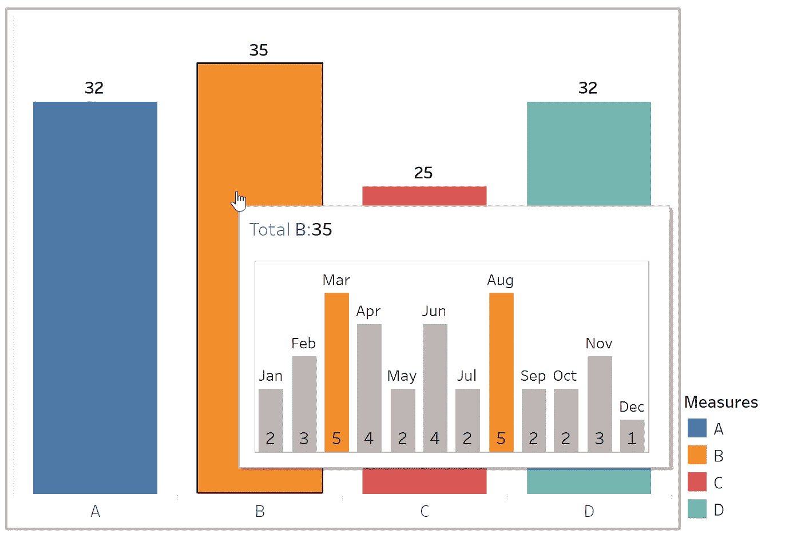

Tableau 桌面的作者的形象。

如果您没有一个合适的数据模型，并且该数据模型的维度允许数据切片，那么前面的图像可能会很有挑战性。我将解释一个快速的方法来解决这个问题，而不改变原始数据。

# 数据

很多时候我们遇到了麻烦，因为我们的度量是以列而不是行的形式出现的，并且我们无法在一个单独的列中找到值 A、B、C 和 D:

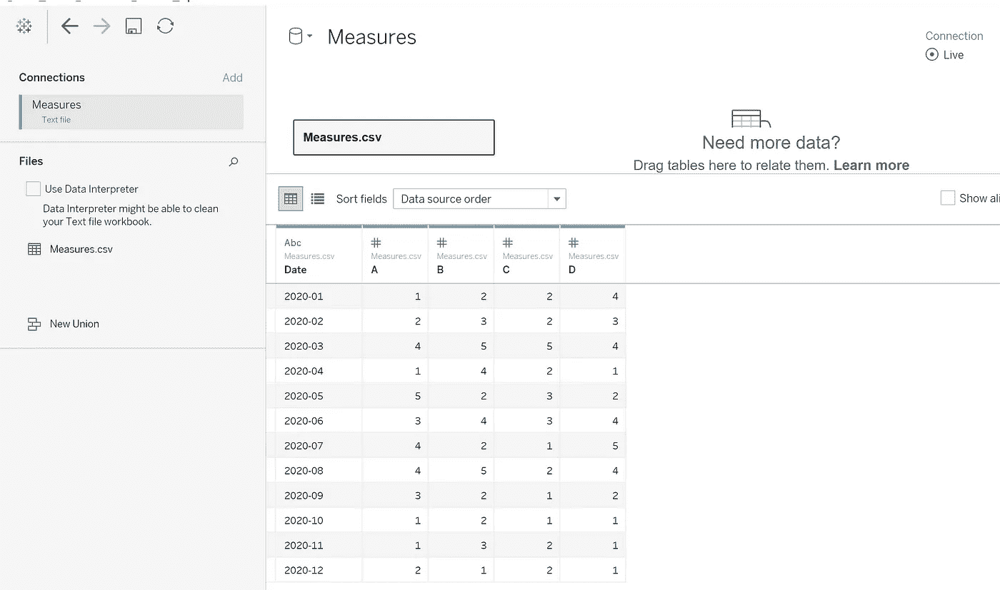

Tableau 桌面的作者的形象。

假设您有一个**少量数据**(几百万条记录或更少)。在这种情况下，您可以使用 **Tableau 桌面**中的**数据加密**方法来构建之前的图表，而无需修改您的数据源。

如果你的数据量**更大**，我推荐使用合适的 **ETL** **或数据流**软件，如 Tableau Prep Builder、Alteryx、Informatica、AWS Glue 等。它也适用于 SQL、Python Pandas 或 Spark。您仍然可以使用数据加密方法。

# 什么是致密化？

致密化是**变得**或使**更致密的行为。**

# 什么是数据上下文？

这意味着从你当前的数据中产生更多的行。在某些情况下，添加列和进行特性工程也可以算作数据加密，但是为了简化，我将只关注**行。**

为了澄清，根据您的背景，您可以使用不同的名称来引用**行、**例如，记录或观察结果，以及**列、**在此上下文中的特征或度量。

# 我们为什么需要它？

一般来说，要使用预先计算的数据来填充间隙，以将其用作维度，例如，如果您需要将 LATAM 和 CAM 显示为国家列表中的另一个条形，我们可以截取日期之间缺少的天数来进行计算。

# 我如何在 Tableau 桌面中使用它来在我的工具提示中显示更多数据？

首先，创建一个只包含测量或特征列表的新文件。

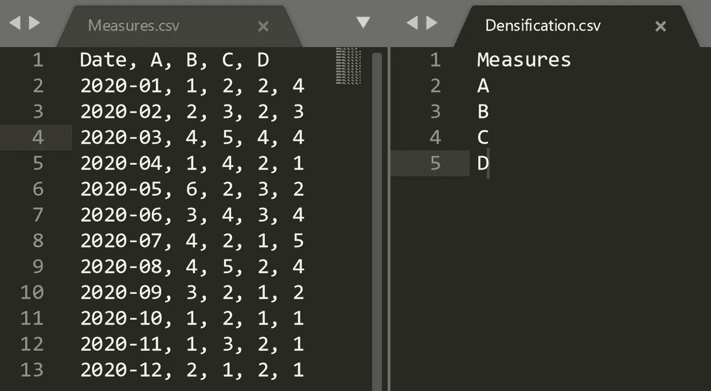

**densitization . CSV**包含一个度量或特征列表——作者对文本图像的升华。

其次，通过将文件名拖到画布中来创建与当前数据的关系:

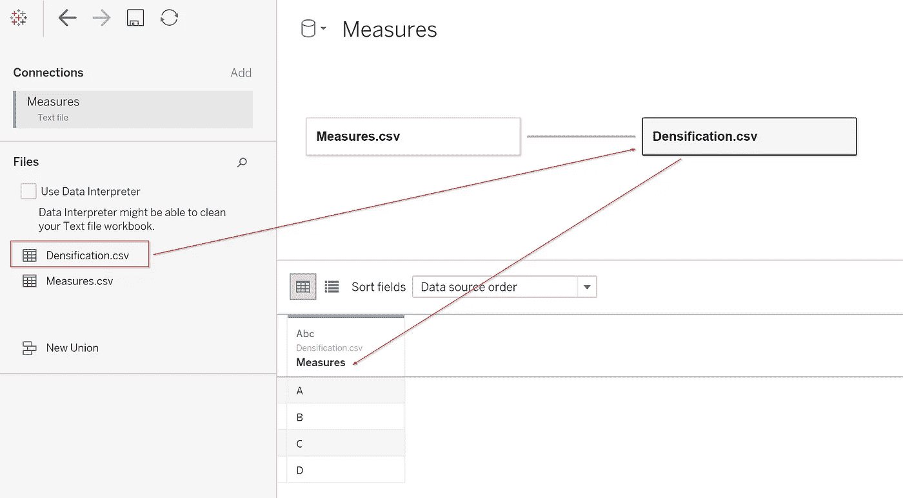

Tableau 桌面的作者的形象。

通过点击**橙色线**并创建**关系计算**来修改关系，两边的数字为 **1** 。这些将在获取数据时被 Tableau 用作 SQL 交叉连接。

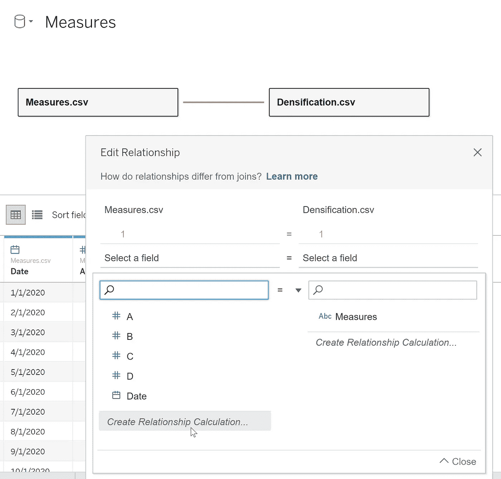

Tableau 桌面的作者的形象。

创建一个名为 **Measure Selected** 的新计算字段，如下所示。请记住，所有度量都必须共享相同的数据类型和相同的格式。

```
CASE [Measures]
    WHEN "A" THEN [A]
    WHEN "B" THEN [B]
    WHEN "C" THEN [C]
    WHEN "D" THEN [D]
END
```

此计算字段将映射度量值:

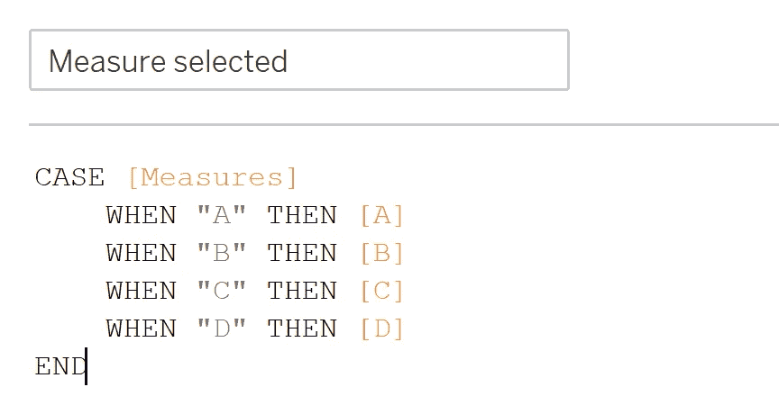

**测量选定的**计算字段—作者 Tableau 桌面的图像。

并创建一个名为**的新计算字段，突出显示**，如下所示:

```
IF  {FIXED  [Measures]:max([Measure selected])} = [Measure selected] THEN
    0
ELSE
    1
END
```

我将**在工具提示中按日期突出显示**条形的最大值，将度量的总量与当前值进行比较。

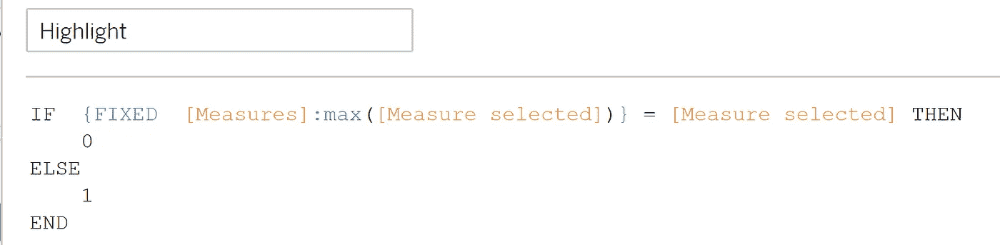

Tableau 桌面的作者的形象。

然后，您会注意到，当您移动**度量维度时，**density . CSV 文件中的新列在每个**度量名称中生成**密集**数据。**

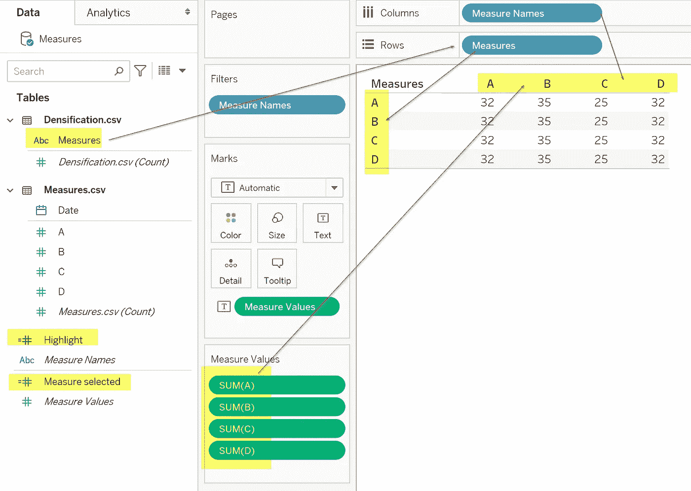

度量名称与度量-作者的 Tableau 桌面图像。

使用**测量选定的**字段，您将只看到通过**测量**尺寸的相关值:

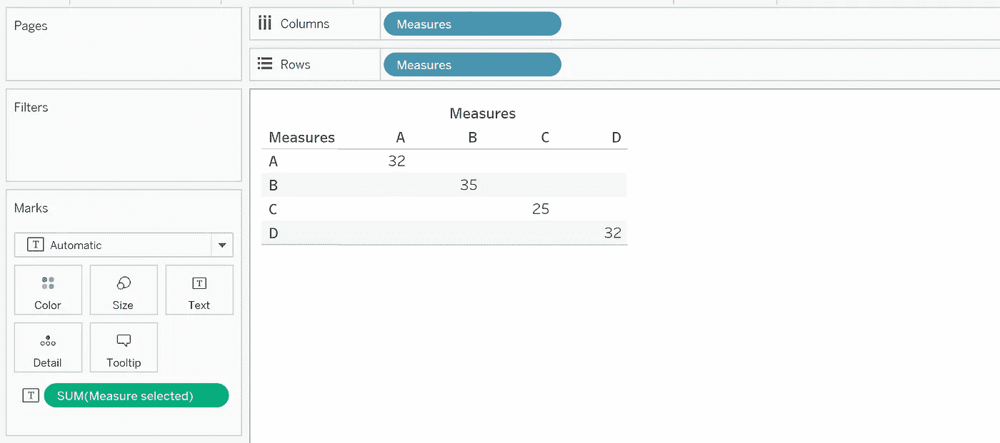

**测量选定的**计算字段—作者 Tableau 桌面的图像。

因为我们使用的是**关系，**当您将每个度量单独分组时，您不需要担心重复的值。在旧的 Tableau 版本中，您必须创建一个额外的**集合**，在其中选择我们的度量列表中的一个元素来过滤数据。

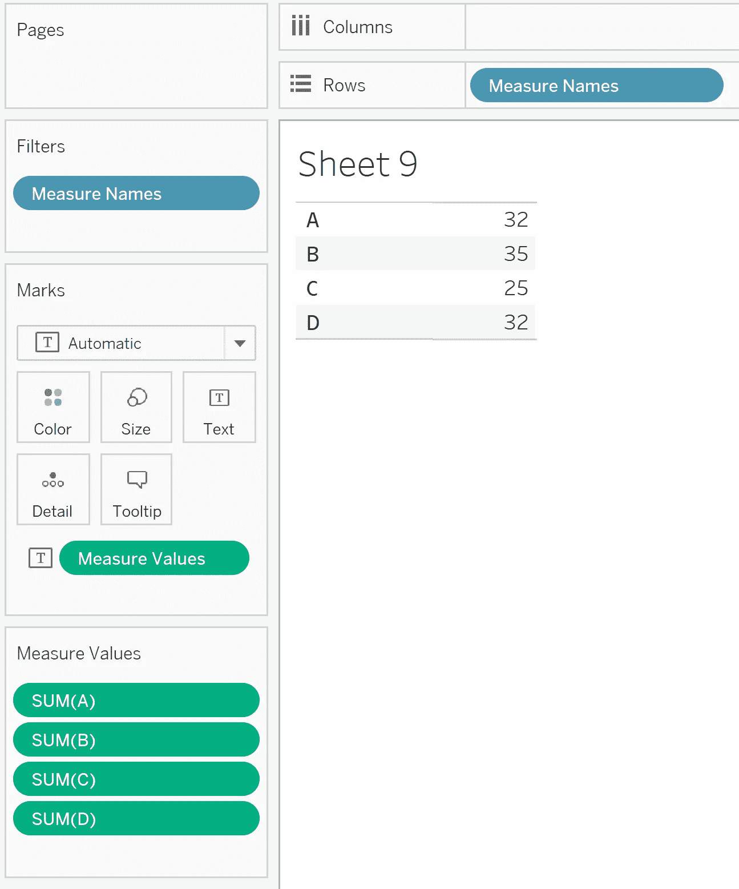

现在你可以用它作为一个**尺寸**来将值传递给工具提示表。

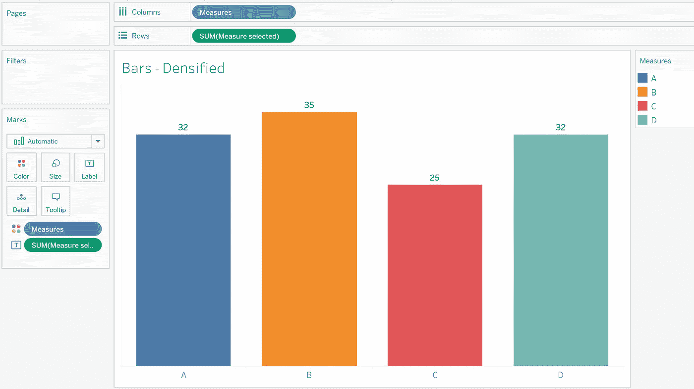

**棒材——增密的**板材。Tableau 桌面的作者的形象。

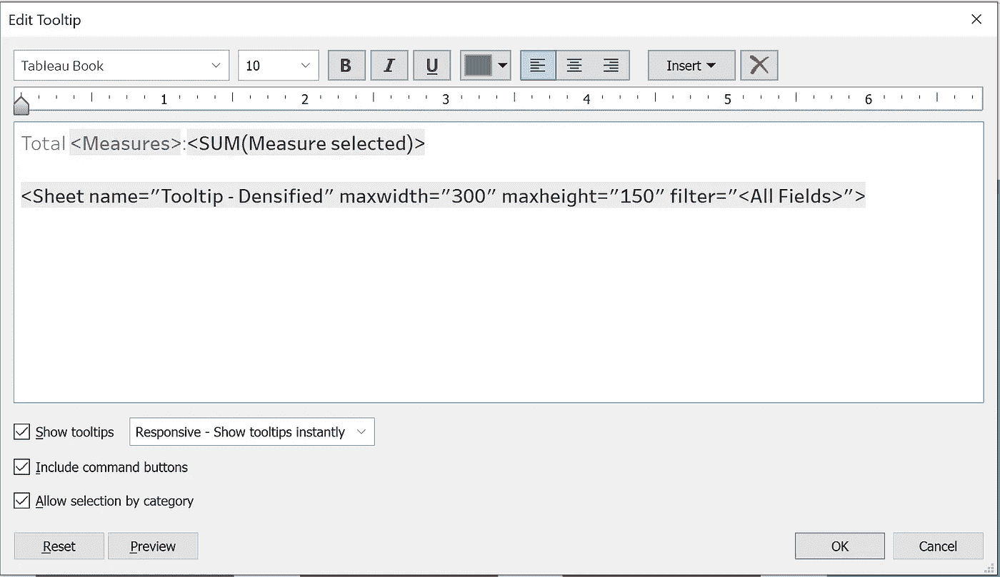

**条—增密的**工作表工具提示。Tableau 桌面的作者的形象。

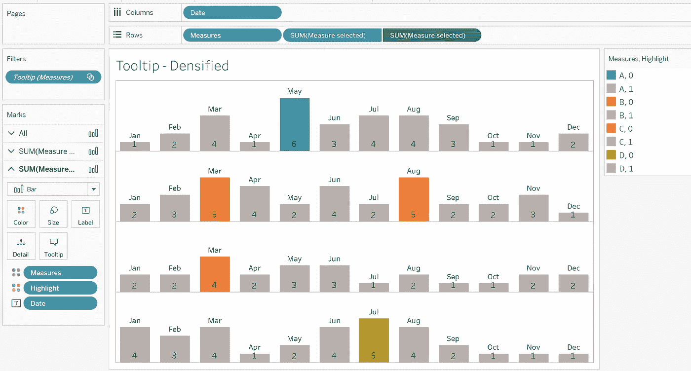

**工具提示—增密的**工作表。Tableau 桌面的作者的形象。

来产生我们想要的视觉效果:

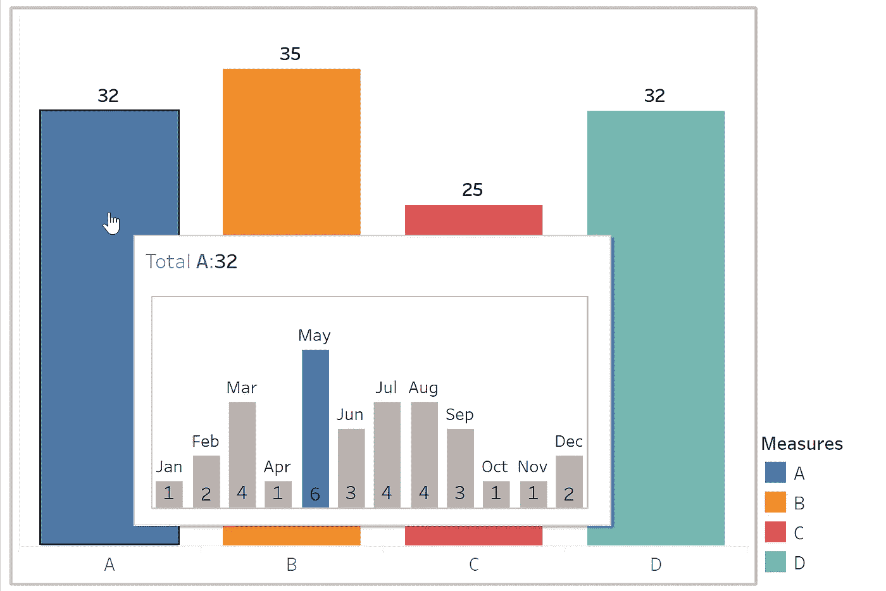

Tableau 桌面的作者的形象。

# 但是为什么不能使用度量名称呢？

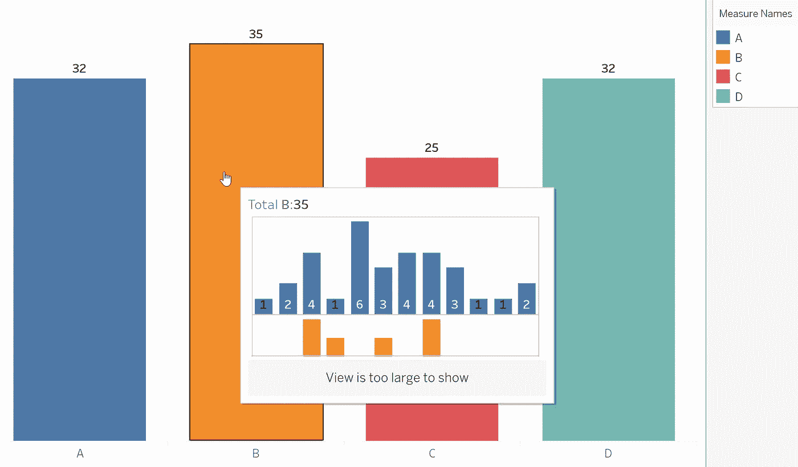

Tableau 桌面的作者的形象。

主要原因是**度量名称**是一个**计算的**字段，它创建了所有度量的离散列表，但不存在于数据集中，因此，至少在 Tableau Desktop 2020.3.1 版本之前，不能作为值传递给工具提示所引用的表

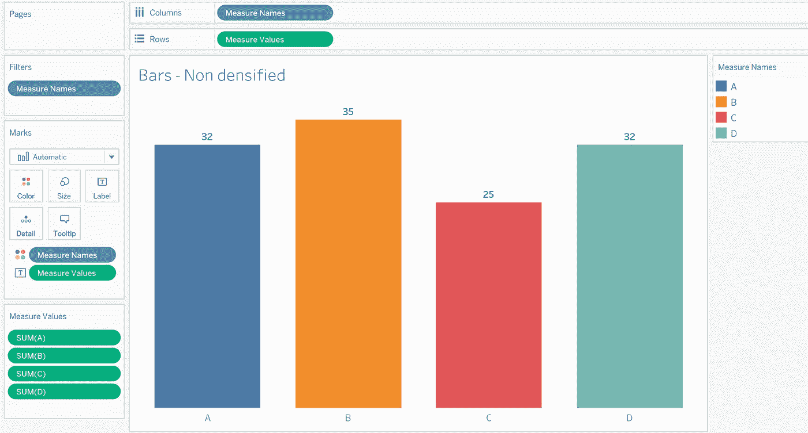

**条-非增密**按 Tableau 桌面中的度量名称。Tableau 桌面的作者的形象。

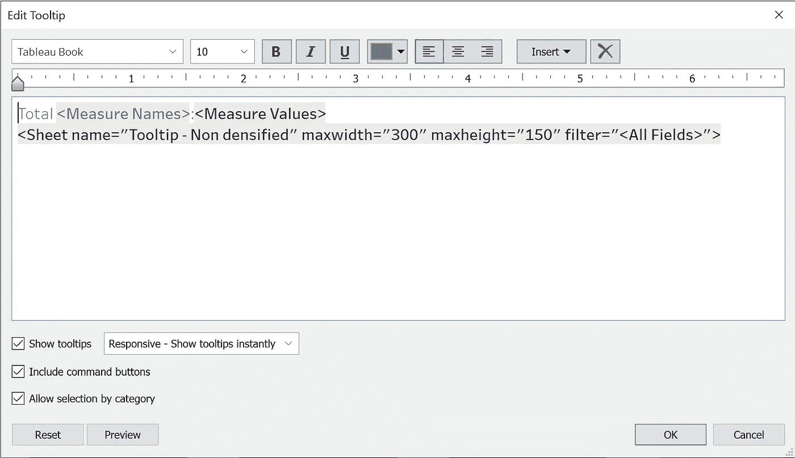

前面**条的提示—非增密**张引用**的提示—非增密**张—作者的 Tableau 桌面图片。

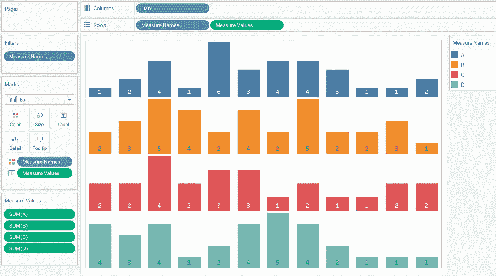

**工具提示 Tableau 桌面中按日期和度量名称排列的非增密**工作表。Tableau 桌面的作者的形象。

# 结论

我们学习了**数据增密**以及如何在 Tableau Desktop 中使用它，当您的模型没有表示每个度量名称的维度时，通过工具提示过滤值。

此外，我们看到，无论您使用的软件有多先进，无论您拥有的专业知识或领域有多丰富，您总会发现一个限制，为了解决这个问题，您需要跳出框框思考，发挥创造力。

# 谢谢

最后，我要感谢**丹尼尔·多伦索罗**向**和**询问这件事。还有**罗萨里奥·高纳，**她促使我继续写这些话题。

[快乐 Viz！](https://www.linkedin.com/in/cristiansaavedradesmoineaux/)

# 有用的资源

[](https://rosariogaunag.wordpress.com/2019/09/06/manifesto-of-internal-data-densification/) [## 内部数据加密宣言

### Rosario Gauna & Klaus Schulte 数据加密——当你去过……

rosariogaunag.wordpress.com](https://rosariogaunag.wordpress.com/2019/09/06/manifesto-of-internal-data-densification/)  [## 去神秘化的数据加密——数据学校

### 你有没有想过在 Tableau 中创建了一个表计算，结果没有任何意义？你…

www.thedataschool.co.uk](https://www.thedataschool.co.uk/damiana-spadafora/data-densification-demystified/) [](https://www.flerlagetwins.com/2019/05/intro-to-data-densification.html) [## 数据增密简介

### 数据加密是 Tableau 中常用的技术。很多人都写过，包括场景…

www.flerlagetwins.com](https://www.flerlagetwins.com/2019/05/intro-to-data-densification.html) [](https://www.dataplusscience.com/DataDensification.html) [## 使用域完成和域填充的数据致密化

### 4/22/2020 使用域完成和域填充的数据加密表中较复杂的主题之一…

www.dataplusscience.com](https://www.dataplusscience.com/DataDensification.html)