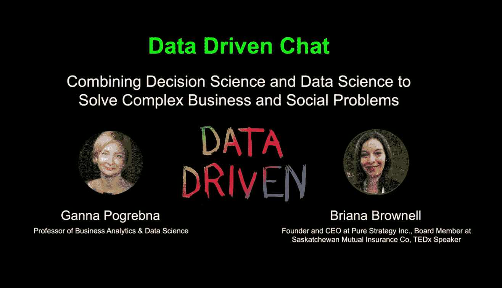

# 数据驱动聊天:“这是真正重要的事情。”

> 原文：<https://towardsdatascience.com/data-driven-chat-it-was-something-that-really-mattered-b23b31dbf336?source=collection_archive---------59----------------------->

## Ganna Pogrebna 与 Briana Brownell 的对话——她的数据科学之旅、有影响力的项目和目前在医疗保健领域的工作

学者、教育家、顾问和博主 Ganna Pogrebna 开始了 [*数据驱动聊天*](http://bit.ly/datadrivenchat) *来探索行为数据科学的许多有趣方面，包括人类行为、数据科学和人工智能。Ganna Pogrebna 是行为分析和数据科学教授，是艾伦图灵研究所(位于英国伦敦的国家人工智能和数据科学中心)行为数据科学团队的负责人。数据驱动聊天是图灵行为数据科学特别兴趣小组的官方播客。*

*从数据科学家转型为科技企业家的 Briana Brownell 是 Pure Strategy Inc .的创始人兼首席执行官。Pure Strategy 的自动化神经智能引擎(ANIE)使用自然语言处理、机器学习和神经网络领域的领先技术，为组织提供自信地做出决策所需的洞察力。*

*对话最初出现在数据驱动聊天上。点击* [*此处*](https://www.youtube.com/watch?v=0OnxoGFVuXU) *收听。*

这是由三部分组成的系列文章的第一部分。

大家好，这是数据驱动聊天，今天我们请到了 Briana Brownell！Briana 是 Pure Strategy Incorporated 的创始人兼首席执行官。你好布里亚纳！很高兴见到你，也很高兴见到你。

布里亚纳:很高兴见到你，也很高兴见到你！

甘娜:谢谢你这么做。我知道你很忙，现在很难找到时间，但是非常感谢你来参加这个播客，和我们分享你的想法。

布里亚纳:不客气。

**甘娜:开始我们的讨论吧，我的理解是你从事决策科学和数据科学的工作，我很高兴能和你交谈，因为这也是我的工作。我做学术方面的工作，很少在商业方面遇到像你这样的人，所以我真的很兴奋。你是如何对这个领域感兴趣的？你能告诉我们一些你个人的经历吗？**

布里亚纳:当我上大学的时候，我其实想成为一名理论物理学家。整个高中时期我都对物理很感兴趣。我喜欢斯蒂芬·霍金，我对夸克非常着迷。我真的很喜欢粒子物理学。但是当我进入大学时，我发现真正吸引我的是数学课程，它让我对数学的一些可能性感到兴奋。那时数学非常不受欢迎——当我毕业时，我是唯一一个在我那一年获得数学学位的人。没有人能理解我为什么要主修如此不切实际又如此怪异的东西。

我本科毕业后的第一份工作是金融。2006 年，我在纽约证券交易所找到了一份自营交易员的工作，我非常喜欢这份工作。那时候在金融行业工作是一段非常迷人的经历。当然，你可能知道接下来发生了什么。接下来发生了全球金融危机！因此，大约在 2007 年，一切都开始分崩离析，于是我在那时离开了金融行业。

> “这么多年来，人们一直不理解我为什么想研究数学模型和数据，但最终他们开始理解了。我很高兴现在人们对数据科学如此感兴趣。”

但真正打动我的是，我可以看到人类行为是多么重要的一部分，是我一直在创造的一些数学模型的关键部分。我开始对人类行为方面产生兴趣，并开始从事数据分析师的工作。我们当时不称自己为数据科学家，因为那个时候这个术语还没有被创造出来。我与不同的公司合作，应对他们在数据方面的一些挑战——做预测、理解消费者行为以及理解人们为什么做出决策的一些深层方面。

几年后，公司开始对更有效地使用他们的数据非常感兴趣，所以我发现自己在一个再好不过的地方了。数据科学越来越受欢迎，我感到有点被证明了，在这么多年人们不理解我为什么要研究数学模型和数据之后，他们终于开始理解它了。我很高兴现在人们对数据科学如此感兴趣。

是的，现在它是当今最热门的领域。对于那些不了解你工作的人，如果你必须选择你职业生涯中最重要的一件事，你会选择什么？会是什么呢？

布里亚纳:我最自豪的事情之一是我在澳大利亚和澳大利亚政府一起做的工作，以了解初级生产者的决策和技术采用。

2007 年，澳大利亚发生了非常严重的干旱，这绝对是毁灭性的。我们研究了人们为什么采用技术来减轻气候变化带来的风险。这项研究大概持续了八年。我从 2007 年开始，2015 年我们还在出版。

这绝对令人着迷，因为它真的把我用数据做的工作和人们的生活联系起来了。它不再只是电子表格中的一串数字或我运行的算法，而是真正重要的东西。它真的很有影响力，我喜欢和它一起工作。我们有一个很棒的研究团队，我很幸运能和他们一起工作。这真的教会了我很多关于如何利用数据来改善世界的知识。

甘娜:是的，我能看到很多和我相似的地方。我也是一名实验室科学家，后来我终于在一个工程部门找到了一份工作，只是因为我想看看我的模型在现实世界中实际工作，所以我认为这非常重要。

布里亚娜:太令人满意了，不是吗？

**甘娜:是，是。那么你能告诉我们更多关于你目前在做什么吗？是什么让你夜不能寐？什么让你兴奋？**

布里亚纳:我提到过我在澳大利亚做的工作。其中一个重要的组成部分是创建类型学来理解不同的人如何以相似的方式做决定。我们发现不同群体的人有相同的世界观，有相同的态度和信仰，通过理解这些态度和信仰，我们可以预测行为。我们可以干预和鼓励我们想要鼓励的行为。

例如，减轻气候变化导致的风险是我们想要鼓励的事情，因为我们希望人们的生计得到保护。现在，我们正在使用这种方法来理解医疗保健行业中医生和患者的决策。

> “我们发现不同群体的人有相同的世界观、态度和信仰，通过理解这些态度和信仰，我们可以预测行为。我们可以干预和鼓励我们想要鼓励的行为。
> 
> 例如，减轻气候变化导致的风险是我们想要鼓励的事情，因为我们希望人们的生计得到保护。现在，我们正在使用这种方法来理解医疗保健行业中医生和患者的决策。"

我发现这真的很有趣，因为你尊重人们的差异和不同的世界观，而不是像一些做同样事情的铁板一块的团体那样对待病人或医生。

我们已经在医疗保健的多个领域进行了这项研究，以了解诸如为什么患者决定不寻求他们正在经历的症状的护理？有时他们感到尴尬，有时他们对自己经历的一些症状感到无可奈何。我们希望鼓励人们尽可能过上最健康的生活，因此理解他们为什么不选择寻求护理是极其重要的。

再往下看，我们也看到一些个体，当他们有一个针对某种疾病的治疗计划时，他们可能不会继续按计划进行治疗。他们没有在正确的时间服用药物，或者他们没有安排随访预约或与他们需要看的其他医疗保健专业人员的预约。

通过了解患者群体的行为以及围绕决策的核心态度和情绪，我们可以规划干预措施。我们发现，世界各地的医疗保健面临着多么大的挑战，新冠肺炎和所有不同的因素都影响着人们做出如何保持最佳健康状态的决策。我认为能够理解这些行为和动机非常非常重要。

这是三部分系列的第一部分。点击 [*此处*](https://www.youtube.com/watch?v=0OnxoGFVuXU) *听完整段对话。*

## [第 2 部分:数据驱动的聊天:“大多数组织都没有意识到数据的潜力”](/data-driven-chat-the-potential-of-data-is-not-realized-in-most-organizations-c0b8f29e7ac3)

Ganna Pogrebna 与 Briana Brownell 的对话——数据科学中被低估的技能、获得高管的认同以及我们如何塑造未来

## [第 3 部分:数据驱动的聊天:“我们没有很好地为真正重要的行业建立弹性。”](/data-driven-chat-we-didnt-do-a-very-good-job-of-building-resiliency-into-really-important-8822f242b23c)

Ganna Pogrebna 与 Briana Brownell 的对话——新冠肺炎向我们展示了数据科学，新冠肺炎之后的生活将会如何不同，弹性系统，并推荐阅读和观看人工智能。