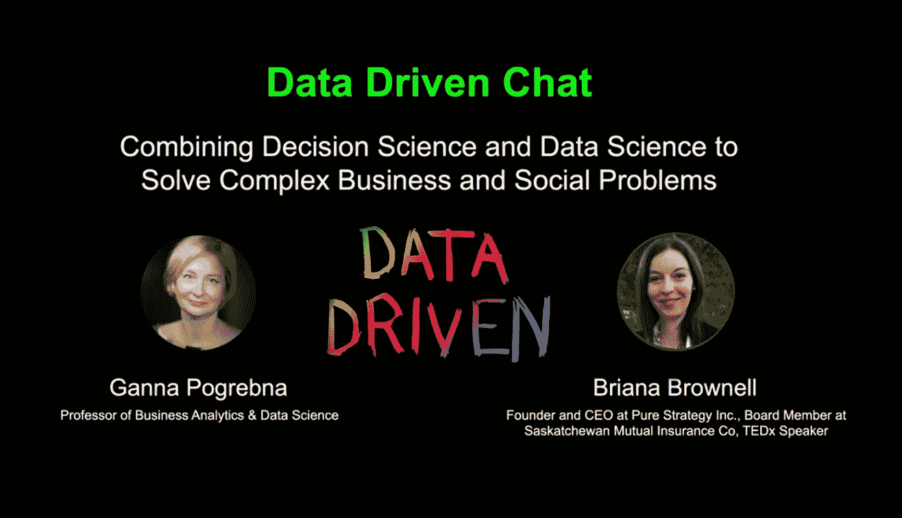

# 数据驱动的聊天:“大多数组织都没有意识到数据的潜力”

> 原文：<https://towardsdatascience.com/data-driven-chat-the-potential-of-data-is-not-realized-in-most-organizations-c0b8f29e7ac3?source=collection_archive---------60----------------------->

## Ganna Pogrebna 与 Briana Brownell 的对话——数据科学中被低估的技能、获得高管的认同以及我们如何塑造未来

学者、教育家、顾问和博主 Ganna Pogrebna 开始了 [*数据驱动聊天*](http://bit.ly/datadrivenchat) *来探索行为数据科学的许多有趣方面，包括人类行为、数据科学和人工智能。Ganna Pogrebna 是行为分析和数据科学教授，是艾伦图灵研究所(位于英国伦敦的国家人工智能和数据科学中心)行为数据科学团队的负责人。数据驱动聊天是图灵行为数据科学特别兴趣小组的官方播客。*

*从数据科学家转型为科技企业家的 Briana Brownell 是 Pure Strategy Inc .的创始人兼首席执行官。Pure Strategy 的自动化神经智能引擎(ANIE)使用自然语言处理、机器学习和神经网络领域的领先技术，为组织提供自信地做出决策所需的洞察力。*

*对话最初出现在数据驱动聊天上。点击* [*此处*](https://www.youtube.com/watch?v=0OnxoGFVuXU) *收听。*

这是由三部分组成的系列文章的第二部分。可以在这里阅读[*Part 1*](https://medium.com/p/data-driven-chat-it-was-something-that-really-mattered-b23b31dbf336?source=email-74842fb1df6a--writer.postDistributed&sk=8276e128a3a74dab61e70caa26f26769)*和*[*Part 3*](/data-driven-chat-we-didnt-do-a-very-good-job-of-building-resiliency-into-really-important-8822f242b23c)*。*

**Ganna:我们稍后会回到新冠肺炎的话题，但首先，我想问你——许多收听本播客的人都是有抱负的数据科学家，并试图在数据科学中找到一席之地。你能给那些想进入决策科学和数据科学之间的这种联系的人一些提示吗？他们从哪里开始？他们需要做什么？**

Briana:我认为，在数据科学中，被低估的技能是沟通和商业头脑。拥有运行模型的技术技能，并能够进行 Python 编程和理解数据库等技术工作确实很重要，但事实是，当你在行业中工作时，这一切都是关于分析如何影响企业关心的指标。因此，如果你不能将你正在做的事情与企业的目标或真正重要的结果联系起来，那么就很难获得资源，如果你正在做的事情在企业中不是高度优先的，那么就很难有效。

> “我认为，数据科学中未被充分重视的技能是沟通和商业敏锐度。”

这是我看到数据科学家真正挣扎的地方。在一个组织中，当你用与任何结果都没有联系的数据建模时，这些团队经常被推到一边，或者在组织中被最小化。这很可悲，因为数据科学可以如此有影响力。

技能非常重要，但能够向企业传达技能的价值更为重要。

甘娜:当然，你提到问题陈述也很重要，对吗？你如何支持回答商业上的重要问题？这是作为一名有抱负的数据科学家，每个人都需要能够做到的另一件事。我们如何在业务环境中处理数据？为什么你认为理解数据对现在的企业特别重要？你觉得数据的潜力还没有发挥出来吗？

布里亚纳:很好的问题。我确实认为大多数组织都没有意识到数据的潜力，这有几个原因。第一个是组织内孤立的数据。我曾与一些组织合作过，他们有多个团队在收集基本相同的信息，但由于组织内部的政治原因，他们不愿意在各部门之间来回共享这些数据。我认为这非常危险，因为这是一个组织运转不良的标志。如果没有办法在组织中的不同小组之间共享数据，这总是一个挑战。

第二，个人往往不知道数据有什么用，尤其是当你到了高管层。所有这些技术都是如此的新，以至于很难确切地知道在组织内做一个更大规模的分析项目会有什么样的回报。有时项目本质上是失败的，有时你可以获得额外的洞察力，但你不一定知道，直到你尝试。当高管希望看到他们的数据程序的特定投资回报率时，这有时是一个真正的障碍。

**甘娜:在过去的几年里，数据是如何改变商业格局的，或者说它改变了吗？你注意到变化了吗？**

Briana:我认为数据在组织中的使用方式的最大变化是，比如说 10 年前，很少有数据项目能够一直上升到高管层或董事会级别。高管们永远不会真正看到数据分析项目的任何结果。他们可能属于营销团队，可能属于 IT 团队，也可能属于销售团队。他们被关在那些小仓库里，永远也不会升到组织的管理层。

但是在人们开始看到它的价值之后，我们开始看到组织的最高层的认同。不仅高管们要求更好的数据、更好的分析、更好的建模，董事会也在要求。你看到一个董事会命令说“我们每个季度都需要某种数据驱动的指标。我们需要看到这个指标。”

> “所有这些信息都传到了组织的最高层，我认为这是一件非常新鲜的事情。”

所有这些信息都传到了组织的最高层，我认为这是一件非常新鲜的事情。以前，许多财务指标总是报告给董事会和高管，但现在营销指标、运营研究指标，所有这些领域都出现在董事会会议上，我认为这是一个非常积极的迹象。

甘娜:但同时，我也想挑战你所说的。同时，我觉得董事会对数据科学缺乏了解，认为它不是一根可以解决问题的魔杖。

**如果你没有高质量的数据，你就无能为力。也许这些见解并不那么有价值。感觉往往缺乏对方法论的理解。人们会看到无关紧要的结果，或者看到太少的数据点而无法做出决定。**

**有像你这样的人来解释这可能不是一个好主意，这很重要，你需要看看这里，利用数据获得适当的决策情报和决策洞察力。所以你有没有觉得一方面有数据很棒，但是对于数据能做什么的炒作太多了？**

布里亚纳:你完全正确。我认为这很有趣，因为很多时候，我看到董事会或执行团队中有一两个人真正理解数据。如果你让那个人成为分析项目的冠军，你所做的真的很有帮助。

> “组织对培训人们成为公民数据科学家很感兴趣。您可以在组织中担任任何角色，并通过更好地理解数据及其与您的角色的关系来增强您的技能。”

绝对有人们误解数据的情况。例如，数据不干净，或者其中有某种偏见，这总是一个挑战，因为你可以根据数据做出不一定像你认为的那么强的决策。

我看到的变化是，组织对将人们培养成公民数据科学家很感兴趣。您可以在组织中担任任何角色，并通过更好地理解数据及其与您的角色的关系来增强您的技能。我看到越来越多的大型组织提供培训，让顾问领导工作小组，研究如何在组织内使用数据和如何理解数据。所以我希望你提到的挑战——绝对真实的挑战——开始变得越来越好。我希望在 10 年内，我们能够摆脱这种困境。

甘娜:是啊，我也希望如此。就像你提到的，当你有一个人可以为董事会翻译复杂的数据见解时，这很酷。我们最近和一个大公司客户合作，我们有一个物理学博士，这个人太棒了！我的意思是，他可以把任何复杂的分析变成条形图，地图和图表等等。他把这些都变成了非常非常简单的条形图。太棒了！我在想，哇！你可以用一种简单的方式做到这一切。

**我想问你几个关于 stem 女性的问题。因为你自己是首席执行官，而且你处在一个非常高科技、男性主导的环境中，在你看来，我们是否缺少女性首席执行官？如果是的话，为什么我们会有这个问题？你认为这背后的原因是什么？**

布里亚纳:我真的希望有更多的女性首席执行官领导深度技术和高科技公司，因为首先，我认为这是一个迷人的领域。我认为这非常重要，它让人们成为未来的塑造者，而不仅仅是被随之而来的技术所影响。

至于为什么我认为做这些事情的女性越来越少——最重要的事情之一是知名度，让女性和年轻女孩看到这是她们可行的职业道路。我知道有很多女性碰巧成为了律师或兽医或其他类似的职业，她们没有进入科技行业的唯一原因不是她们不擅长这个行业或其他什么，而是因为她们不知道自己可以。他们只是不认识任何工程师或计算机科学家或在该领域工作的人，他们没有意识到这是他们的一个选择。

通过看到正在做有趣事情的人并接触到这些事情是非常重要的，并且能够看到在这些角色中与他们相似的人。

> “我认识的很多女性都碰巧成为了律师或兽医或其他类似的职业，她们没有进入科技行业的唯一原因是她们没有意识到这是她们的一个选择。”

我永远不会忘记格温·肖特维尔，她是一个如此了不起的人和工程师，还有 SpaceX 公司的首席运营官。她说她成为一名工程师的原因之一是一名女工程师来她的学校演讲，她穿着一套非常棒的衣服。起初，这听起来真的很傻，就像，“哦哇！为什么她的穿着如此重要？”但它揭示的是，这个女孩想在那个角色，那个职业中看到自己。不是西装，而是“这能让我在这个角色中看到自己吗？我能把自己看成一名工程师吗？如果我是工程师会是什么样子？还是数据科学家或技术专家？”我认为这非常重要。

甘娜:我喜欢你谈论榜样的方式。你谈论这些榜样是因为你不一定需要一个特定的人；你可以有一个穿着很酷的西装的人，这有点激励人心。“实际上我想要这样，”对吗？我想去太空，我想和这群人一起工作，就像这个女人一样，对吗？这个例子很酷。

**我想把这种多样性和包容性缩小一点，谈论更多的现代女性，因为即使我们只看女性，如果我们看财富 500 强——我们最近刚刚和我的一个学生和我的一些同事一起做了这项研究——我们实际上发现如果我们看财富 500 强中女性的代表性并不好，对吗？但是如果我们看看，比如说，少数民族的情况就非常糟糕。例如，如果我们寻找有色人种女性，只有三位女性领导财富 500 强公司，而且没有一位是黑人。所以看起来这个系统在某个地方被破坏了。我们能做些什么来提高科技行业的包容性？**

布里亚纳:我认为这是关于创造一个让人们有归属感的环境。我曾提到，人们需要能够在这些角色中看到自己，所以能够看到像你这样的人担任高级角色，并意识到这是你可能的职业道路，我认为这真的很重要。当你看不到任何像你一样的人时，很容易觉得你不属于这里，对吗？

每个人，每个人都有归属感，都需要成为一个团体的一部分，这个团体周围有一种团体感。因此，能够创建这些群体是非常重要的。我看到越来越多的在线支持团体，人们可以聚集在一起分享他们的经历，分享他们的故事，分享建议。我认为这是一个非常积极的迹象，能够创建这样的团体，在那里你感觉你可以做你自己，你属于那里，人们不会因为你有兴趣而评判你或认为你很奇怪。这是一个更大、更具挑战性的图景中非常重要的一部分。

Ganna:我的许多学生都是管理专业的学生，他们总是担心他们需要的技能。你提到你来自技术背景，你是 CEO，但是就你在当前条件下需要领导的技术技能而言，你认为知道如何编码很重要吗？理解算法如何工作很重要吗？作为当今的领导者，你需要什么水平的技术能力？不仅仅是作为一个女性领导，总的来说，今天有哪些领导技能是重要的？

布里亚纳:如果你在领导一家科技公司，如果在公司的高层，你有一个技术高超的人，那么找到优秀的人才会容易得多。原因是，许多技术人员在他们刚开始职业生涯时，几乎所有人都有过为非技术领导工作的经历，这些领导并不真正了解我们在做什么，将信息技术边缘化，抱有不切实际的期望，基本上很难为他们工作。因此，当你是一名技术人员时，你希望为了解其中一些问题的人工作，希望有人支持你为公司的重要部分做出贡献，而不是忽视发展和使公司成功所需的技术能力。

> “如果你在领导一家科技公司，如果在公司的高层，你有一个技术高超的人，那么找到优秀人才就容易得多。”

例如，对于 CEO 来说，成为一名程序员或知道如何编码并不重要，但你要么需要对软件架构如何工作有足够好的理解，这样你就可以尊重你的技术团队的意见和知识水平，要么你需要与拥有这些知识的人合作，他可以以尊重他们的技能集的方式为技术团队辩护。

我发现女性领导者经常面临的一个挑战是，她们将成为非技术型首席执行官或非技术型创始人，她们总是在寻找技术型联合创始人，对吗？只要领导技术方面的联合创始人从最初的创始人那里获得足够的尊重，能够创造出对业务有益的东西，这种关系就绝对能够发挥作用。而不是仅仅说‘哦，我有这个想法！你能帮我编码吗？因为那根本没用。仅仅为了编码而让某人参与是行不通的。需要尊重技术技能和公司的技术需求。

是的，说到这个和糟糕的老板，我想起来我曾经为一个人工作过，他让我回归变量本身来得到完美的相关性！我当时想，‘你确定吗？!'我的意思是，缺乏理解是一个大问题。

**我完全明白你的意思，如果你也有名气，吸引人才会容易得多。**

**回到你关于榜样的观点，如果人们知道你在科技行业有声望，你肯定能吸引人，这很好。**

布里亚纳:是的，当然。

这是三部分系列的第二部分。点击 [*此处*](https://www.youtube.com/watch?v=0OnxoGFVuXU) *听完整段对话。*

## [第 1 部分:数据驱动的聊天:“这是真正重要的事情。”](https://medium.com/p/data-driven-chat-it-was-something-that-really-mattered-b23b31dbf336?source=email-74842fb1df6a--writer.postDistributed&sk=8276e128a3a74dab61e70caa26f26769)

Ganna Pogrebna 与 Briana Brownell 的对话——她的数据科学之旅、有影响力的项目和目前在医疗保健领域的工作。

## [第 3 部分:数据驱动的聊天:“我们没有很好地为真正重要的行业建立弹性。”](/data-driven-chat-we-didnt-do-a-very-good-job-of-building-resiliency-into-really-important-8822f242b23c)

Ganna Pogrebna 与 Briana Brownell 的对话——新冠肺炎向我们展示了数据科学，新冠肺炎之后的生活将会如何不同，弹性系统，并推荐阅读和观看人工智能。