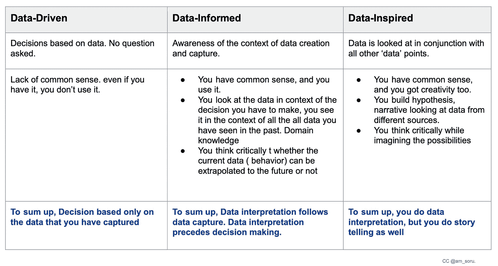
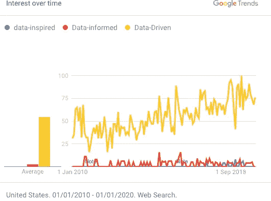
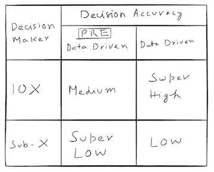
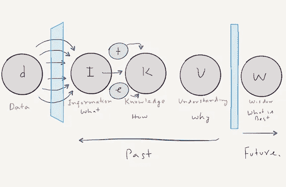

# 数据驱动、数据知情和数据启发—旧思想、新词汇

> 原文：<https://towardsdatascience.com/data-driven-vs-data-informed-vs-data-inspired-740eaaec6263?source=collection_archive---------20----------------------->

## 不要被流行语迷惑。知道它们代表什么吗

我们需要这些流行语吗？它们增加了什么价值吗？有没有不好的一面？

在这篇文章中，首先，我们将进入这些流行语代表什么。

第二，文章认为，这三个流行语都是在用新衣服营销旧概念，理由很充分。它只是要求我们不要成为数据原教旨主义者，不要放弃常识。事实上，当我们应用清晰的思维时，数据通知的业务决策和数据驱动的业务决策结果是相同的；当我们不运用清晰的思维时，两种情况的结果都是一样的，我们就做出了错误的决定。

最后，我们将探索流行语是如何伤害和帮助的。

## 当我们谈论数据驱动、数据通知和数据启发时，我们谈论的是什么

如果你想验证，就要数据驱动。如果你想创新，就要了解数据。如果你想为一个想法寻找灵感，那就从数据中寻找灵感。这就是你将看到的解释。

下面是一张表格，显示了业内流行词汇的更多细节。

随着我们从数据驱动的方法转向数据启发的方法，我们开始更加关注数据解释和故事构建技巧。我们不再拘泥于数字。在第一种情况下，我们试图理解所有指标背后的原因，在第二种情况下，我们试图用所有这些数字创造故事。

挑战在于，如果你愿意插入叙述来连接这些点，你总是会找到数据来支持你的观点。我们有这样一种说法是有原因的，数据就像是被警察关押的囚犯。折磨它，它会告诉你你想听的事情。

总而言之，这些流行词只是要求我们不要从表面上看数据，不要只依赖容易获得和测量的数据，不要抛弃常识。

现在，要理解为什么这三个流行语都在用新衣服推销旧概念，以及它们如何以及为什么会同时带来伤害和帮助，我们需要了解它们的历史。

## 流行语的诞生

请看看这些流行语的谷歌搜索趋势。在 2010 年，我们得到了一个时髦词[数据通知](https://www.youtube.com/watch?v=bKZiXAFeBeY&feature=youtu.be)，在此之前，技术世界主要是数据驱动的。数据启发从 2018 年开始出现。

数据驱动已经流行了很长时间；数据驱动之前的时代我们称之为石器时代。

## 石器时代:

一开始，我们没有数据术语，我们有远见者:商业远见者、产品远见者和营销忍者。他们拥有坚如磐石的直觉，对用户的需求和行为有着无可挑剔的理解，他们在组织中做着大部分的决策。商业决策与其说是一门科学，不如说是一门艺术。这并不一致。

幸运的团队有真正的远见者(10 倍)，不幸的团队有假的远见者(次 X)。真实的公司在业务活动的各个环节上做得很好，做出了可靠的决策；假的挣扎过，但没人知道。

## 硅时代:

数据的数字化导致了数据的泛滥，这为提高两个群体的绩效提供了机会——10 倍群体和 X 倍群体。我们需要一个口号来激发人们的热情。行业发明了这个词——数据驱动，将人们聚集到一个新的方法上。毫无疑问，这种方法很有帮助。

数据驱动的决策帮助了整个行业。然而，它对人的帮助是亚 X 人的 10 倍。

在前数据驱动和数据驱动的世界中，对“真天才”和“假天才”的决策准确性

为什么？

这是因为新的数据为那些已经擅长联系事实的人提供了更多的杠杆。10 倍拥有卓越数据解释技能的人在决策方面做得非常出色，但 X 人的收益一般。这是因为他们从字面上理解了“数据驱动”的标签，并将数据误认为是违背常识和深度思考的保险单。

数据站在他们一边，过分热衷于数据的家伙大喊“数据”，而不考虑上下文。它不仅会导致错误和次优的决策，而且会减缓决策过程，进而减缓业务创新。

此外，教条的数据驱动的家伙游说短期利益的战略。他们不愿意相信任何他们第一次看不到和测量不到的东西。他们的热情让公司陷入了本地最大值的困境。

随着滥用数据驱动的流行词的增加，需要一种新的心理模型。一个新的流行词。

## 一个新的流行词诞生了——数据信息？

一个新术语诞生了。现在，你对过分热衷于数据驱动的同事做出了回应。“伙计们，你们的数据驱动方法很好，但我们需要了解数据。”请注意，这两个流行语都有数据这个词。数据驱动的原教旨主义者更难反对任何始于数据的东西。

## 数据启发的诞生

不幸的是，所有流行语的诞生并不鼓舞人心。有些流行语是出于需要，有些是为了听起来更聪明。数据启发，在我看来，就属于这一类。

它要求你在数据非常少的时候使用框架。你依靠你的直觉、创造力和过去的经验来发现数据中的趋势。

## 旧思想，新语言——揭穿流行语

不幸的是，数据解释很难，因为它需要理解用户的需求和大量的思考。为了阻止社区对深度思考的忽视，新的流行语被创造出来作为提醒的线索:不要停止思考。

理解这一点至关重要，否则，我们会被新流行语的光泽所迷惑，最终犯下同样的错误。

让我们来看看知识层次——一个古老的概念，以便更好地理解它。它向我们展示了数据转化为决策的过程？在我们获得智慧之前还有几个步骤。智慧给我们决策。

知识层次。数据到决策(智慧)

上面的模型从来没有暗示收集数据就足够了，它消除了决策的负担。数据驱动从来不意味着数据收集或逐字阅读。请记住，您的业务环境也是数据，即使它没有被公式化为您现在看到的数据。请记住，来自行业的见解或您去年收集的见解也是数据。这些额外的数据可以帮助你将当前的数据转化为智慧。

一方面，新的流行语告诉我们不外乎做数据解读，另一方面，它使我们陷入绿色木材谬论。我们开始把空谈者和实干家混为一谈，我们愚弄自己，认为知道流行词意味着我们擅长数据解释。通常，它会将注意力从核心转移开。

在添加新的流行词之前，重要的是找到平衡并理解权衡。基于数据的听起来不错，但基于数据的似乎有些自我放纵。

## 外卖食品

1.  不要掩饰流行语，试着理解那些流行语想要表达的意思。
2.  数据驱动、数据通知、数据启发都是披着新衣的旧概念。它所做的只是要求你不要停止思考，不要成为数据原教旨主义者，不要做没有数据的解读。
3.  对流行语的了解并不意味着高超的数据解释技能。吹嘘你了解数据并不意味着你做出了正确的决定。不要愚弄自己，也不要在面试一个候选人的时候被愚弄。不要相信绿色木材谬论。

*参考和延伸阅读*

1.  [*Adam Mosseri*](https://twitter.com/mosseri) *在 2010 年做了一个演讲“* [*数据通知，而不是数据驱动*](https://youtu.be/bKZiXAFeBeY) *”。这可能是“数据通知”框架在公共空间的首次使用。*
2.  *陈楚翔论* [*【数据知情 vs 数据驱动】*](https://andrewchen.co/know-the-difference-between-data-informed-and-versus-data-driven/)
3.  [*数据化营销*](https://wistia.com/learn/marketing/data-informed-marketing)