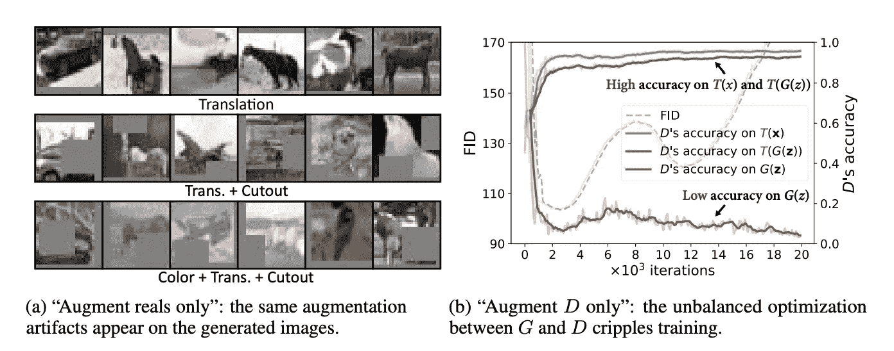
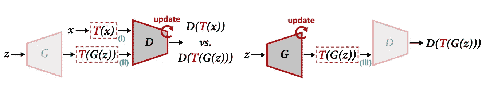

# 数据高效的 GANs！

> 原文：<https://towardsdatascience.com/data-efficient-gans-d10acd595361?source=collection_archive---------55----------------------->

## 看看麻省理工学院最近令人兴奋的[论文](https://arxiv.org/pdf/2006.10738v1.pdf)“数据高效 GAN 训练的差异化增强”

*理解本文*的前提:你**训练过 GAN** 或者你了解训练 GAN 时出现的常见困难比如**训练数据上的甄别器过拟合**。否则，一定要阅读这篇文章，或者自己花几个小时在谷歌上搜索甘斯。然后回到这里，享受这篇文章！

你读过甘斯的书。也许你已经训练了一只。也许你已经*尝试过*来训练一个，看着鉴频器损耗一降再降，然后“嘣”的一声，你在训练数据上过度拟合了。你打印出 100 张图片，其中 50 张是同样畸形的金毛猎犬图片。你去见你的教授，也许眼里含着泪水，你宣称:

‘模式崩溃，怎么办？’

“增加更多的数据，”你的教授说。或许打个盹。

不要害怕！麻省理工学院最近的[论文](https://arxiv.org/pdf/2006.10738v1.pdf)“数据高效 GAN 训练的差异化增强”声称是你的救星，或者至少是它的一部分(赵，刘，林，朱&韩，2020)。该论文声称需要更少的数据，同时仍然使用一种称为“可区分”增强的特殊数据增强来实现最先进的结果。在这篇博文中，我会把茶洒在这张纸上(如果你还不知道，我对此非常兴奋)。我来告诉你这篇论文是怎么宣称提高 GAN 训练的，我来说说实际上有没有效果。所以，拿起一杯茶和一个笔记本，向 GAN 神祈祷这有助于击败“模式崩溃”的老怪物

甘斯的问题:快速回顾一下

在机器学习中，你将学到的第一个也是最重要的概念之一是“过度适应”。在鉴别器 GANs 的上下文中，D 在训练中继续改进，但是**在验证期间表现很差，因为它已经开始“记忆”图像数据**。这并不一定会导致模式崩溃，在这种情况下，您会得到许多相同的输出图像，尽管这种情况经常发生。如果您观察到模式崩溃，这是一种证据，表明鉴别器对数据过度拟合。通常，我们只是添加更多的数据来防止这个问题——当然，这通常是有帮助的……但是这么多的数据不一定容易收集。这篇论文提供了一个有力的例子:如果我们试图生成一个稀有物种的图像会怎么样？我们无法获得更多的数据。然而，我们不必把自己局限于稀有物种这种极端的边缘情况。即使当我们谈论像衣服这样的常规物品时，**收集数据也是昂贵的。注释数据是昂贵的。需要*年*(赵等，2020)。我们希望模型现在*工作*。**

**解决方案:增强？**

因此，现在我们将得到我们的论文谈到的解决方案。该论文观察到，当在监督学习的情况下出现过拟合时(比如一个简单的图像分类问题)，并且我们没有更多的数据要添加，我们将对数据进行称为**增加** 的处理。[作为补充说明，请随意阅读其他解决过度拟合问题的方法，如正则化]。

图像增强是指将图片翻转过来或稍微改变颜色等。等等。我们只是稍微改变一下照片，这样我们可以得到更多的样本。但是对于 GANs，这种增强不能直接起作用。作者提供了两种我们可以在 GAN 训练期间增加数据的方法，以及为什么这两种方法都无法获得良好的输出图像。然后他们提供了第三种选择，这种选择*起作用*(微分增强)，这就是他们论文的全部内容。所以这里有两个行不通的选择:

**选项 1:仅增加 Reals】**

大家还记得，当我们训练 GAN 时，我们输入的图像是实际物体的实际图片。我们用它和我们的生成器制造的赝品一起输入到鉴别器中。所以在第一种增强方法中，我们只是增强这些真实的图像。简单吧？

不对。

赵等人(2020)报告说，增强*随机水平翻转*确实适度地改善了结果。但是**更强** **增强**比如翻译&只对真实图像进行剪切会导致生成的图像出现失真和怪异着色等问题。虽然普通增强可能适用于常规分类问题，但对于我们不分类的 gan，我们正试图生成数据的**真实分布**。但是，如果我们去扭曲真实的输入数据，那么我们生成的输出也将被类似地扭曲。鼓励发生器匹配增大的&失真分布，而不是真实分布。那么，扩充数据的第二个选择呢？

**选项 2:增加所有鉴别器输入**

在这个选项中，我们不仅增加了实数，还增加了由我们的生成器输出并进入我们的鉴别器的虚数。有趣的是，虽然鉴别器学会了以超过 90%的准确度在增强的真实和增强的虚假之间进行完美分类，但鉴别器**未能识别未增强的虚假**，导致准确度低于 10%。这是因为**发生器 G 从非增强伪图像**接收其梯度。因此，我们需要某种方式**将梯度传播到我们的生成器 G.** 否则，用赵等人(2020)的恐怖诱导的话来说:

> 生成器完全欺骗了鉴别器

**图一。**甘斯失败的增强方法。来源:[赵等(2020)](https://arxiv.org/pdf/2006.10738v1.pdf)

**选项 3:输入差异化增量**

所以这就是作者提出了一种*做*工作的增强类型，即可微分增强。为了解决选项 1 和选项 2 的问题，作者提供了一个解决方案。增强了鉴别器网络中使用的真实和虚假图像，而且 2。成功地**“将增强样本的梯度传播到 g。”**这避免了我们之前在选项 2 下讨论的无法识别未增强的假货的问题。**这是本文的关键:**为了允许梯度传播到生成元 G，他们简单地非常确定增广是，如名字所说，**可微的**。作者提供了这种可区分增加的三个主要例子:

> 平移(在图像大小的[1/8，1/8]范围内，用零填充)，
> 
> 剪切(用图像一半大小的随机正方形进行遮罩)，以及
> 
> 颜色(包括随机亮度在[0.5，0.5]范围内，对比度在[0.5，1.5]范围内，饱和度在[0，2]范围内)。

**结果**

这有用吗？是的。是的，它似乎起作用了。作者列出了一些非常酷的结果，我将在这里列出其中一些。我强烈建议你看看[主要论文](https://arxiv.org/pdf/2006.10738v1.pdf)中的其他结果——它们确实让我大吃一惊。

*成果#1* : *CIFAR-10 和 CIFAR-100 数据集。*作者使用了两个著名的 GAN，即 BigGAN 和 StyleGAN2，并尝试了几种数据集大小(100%数据、10%数据、20%数据)。为了使他们的比较与基线公平，他们甚至确保在基线方法中使用正则化&水平翻转。对于 CIFAR-10 和 CIFAR-100 而言，它们都比基线有所改进，是 CIFAR-10 和 CIFAR-100 的**最新技术**。

*成就#2:* *ImageNet* 。可区分增强推进了 100%数据集和缩减大小数据集的最新水平。

我喜欢本文中提出的解决方案的原因是它非常符合逻辑。作者 1。尝试了不同的增强方法。确定了确切的困难和 3。通过使用特定类型的增强，即在真实和虚假上执行的可区分增强，迅速修复了问题，从而允许梯度传播到生成器。然而，这个逻辑推导出的解决方案做了这么多。现在，任何训练 GAN 的人都可以将“使用可微分增强”添加到他们的规则工具箱中，如“向鉴别器输入添加噪声”和“惩罚[调整]鉴别器权重”(未注明)。

这篇论文真的让我很兴奋，促使我在凌晨 1 点写了一篇关于它的帖子。我希望我对它的讨论能帮助你理解这个解决方案是如何工作的，并让你兴奋起来！

最后，论文中的一张图清晰地展示了他们的方法:

**图二。**“更新 D(左)和 G(右)的 DiffAugment 概述”。DiffAugment 将扩充 T 应用于真实样本 x 和生成的输出 G(z)。当我们更新 G 时，梯度需要通过 T 反向传播，这要求 T 对于输入是可微分的。”图片来源&图片说明:[赵等(2020)](https://arxiv.org/pdf/2006.10738v1.pdf) 。

**参考文献**

赵树声，刘，张，林俊杰，朱俊英，韩树声(2020)。数据有效的 GAN 训练的可区分增强。arXiv 预印本 arXiv:2006.10738 。从 https://arxiv.org/pdf/2006.10738v1.pdf[取回](https://arxiv.org/pdf/2006.10738v1.pdf)

生成性对抗网络(未注明)。常见问题。*谷歌开发者*。从 https://developers.google.com/machine-learning/gan/problems[取回](https://developers.google.com/machine-learning/gan/problems)