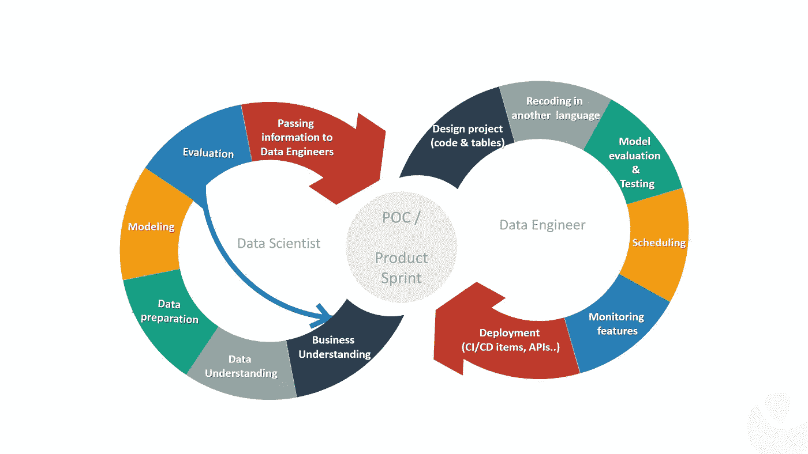
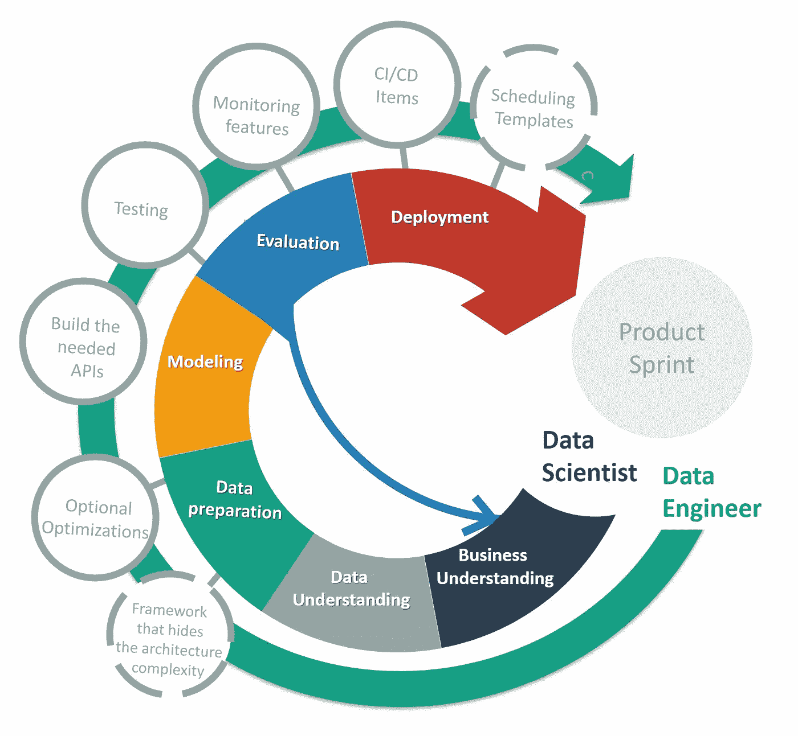
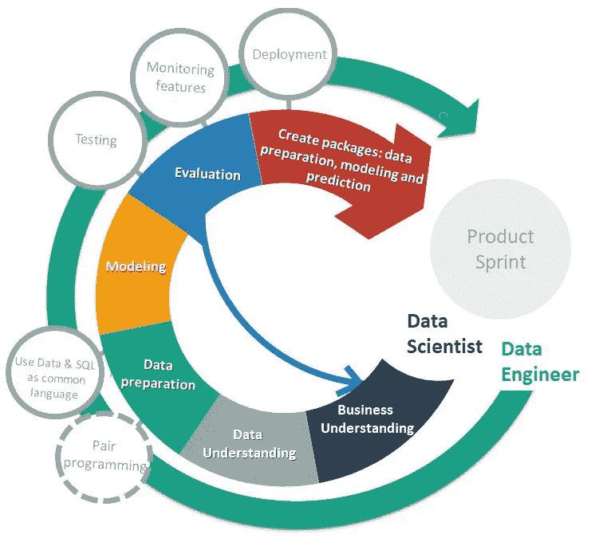
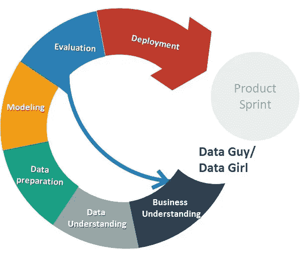

# 数据工程和数据科学协作流程

> 原文：<https://towardsdatascience.com/data-engineer-and-data-science-collaboration-processes-b2d7abcfc74f?source=collection_archive---------21----------------------->

## 沮丧、紧张和痛苦都是缺乏共同合作基础的结果。找到重视每个数据角色的最佳协作流程是最基本的。

作为一名数据工程师，我有机会经历了一个数据工程师/数据科学家的合作过程，并很快看到了它的失败。因此，我对我们如何改善这种合作变得非常感兴趣，并开始记录自己在其他可以改善团队合作的过程中的表现。因此，本文介绍了数据工程师和数据科学家之间的多个组织，每个组织都有其优点和缺点。

# 数据工程师将数据科学项目产业化

**当数据科学家和数据工程师不使用相同的编码语言**并且数据工程师是负责生产代码的人时，一切都必须重新编码。

数据科学家/数据工程师组织:数据工程师将数据科学项目工业化

当然，在对数据科学项目进行重新编码之后，数据工程师将会有一些额外的任务，比如调度、构建部署部分以及确保自己创建了监控功能。

**好处:**

*   这位数据科学家仍然呆在他的舒适区，因为他可以用任何他想用的语言工作
*   数据科学家在探索部分是自主的
*   数据工程师仍然呆在他的舒适区，因为他可以使用他认为适合项目的语言和项目架构

**陨落:**

*   它没有“评估”团队的每个成员(在这种情况下也就是数据工程师)。尽管用另一种语言，以一种更优化、更工业化的方式创建同一个项目会有很多挑战，但它创造了一个“思考者”/“实干家”的组合，没有一个工程师愿意只是另一个“实干家”
*   数据科学家不能自主添加新功能。每一个新特性都需要一个数据工程师来负责产品代码部分，一个数据科学家来评估非工业化项目中的变化。
*   该项目必须由两个不同的人用两种不同的语言维护(以便能够进行更新)

# 构建数据科学框架

当有了数据工程师和数据科学家使用的**通用编码语言**，前者就可以免去一切重新编码的麻烦。重新编码部分将被可选的优化所取代。

通过数据科学框架进行数据科学/数据工程师协作

当然，为了限制数据科学家需要学习的技术数量，数据工程师可以创建一个数据科学框架，隐藏/抽象架构复杂性和部署复杂性。

然而，创建这个框架并不意味着数据科学家将独自完成每个项目，仍然有一些任务，如监控功能、优化和构建所需的 API，应该由数据工程师来完成。

然而，这种组织给了数据科学家更多的自主权，因为有些变化不需要数据工程师。

这种组织在 [Dailymotion](https://medium.com/dailymotion) 使用，更多细节我推荐这篇由 Germain Tanguy 写的[文章](https://medium.com/dailymotion/collaboration-between-data-engineers-data-analysts-and-data-scientists-97c00ab1211f)。

**好处**

*   数据工程师并不是对所有事情都重新编码:没有思考者/行动者的关系
*   该框架将加速数据科学项目的开发和部署
*   数据科学家更加自主

**弊端**

*   就数据准备而言，数据工程师只负责优化
*   建立和维护这样一个框架需要时间

# 封装和结对编程

当没有数据工程师和数据科学家使用的通用编码语言时，你可以试着像 Coursera 数据工程师刘璐珈建议的那样使用 SQL 作为对等编程的通用语言。

通过包和结对编程进行数据科学/数据工程师协作

如果在一些数据科学领域，SQL 不能作为通用语言使用，那么您可以使用包在不同的数据科学阶段和数据工程师之间进行通信。

这本 [Xebia 书](https://dataanalyticspost.com/wp-content/uploads/2019/05/Techtrends_13_ProduitDataScience_Xebia_compressed.pdf)描述了我们可以创建三个包的事实:

*   特征工程包
*   用于已训练模型的包
*   预测部分的包

根据您的架构，包可以采用不同的形式:docker 图像、Kafka 队列中的消息等。

在这个协作过程中，数据工程师将主要负责部署模型、监控功能，并在对等编程部分帮助进行测试和优化。

**好处:**

*   数据工程师并不是对所有事情都重新编码:没有思考者/行动者的关系
*   数据准备部分的对等编程将有助于两个角色之间的协作
*   对于建模部分，我们通过使用包作为数据工程师和数据科学家之间的通信来划分职责

**缺点:**

*   使用 SQL 作为通用语言可能会限制语言的可能性。例如，在 Python 中，如果不使用 SQL，可以更容易地进行一些数据操作

# 数据男/数据女

我的一个朋友告诉我，他认为自己是一个“数据人”。事实上，从某个角度来看，我们都在学习不同的技能，因此你可以找到既有数据工程技能又有数据科学家技能的人。

数据男/数据女

**弊端**:

*   这个人可能会独自处理一些项目(如果这个人离开，可能会丢失一些信息)

**好处**:

*   项目速度
*   因为这个人拥有所有需要的技能，所以没有共同的基础去寻找

# 笑点

没有完美的协作过程，每个协作方案都有一些缺点和一些好处；取决于您和您的团队，根据您的环境以及您的数据工程师和数据科学家拥有或想要培养的能力，选择最适合您公司的组织！