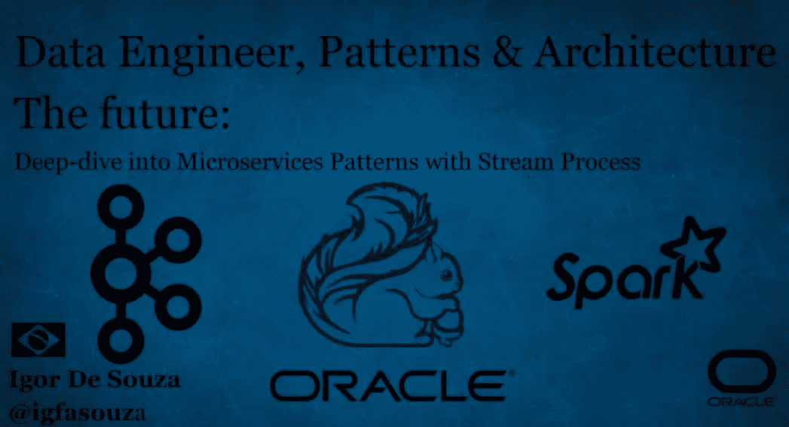
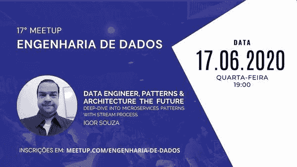
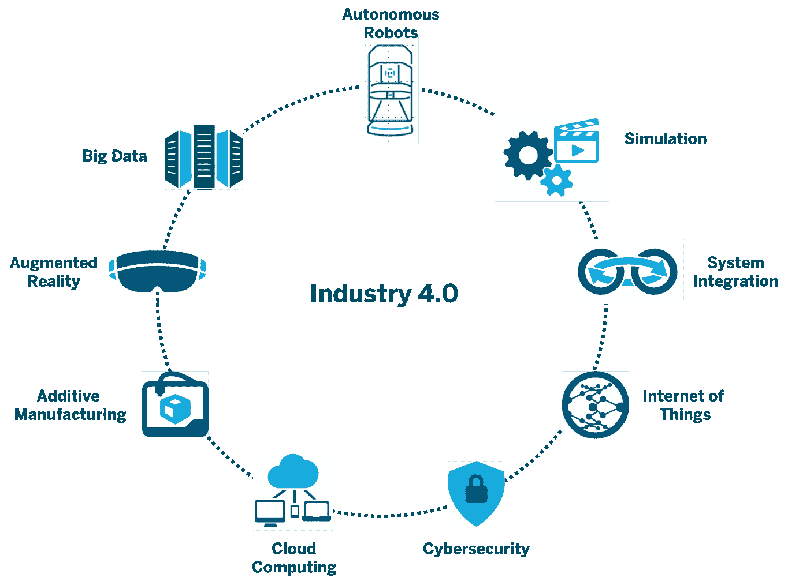
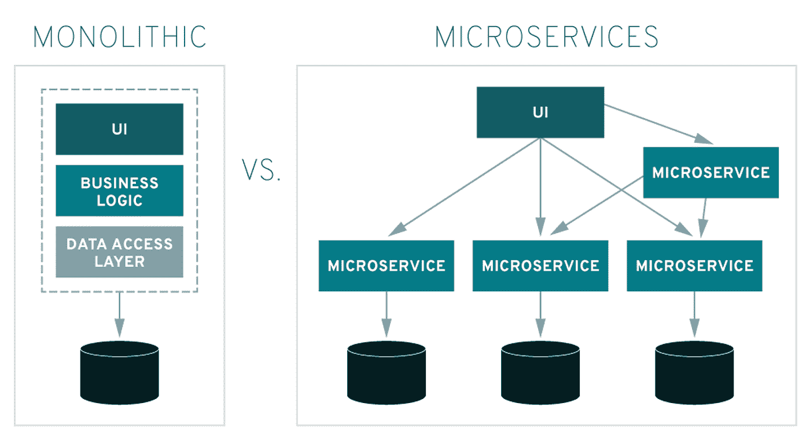
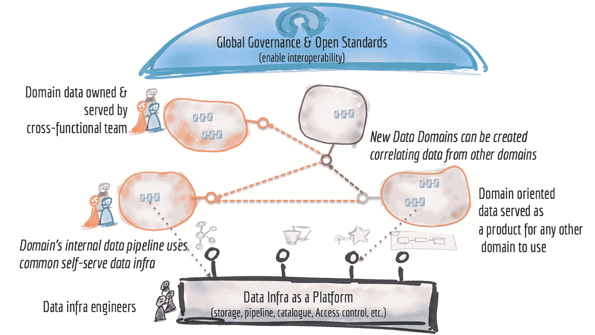
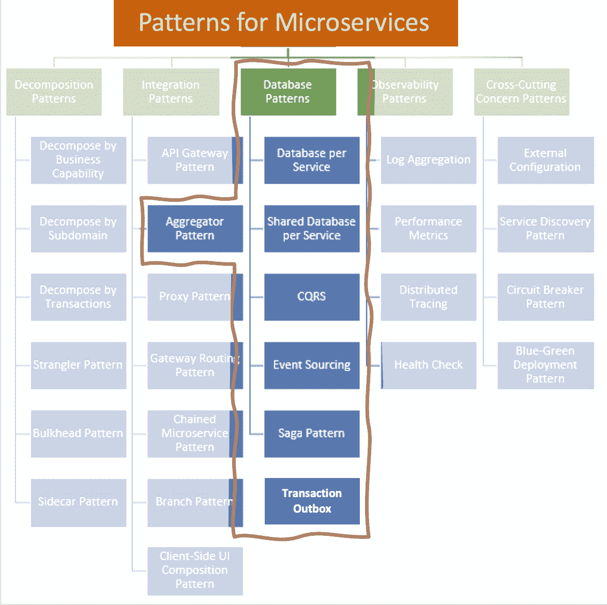
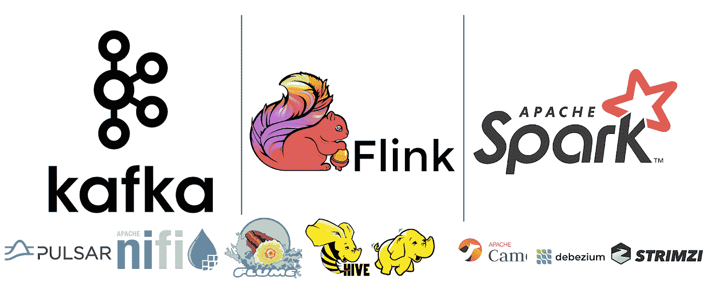
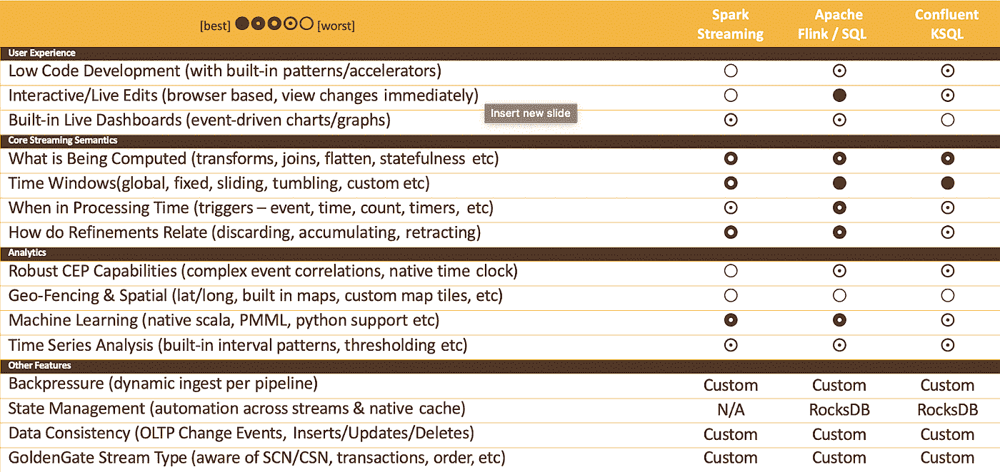
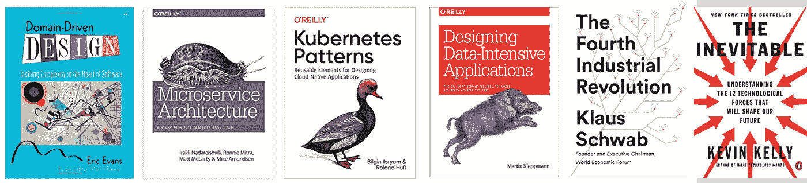

# 数据工程师，模式和架构未来

> 原文：<https://towardsdatascience.com/data-engineer-patterns-architecture-the-future-7c3a01737053?source=collection_archive---------26----------------------->

## **深入了解流流程的微服务模式**

我创造的形象【http://www.igfasouza.com/ 

**TL；博士**

在工业 4.0 中，使用了多种技术来进行实时数据分析，另一方面，维护、组织和构建数据是一项复杂的工作。在过去的 30 年里，我们看到了几个将数据库集中在一个地方的想法，因为统一和真正的数据源已经在公司中实现，如数据仓库、NoSQL、数据湖、Lambda & Kappa 架构。

另一方面，软件工程一直在将想法应用于分离的应用程序，以促进和提高应用程序性能，如微服务。

想法是使用日期上的微服务模式，并将模型分成几个更小的模型。分解它的一个好方法是使用 DDD 原则的模型。这就是我试图解释和定义 DataMesh & Data Fabric 的方式。

这里值得一提的是，我简化了数据网格和数据结构的概念和思想，就像我简化了流和 Kafka 的概念和思想一样。

**想法**

我被邀请在一个数据工程师会议上做一个演讲，我带着这个想法来展示我对数据网格的看法。

[https://www . meetup . com/engen haria-de-dados/events/271280539/](https://www.meetup.com/engenharia-de-dados/events/271280539/)

**工业 4.0**

图片灵感来自[https://aethon.com/mobile-robots-and-industry4-0/](https://aethon.com/mobile-robots-and-industry4-0/)

在过去的几年中，出现了一些想法和架构，如数据仓库、NoSQL、数据湖、Lambda & Kappa 架构、大数据等，它们提出了应该将数据整合并分组到一个地方的想法。将一个地方作为数据的统一和真实来源的想法。

我创造的形象

此处的图像显示了将所有数据分组到一个唯一的位置作为最终目标的概念。

近年来，软件工程领域已经表明，应用程序应该被隔离，以促进和提高应用程序的性能，并便于维护。向该司提出的一个想法是使用 DDD 和微服务。

我创造的形象

如果我们比较数据区和开发区，我们会发现两者的说法正好相反，一个想要统一，另一个想要分裂。

这正是 DataMesh 提出的想法，它提出了我们应该使用 DDD 和微服务的想法来分离数据，以生成更小、更简单的应用程序，这样维护和性能会更好。

Jeffrey T. Pollock 网上研讨会未来数据集成 datamesh 和金门卡夫卡

图片来自[https://Martin fowler . com/articles/data-monolith-to-mesh . html](https://martinfowler.com/articles/data-monolith-to-mesh.html)

查看微服务模式，我们会发现有一些数据驱动的模式。如果我们更详细地分析它们，我们会发现它们都使用或链接到流处理。

映像的想法来自微服务架构:调整原则、实践和文化。但这个形象并不在书本身。由我创作灵感来自[https://medium . com/@ madhukaudantha/microservice-architecture-and-design-patterns-for-microservice-e0e 5013 FD 58 a](https://medium.com/@madhukaudantha/microservice-architecture-and-design-patterns-for-microservices-e0e5013fd58a)

这里的想法是，所有与数据相关的设计模式我们都可以应用流，并且像 Apache Spark、Apache Flink 和 Apache Kafka 这样的工具是目前使用最多的。围绕它还有一个生态系统，还有其他一些技术。

我创造的形象

我创建了一个表，其中列出了流媒体市场的主要选项，但这里的想法是，这不是一个银弹，只是我的愿景。这是主观的。

我创造的形象

**我用来构思自己想法的书籍**(我只想记住有几篇文章、论文和视频围绕着这些想法)

*   域驱动器设计师— Eric Evans
*   微服务架构:调整原则、实践和文化——irak Li Nadareishvili、Ronnie Mitra、Matt McLarty 和 Mike Amundsen
*   Kubernetes 模式:设计云原生应用的可重用元素
*   设计数据密集型应用— Martin Kleppmann
*   第四次工业革命——克拉斯·施瓦布
*   不可避免的——凯文·凯利

我创造的形象

**我用来构思的文章:**

*   作为数据库流式传输

[https://Yokota . blog/2019/09/23/building-a-relational-database-using-Kafka/](https://yokota.blog/2019/09/23/building-a-relational-database-using-kafka/)

[https://Yokota . blog/2020/01/13/building-a-graph-database-using-Kafka/](https://yokota.blog/2020/01/13/building-a-graph-database-using-kafka/)

[https://www . kai-waehner . de/blog/2020/03/12/can-Apache-Kafka-replace-database-acid-storage-transactions-SQL-no SQL-data-lake/](https://www.kai-waehner.de/blog/2020/03/12/can-apache-kafka-replace-database-acid-storage-transactions-sql-nosql-data-lake/)

*   事件驱动和数据网格

[http://jacekmajchrzak . com/event-driven-data-mesh-introduction/](http://jacekmajchrzak.com/event-driven-data-mesh-introduction/)

*   无服务器时代

[https://blogs . Oracle . com/cloud-infra structure/server less-big-data-pipelines-architecture](https://blogs.oracle.com/cloud-infrastructure/serverless-big-data-pipelines-architecture)

*   Martin Kleppmann |卡夫卡峰会 SF 2018 主题演讲(卡夫卡是数据库吗？)

【https://www.youtube.com/watch?v=v2RJQELoM6Y 

*   库伯内特土著

[https://medium . com/@ graeme colman/the-new-kubernetes-native-d 19 DD 4 AE 75 a 0](https://medium.com/@graemecolman/the-new-kubernetes-native-d19dd4ae75a0)

[https://developers . red hat . com/blog/2020/05/11/top-10-must-know-kubernetes-design-patterns/](https://developers.redhat.com/blog/2020/05/11/top-10-must-know-kubernetes-design-patterns/)

*   GoldenGate 的微服务模式

[https://www . slide share . net/jtpollock/microservice-patterns-with-golden gate](https://www.slideshare.net/jtpollock/microservices-patterns-with-goldengate)

*   网上研讨会未来数据集成-datamesh-and-goldengatekafka

[https://www . slide share . net/JT pollock/webinar-future-dataintegrationdatameshandgoldengatekafka](https://www.slideshare.net/jtpollock/webinar-future-dataintegrationdatameshandgoldengatekafka)

*   对分布式数据湖思想的思考

[https://www.youtube.com/watch?v=mnvxeU3oDyQ](https://www.youtube.com/watch?v=mnvxeU3oDyQ)

*   什么是服务网格？

[https://www.youtube.com/watch?v=QiXK0B9FhO0](https://www.youtube.com/watch?v=QiXK0B9FhO0)

**Twitter 影响者:**

@ KaiWaehner
@ bib ryam
@ gschmutz

**结论**

*   分而治之是最好的开始方式，它简单，便宜，会节省你的时间和金钱
*   一些公司在尝试实施大数据、数据湖和数据仓库时失败了，因为他们试图构建一些大而复杂的东西
*   流媒体无处不在
*   我们正处于多云和混合云时代
*   无服务器架构越来越流行
*   我们不应该关心名字，而应该关心目标
*   我用一种方式简化了它，我传递了这样一个想法:是的，我们已经处于无服务器时代；
    是的，我们已经处于土生土长的库伯内特人时代；
    没错，串流就是数据库；
    是的，流无处不在；
    对，分而治之；
    对，微服务模式；
    是的，Kubernetes 图案是加分项；

**我的幻灯片:**

[https://www . slide share . net/igorsouza 137/data-engineer-patterns-architecture-the-future-deep dive-into-microservice-patterns-with-stream-process](https://www.slideshare.net/IgorSouza137/data-engineer-patterns-architecture-the-future-deepdive-into-microservices-patterns-with-stream-process)

**追加:**

*   大数据

[http://www.igfasouza.com/blog/what-is-big-data/](http://www.igfasouza.com/blog/what-is-big-data/)

*   阿帕奇火花

[http://www.igfasouza.com/blog/what-is-apache-spark/](http://www.igfasouza.com/blog/what-is-apache-spark/)

*   阿帕奇卡夫卡

[http://www.igfasouza.com/blog/what-is-kafka/](http://www.igfasouza.com/blog/what-is-kafka/)

*   流处理

[http://www.igfasouza.com/blog/what-is-stream-processing/](http://www.igfasouza.com/blog/what-is-stream-processing/)

*   数据仓库

[https://www . Oracle . com/ie/database/what-is-a-data-warehouse/](https://www.oracle.com/ie/database/what-is-a-data-warehouse/)

*   数据湖

[http://www.igfasouza.com/blog/what-is-data-lake/](http://www.igfasouza.com/blog/what-is-data-lake/)

*   数据仓库

[https://databricks . com/blog/2020/01/30/what-is-a-data-lake house . html](https://databricks.com/blog/2020/01/30/what-is-a-data-lakehouse.html)

*   工业 4.0

[https://www . kai-waehner . de/blog/2020/04/21/Apache-Kafka-as-data-historian-an-iiot-industry-4-0-real-time-data-lake/](https://www.kai-waehner.de/blog/2020/04/21/apache-kafka-as-data-historian-an-iiot-industry-4-0-real-time-data-lake/)

[https://www . Forbes . com/sites/Bernard marr/2018/09/02/what-is-industry-4-0-heres-a-super-easy-explain-for-any one/# 166 bad 289788](https://www.forbes.com/sites/bernardmarr/2018/09/02/what-is-industry-4-0-heres-a-super-easy-explanation-for-anyone/#166bad289788)

*   数据结构

[https://www . Forrester . com/report/Now+Tech+Enterprise+Data+Fabric+Q2+2020/-/E-RES 157315 #](https://www.forrester.com/report/Now+Tech+Enterprise+Data+Fabric+Q2+2020/-/E-RES157315#)

*   数据网格

[https://Martin fowler . com/articles/data-monolith-to-mesh . html](https://martinfowler.com/articles/data-monolith-to-mesh.html)

*   微服务

[https://microservices.io/](https://microservices.io/)