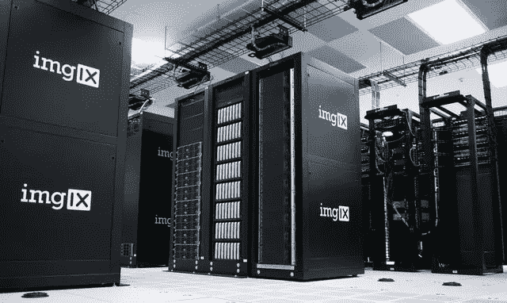

# 企业家的数据工程

> 原文：<https://towardsdatascience.com/data-engineering-for-entrepreneurs-fa10f9190831?source=collection_archive---------68----------------------->

肖恩·波洛克在 [Unsplash](https://unsplash.com/s/photos/engineering?utm_source=unsplash&utm_medium=referral&utm_content=creditCopyText) 上的照片

## 这是一家更加数据驱动的公司。

到在这个快速发展的世界中竞争，创业公司和公司应该更加敏捷，以客户为中心，并以数据为驱动力，以赢得市场。

他们中的大多数已经实现了敏捷技术，比如 scrum，来开发一个比以前更快发布的产品。

尽管如此，仍有一些公司没有实施这些以客户为中心和数据驱动的东西。

为了实现这一点，管理人员必须实施他们的数据基础设施，然后才能基于数据做出更准确的决策和更个性化的服务。

要解决这个问题，您应该优先考虑数据工程。

# **数据工程为什么重要？**

这就是为什么它很重要的原因，

## 你有大量的数据。

在这个互联的世界里，你的交易可能不仅仅发生在你的城市或国家。全世界都知道你的产品和你的公司。正因为如此，你会有很多交易。因此，产生的数据变得更大。因此，你需要一个数据工程师来做这件事。

## 你有多种数据来源。

数据不仅越来越大，而且有多种类型，例如表这样的结构化格式和文本这样的非结构化格式。为了整合这些数据，你需要一个数据工程师。

## 您的数据还不能用于分析。

现在，您的数据库是一种结构化格式，为事务处理过程进行了优化。如果您看到数据库的模式，它们不在一个表上。有多个表，每个表都有自己的 id，也有其他表的 id。因此，如果您想为分析过程做好准备，那么您应该让数据工程师来解决它。

> 这些就是你应该优先考虑数据工程的原因。现在，什么是数据工程，他们做什么？

# **什么是数据工程？**

[泰勒·维克](https://unsplash.com/@tvick?utm_source=unsplash&utm_medium=referral&utm_content=creditCopyText)在 [Unsplash](https://unsplash.com/s/photos/data-center?utm_source=unsplash&utm_medium=referral&utm_content=creditCopyText) 上的照片

数据工程是一个从收集数据到处理数据的过程，因此数据已经为分析过程做好了准备。

## **数据工程师是做什么的？**

数据工程师将把你的数据整合到一个地方，然后使用任何现有的软件进行处理。之后，数据为分析过程做好了准备，或者，你可以在此基础上创建一个推荐系统。

## 他们使用什么工具？

他们使用的工具是，

*   **数据库**，工具有 PostgreSQL、MySQL、MongoDB 等。
*   **用于加工**，工具有 Apache Spark，Hive 等。
*   **对于调度**，工具有 Apache Airflow、Oozie、Cron 等。

# **注意事项**

照片由 [imgix](https://unsplash.com/@imgix?utm_source=unsplash&utm_medium=referral&utm_content=creditCopyText) 在 [Unsplash](https://unsplash.com/s/photos/data-center?utm_source=unsplash&utm_medium=referral&utm_content=creditCopyText) 上拍摄

有一些需要考虑的因素，它们是，

## **云计算与否？**

您可以为您的数据架构构建高性能的计算机。但是如果，

*   你没有维护电脑的成本，
*   你没有支付电费的费用，或者
*   你需要备份你的数据。

如果这些是你的考虑，你必须使用云计算。

云计算对于任何公司来说都是必须的，尤其是那些不想构建高性能计算机而需要数据架构的公司。云计算有数据工程可以使用的工具。有很多公司都有云计算服务，比如亚马逊网络服务、谷歌云、微软 Azure 等等。

## **什么时候考虑雇佣数据工程师？**

你必须确定你将如何使用这些数据，它可能是用于决策或建立一个推荐系统。

如果你没有任何成为数据驱动公司的迫切需要，那么你就不必考虑雇佣数据工程师。但是如果你有，那么你应该找数据工程师。

> 在您拥有一个良好的数据架构并且已经可扩展之后，您就可以继续研究如何使用数据，包括数据分析、使用机器学习的预测建模或从数据中挖掘模式。

# **结论**

在你做出决策或个性化服务之前，数据工程是必须的。在构建数据架构之前，您必须考虑要使用哪些数据以及如何使用这些数据。如果你已经有了很好的理由，那么你应该找数据工程师来构建解决方案。这样，你就可以在这个快速发展的世界中竞争。